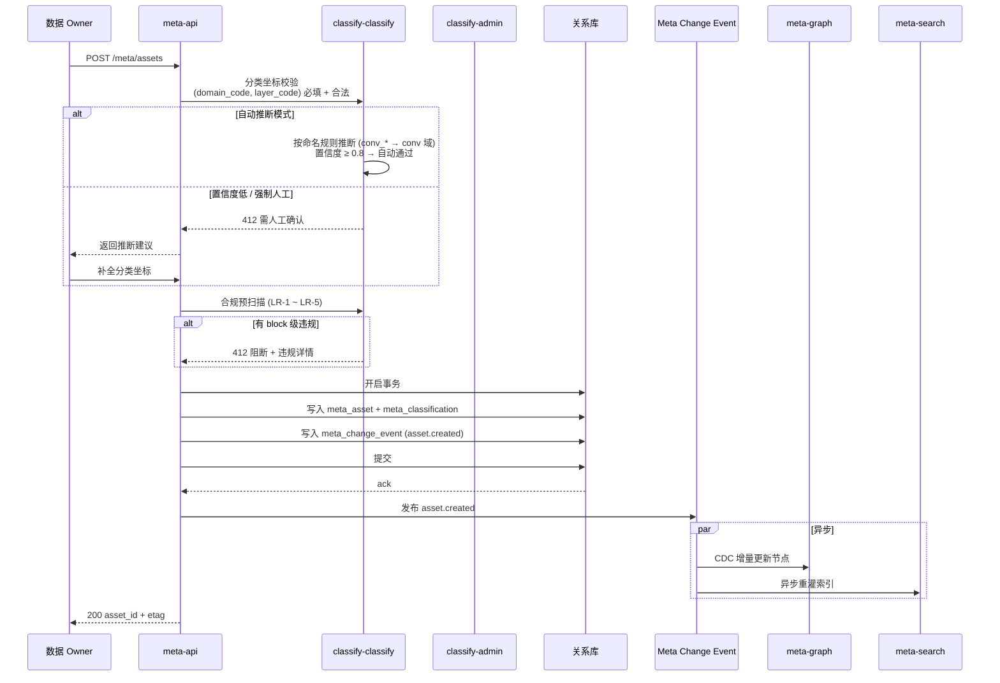
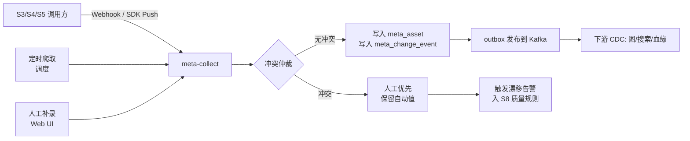
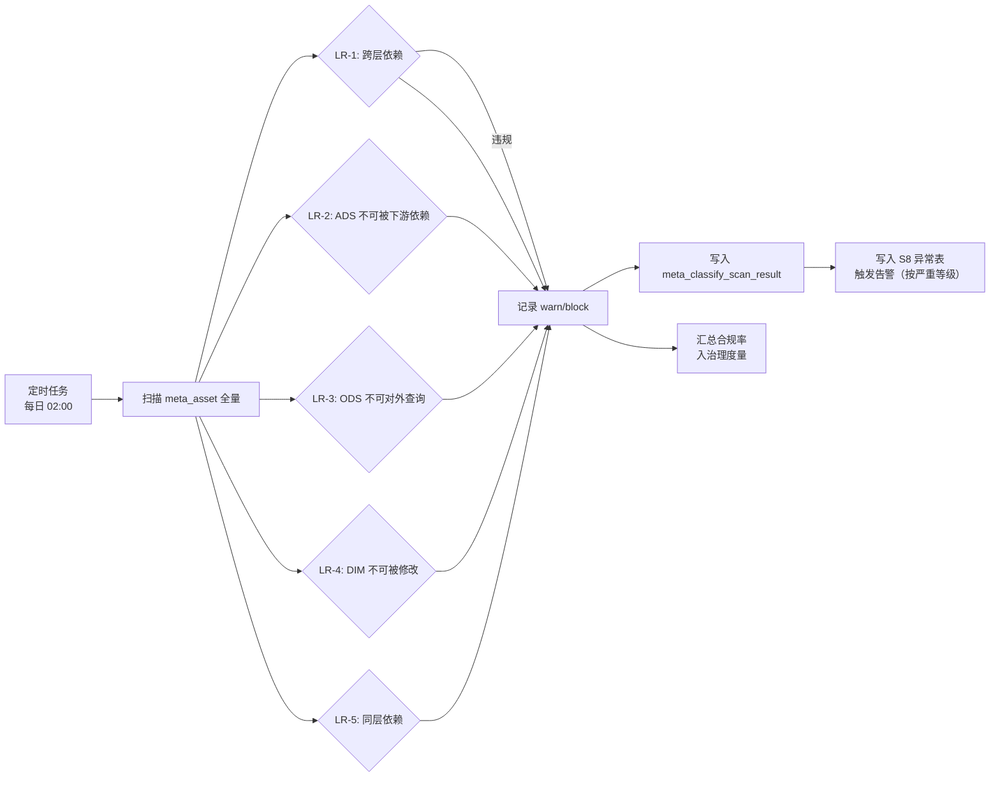
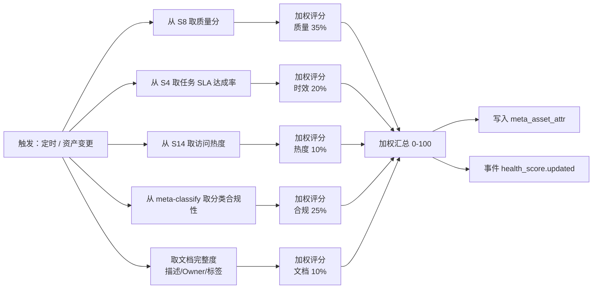
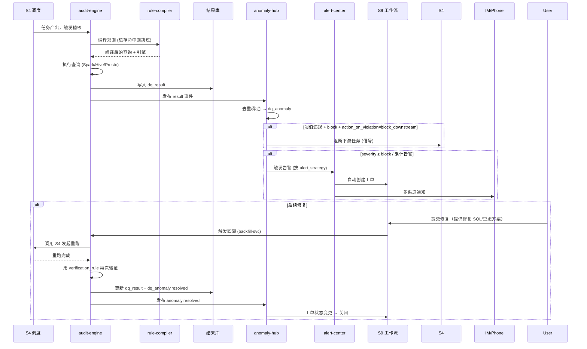
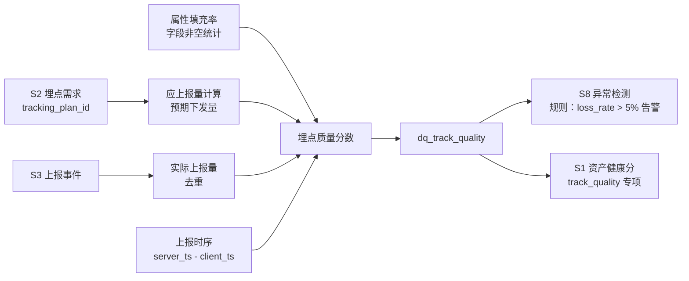

# S1 元数据与资产中心 · 子系统实现设计
## S8 数据质量治理中心 · 子系统实现设计

> 与《智能体数据治理系统-分析与设计文档.md》（以下简称"主文档"）配套。本文。聚焦 S1、S8 两个治理面核心子系统的**实现级**设计：服务模块拆分、存储与表结构、接口契约、关键流程时序、关键算法、容量与高可用、可观测性、灰度与迁移。
>
> 主文档已包含内容（此处不重复，仅引用）：
> - S1 定位、职责边界、元模型分层（L0/L1/L2）、全域资产分类体系、主题域与分层规范、跨层依赖规则（LR-1~LR-5）、核心能力、6 条关键设计要点 → 主文档 §S1。
> - S8 定位、质量维度与规则体系、DQRule 模型、核心能力、4 条关键设计要点 → 主文档 §S8。

---

## 目录

- [S1 元数据与资产中心](#s1-元数据与资产中心--子系统实现设计)
  - 1. 实现范围与设计目标
  - 2. 服务模块拆分
  - 3. 存储设计
  - 4. 核心接口设计
  - 5. 关键流程
  - 6. 关键算法
  - 7. 缓存与一致性
  - 8. 容量与性能
  - 9. 高可用与容灾
  - 10. 可观测性
  - 11. 灰度与迁移
  - 12. 测试策略
- [S8 数据质量治理中心](#s8-数据质量治理中心--子系统实现设计)
  - 1. 实现范围与设计目标
  - 2. 服务模块拆分
  - 3. 存储设计
  - 4. 核心接口设计
  - 5. 关键流程
  - 6. 关键算法
  - 7. 与 S4 的卡点集成
  - 8. 告警降噪与抑制
  - 9. 容量与性能
  - 10. 高可用与容灾
  - 11. 可观测性
  - 12. 灰度与迁移
  - 13. 测试策略

---

# S1 元数据与资产中心 — 子系统实现设计

## 1. 实现范围与设计目标

### 1.1 实现范围

| 模块 | 范围 |
|---|---|
| **元模型管理** | L0 元元模型（Entity/Relation/Property 三类抽象 + 自定义扩展）、L1 元模型（资产类型与分类实体定义）、L2 实例（具体资产主数据） |
| **资产注册中心** | 资产全生命周期 CRUD：注册/版本/变更/退役/恢复 |
| **分类体系管理** | 主题域、数据分层的定义、变更、合并、拆分、废弃；跨层依赖规则维护 |
| **分类坐标挂载** | 资产注册时强制指定 `(主题域, 数据分层)`；批量挂载、自动推断、合规扫描 |
| **元数据采集** | 技术/业务/操作三类元数据的拉/推/订阅采集，含自动与人工双轨 |
| **资产目录与检索** | 全文检索 + 多维过滤 + 主题域/分层导航 + 资产关系图谱 |
| **资产健康分** | 6 维度加权评分（含分类合规性），输出至资产目录与团队治理排名 |
| **版本与审计** | 任何元数据变更（含分类体系）生成不可变版本快照，支持 diff/回滚 |
| **对外 API** | 元数据服务 API、元数据采集 Hook、Meta Change Event（事件订阅） |

### 1.2 设计目标

| 目标 | 锚定 NFR | 量化指标 |
|---|---|---|
| **全局元数据底座** | NFR-05 | S1 可用性 ≥ 99.9%；不可用时全治理能力降级 |
| **资产检索高效** | NFR-13 | 平均响应 ≤ 500 ms；Top5 命中率 ≥ 85% |
| **变更实时可见** | NFR-04 | 元数据变更后血缘/影响 5 分钟内可见（依托 S7）） |
| **自举治理** | NFR-15 | S1 自身的关键链路 100% 纳入 ADGS 自身监控（用 ADGS 治理 ADGS） |

---

## 2. 服务模块拆分

### 2.1 模块架构

```
┌────────────────────────────────────────────────────────────────┐
│                        S1 Service Cluster                      │
│                                                                │
│  ┌────────────────┐  ┌────────────────┐  ┌────────────────┐   │
│  │ meta-api        │  │ meta-collect   │  │ meta-classify  │   │
│  │ API 网关层      │  │ 元数据采集引擎  │  │ 分类与合规引擎  │   │
│  │ gRPC + HTTP    │  │ SDK/Webhook    │  │ 坐标挂载       │   │
│  │ 鉴权/限流/路由  │  │ 拉/推/订阅     │  │ 规则引擎       │   │
│  └────────────────┘  └────────────────┘  └────────────────┘   │
│                                                                │
│  ┌────────────────┐  ┌────────────────┐  ┌────────────────┐   │
│  │ meta-search     │  │ meta-graph     │  │ meta-audit     │   │
│  │ 资产检索        │  │ 资产关系图谱    │  │ 审计与版本     │   │
│  │ 全文+多维       │  │ 图查询/可视化   │  │ 变更快照/回滚  │   │
│  └────────────────┘  └────────────────┘  └────────────────┘   │
│                                                                │
│  ┌────────────────┐  ┌────────────────┐  ┌────────────────┐   │
│  │ classify-admin  │  │ health-score   │  │ meta-portal    │   │
│  │ 分类体系管理    │  │ 资产健康分      │  │ 资产目录门户    │   │
│  │ 主题域/分层     │  │ 6 维度加权     │  │ Web UI          │   │
│  └────────────────┘  └────────────────┘  └────────────────┘   │
│                                                                │
│  Meta Change Event Bus (Kafka)：所有变更统一发布，所有消费者（血缘、检索、审计等）订阅对齐 │
└────────────────────────────────────────────────────────────────┘
```

### 2.2 模块职责

| 模块 | 职责 | 关键能力 | 对外依赖 |
|---|---|---|---|
| **meta-api** | 对外 API 网关 | 资产 CRUD、批量操作、查询、检索、订阅；统一鉴权 (OIDC) + 限流 (Sentinel) + 审计日志 | 所有消费方（S2/S5/S6/S7/S11/S13） |
| **meta-collect** | 元数据采集引擎 | Hook 接入、表结构定时爬取、操作日志订阅、人工补录工作流；增量 + 全量并行；冲突仲裁（人工优先，保留自动值用于漂移检测） | S3（上报 Schema）、S4（任务血缘）、S5（建模产物） |
| **meta-classify** | 分类与合规引擎 | 资产注册时强制要求 (主题域, 分层)；自动推断（按命名规则/血缘）；人工确认；规则引擎执行 LR-1~LR-5 合规扫描 | classify-admin（主题域/分层定义） |
| **meta-search** | 资产检索 | 全文（中文 IK + 拼音）+ 多维过滤（域/层/类型/等级/Owner/标签）+ 热度/质量分排序；高亮与聚合 | Elasticsearch / OpenSearch |
| **meta-graph** | 资产关系图谱 | 邻居/路径查询、上下游追溯、子图导出（提供给 S7 血缘） | Neo4j / JanusGraph |
| **meta-audit** | 审计与版本 | 不可变变更事件日志；按资产 ID 拉版本快照；diff；回滚（需双人复核） | 关系库 + 对象存储（快照归档） |
| **classify-admin** | 分类体系管理 | 主题域/分层的 CRUD + 评审流程；变更影响分析（哪些资产受影响）；发布即生效 | 工作流引擎（S9） |
| **health-score** | 资产健康分 | 6 维度加权：质量、时效、热度、文档完整度、分类合规性、SLA 达成；周期任务 + 触发式（变更后增量重算） | S8（质量分）、S4（任务 SLA）、S14（治理度量） |
| **meta-portal** | 资产目录门户 | Web UI：搜索、浏览、详情、关系图、订阅、反馈；面向数据使用者（分析师/产品/算法） | 仅供内部登录访问 |

### 2.3 关键拆分决策

| 决策 | 理由 |
|---|---|
| **采集与 API 分离** | 采集是后台高吞吐任务（万级/小时），API 是低延迟交互（百毫秒级），混合部署会互相干扰 |
| **检索与图谱分离** | 检索是"按属性找资产"（全文+过滤），图谱是"按关系找资产"（邻居/路径）；索引结构完全不同 |
| **分类管理独立为 classify-admin** | 主题域与分层是"低频高影响"（半年级变更），需独立的工作流与权限；不应与高频资产 CRUD 混在一起 |
| **健康分独立服务** | 计算密集（聚合 6 维度 + 资产历史），单独扩缩容；可批处理（夜间）或触发式（实时） |

---

## 3. 存储设计

### 3.1 多模存储选型

依据主文档 4.x "关键设计要点 6（元数据存储选型）"：采用**图 + 搜索 + 关系库**三模组合。

| 存储 | 选型 | 承载内容 | 选型理由 |
|---|---|---|---|
| **关系库** | MySQL 8.0（分库分表） | L0/L1 元模型、资产主表、分类体系主表、版本快照元数据、审计日志 | 强事务保证元模型/分类体系变更的原子性；成熟的水平扩展工具（TiDB-Sharding） |
| **图存储** | Neo4j 5.x（Causal Cluster） | 资产关系（依赖/派生/分类挂载）、血缘（与 S7 共享） | 关系遍历性能优（毫秒级 3-5 hop），Cypher 查询表达力强 |
| **搜索** | Elasticsearch 8.x | 资产名称/标签/描述的全文索引、业务元数据过滤缓存 | 中文分词成熟（IK）、聚合丰富、与 Kibana 一体 |
| **对象存储** | S3 兼容存储 | 资产变更快照归档、Schema JSON 长文本、导入导出报表 | 成本低、容量无限 |

### 3.2 一致性架构

```
┌──────────────────────────────────────────────────────────────┐
│                     Meta Change Event Bus                    │
│                       (Kafka topic)                          │
│  asset.changed / classify.changed / version.snapshotted     │
└──────────────┬─────────────┬─────────────┬───────────────────┘
               │             │             │
       ┌───────▼──────┐ ┌────▼─────┐ ┌─────▼──────┐
       │ 关系库 (写)  │ │ 图(增量)  │ │ 搜索(重灌) │
       │ 同步写       │ │ CDC 订阅  │ │ 异步重灌   │
       │ 强一致       │ │ 最终一致  │ │ 最终一致   │
       └──────────────┘ └──────────┘ └────────────┘
```

**一致性 SLA**：
- 关系库 → 图：CDC 订阅端到端 ≤ 30s（P95）
- 关系库 → 搜索：异步重灌 ≤ 60s（P95）
- 关系库 → API：同步写，RTT ≤ 50ms

### 3.3 核心表 DDL

> 表名遵循主文档 §6.2 命名规范：`{系统域}_{子域}_{业务}_{粒度}`。S1 的系统域为 `meta`。

#### 3.3.1 元模型定义表（L1 层）

```sql
-- 资产类型定义（声明一类资产有哪些属性与关系）
CREATE TABLE meta_entity_type (
    entity_type_code   STRING       COMMENT '类型编码，如 Table/Event/Metric',
    entity_type_name   STRING       COMMENT '类型名称',
    category           STRING       COMMENT '分类：asset(资产)/classification(分类)',
    schema_json        STRING       COMMENT '属性 schema（JSON 数组，每个含 code/name/type/required）',
    relation_schema    STRING       COMMENT '允许的关系类型（JSON 数组）',
    owner_team         STRING       COMMENT '负责团队',
    is_system          BOOLEAN      COMMENT '是否系统预置',
    status             STRING       COMMENT '状态：draft/published/deprecated',
    version            INT          COMMENT '版本号，自增',
    created_at         TIMESTAMP,
    created_by         STRING,
    updated_at         TIMESTAMP,
    updated_by         STRING,
    etl_ts             TIMESTAMP    COMMENT 'CDC 时间戳'
)
COMMENT '资产类型元模型定义'
PARTITIONED BY (dt STRING)
STORED AS ORC;

-- 关系类型定义
CREATE TABLE meta_relation_type (
    relation_type_code STRING       COMMENT '关系编码，如 depends_on/belongs_to',
    relation_type_name STRING,
    cardinality       STRING       COMMENT '1:1 / 1:N / N:N',
    source_entity_types STRING     COMMENT '允许的源实体类型（JSON 数组）',
    target_entity_types STRING     COMMENT '允许的目标实体类型',
    description       STRING,
    status            STRING,
    etl_ts            TIMESTAMP
)
COMMENT '关系类型元模型'
PARTITIONED BY (dt STRING)
STORED AS ORC;
```

#### 3.3.2 分类体系表

```sql
-- 主题域（受主文档 4.x 主题域体系约束）
CREATE TABLE meta_subject_domain (
    domain_code        STRING       COMMENT '主题域编码（全局唯一 2-6 位，如 conv/agent）',
    domain_name        STRING       COMMENT '主题域名称',
    parent_domain_code STRING       COMMENT '父域编码（支持层级）',
    core_business_proc STRING       COMMENT '核心业务过程（JSON 数组）',
    core_entities      STRING       COMMENT '核心实体（JSON 数组）',
    domain_owner_team  STRING       COMMENT '域 Owner 团队',
    sla_level          STRING       COMMENT 'SLA 等级：S/A/B/C',
    status             STRING       COMMENT 'active/deprecated/archived',
    version            INT,
    effective_at       TIMESTAMP    COMMENT '生效时间',
    created_at         TIMESTAMP,
    created_by         STRING,
    etl_ts             TIMESTAMP
)
COMMENT '主题域定义（分类体系核心实体）'
PARTITIONED BY (dt STRING)
STORED AS ORC;

-- 数据分层
CREATE TABLE meta_data_layer (
    layer_code         STRING       COMMENT '分层编码：ODS/DWD/DWM/DWS/ADS/DIM',
    layer_name         STRING       COMMENT '分层名称',
    layer_seq          INT          COMMENT '层级序号，决定依赖方向',
    position           STRING       COMMENT '定位说明',
    modeling_method    STRING       COMMENT '建模方法约定',
    usage_constraint   STRING       COMMENT '使用约束（自由文本）',
    default_retention_days INT      COMMENT '默认保留期（天）',
    default_security_level STRING   COMMENT '默认安全等级',
    status             STRING,
    etl_ts             TIMESTAMP
)
COMMENT '数据分层定义'
PARTITIONED BY (dt STRING)
STORED AS ORC;

-- 分类坐标挂载（每份资产的强制二元组）
CREATE TABLE meta_classification (
    asset_id           STRING       COMMENT '资产主键（来自 meta_asset）',
    domain_code        STRING       COMMENT '主题域（FK）',
    layer_code         STRING       COMMENT '数据分层（FK）',
    classifier         STRING       COMMENT 'system(自动)/manual(人工)',
    confidence         DECIMAL(3,2) COMMENT '自动推断置信度（0.00-1.00）',
    classified_by      STRING       COMMENT '最终确认人',
    classified_at      TIMESTAMP,
    etl_ts             TIMESTAMP
)
COMMENT '资产分类坐标（强制二元组）'
PARTITIONED BY (dt STRING)
STORED AS ORC;

-- 分类合规扫描结果（周期任务写入）
CREATE TABLE meta_classify_scan_result (
    scan_id            STRING       COMMENT '扫描批次 ID',
    scan_at            TIMESTAMP,
    rule_id            STRING       COMMENT 'LR-1 ~ LR-5',
    asset_id           STRING,
    violation_detail   STRING       COMMENT '违规详情（JSON）',
    severity           STRING       COMMENT 'warn/block',
    etl_ts             TIMESTAMP
)
COMMENT '分类合规扫描结果'
PARTITIONED BY (dt STRING COMMENT '扫描日期 yyyy-MM-dd')
STORED AS ORC;
```

#### 3.3.3 资产主表

```sql
-- 资产主表（核心，覆盖 11 类资产）
CREATE TABLE meta_asset (
    asset_id           STRING       COMMENT '资产全局唯一 ID（UUID）',
    asset_code         STRING       COMMENT '业务编码（如 dwd_conv_turn_di）',
    asset_type_code    STRING       COMMENT '实体类型 FK（Table/Event/Metric/Dataset/Rule/API/Dashboard...）',
    asset_name         STRING       COMMENT '资产显示名',
    description        STRING       COMMENT '业务描述',
    domain_code        STRING       COMMENT '冗余：主题域（来自 classification）',
    layer_code         STRING       COMMENT '冗余：数据分层（来自 classification）',
    asset_level        STRING       COMMENT '资产等级：S/A/B/C',
    owner_team         STRING       COMMENT '业务 Owner 团队',
    owner_user         STRING       COMMENT '业务 Owner 个人',
    dpo_user           STRING       COMMENT '数据保护官（合规）',
    sla_level          STRING       COMMENT 'SLA 等级',
    tags               STRING       COMMENT '标签（JSON Array）',
    source_system      STRING       COMMENT '来源系统（CDC/SDK/手工录入）',
    status             STRING       COMMENT 'active/deprecated/archived/draft',
    version            INT          COMMENT '当前版本',
    deprecated_at      TIMESTAMP,
    created_at         TIMESTAMP,
    created_by         STRING,
    updated_at         TIMESTAMP,
    updated_by         STRING,
    etl_ts             TIMESTAMP    COMMENT 'CDC 时间戳（用于增量同步）'
)
COMMENT '资产主表（覆盖表/事件/指标/规则/API/数据集等）'
PARTITIONED BY (dt STRING)
STORED AS ORC;

-- 资产属性表（动态属性，按 entity_type.schema_json 渲染）
CREATE TABLE meta_asset_attr (
    asset_id           STRING,
    attr_code          STRING       COMMENT '属性编码（如 retention_days/p95_latency_ms）',
    attr_value         STRING       COMMENT '属性值（统一字符串，类型由 schema 限定）',
    attr_type          STRING       COMMENT 'string/int/float/bool/json',
    attr_source        STRING       COMMENT '属性来源：auto_collect/manual/business',
    updated_at         TIMESTAMP,
    etl_ts             TIMESTAMP
)
COMMENT '资产动态属性'
PARTITIONED BY (dt STRING)
STORED AS ORC;
```

#### 3.3.4 关系表（图存储的影子表，CDC 同步到 Neo4j）

```sql
-- 资产关系（dependency/derives_from/belongs_to/classified_by 等）
CREATE TABLE meta_relation (
    relation_id        STRING       COMMENT '关系 ID',
    relation_type_code STRING       COMMENT '关系类型 FK',
    source_asset_id    STRING,
    target_asset_id    STRING,
    properties            STRING       COMMENT '关系属性 JSON（如依赖强度、发现时间）',
    is_active          BOOLEAN,
    discovered_by      STRING       COMMENT 'auto(自动采集)/manual(人工声明)',
    confidence         DECIMAL(3,2) COMMENT '自动发现置信度',
    created_at         TIMESTAMP,
    created_by         STRING,
    etl_ts             TIMESTAMP
)
COMMENT '资产关系'
PARTITIONED BY (dt STRING)
STORED AS ORC;
```

#### 3.3.5 元数据变更事件（不可变审计）

```sql
-- 元数据变更事件（append-only，永久保留）
CREATE TABLE meta_change_event (
    event_id           STRING       COMMENT '事件 ID（UUID）',
    event_type         STRING       COMMENT 'asset.created/asset.updated/asset.deprecated/classification.changed/entity_type.published/...',
    resource_type      STRING       COMMENT 'asset/entity_type/subject_domain/data_layer/relation',
    resource_id        STRING,
    operation          STRING       COMMENT 'create/update/delete/deprecate',
    before_snapshot    STRING       COMMENT '变更前完整快照（JSON））',
    after_snapshot     STRING       COMMENT '变更后完整快照（JSON））',
    diff               STRING       COMMENT '字段级 diff（JSON））',
    actor_id           STRING       COMMENT '操作人',
    actor_type         STRING       COMMENT 'user/system/scheduler',
    reason             STRING       COMMENT '变更原因（人工填写）',
    ticket_id          STRING       COMMENT '关联工作流工单（人工变更时）',
    occurred_at        TIMESTAMP,
    etl_ts             TIMESTAMP
)
COMMENT '元数据变更事件（不可变、append-only，承载版本快照）'
PARTITIONED BY (dt STRING COMMENT '发生日期 yyyy-MM-dd')
STORED AS ORC;
```

> **回滚实现**：从 `before_snapshot` 重建主表与相关表 → 触发新的变更事件（事件类型 `asset.rollback`）→ Kafka 广播 → 下游 CDC 重放。

### 3.4 表分区与保留策略

| 表 | 分区粒度 | 保留期 | 理由 |
|---|---|---|---|
| meta_asset | dt（创建日期） | 永久（仅更新，不物理删除） | 资产是事实，退役资产仍需可追溯 |
| meta_asset_attr | dt（更新日期） | 永久 | 同上 |
| meta_relation | dt（创建日期） | 永久 | 关系需可追溯（含历史血缘） |
| meta_classification | dt（创建日期） | 永久 | 分类坐标不可丢 |
| meta_change_event | dt（发生日期） | **永久归档 + 冷存**（7 年） | 合规审计要求 |
| meta_classify_scan_result | dt（扫描日期） | 1 年热 + 3 年冷 | 周期性扫描结果 |

---

## 4. 核心接口设计

### 4.1 API 风格总则

| 维度 | 决策 | 理由 |
|---|---|---|
| **同步 API** | gRPC（主） + HTTP/JSON（次） | gRPC 性能高、强类型；HTTP 方便 Web/三方接入 |
| **异步事件** | Kafka topic `meta.change.events` | 解耦下游消费方；统一事件格式 |
| **认证** | OIDC + mTLS | S1 在 VPC 内，对外 HTTP 走 OIDC；内网 gRPC 走 mTLS |
| **限流** | Sentinel | 防止单租户/单调用方打爆 |
| **幂等** | 所有写操作接受 `Idempotency-Key` 头 | 防止重试导致重复 |
| **版本** | URI 含 v1/v2 | 主版本破坏性变更时强制新 URI |

### 4.2 元数据服务 API（核心）

> 与主文档 §8.1 内部子系统接口"元数据服务 API"对齐。

#### 4.2.1 资产注册

```http
POST /api/v1/meta/assets
Content-Type: application/json
Authorization: Bearer <token>
Idempotency-Key: <uuid>

{
  "asset_code": "dwd_conv_turn_di",
  "asset_type_code": "Table",
  "asset_name": "对话轮次事实表",
  "description": "一次会话轮次粒度的事实表，承载所有 Agent 交互的最小业务事件",
  "domain_code": "conv",                  // 主题域（必填）
  "layer_code": "DWD",                    // 数据分层（必填）
  "asset_level": "S",                     // S/A/B/C
  "owner_team": "agent-product",
  "owner_user": "u_xxx",
  "tags": ["agent", "conversation", "core"],
  "properties": {
    "retention_days": 180,
    "primary_key": ["tenant_id", "conversation_id", "turn_seq"],
    "partition_field": "dt"
  },
  "schema_version": "1
,
  "source_system": "s5-modeling"          // 由 meta-api 根据调用方 token 自动注入
}
```

**响应**：

```json
{
  "asset_id": "ast_2f9b8c1e7d",
  "asset_code": "dwd_conv_turn_di",
  "version": 1,
  "classification": {
    "domain_code": "conv",
    "layer_code": "DWD",
    "classifier": "manual",
    "classified_by": "u_xxx"
  },
  "compliance_scan": {
    "passed": true,
    "checked_rules": ["LR-1", "LR-2", "LR-4"],
    "violations": []
  },
  "etag": "W/\"v1-9f3a...\""
}
```

#### 4.2.2 资产检索（Top5 命中率 ≥ 85%）

```http
POST /api/v1/meta/assets/search
Content-Type: application/json
Authorization: Bearer <token>

{
  "q": "对话 轮次 智能体",               // 全文（中文分词 + 同义词扩展）
  "filters": [
    {"field": "domain_code", "op": "in", "values": ["conv", "agent"]},
    {"field": "layer_code", "op": "in", "values": ["DWD", "DWS"]},
    {"field": "asset_level", "op": "in", "values": ["S", "A"]},
    {"field": "status", "op": "=", "value": "active"}
  ],
  "sort_by": "health_score",
  "limit": 10,
  "highlight": true
}
```

**响应**：

```json
{
  "total": 23,
  "took_ms": 87,
  "items": [
    {
      "asset_id": "ast_2f9b8c1e7d",
      "asset_code": "dwd_conv_turn_di",
      "asset_name": "对话轮次事实表",
      "domain_code": "conv",
      "layer_code": "DWD",
      "asset_level": "S",
      "health_score": 92.3,
      "highlights": {
        "asset_name": "<em>对话</em><em>轮次</em>事实表"
      }
    }
  ],
  "facets": {
    "domain_code": {"conv": 12, "agent": 11},
    "layer_code": {"DWD": 14, "DWS": 9}
  }
}
```

#### 4.2.3 资产版本与回滚

```http
GET  /api/v1/meta/assets/{asset_id}/versions           # 列出版本
GET  /api/v1/meta/assets/{asset_id}/versions/{v}      # 查版本快照
POST /api/v1/meta/assets/{asset_id}/rollback          # 回滚到指定版本
```

回滚需双人复核（参考 §11.1 灰度策略）。

#### 4.2.4 元数据采集 Hook

> 与主文档 §8.1 "元数据采集 Hook"对齐。

**Webhook 上报（S**3** / S**4** / S**5** 调用）**：

```http
POST /api/v1/meta/collect/webhook
Content-Type: application/json
X-Source-System: s4-pipeline
X-Signature: <hmac-sha256>

{
  "resource_type": "table_schema",
  "resource_id": "dwd_conv_turn_di",
  "operation": "upsert",
  "snapshot": {
    "fields": [
      {"name": "turn_id", "type": "STRING", "comment": "轮次ID"},
      {"name": "turn_seq", "type": "INT", "comment": "轮次序号"}
    ],
    "partition_field": "dt",
    "storage_format": "ORC",
    "compression": "SNAPPY"
  },
  "collected_at": "2026-09-06T10:23:45Z"
}
```

**签名校验**：HMAC-SHA256(secret, body)，防伪造。secret 由 S1 在调用方首次接入时签发，存储在调用方配置中心。

### 4.3 Meta Change Event 订阅

S1 发布到 Kafka，所有下游消费方订阅：

```json
{
  "event_id": "evt_xxx",
  "event_type": "asset.classification_changed",
  "resource_type": "asset",
  "resource_id": "ast_2f9b8c1e7d",
  "operation": "update",
  "diff": {
    "classification": {
      "before": {"domain_code": "agent", "layer_code": "DWD"},
      "after":  {"domain_code": "conv",  "layer_code": "DWD"}
    }
  },
  "actor": "u_xxx",
  "occurred_at": "2026-09-06T10:23:45Z"
}
```

**事件类型清单**：

| event_type | 含义 | 主要消费方 |
|---|---|---|
| `asset.created` | 新资产注册 | S7（血缘起点）、搜索（索引）、图（节点） |
| `asset.updated` | 资产属性变更 | 搜索（更新）、图（更新）、S8（重算健康分） |
| `asset.classification_changed` | 分类坐标变更 | S7（影响分析）、S11（权限重算）、S12（生命周期策略重算） |
| `asset.deprecated` | 资产退役 | S7（标红）、S12（下线流程）、S14（治理度量扣分） |
| `asset.rollback` | 回滚到历史版本 | 全部（按版本重灌） |
| `classification.changed` | 主题域/分层定义变更 | **全体治理子系统**（影响面分析） |
| `entity_type.published` | 资产类型发布 | 检索、采集器（启用新类型） |

> **关键 SLA**：所有事件从 commit 到 Kafka 的延迟 ≤ 1s（P95）；下游消费方需在 5 分钟内对齐（与 NFR-04 一致）。

---

## 5. 关键流程

### 5.1 资产注册与分类坐标挂载



**关键设计要点**：

1. **事务边界**：资产主表 + 分类坐标 + 变更事件**同事务**（关系库内）；事件事件发布走 outbox 模式（防丢）。
2. **outbox 表**：`meta_outbox(event_id, payload, status)`，由独立 dispatcher 轮询 publish 到 Kafka，保证至少一次。
3. **合规预扫描**：在事务前执行，避免违规资产入库后的回滚成本。

### 5.2 元数据采集与漂移检测



**冲突仲裁规则**：
- 业务元数据（owner/描述/SLA）：以**最后人工确认**为准，自动采集仅作参考
- 技术元数据（schema/分区/存储量）：以**自动采集**为准，人工覆盖需通过审批
- 漂移检测：表结构变了但业务元数据文档没更新 → 触发 `meta_drift` 告警入 S8 规则

### 5.3 分类体系变更流程

**主题域或分层的任何变更**（新增、合并、拆分、废弃、层级调整）必须走工作流：

```
变更提案 (classify-admin) → 影响面分析 (S7 + S8 + S14)
        ↓
   评审会签 (S9 工作流引擎) → 域 Owner 签字 + 数据治理委员会批准
        ↓
   双写灰度 (新/老体系并行) → 至少 1 个版本周期
        ↓
   全量切流 (强制) → 老体系标记 deprecated
        ↓
   定期清理 (S12 生命周期策略)
```

**变更影响面分析**：
- 多少资产受影响（按 domain_code/layer_code 过滤）
- 多少指标依赖受影响（S6 引用统计）
- 多少服务 API 暴露受影响（S13 调用方统计）
- 影响等级：≥ 50 个资产或 ≥ 10 个调用方 → 必走委员会

### 5.4 合规扫描



**触发条件**：除定时外，支持变更触发（新资产注册后立即扫描、分类体系变更后扫描受影响资产）。

**严重等级**：block 级违规写入 `meta_change_event(operation='compliance_block')`，阻塞后续依赖创建（由 S8 卡点统一执行）。

### 5.5 资产健康分计算



权重表：

| 维度 | 权重 | 数据来源 | 计算方式 |
|---|---|---|---|
| 质量 | 35% | S8 | 资产所有关联规则的最近 7天通过率均值 |
| 合规 | 25% | meta-classify | 分类坐标完备率 + LR 扫描无 block 级违规 |
| 时效 | 20% | S4 | 最近 30 天任务产出 SLA 达成率 |
| 文档 | 10% | meta-asset | 描述/Owner/标签完备度评分 |
| 热度 | 10% | S14 | 30 天访问次数对数 + 下游引用数 |

> 权重经过**敏感性分析**确定（与主文档 §6.x 治理度量章节对齐）。允许按资产等级微调（S 级资产合规与质量权重上调至 40%/35%）。

---

## 6. 关键算法

### 6.1 分类坐标批量推断（命名规则引擎）

**输入**：资产名称 + 血缘上游 + 上游资产分类坐标
**输出**：建议 (domain_code, layer_code) + 置信度

```python
# 伪代码：分类坐标自动推断
def infer_classification(asset):
    code = asset.asset_code        # 如 dwd_conv_turn_di
    name = asset.asset_name

    # 1. 命名规则推断（按分层前缀）
    layer = infer_layer_from_prefix(code)  # dwd_* → DWD
    if layer is None:
        return None, 0.0

    # 2. 主题域推断（按域码关键词）
    domain = infer_domain_from_name(name, code)  # 关键词匹配 + 同义词
    confidence = 0.5 if domain else 0.0

    # 3. 上游资产投票（血缘已就绪的资产）
    if asset.upstream_assets:
        upstream_domains = [a.domain_code for a in asset.upstream_assets if a.domain_code]
        if upstream_domains:
            voted_domain = majority(upstream_domains)
            if voted_domain == domain:
                confidence = max(confidence, 0.95)  # 同源，置信度极高
            elif domain is None:
                domain, confidence = voted_domain, 0.7

    # 4. S/A 级资产：强制人工确认（不自动通过）
    if asset.asset_level in ('S', 'A'):
        confidence = min(confidence, 0.7)  # 强制人工确认

    return (domain, layer), confidence
```

**关键决策**：S/A 级资产自动推断置信度上限 0.7，强制人工确认（合规风险兜底）。

### 6.2 合规扫描（LR-1 ~ LR-5）

```python
# 伪代码：合规扫描
class ComplianceEngine:
    def scan(self, asset):
        violations = []
        # LR-1: 数据只能从低层流向高层，禁止跨层直读
        for dep in asset.dependencies:
            if not self.layer_seq[dep.layer_code] < self.layer_seq[asset.layer_code]:
                violations.append({
                    'rule_id': 'LR-1',
                    'severity': 'block',
                    'detail': f"依赖 {dep.asset_code}({dep.layer_code}) 高于本资产层({asset.layer_code})"
                })

        # LR-2: ADS 不可被下游依赖
        if asset.layer_code == 'ADS':
            downstream = self.get_downstream(asset)
            if downstream:
                violations.append({
                    'rule_id': 'LR-2', 'severity': 'block',
                    'detail': f"ADS 资产被 {len(downstream)} 个下游依赖"
                })

        # LR-3: ODS 不可对外提供查询权限（仅排障）
        if asset.layer_code == 'ODS':
            permissions = self.get_external_permissions(asset)
            non_emergency = [p for p in permissions if p.purpose != 'troubleshooting']
            if non_emergency:
                violations.append({
                    'rule_id': 'LR-3', 'severity': 'warn',
                    'detail': f"ODS 资产有 {len(non_emergency)} 个非排障权限"
                })

        # LR-4: DIM 不可被修改（只读共享）
        if asset.layer_code == 'DIM':
            write_pipelines = self.get_write_pipelines(asset)
            if write_pipelines:
                violations.append({
                    'rule_id': 'LR-4', 'severity': 'block',
                    'detail': f"DIM 资产被 {len(write_pipelines)} 个写管道访问"
                })

        # LR-5: 同层禁止互相依赖（DWS_A 依赖 DWS_B）
        if asset.layer_code in ('DWS', 'DWM'):
            for dep in asset.dependencies:
                if dep.layer_code == asset.layer_code:
                    violations.append({
                        'rule_id': 'LR-5', 'severity': 'warn',
                        'detail': f"同层依赖 {dep.asset_code}"
                    })
        return violations
```

### 6.3 资产健康分加权聚合

```python
# 伪代码：健康分计算
def compute_health_score(asset_id):
    dims = {
        'quality':  fetch_quality_score(asset_id),       # S8，最近 7 天规则通过率均值
        'timeliness': fetch_sla_achievement(asset_id),   # S4，最近 30 天 SLA 达成率
        'usage': fetch_usage_score(asset_id),            # S14，30 天访问 log + 下游引用
        'compliance': fetch_compliance_score(asset_id), # meta-classify，合规扫描通过率
        'documentation': fetch_doc_score(asset_id),      # meta-asset，完备度
    }
    # 不同等级资产权重微调
    level = get_asset_level(asset_id)
    if level == 'S':
        w = {'quality':0.40,'timeliness':0.20,'usage':0.05,'compliance':0.30,'documentation':0.05}
    elif level == 'A':
        w = {'quality':0.35,'timeliness':0.20,'usage':0.10,'compliance':0.25,'documentation':0.10}
    else:
        w = {'quality':0.30,'timeliness':0.20,'usage':0.15,'compliance':0.20,'documentation':0.15}

    # 加权聚合
    score = sum(dims[k] * w[k] for k in dims) * 100  # 转为 0-100
    # 关键维度兜底：任一维度 < 30 → 总分上限 60（避免单维度塌陷被其他维度掩盖）
    if any(dims[k] < 0.3 for k in ['quality', 'compliance']):
        score = min(score, 60)
    return round(score, 1)
```

### 6.4 增量采集调度

S3/S4/S5 的元数据采集**不能全量重采**（数百万资产 × 千字段），需增量：

```
meta-collect 启动时：
  1. 读取 Kafka offset，从上次 commit 处继续
  2. 启动定时全量校准（每日一次，凌晨低峰）
  3. 增量事件去重（用 event_id）

调度策略：
  - 高频资产（S 级）：实时采集（Webhook push）
  - 中频资产（A 级）：每 10 分钟定时爬取
  - 低频资产（B/C 级）：每小时定时爬取
  - 漂移检测：每次增量事件与最近一次完整快照对比，结构变化 → 触发人工 review
```

---

## 7. 缓存与一致性

### 7.1 多级缓存

| 缓存层 | 承载 | 失效策略 | TTL |
|---|---|---|---|
| **CDN** | meta-portal 静态资产 | 按版本号 | 永久（带 hash） |
| **网关本地** | 热点资产详情 | LRU | 5 min |
| **Redis 集群** | 检索结果、分类体系全集 | 事件驱动失效 + TTL | 10 min（事件失效立即生效） |
| **进程内** | 元模型定义（启动加载） | 启动加载，事件驱动 reload | 进程生命周期 |

**失效一致性**：所有写操作产生 `meta_change_event`，由统一 dispatcher 订阅并广播到各缓存失效通道（Redis pub/sub + 网关 SSE 推送）。

### 7.2 跨存储一致性

详见 §3.2 一致性架构。

**反查机制**：检索返回的资产详情强制二次反查关系库（用 asset_id），避免索引陈旧导致用户看到过期数据；用 ES 聚合结果 + 关系库详情合并展示。

---

## 8. 容量与性能

### 8.1 容量估算

> 与主文档 §9.1 容量估算对齐，并细化 S1 内部。

| 项 | 假设 | 结果 |
|---|---|---|
| 资产总数 | 14 类资产 × 平均 5 万/类 | 70 万资产 |
| 每日变更事件 | 1% 资产变更 × 70 万 = 7000；增量采集事件 5 万 | 约 5.7 万事件/日 |
| 关系总数 | 平均每资产 10 个关系（依赖/分类） | 700 万关系 |
| 变更事件保留 | 7 年 × 5.7 万/日 = 1.45 亿事件 | 冷存 500 GB / 热存 50 GB |
| 全文索引 | 70 万资产 × 平均 5 KB | ES 约 350 GB（含副本 1 TB） |
| 图存储 | 700 万节点 + 7000 万关系 | Neo4j 约 80 GB |

### 8.2 性能基线

| 指标 | 目标 | 监控位置 |
|---|---|---|
| 资产写入 P95 | ≤ 200 ms（含合规扫描） | meta-api |
| 资产读取 P95 | ≤ 50 ms | meta-api |
| 检索 P95 | ≤ 500 ms（NFR-13） | meta-search |
| 分类坐标挂载 P95 | ≤ 150 ms | meta-classify |
| 健康分计算 P95 | ≤ 1 s | health-score |
| 图谱 3-hop 查询 P95 | ≤ 200 ms | meta-graph |
| 变更事件发布延迟 P95 | ≤ 1 s | Kafka producer |

---

## 9. 高可用与容灾

### 9.1 部署架构

```
            ┌─────────── Region A (主)  ───────────┐
            │                                     │
   ┌────────────────┐                  ┌────────────────┐
   │ meta-api (3 副本)│                  │ meta-api (3 副本)│
   └────────────────┘                  └────────────────┘
            │                                     │
   ┌────────▼────────┐                ┌────────▼────────┐
   │ MySQL 主从 (读写分离)│            │ MySQL 主从 (灾备)│
   └────────┬────────┘                └────────┬────────┘
            │                                     │
   ┌────────▼────────┐                ┌────────▼────────┐
   │ Neo4j Cluster    │                │ Neo4j Cluster   │
   └────────┬────────┘                └────────┬────────┘
            │                                     │
   ┌────────▼────────┐                ┌────────▼────────┐
   │ ES Cluster       │                │ ES Cluster      │
   └─────────────────┘                └─────────────────┘

            ┌─────────── Region B (灾备，冷备 RPO 5min) ───────────┐
```

**SLA**：可用性 ≥ 99.9%（每月 ≤ 43 分钟不可用）。

### 9.2 降级策略

S1 不可用对 ADGS 是**全局性灾难**（所有治理能力降级）。需分级降级：

| 故障范围 | 降级行为 | 触发条件 |
|---|---|---|
| **完全不可用** | 所有治理子系统切换到**本地缓存**（最近一次同步的元数据快照）；S4 管道降级为"先跑后校验" | 健康检查连续 3 次失败 |
| **图存储不可用** | meta-graph 返回"关系未知"，API 仍可读写；血缘影响分析降级 | Neo4j 健康检查失败 |
| **搜索不可用** | 检索降级为关系库 LIKE 查询（性能降级，准确性下降） | ES 健康检查失败 |
| **变更事件不可用** | 写操作正常返回，但下游对齐延迟；启动 outbox 重放 | Kafka producer 健康检查失败 |

### 9.3 灾备与 RPO/RTO

| 指标 | 目标 |
|---|---|
| **RPO** | ≤ 5 分钟（关系库主从同步延迟） |
| **RTO** | ≤ 30 分钟（关系库切换 + 图/搜索重建） |
| **灾难演练** | 每季度一次全量切换演练 |

---

## 10. 可观测性

### 10.1 黄金信号

| 信号 | 指标 | 告警阈值 |
|---|---|---|
| **流量** | QPS（按 API 分组） | 突增 200% 持续 5 分钟 |
| **错误率** | 5xx 比例 | > 0.5% 持续 2 分钟 |
| **延迟** | P95/P99（按 API） | P95 > SLA × 1.5 |
| **饱和度** | CPU/内存/连接池/Kafka lag | > 80% 持续 5 分钟 |

### 10.2 自举治理（NFR-15）

S1 自身的关键链路 100% 纳入 ADGS 治理：

- S1 的 API 调用 → 上报到 S3 作为业务事件
- S1 的 meta_asset 表 → 注册到 S1 自身（meta-asset 类型）
- S1 的 API 质量 → 配置 S8 质量规则（Schema、响应码分布）
- S1 的延迟/SLA → 上报到 S4（meta-api-latency 任务）
- S1 的健康分 → 自身纳入治理度量（S14）

**特殊处理**：S1 注册自己的元数据时，绕开"分类坐标必须填写"的硬约束（用 `system=true` 标记），避免启动死锁。

---

## 11. 灰度与迁移

### 11.1 分类体系变更的灰度

```
Phase 1（提案）：classify-admin 提交变更 + 影响面分析
        ↓
Phase 2（评审）：工作流会签（S9）→ 双人复核 + 委员会批准
        ↓
Phase 3（双写）：新老体系并行存在
        - 老体系资产标 deprecated
        - 新老双 ID 可互查
        - 持续 1 个版本周期（≥ 30 天）
        ↓
Phase 4（全量切流）：强制切到新体系
        - 老体系标 archived
        - 老资产 ID 触发迁移事件
        ↓
Phase 5（清理）：S12 生命周期策略下，老体系数据冷存
```

### 11.2 资产回滚的双人复核

资产回滚是高风险操作（影响血缘、检索、权限、健康分），必须：

```
操作人提交回滚请求 → meta-audit 锁定版本快照
        ↓
复核人（必须非操作人）审核 → 工作流会签
        ↓
生成新事件 asset.rollback → 写入新版本（不是物理回滚，避免破坏审计链）
        ↓
所有下游重灌
```

---

## 12. 测试策略

### 12.1 测试层次

| 层次 | 工具 | 覆盖 |
|---|---|---|
| **单元测试** | Go testing | meta-classify 规则引擎、健康分计算、合规扫描算法（覆盖率 ≥ 80%） |
| **集成测试** | Testcontainers | meta-api + MySQL + Kafka + ES 全链路 |
| **契约测试** | Pact | meta-api 对外契约（与 S2/S5/S6/S7/S11/S13 的 API 一致性） |
| **性能测试** | k6 | API 读写 P95/P99、检索响应、健康分计算 |
| **灾备演练** | ChaosBlade | 注入网络/存储故障，验证降级策略与 RTO |
| **混沌测试** | ChaosBlade | 验证事件乱序/重复/丢失下的最终一致性 |

### 12.2 关键测试场景

- **合规扫描正确性**：构造违规资产（跨层直读、ADS 被依赖、ODS 对外权限、DIM 被写、同层依赖），验证扫描结果
- **回滚幂等性**：重复回滚同一资产，结果一致
- **事件最终一致性**：模拟 Kafka 延迟 60s 后，下游最终对齐
- **分类坐标强制约束**：未填 (domain, layer) 的资产注册请求必失败
- **健康分敏感性**：单维度变化对总分的影响（验证权重合理性）

---

# S8 数据质量治理中心 — 子系统实现设计

## 1. 实现范围与设计目标

### 1.1 实现范围

| 模块 | 范围 |
|---|---|
| **规则市场** | 模板规则库（6 维 × 20+ 模板）+ 自定义 SQL 规则 + 对比规则（跨表/跨端/流批）；规则复用与共享 |
| **定时稽核** | 与 S4 调度集成（任务产出后触发）；独立定时稽核（Cron）；实时校验（采集网关侧回调） |
| **卡点执行** | Block 级规则挂载到 S4 管道节点；违规阻断下游；Warn/Info 仅通知 |
| **异常闭环** | 告警 → 工单（自动创建 S9）→ 分派 → 处理 → 验证 → 关闭；全程留痕 |
| **影响面分析** | 异常资产的下游调用方/服务/指标 → 通知范围 + 告警等级 |
| **数据回溯** | 修复后发起 Backfill；自动推导下游重跑；回溯任务结果纳入质量校验 |
| **埋点质量专项** | 端到端：埋点需求覆盖率、丢失率、重复率、属性填充率、上报时序正确率 |
| **资产质量分** | 综合 6 维度（完整性/准确性/一致性/及时性/唯一性/有效性）+ 埋点专项 → 0-100 分 → 入 S1 资产健康分 |

### 1.2 设计目标

| 目标 | 锚定 NFR | 量化指标 |
|---|---|---|
| **时效** | NFR-02 | 实时链路质量异常检测延迟 P95 ≤ 30s |
| **时效** | NFR-03 | 离线稽核按小时/天产出，SLA 达成率 ≥ 99.5% |
| **准确性** | NFR-06 | 核心指标端到端准确率 ≥ 99.9%（准确性维度必须严格保证） |
| **易用** | NFR-13 | 资产检索响应 ≤ 500ms（含异常资产的快速定位） |
| **可扩** | NFR-08 | 新增一个数据源接入 ≤ 1 人日（规则模板化） |

---

## 2. 服务模块拆分

### 2.1 模块架构

```
┌────────────────────────────────────────────────────────────────┐
│                        S8 Service Cluster                      │
│                                                                │
│  ┌────────────────┐  ┌────────────────┐  ┌────────────────┐   │
│  │ rule-admin      │  │ audit-engine   │  │ rule-compiler  │   │
│  │ 规则管理        │  │ 稽核执行引擎    │  │ 规则编译器      │   │
│  │ 模板/CRUD/版本  │  │ 调度/执行/收数  │  │ SQL/表达式→执行计划│   │
│  └────────────────┘  └────────────────┘  └────────────────┘   │
│                                                                │
│  ┌────────────────┐  ┌────────────────┐  ┌────────────────┐   │
│  │ anomaly-hub     │  │ alert-center   │  │ backfill-svc   │   │
│  │ 异常中心        │  │ 告警与降噪     │  │ 数据回溯        │   │
│  │ 异常聚合/工单   │  │ 通知渠道/抑制  │  │ Backfill 编排   │   │
│  └────────────────┘  └────────────────┘  └────────────────┘   │
│                                                                │
│  ┌────────────────┐  ┌────────────────┐  ┌────────────────┐   │
│  │ track-quality   │  │ quality-portal │  │ qscore-service │   │
│  │ 埋点质量专项    │  │ 质量门户 UI    │  │ 资产质量分      │   │
│  └────────────────┘  └────────────────┘  └────────────────┘   │
│                                                                │
│  ┌────────────────┐                                              │
│  │ rule-gateway    │  ← 部署在 S3 采集网关侧（实时校验）       │
│  └────────────────┘                                              │
└────────────────────────────────────────────────────────────────┘
```

### 2.2 模块职责

| 模块 | 职责 | 关键能力 |
|---|---|---|
| **rule-admin** | 规则 CRUD 与版本 | 模板库（6 维度 × 内置规则）；规则绑定（资产 × 分区 × 频率）；版本化；CRUD 工作流 |
| **rule-compiler** | 规则编译 | SQL 解析 → 执行计划（Spark/Hive/Presto）；模板规则生成；规则优化（谓词下推、分区裁剪） |
| **audit-engine** | 稽核执行引擎 | 调度（与 S4 集成）；执行（拉取数据、跑规则、产出结果）；状态机（pending/running/success/failed） |
| **anomaly-hub** | 异常中心 | 异常聚合（去重：同一规则 × 同资产 × 同窗口 N 分钟内只算一次）；影响面分析（调用 S7）；自动创建工单（S9） |
| **alert-center** | 告警与降噪 | 多渠道（IM/邮件/短信/电话，按严重等级）；抑制（连续 N 次触发才告警、抑制期窗口、维护期）；升级 |
| **backfill-svc** | 数据回溯 | 修复后发起回溯；自动推导下游重跑（S4）；回溯任务执行结果再次稽核 |
| **track-quality** | 埋点质量专项 | 端到端计算：需求覆盖率（按 S2 验收通过的事件/总需求）、丢失率（应上报 vs 实际上报）、重复率、属性填充率、上报时序 |
| **quality-portal** | 质量门户 | 资产质量分趋势、维度雷达、失败规则 TOP、团队治理排名、规则市场（浏览/启用） |
| **qscore-service** | 资产质量分 | 6 维度加权 → 0-100 分；周期任务 + 触发式（规则结果变化时）；输出至 S1 健康分（仅 6 维度中的"质量"维度） |
| **rule-gateway** | 采集网关侧实时校验 | 部署在 S3 网关：Schema 校验、字段类型、值域、必填；异常事件上报到 anomaly-hub |

### 2.3 关键拆分决策

| 决策 | 理由 |
|---|---|
| **规则编译与执行分离** | 编译是低频（规则变更时），执行是高频（每分钟数千任务）；分离后编译可独立做 SQL 静态分析与优化 |
| **告警与异常中心分离** | 异常中心聚焦"异常事件本身"，告警中心聚焦"何时如何通知谁"；告警降噪逻辑复杂，单独演进 |
| **回溯独立服务** | 回溯与"日常稽核"语义不同（一次性、定向、需要人工确认）；单独工作流、权限、审计 |
| **rule-gateway 部署在 S3 侧** | 实时校验必须在数据进入 ODS 前生效（成本最低）；作为独立进程/容器部署，通过 mTLS 与 S8 通信 |

---

## 3. 存储设计

### 3.1 多模存储选型

| 存储 | 选型 | 承载 |
|---|---|---|
| **关系库** | MySQL 8.0 分库分表 | DQRule、DQResult、Anomaly、Alert、BackfillTask |
| **OLAP** | ClickHouse / StarRocks | DQResult 详情、稽核明细（高吞吐写入 + 复杂聚合） |
| **时序** | Prometheus + VictoriaMetrics | 稽核任务执行指标（成功率/延迟/吞吐） |
| **对象存储** | S3 兼容 | 异常现场（数据样本导出、回溯前后对比快照） |

### 3.2 核心表 DDL

> 系统域：`dq`

#### 3.2.1 规则定义表

```sql
-- 质量规则
CREATE TABLE dq_rule (
    rule_id            STRING       COMMENT '规则 ID（UUID）',
    rule_code          STRING       COMMENT '规则业务编码（如 RULE_TBL_DWD_TURN_NON_NULL_TURN_ID）',
    rule_name          STRING       COMMENT '规则名称',
    quality_dim        STRING       COMMENT '质量维度：completeness/accuracy/consistency/timeliness/uniqueness/validity/track_quality',
    rule_type          STRING       COMMENT 'template(模板)/sql(自定义SQL)/compare(对比)',
    severity           STRING       COMMENT 'block/warn/info',
    asset_id           STRING       COMMENT '绑定的资产（FK to meta_asset）',
    asset_field        STRING       COMMENT '绑定的字段（可选）',
    schedule_type      STRING       COMMENT 'cron/post_task(任务产出后)/realtime',
    schedule_expr      STRING       COMMENT 'cron 表达式 / S4 任务 ID',
    -- 模板规则参数
    template_code      STRING       COMMENT '模板编码（如 NON_NULL/ENUM/RANGE/COUNT_DRIFT/...）',
    template_params    STRING       COMMENT '模板参数（JSON）',
    -- SQL 规则
    sql_template       STRING       COMMENT '自定义 SQL 模板（含占位符 ${asset}, ${partition_field}）',
    -- 对比规则
    compare_type       STRING       COMMENT 'cross_table/cross_endpoint/cross_batch/yoy_mom',
    compare_config     STRING       COMMENT '对比配置（JSON）',
    -- 阈值
    threshold_value    DECIMAL(18,6),
    threshold_op       STRING       COMMENT 'lte/gte/eq/range',
    threshold_range    STRING       COMMENT '区间值 [low, high]',
    -- 告警策略
    alert_strategy     STRING       COMMENT 'consecutive_n(连续N次)/first(首次)/suppress_window',
    alert_consecutive  INT          COMMENT '连续 N 次触发才告警',
    suppress_window_min INT         COMMENT '抑制窗口（分钟）',
    -- 处置
    action_on_violation STRING       COMMENT 'block_downstream/alert_only/auto_backfill',
    -- 工作流
    status             STRING       COMMENT 'draft/active/paused/deprecated',
    owner_team         STRING,
    owner_user         STRING,
    version            INT,
    created_at         TIMESTAMP,
    created_by         STRING,
    updated_at         TIMESTAMP,
    etl_ts             TIMESTAMP
)
COMMENT '质量规则定义'
PARTITIONED BY (dt STRING COMMENT '创建日期')
STORED AS ORC;
```

#### 3.2.2 稽核结果表

```sql
-- 稽核结果（任务执行后写入）
CREATE TABLE dq_result (
    result_id          STRING,
    rule_id            STRING,
    asset_id           STRING,
    asset_partition    STRING       COMMENT '执行的分区（如 dt=2026-09-06）',
    task_id            STRING       COMMENT '关联的 S4 任务',
    execution_id       STRING       COMMENT '稽核执行实例 ID',
    exec_start_at      TIMESTAMP,
    exec_end_at        TIMESTAMP,
    exec_duration_ms   INT,
    status             STRING       COMMENT 'success/failed/timeout/skipped',
    -- 检查结果
    checked_rows       BIGINT       COMMENT '检查的总行数',
    failed_rows        BIGINT       COMMENT '失败行数',
    fail_rate          DECIMAL(8,6) COMMENT '失败率',
    threshold_value    DECIMAL(18,6),
    passed             BOOLEAN,
    -- 异常样本
    sample_data        STRING       COMMENT '异常样本（前 100 行，JSON）',
    -- 上下文
    exec_engine        STRING       COMMENT 'spark/hive/presto/sql_endpoint',
    exec_query         STRING       COMMENT '实际执行的查询',
    etl_ts             TIMESTAMP
)
COMMENT '质量稽核结果'
PARTITIONED BY (dt STRING COMMENT '执行日期')
STORED AS ORC;

-- 异常聚合（用于异常中心、告警去重）
CREATE TABLE dq_anomaly (
    anomaly_id         STRING,
    rule_id            STRING,
    asset_id           STRING,
    asset_partition    STRING,
    first_seen_at      TIMESTAMP    COMMENT '首次发现时间',
    last_seen_at       TIMESTAMP    COMMENT '最近一次发现',
    occurrence_count   INT          COMMENT '累计出现次数',
    consecutive_count  INT          COMMENT '连续触发次数（用于告警抑制）',
    severity           STRING,
    status             STRING       COMMENT 'open/acknowledged/fixing/resolved/closed',
    ticket_id          STRING       COMMENT '关联工单（S9）',
    impact_assets      STRING       COMMENT '受影响的下游资产 ID 列表（JSON，由 S7 算）',
    sla_impact         STRING       COMMENT '影响的核心指标/服务（JSON）',
    resolved_at        TIMESTAMP,
    resolved_by        STRING,
    resolution_note    STRING,
    etl_ts             TIMESTAMP
)
COMMENT '质量异常聚合'
PARTITIONED BY (dt STRING)
STORED AS ORC;
```

#### 3.2.3 告警与回溯

```sql
-- 告警记录
CREATE TABLE dq_alert (
    alert_id           STRING,
    anomaly_id         STRING,
    rule_id            STRING,
    severity           STRING,
    channel            STRING       COMMENT 'im/email/sms/phone',
    recipients         STRING       COMMENT '接收人（JSON 数组）',
    sent_at            TIMESTAMP,
    delivery_status    STRING       COMMENT 'sent/failed/throttled',
    escalation_level   INT          COMMENT '升级层级（0=首次, 1=15min未响应, 2=1h未响应）',
    acked_at           TIMESTAMP,
    acked_by           STRING,
    etl_ts             TIMESTAMP
)
COMMENT '告警投递记录'
PARTITIONED BY (dt STRING)
STORED AS ORC;

-- 回溯任务
CREATE TABLE dq_backfill (
    backfill_id        STRING,
    anomaly_id         STRING,
    target_asset_id    STRING,
    target_partition   STRING       COMMENT '回溯的目标分区',
    fix_type           STRING       COMMENT 'recompute/repair/reimport',
    fix_config         STRING       COMMENT '修复配置（JSON，含修复逻辑 SQL）',
    downstream_assets  STRING       COMMENT '需要联动重跑的下游资产（自动推导，JSON）',
    status             STRING       COMMENT 'pending/approved/running/success/failed/cancelled',
    approver           STRING,
    approved_at        TIMESTAMP,
    task_id            STRING       COMMENT 'S4 调度任务',
    verification_rule_id STRING     COMMENT '回溯完成后跑哪条规则验证',
    verification_result STRING      COMMENT 'verification_passed/failed',
    created_at         TIMESTAMP,
    created_by         STRING,
    completed_at       TIMESTAMP,
    etl_ts             TIMESTAMP
)
COMMENT '数据回溯任务'
PARTITIONED BY (dt STRING)
STORED AS ORC;
```

#### 3.2.4 埋点质量专项

```sql
-- 埋点质量聚合（每日/每小时）
CREATE TABLE dq_track_quality (
    event_code         STRING       COMMENT '事件编码（来自 S2 Event Schema）',
    asset_id           STRING       COMMENT '对应事件资产 ID',
    window_start       TIMESTAMP    COMMENT '窗口起点',
    period             STRING       COMMENT 'hour/day',
    -- 五个核心指标
    expected_count     BIGINT       COMMENT '应上报数（按 S2 验收通过的下发量算）',
    actual_count       BIGINT       COMMENT '实际上报数',
    loss_rate          DECIMAL(8,6) COMMENT '丢失率 = 1 - actual/expected',
    duplicate_rate     DECIMAL(8,6) COMMENT '去重后重复率',
    field_fill_rate    DECIMAL(8,6) COMMENT '关键属性填充率',
    sequence_ok_rate   DECIMAL(8,6) COMMENT '上报时序正确率（client_ts 与 server_ts 偏差在阈值内）',
    -- 关联 S2
    tracking_plan_id   STRING,
    requirement_id   TEXT,
    etl_ts             TIMESTAMP
)
COMMENT '埋点质量专项聚合（端到端）'
PARTITIONED BY (dt STRING COMMENT '统计日期')
STORED AS ORC;
```

### 3.3 表分区与保留策略

| 表 | 分区粒度 | 保留期 | 理由 |
|---|---|---|---|
| dq_rule | dt（创建日期） | 永久 | 规则定义需可追溯 |
| dq_result | dt（执行日期） | **90 天热 + 1 年冷** | 详单量大，过期价值低；合规要求保留 1 年 |
| dq_anomaly | dt（首次发现日期） | 永久（仅更新） | 异常生命周期长 |
| dq_alert | dt（发送日期） | 1 年 | 告警投递记录的合规保留 |
| dq_backfill | dt（创建日期） | 永久 | 回溯是高风险操作，全程审计 |
| dq_track_quality | dt（统计日期） | 2 年 | 埋点质量追溯 |

---

## 4. 核心接口设计

### 4.1 API 风格总则

| 维度 | 决策 |
|---|---|
| **同步 API** | HTTP/JSON（主） + gRPC（内网高频） |
| **异步事件** | Kafka topic `dq.results`（稽核结果）、`dq.anomalies`（异常）、`dq.alerts`（告警） |
| **认证** | OIDC（外部）+ mTLS（内网） |
| **告警订阅** | Webhook + IM Bot（飞书/企微） |

### 4.2 核心 API

#### 4.2.1 规则 CRUD

```http
POST /api/v1/dq/rules
Content-Type: application/json
Authorization: Bearer <token>

{
  "rule_code": "RULE_TBL_DWD_TURN_NON_NULL_TURN_ID",
  "rule_name": "DWD 对话轮次表 turn_id 非空率",
  "quality_dim": "completeness",
  "rule_type": "template",
  "severity": "block",
  "template_code": "NON_NULL",
  "asset_id": "ast_dwd_conv_turn_di",
  "asset_field": "turn_id",
  "schedule_type": "post_task",
  "schedule_expr": "task_dwd_conv_turn_di",
  "threshold_value": 0.9999,
  "alert_strategy": "consecutive_n",
  "alert_consecutive": 3,
  "action_on_violation": "block_downstream",
  "owner_team": "agent-product"
}
```

**响应**：

```json
{
  "rule_id": "rul_8a3e1c2f",
  "rule_code": "RULE_TBL_DWD_TURN_NON_NULL_TURN_ID",
  "version": 1,
  "compiled_query": "SELECT COUNT(*) AS failed FROM dwd_conv_turn_di WHERE turn_id IS NULL OR turn_id = ''",
  "compiled_engine": "spark",
  "est_cost": {"cpu_hours": 0.5, "scanned_gb": 12}
}
```

> **编译即时返回**：rule-compiler 同步编译，SQL 静态分析（语法 + 引用资产存在性）+ 估算扫描量。

#### 4.2.2 触发稽核

```http
POST /api/v1/dq/audit/trigger
Content-Type: application/json
Authorization: Bearer <token>

{
  "rule_id": "rul_8a3e1c2f",
  "partition": "dt=2026-09-06",
  "priority": "high"
}
```

**响应**：

```json
{
  "execution_id": "exe_xxx",
  "rule_id": "rul_8a3e1c2f",
  "partition": "dt=2026-09-06",
  "status": "pending",
  "estimated_completion_at": "2026-09-06T10:25:00Z"
}
```

#### 4.2.3 告警订阅

```http
POST /api/v1/dq/alerts/subscriptions
Content-Type: application/json
Authorization: Bearer <token>

{
  "filters": [
    {"field": "severity", "op": "in", "values": ["block", "warn"]},
    {"field": "domain_code", "op": "in", "values": ["conv", "agent"]},
    {"field": "asset_level", "op": "in", "values": ["S", "A"]}
  ],
  "destinations": [
    {"type": "im", "target": "feishu://chat/oc_xxx"},
    {"type": "phone", "target": "+86-xxx"}
  ],
  "active_hours":": "00:00-24:00"     // 维护期由 alert-center 统一管控
}
```

### 4.3 事件订阅

S8 发布到 Kafka 的事件：

| topic | event_type | 消费方 |
|---|---|---|
| dq.results | result.passed / result.failed | S1（资产质量分更新）、S14（治理度量） |
| dq.anomalies | anomaly.opened / anomaly.acknowledged / anomaly.resolved | S9（工单）、S1（资产健康分）、S11（安全事件联动） |
| dq.alerts | alert.sent / alert.escalated | S14（告警响应时长度量） |
| dq.backfill | backfill.started / backfill.completed | S1（资产状态）、S4（调度） |

---

## 5. 关键流程

### 5.1 质量闭环



### 5.2 实时校验（采集网关侧）

```
S3 采集网关上报事件
        ↓
rule-gateway（部署在网关侧）本地缓存规则
        ↓
逐事件校验（Schema + 值域 + 必填）
        ↓
├─ 通过 → 写入 Kafka 主流
└─ 失败 → 写入死信队列 (DLQ)
        ↓
定期聚合 DLQ → anomaly-hub → 上报质量（按"未知事件""未知字段""Schema 失败"等模板规则）
```

**为什么本地缓存**：网关侧要求 P95 ≤ 5ms 完成校验，不能每次调用 S8。规则变更由 S8 主动推送（Kafka 推送 → rule-gateway 内存加载）。

### 5.3 埋点质量专项



**关键算法**：

```python
def calc_track_quality(event_code, window):
    plan = fetch_tracking_plan(event_code)
    # 应上报量 = S2 验收通过的需求覆盖的预期下发量（按渠道×版本×用户群聚合）
    expected = aggregate_expected_count(plan, window)
    # 实际上报量 = S3 入库量（去重）
    actual = aggregate_actual_count(event_code, window)
    loss_rate = max(0, 1 - actual / expected) if expected > 0 else 0
    # 重复率 = (原始条数 - 去重后条数) / 原始条数
    raw, deduped = aggregate_raw_and_deduped(event_code, window)
    dup_rate = (raw - deduped) / raw if raw > 0 else 0
    # 关键属性填充率（按 tracking_plan 中标记为 required 的属性）
    fill_rate = aggregate_required_field_fill(event_code, window)
    # 时序正确率：server_ts - client_ts 在阈值内的比例
    seq_ok = aggregate_timing_correctness(event_code, window, threshold_seconds=5)
    return {event_code, expected, actual, loss_rate, dup_rate, fill_rate, seq_ok}
```

### 5.4 数据回溯

详见 §7 "与 S4 的卡点集成" 中的回溯子流程。

---

## 6. 关键算法

### 6.1 规则编译与执行计划生成

```python
# 伪代码：SQL 规则编译
class RuleCompiler:
    def compile(self, rule):
        if rule.rule_type == 'template':
            sql = self.expand_template(rule.template_code, rule.template_params, rule.asset_id)
        elif rule.rule_type == 'sql':
            sql = rule.sql_template
        else:
            sql = self.expand_compare(rule.compare_type, rule.compare_config)

        # SQL 静态分析
        parsed = parse_sql(sql)
        self._validate(parsed)  # 语法校验、注入检查、资产存在性校验
        self._optimize(parsed)  # 谓词下推、分区裁剪、列裁剪

        # 选择执行引擎
        engine = self._select_engine(parsed)
        return {'sql': sql, 'engine': engine}

    def _select_engine(self, parsed):
        # 规则类型 + 数据量 + 时效要求 → 引擎选择
        if parsed.requires_aggregation and parsed.estimated_scan_gb > 100:
            return 'spark'
        elif parsed.estimated_scan_gb < 1 and parsed.latency_requirement_ms < 5000:
            return 'presto'
        else:
            return 'hive'
```

### 6.2 异常聚合与去重

```python
# 伪代码：异常聚合（关键：避免告警风暴）
class AnomalyAggregator:
    def aggregate(self, new_result):
        # 去重 key: rule_id + asset_id + partition + 时间窗口
        key = (new_result.rule_id, new_result.asset_id, new_result.partition)
        anomaly = self.find_open_anomaly(key)
        if anomaly is None:
            anomaly = self.create_anomaly(new_result)
        else:
            anomaly.occurrence_count += 1
            anomaly.last_seen_at = new_result.exec_end_at
            if anomaly.consecutive_count == 0:  # 仅在新连续触发时增加
                anomaly.consecutive_count += 1
            anomaly.save()

        # 触发告警的条件（去重 + 抑制）：
        should_alert = (
            new_result.passed == False
            and anomaly.severity in ('block', 'warn')
            and (
                anomaly.consecutive_count >= self.rule.alert_consecutive
                or anomaly.first_seen_at + self.suppress_window_minutes <= now()
            )
        )
        if should_alert:
            self.alert_center.trigger(anomaly)
```

### 6.3 资产质量分计算

```python
# 伪代码：资产质量分（仅 S8 维度，输出至 S1 健康分）
def compute_asset_quality_score(asset_id):
    # 取该资产所有规则的最近 7 天结果
    results = fetch_recent_results(asset_id, window_days=7)
    if not results:
        return 100  # 无规则不扣分（视为未覆盖，但提醒运营配置）

    # 按维度分组计算通过率
    by_dim = defaultdict(list)
    for r in results:
        if r.status == 'success':
            by_dim[r.quality_dim].append(r.fail_rate)  # 失败率

    dim_scores = {}
    for dim, fails in by_dim.items():
        # 该维度得分 = 1 - 平均失败率
        dim_scores[dim] = max(0, 1 - mean(fails))

    # 加权聚合（仅质量维度，权重对应主文档 6 维度）
    w = {'completeness':0.20, 'accuracy':0.30, 'consistency':0.20,
         'timeliness':0.15, 'uniqueness':0.10, 'validity':0.05}
    score = sum(dim_scores.get(k, 1.0) * w[k] for k in w) * 100
    return round(score, 1)
```

### 6.4 告警降噪（多策略组合）

| 策略 | 规则 |
|---|---|
| **连续触发抑制** | 同一异常连续 N 次才告警（按规则的 `alert_consecutive`） |
| **抑制窗口** | 同一异常告警后 M 分钟内不再告警 |
| **维护期** | 全局维护期（资产变更/数仓迁移期间）所有告警降级为 Info |
| **静默期** | 非工作时间（22:00-08:00）+ 法定假日，warn 级降为 IM 不电话 |
| **影响面阈值** | 仅下游 ≥ N 个资产或 ≥ M 个 S 级指标才告警（避免冷门资产噪音） |
| **Owner 屏蔽** | 同一 Owner 当日 ≥ 3 次告警后，自动合并为日报 |
| **修复期** | 工单处理中（status=fixing）期间，不重复告警 |

---

## 7. 与 S4 的卡点集成

### 7.1 卡点机制

Block 级规则的 `action_on_violation=block_downstream` 触发卡点：

```
S4 管道任务产出 → 触发 S8 稽核 (post_task)
        ↓
S8 执行 → 写结果到 dq_result
        ↓
├─ 全部通过 → S4 继续下游
└─ 有 block 失败 → S8 回调 S4 (信号: BLOCK)
        ↓
S4 阻塞下游 + 通知任务 Owner
```

**实现机制**：
- S4 在触发稽核时调用 `audit/trigger` 获得 `execution_id`，轮询直到 status=success/failed
- 或异步：稽核完成后 S8 回调 S4 webhook `/（`4/integrations/s8/block?task_id=xxx`
- 阻塞窗口：默认 5 分钟（可配置）；超时未完成则放行下游 + 告警"稽核超时"

### 7.2 回溯触发与编排

```
User 在 S9 工单中提交修复方案
        ↓
S9 调用 backfill-svc: POST /backfills
        ↓
backfill-svc:
  1. 解析修复类型（recompute/repair/reimport）
  2. 调用 S7 查下游资产链
  3. 调用 S4 发起重跑任务（含下游）
  4. 任务完成 → 调用 S8 跑 verification_rule_id
  5. 通过 → 更新 anomaly.status=resolved；工单关闭
  6. 失败 → 工单重开 + 升级
```

**双重稽核**：回溯任务本身也要跑质量规则（避免修复引入新问题）。

---

## 8. 告警降噪与抑制

详见 §6.4 算法。

**关键指标**：
- 告警疲劳度 = 7 天人均告警数 / 7 天资产数（目标 ≤ 0.5%）
- 误警率 = 7 天内被标记 false_positive 的告警 / 总告警（目标 ≤ 5%）

**运营动作**：
- 每月评审规则模板，停用低价值/高噪音规则
- 每季度评审告警阈值，结合资产等级 + 业务反馈

---

## 9. 容量与性能

### 9.1 容量估算

| 项 | 假设 | 结果 |
|---|---|---|
| 规则总数 | 14 类资产 × 平均 30 条规则/类（含模板） | 约 25 万条规则 |
| 稽核任务数 | 25 万规则 × 平均 6 次/天（含 post_task + cron） | 约 150 万次稽核/日 |
| 稽核结果记录 | 150 万/日 × 365 = 5.5 亿/年 | OLAP 5 TB/年（90 天热 + 1 年冷） |
| 异常总数 | 平均每规则 1 个 open 异常 | 约 5 万 open 异常 |
| 告警数 | 每日新触发告警（已降噪后） | 约 2000-5000 条/日 |

### 9.2 性能基线

| 指标 | 目标 |
|---|---|
| 规则编译 P95 | ≤ 500 ms |
| 稽核执行 P95 | ≤ 60 s（轻量规则）/ ≤ 5 min（重量级规则） |
| 异常聚合去重延迟 P95 | ≤ 5 s |
| 告警投递延迟 P95 | ≤ 30 s |
| 实时校验（rule-gateway）P95 | ≤ 5 ms（每事件） |
| 埋点质量聚合延迟 P95 | ≤ 5 min（小时窗口）/ ≤ 30 min（日窗口） |

### 9.3 自举治理（NFR-15）

S8 自身的稽核结果也要上报：

- dq_rule 表本身被 S1 录入元数据，分类为 meta 域 ADS 层
- audit-engine 的执行链路被 S4 调度覆盖
- 规则质量（误警率、修复率）作为质量分输入
- 告警渠道的可达性作为质量规则（如 "alert-center 不可达"）

---

## 10. 高可用与容灾

### 10.1 部署架构

```
            ┌─────────── Region A (主)  ───────────┐
   ┌────────────────┐    ┌────────────────┐    ┌────────────────┐
   │ rule-admin (3)  │    │ audit-engine (10+)│    │ anomaly-hub (5)│
   └────────────────┘    └────────────────┘    └────────────────┘
            │                     │                      │
   ┌────────▼─────────────────────▼──────────────────────▼────────┐
   │ Kafka: dq.results / dq.anomalies / dq.alerts / dq.backfill │
   └────────┬─────────────────────┬──────────────────────┬────────┘
            │                     │                      │
   ┌────────▼────────┐    ┌───────▼────────┐    ┌────────▼────────┐
   │ ClickHouse 集群  │    │ 关系库主从     │    │ 告警渠道网关      │
   └─────────────────┘    └────────────────┘    └────────────────┘
```

**SLA**：可用性 ≥ 99.9%（治理面要求同 NFR-05）。

### 10.2 降级策略

| 故障 | 降级行为 |
|---|---|
| audit-engine 部分不可用 | 排队等待可用实例；超时任务标记 failed + 通知 |
| ClickHouse 不可用 | 稽核结果降级写 MySQL（容量受限）；后续补写 |
| 告警渠道（IM/短信）不可用 | 降级为邮件；多次失败 → 升级到电话 |
| rule-gateway 离线 | S3 网关侧跳过实时校验 → 上报到异常中心 → 运维补漏 |

### 10.3 灾备

- RPO ≤ 5 分钟（MySQL 主从同步）
- RTO ≤ 30 分钟

---

## 11. 可观测性

### 11.1 黄金信号

| 信号 | 指标 | 告警阈值 |
|---|---|---|
| 流量 | 稽核 QPS | 突增 200% / 突降 50% |
| 错误率 | 稽核失败率（status=failed） | > 5% |
| 延迟 | 稽核 P95 / 告警投递 P95 | 超 SLA |
| 饱和度 | ClickHouse 磁盘 / Kafka lag | > 80% |

### 11.2 业务可观测性

- **质量大盘**：规则通过率趋势、Top 失败规则、团队质量排名
- **告警大盘**：告警量趋势、误警率、响应时长分布
- **回溯大盘**：回溯频率、平均修复时长、回溯失败率
- **埋点质量大盘**：按事件 × 渠道 × 版本的热力图

### 11.3 自举治理

S8 自身的关键链路 100% 纳入 ADGS 治理：
- S8 API 调用 → 上报到 S3
- S8 稽核任务 → 注册到 S4
- S8 质量规则 → S1 元数据注册
- S8 告警可达性 → 自身质量规则

---

## 12. 灰度与迁移

### 12.1 规则灰度

新规则上线必须灰度：

```
Phase 1 (draft)：规则定义完成但未激活
        ↓
Phase 2 (active, severity=info)：仅观察，不告警，不阻断（持续 7 天）
        ↓
Phase 3 (active, severity=warn)：产生告警但不阻断（持续 14 天）
        ↓
Phase 4 (active, severity=block)：生效并可阻断（持续 30 天）
        ↓
Phase 5：纳入基线规则库
```

每阶段需检查：误警率、修复率、覆盖目标资产比例。

### 12.2 规则引擎版本灰度

S8 规则编译/执行引擎升级时：
- 新旧引擎并行运行，对比结果（双跑）
- 差异率 < 0.1% 后切换流量
- 保留 1 个月的回滚能力

### 12.3 告警渠道迁移

切换告警渠道（IM/邮件/短信厂商）时：
- 双 投递，结果对比
- 7 天稳定后切流
- 老渠道保留 1 个月兜底

---

## 13. 测试策略

### 13.1 测试层次

| 层次 | 工具 | 覆盖 |
|---|---|---|
| 单元测试 | Go testing | 规则编译、异常聚合、告警降噪、质量分计算 |
| 集成测试 | Testcontainers | audit-engine + ClickHouse + Kafka + S4 webhook |
| 契约测试 | Pact | 与 S4/S7/S9/S14 的 API 一致性 |
| 性能测试 | k6 / JMeter | 稽核并发、告警吞吐、实时校验延迟 |
| 灾备演练 | ChaosBlade | ClickHouse / Kafka 故障下的降级行为 |

### 13.2 关键测试场景

- **规则编译正确性**：构造 SQL 注入、引用不存在资产、循环依赖等异常模板，验证编译拒绝
- **稽核幂等性**：重复执行同一规则，结果一致
- **卡点正确性**：block 规则失败时，下游任务被阻塞；修复并重跑后，下游解锁
- **告警降噪**：连续触发 N 次只告警一次；抑制窗口内不重复；维护期不告警
- **回溯闭环**：修复 → 重跑 → 验证 → 工单关闭 全链路
- **埋点质量计算**：构造丢失、属性缺失、时序异常数据，验证 4 个指标的准确性

### 13.3 性能压测场景

- 10 万规则同时调度（资源隔离 + 队列限流）
- 单规则扫描 100 亿行（执行引擎性能 + 资源隔离）
- 告警风暴：1 万异常同时触发（去重与降噪效果）
- 实时校验：单节点 10 万 QPS（rule-gateway 性能）

---

## 附录 A · 与既有约定的对齐清单

> 本附录用于评审时快速核对：本文档所有命名、接口、存储约定与主文档对齐。

| 维度 | 主文档约定 | 本文遵循 |
|---|---|---|
| 子系统命名 | S1-S14 | S1/S8 完全对齐 |
| NFR 编号 | NFR-01 ~ NFR-15 | §1.2 / §9.2 引用 NFR 编号 |
| 表命名 | `{系统域}_{子域}_{业务}_{粒度}` | `meta_*` / `dq_*` 遵循 |
| 数据分层 | ODS/DWD/DWM/DWS/ADS/DIM | meta_asset.layer_code 严格枚举 |
| API 风格 | gRPC + HTTP | §4.1 / §4.2 一致 |
| API 版本 | URI 含 v1 | `/api/v1/*` |
| 鉴权 | OIDC + mTLS | §4.1 一致 |
| 事件总线 | Kafka | §4.3 / §4.3 一致 |
| 限流 | Sentinel | §4.1 一致 |
| 自举治理 | NFR-15 | §10.3 / §11.3 一致 |
| 灾备 RPO/RTO | §9.3 通用 | §9.3 / §10.3 一致 |
| 灰度策略 | §11 通用 | §11 / §12 各自细化 |
| 5 质量维度 | 主文档 §S8 已列 7 维度 | §3.2.1 quality_dim 字段严格对应 |
| 6 条健康分维度 | 主文档 §S1 健康分 | §6.3 与 S1 §6.3 完全一致 |

---

> **文档维护**：本文档随实现进展同步更新。任何接口/表结构的破坏性变更必须先更新主文档，再更新本文档。