# S1 元数据与资产中心 — 需求分析说明书

| 项 | 内容 |
|---|---|
| 文档编号 | `ADGS-S1-SRS-v1.0` |
| 文档类型 | 需求分析说明书（Software/System Requirements Specification, SRS） |
| 所属系统 | 智能体数据治理系统（ADGS） |
| 子系统 | S1 元数据与资产中心 |
| 上游文档 | 《智能体数据治理系统-分析与设计文档》（`ADGS-ARD`）§1~§3、§4.S1 |
| 下游文档 | 《02-S1软件实现设计说明书》（`ADGS-S1-SDD`） |
| 版本 / 状态 | v1.0 / 设计评审稿 |
| 适用读者 | 数据治理组、数据平台研发、S1 业务方代表（产品/分析师/算法/SRE）、架构评审组 |
| 密级 | 内部公开 |

> **配套关系**：本文与同目录 `02-S1软件实现设计说明书.md`（SDD）构成 S1 的完整交付集。本文档定义"为什么做、做什么、做到什么程度"；SDD 定义"怎么做、为什么这么做"。两文档的需求编号（FR-Mxx / NFR-xx / UC-S1-xx）一一对应、双向可追溯（SDD 附录 A）。

## 修订记录

| 版本 | 日期 | 修订人 | 修订说明 |
|---|---|---|---|
| v1.0 | 2026-09-06 | 数据平台组 | 首次发布。基于主文档 §S1 与 NFR-01~15 编写，结构按 SRS 标准（引言、背景、干系人、用例规约、FR/NFR、数据/接口、约束、规划、追踪矩阵）。 |

## 目录

- 0. 引言
- 1. 业务背景与问题分析
- 2. 干系人与角色
- 3. 业务场景与用例
- 4. 功能性需求
- 5. 非功能性需求
- 6. 数据需求
- 7. 接口与外部依赖需求
- 8. 约束、假设与依赖
- 9. 需求优先级与版本规划
- 10. 验收标准与需求追踪矩阵

---

## 0. 引言

### 0.1 编写目的

本文对 S1 元数据与资产中心的**业务需求**进行完整、清晰、可验收的描述，作为产品研发、测试用例编写、上线评审、运营考核的统一依据。

文档回答四个层面的问题：

1. **要解决什么业务问题**（§1）
2. **谁会用、能用来做什么**（§2、§3）
3. **功能上要做到什么程度**（§4、§6、§7）
4. **做到什么质量水位**（§5、§9、§10）

### 0.2 范围

**本文覆盖**（In Scope）：

- S1 子系统本身的全部业务功能、元模型、主题域与数据分层定义权、技术/业务/操作元数据三类采集、资产检索与目录、健康分、合规扫描。
- S1 与主文档其他子系统（S2/S3/S4/S5/S6/S7/S11/S12/S13/S14）的**外部接口契约**。
- 数据合规、性能、可用性、可观测、可扩展、可迁移相关的非功能性需求。

**本文不覆盖**（Out of Scope）：

- 主文档已定义的领域对象（如 `dim_agent` / `dwd_conv_turn_di`）的物理建模（主文档 §6）；
- 数据面调度、计算、存储引擎本身的实现（S4/S5 内部设计）；
- 数据门户的视觉与交互设计稿（SDD §2.2 仅定义模块能力边界）；
- 组织 RACI、运营节奏、考核口径（主文档 §10）；
- S8 质量规则定义、S6 指标定义、S11 权限模型本身的业务规则（仅描述 S1 与其的契约）。

### 0.3 术语与缩写

| 术语 | 说明 |
|---|---|
| 元元模型 / 元模型 / 元数据实例 | L0 / L1 / L2 三层（主文档 §S1） |
| 主题域 | Subject Domain，按业务过程划分的全域分类（user / conv / agent / invoke / content / quality / growth / ops / meta） |
| 数据分层 | Data Layer，按加工深度划分（ODS / DWD / DWM / DWS / ADS / DIM） |
| 分类坐标 | `(subject_domain, data_layer)` 二元组，每份资产注册时强制 |
| 资产等级 | S / A / B / C 四级，决定治理强度（主文档 §S1 要点 2） |
| 资产健康分 | 6 维加权 0-100 分（主文档 §S1 核心能力表） |
| Meta Change Event | 元数据变更事件，S1 内部与对外通知的唯一机制 |
| 自举治理 | NFR-15：ADGS 用 ADGS 自身治理 |
| 详见 SDD §0.2 | 完整术语 |

### 0.4 参考资料

| 编号 | 文档 / 章节 | 用途 |
|---|---|---|
| R1 | 主文档 §1 系统定位与目标 | 业务背景与设计目标 |
| R2 | 主文档 §2 需求建模 | 干系人、角色、需求矩阵、NFR |
| R3 | 主文档 §3 总体分层架构 | 系统上下文与依赖关系 |
| R4 | 主文档 §S1 子系统分析与设计 | 定位、职责、核心能力、6 条设计要点 |
| R5 | 主文档 §5.1 领域划分 | 限界上下文 |
| R6 | 主文档 §6.2 命名规范 | 表/字段/事件命名约束 |
| R7 | 主文档 §8 接口与集成设计 | 接口风格总则 |
| R8 | 主文档 §9 非功能性设计 | 容量、时效 SLA、高可用约束 |
| R9 | 主文档 §10 治理运营机制 | RACI、运营节奏 |

### 0.5 需求编号规则与优先级

- **需求 ID**：FR-Mxx（功能性）/ NFR-xx（非功能性，引用主文档 NFR-01~15 编号）/ UC-S1-xx（用例）
- **优先级**：
  - **P0**：阻断上线，无此能力系统不可用（必须 M1 完成）
  - **P1**：核心能力，缺失会显著降低系统价值（M2 完成）
  - **P2**：增强能力，可作为后续版本（M3+）
- **验收方式**：可量化指标（数值）或可演示结果（通过/不通过）。

---

## 1. 业务背景与问题分析

### 1.1 业务背景

智能体（Agent）产品形态带来了三类新的数据资产：

1. **多模态会话数据**：对话、轮次、消息、工具调用、检索召回、知识引用，结构更复杂、字段更深、关联更密集。
2. **评测与训练数据**：评测集、Badcase、人工标注、模型 Trace，规模与版本化需求远超传统埋点。
3. **资产/规则/指标的数据资产化**：元数据本身成为资产，主题域、分层、规则、指标、API 都需挂"地址"、评"等级"、算"健康分"。

这些数据分散在数仓表、事件流、指标平台、数据集目录里，**没有统一的"户籍"**，结果是研发提数要问人、口径冲突时找不到决策依据、变更影响靠口口相传。

### 1.2 现状痛点（按场景分组）

| 痛点 | 场景描述 | 后果 |
|---|---|---|
| **找不到** | 新人问"用户首轮响应时长在哪张表"，没人答得上一致；分析师在 SQL 平台盲搜，命中率 < 50% | 入职上手 1 周以上，提数反复试错 |
| **看不懂** | 表 A 在 ODS、DWD、DWS 各有一份，字段名同而含义异；没人维护业务口径 | 同名不同义，指标打架 |
| **不敢用** | 表没标等级/Owner/SLA，使用者无法判断数据能否进指标 | 关键决策反复人工核数据 |
| **管不住** | 分层规范、命名规则挂在一份没人维护的 wiki；新增表是否合规全靠人盯 | 规范持续衰减，治理成本逐年升高 |
| **改不起** | 改一个字段不知道影响哪些指标/看板/ETL；评估影响靠全表扫 | 关键变更评审动辄拖 2 周 |
| **看不清** | 哪些资产健康、哪些没人维护、哪些该下线，没有量化指标 | 治理团队无法向上汇报 ROI |

### 1.3 问题根因

| 根因 | 解释 |
|---|---|
| 没有元数据底座 | 各子系统各自记录元数据，定义不统一、变更不同步 |
| 分类标准未数据化 | 主题域、分层、规范写在 wiki 里，无法被程序校验 |
| 治理与生产脱节 | 治理团队发的规范没人/系统自动执行，靠人工自律 |
| 评估标准缺位 | 治理成绩没有量化度量，无法驱动行为改进 |

### 1.4 建设目标与成功度量（可量化）

| 目标 | 指标 | 验收基线 | 衡量时点 |
|---|---|---|---|
| 资产"找得到" | 资产检索 P95 响应时间 / Top5 命中率 | ≤ 500ms / ≥ 85% | M1 起持续监测 |
| 资产"看得懂" | 核心资产业务元数据完备率（含口径、Owner、用途） | ≥ 95% | M2 月底 |
| 资产"敢用" | S/A 级资产健康分 ≥ 80 分占比 | ≥ 80% | M2 月底 |
| 资产"管得住" | 分类坐标（主题域 + 分层）完备率 | ≥ 98% | M2 月底 |
| 资产"改得起" | 元数据变更到影响分析可见 | P95 ≤ 5min（NFR-04） | M1 起持续监测 |
| 资产"看得清" | 治理度量看板月度活跃使用率 | ≥ 80% 治理岗/分析师 | M2 月底 |
| 接入成本 | 新增资产接入人力 | ≤ 0.5 人日（NFR-07） | M1 起持续监测 |
| 体系自洽 | S1 自身资产注册率与自监控覆盖率 | 100% | 上线前 Gate |

---

## 2. 干系人与角色

### 2.1 角色定义与对 S1 的特化诉求

| 角色 | 主要职责 | 对 S1 的特化诉求 | 主要使用场景 |
|---|---|---|---|
| **数据治理负责人** | 制定分类体系与规范 | 主题域/分层注册即生效、合规扫描能阻断违规、变更影响可量化 | 规范发布、评审主持、月度治理报告 |
| **数据治理运营** | 日常运维与度量 | 资产完备率、僵尸资产清单、健康分排名可一键导出 | 周/月度盘点、规则落地推动 |
| **产品经理** | 需求与效果分析 | 资产检索易用、能按业务语义找表 | 提数、A/B 验证、效果分析 |
| **数据分析师 / 科学家** | 建模、归因、训练数据 | 资产目录清晰、口径可追溯、能订阅变更 | 自助取数、SQL 建模、Trace 归因 |
| **算法工程师** | 评测、Badcase、训练语料 | 数据可版本化、可筛选、可复现 | 评测集构建、样本导出 |
| **客户端/服务端开发** | 埋点与上报 | 埋点方案与资产关联、有自检工具 | 埋点设计、SDK 接入、提交验收 |
| **数据工程师** | 管道、建模、运维 | 建模时分类坐标自动校验、变更影响分析、资产健康可看 | 数仓建模、SLA 维护、故障定位 |
| **安全合规** | 分级、脱敏、审计 | 字段级分级标签贯通 S1 → S11 → S13，敏感访问留痕 | 分级评审、脱敏策略验证、审计 |
| **SRE** | 可用性、成本、可观测 | 自举治理覆盖 S1 自身链路的 100% | 监控、容量、值班 |
| **管理层** | 经营指标与 ROI | 治理成绩可量化 | 月度/季度汇报 |

### 2.2 RACI 摘要

| 活动 | R（执行） | A（负责） | C（咨询） | I（知会） |
|---|---|---|---|---|
| 主题域/分层变更 | 治理负责人 | 数据治理负责人 | 数据工程师、产品 | 管理层 |
| 资产注册与分类 | 数据工程师（建模产物）/ S2（事件）/ S6（指标） | 资产 Owner | 数据治理运营 | 分析师 |
| 元数据采集 | S1 自动 + 资产 Owner 补录 | 资产 Owner | 数据工程师 | 治理运营 |
| 合规扫描与处置 | S1 自动 + 治理运营人工复核 | 数据治理负责人 | 数据工程师 | 资产 Owner |
| 资产回滚 | S1（技术）+ 双人复核 | 数据治理负责人 | 安全合规（敏感资产） | 资产 Owner |

> 完整 RACI 矩阵见主文档 §10.1；本文仅摘录与 S1 强相关的活动。

---

## 3. 业务场景与用例

### 3.1 用例总览

```mermaid
graph TB
  subgraph Actors
    GOV[数据治理负责人]
    OPS[数据治理运营]
    PM[产品经理]
    DA[数据分析师/科学家]
    ALGO[算法工程师]
    DE[数据工程师]
    DEV[客户端/服务端开发]
    SEC[安全合规]
    SRE[SRE]
  end

  subgraph S1ADGS["S1 元数据与资产中心"]
    UC01[UC-S1-01 注册与版本化业务对象]
    UC02[UC-S1-02 技术元数据采集与漂移检测]
    UC03[UC-S1-03 业务元数据维护与评审]
    UC04[UC-S1-04 主题域体系管理]
    UC05[UC-S1-05 数据分层规范管理]
    UC06[UC-S1-06 资产分类坐标挂载]
    UC07[UC-S1-07 分类体系合规扫描]
    UC08[UC-S1-08 资产检索与目录浏览]
    UC09[UC-S1-09 资产详情与血缘视图]
    UC10[UC-S1-10 资产等级与责任人管理]
    UC11[UC-S1-11 元数据变更审计/diff/回滚]
    UC12[UC-S1-12 资产健康分计算与查看]
    UC13[UC-S1-13 资产认领与下线]
    UC14[UC-S1-14 权限/合规联动 S11]
    UC15[UC-S1-15 元模型无代码扩展]
  end

  GOV --> UC04
  GOV --> UC05
  GOV --> UC07
  OPS --> UC02
  OPS --> UC06
  OPS --> UC07
  OPS --> UC11
  OPS --> UC13
  PM --> UC08
  PM --> UC09
  DA --> UC08
  DA --> UC09
  DA --> UC12
  ALGO --> UC08
  ALGO --> UC13
  DE --> UC01
  DE --> UC03
  DE --> UC06
  DE --> UC07
  DE --> UC09
  DE --> UC11
  DEV --> UC01
  SEC --> UC14
  SRE --> UC12
  GOV --> UC15
```

### 3.2 用例规约

> 格式：**UC-S1-xx · 名称 · 主参与者 · 前置条件 · 主流程 · 异常/分支 · 业务规则 · 验收标准 · 关联需求**。

---

#### UC-S1-01 · 业务对象注册与版本化

- **主参与者**：数据工程师、客户端/服务端开发、数据治理运营
- **前置条件**：① 已通过 OIDC 登录；② 调用方具备 `editor` 或更高角色，或携带服务身份 mTLS；③ 资产对应实体类型已在元模型中注册（UC-S1-15）；④ 已具备至少一个主题域与一个数据分层（UC-S1-04/05）
- **主流程**：
  1. 调用方提交资产注册请求（实体类型 + 资产编码 + 业务名称 + 主题域 + 数据分层 + 等级 + Owner + 业务口径 + 版本号）
  2. S1 校验：① 资产编码全局唯一；② 主题域/分层已注册且未废弃；③ Owner 角色有效；④ 必填字段齐全
  3. 校验通过后写入资产主表，生成版本快照 1.0，发布 `Meta Change Event`（`CREATE`）
  4. 同步写图库（创建节点）、检索引擎（建索引），返回资产 ID 与版本号
  5. 调用方收到 201 与资源地址
- **异常/分支**：
  - 资产编码冲突 → 409 + 建议编码
  - 主题域/分层未注册或已废弃 → 400 + 列出可选值
  - 必填缺失 → 400 + `invalid_fields`
  - 检索/图库同步失败 → 503 + 已保证关系库已写入，待后台补偿
- **业务规则**：
  - BR-01：资产编码遵循主文档 §6.2 命名规范
  - BR-02：等级默认 `B`，S/A 需治理负责人确认
  - BR-03：Owner 必填且必须为有效企业用户
  - BR-04：业务口径至少 20 字
- **验收标准**：
  - 全字段合法时 100% 成功，P95 ≤ 200ms
  - 同步检索/图库 P95 ≤ 60s 可见（NFR-04）
  - 同一编码重复注册必须 409，不得覆盖
- **关联需求**：FR-M01、FR-M05、NFR-04、NFR-09

---

#### UC-S1-02 · 技术元数据自动采集与漂移检测

- **主参与者**：数据工程师（提供 Hook/Catalog）、数据治理运营（复核告警）
- **前置条件**：① 数据源已注册到 S1（资产登记 + 连接配置）；② 采集 Agent 已部署并通过 mTLS 注册；③ 增量 CDC 通道可用
- **主流程**：
  1. 数据源产生元数据变更（表结构、分区、统计信息）
  2. 采集 Agent 通过 Catalog API 或 binlog CDC 捕获增量
  3. S1 meta-collect 接收变更，落库 `meta_asset_attr`，按字段级 provenance 标记 `auto`
  4. 同时计算"结构指纹"（列名+类型+分区签名）并与上次采集比对
  5. 若与上次相同 → 静默；若不同 → 与业务元数据比对
  6. 业务元数据未同步更新 → 产生"元数据漂移"告警至运营
- **异常/分支**：
  - 采集超时 → 标记该批 `stale`，不阻断后续
  - 结构变更含破坏性变更（列删除、类型变更）→ 阻断级告警 + 自动建工单（S9）
  - 业务元数据缺失字段 → 标记 `untrusted` 并要求 Owner 在 N 天内补录
- **业务规则**：
  - BR-05：人工补录的业务元数据永远覆盖自动采集值（SDD ADR-S1-05）
  - BR-06：漂移告警阈值：连续 3 次采集周期未同步更新即触发
  - BR-07：每日全量对账 1 次，差异超阈值（资产数 × 0.1%）进入复核
- **验收标准**：
  - 采集延迟 P95 ≤ 5min（增量）
  - 全量对账 P95 ≤ 4h（每日 1 次，错峰执行）
  - 漂移告警漏报率 = 0（关键字段列删除必须 100% 告警）
- **关联需求**：FR-M02、FR-M03、FR-M05

---

#### UC-S1-03 · 业务元数据维护与评审

- **主参与者**：资产 Owner（补录/修改）、数据治理运营（复核）、数据治理负责人（终审）
- **前置条件**：资产已存在；变更类型属于"非破坏性"（口径、等级、Owner、用途、标签）
- **主流程**：
  1. Owner 提交修改申请（含变更前后值 + 原因）
  2. S1 自动校验：① 等级变更必须由治理负责人审批；② Owner 变更必须有原/新 Owner 确认；③ 口径变更触发影响面分析（调用 S7）作为评审附件
  3. 生成版本快照，发布 `Meta Change Event`（`UPDATE`）
  4. 若为等级/Owner/口径等关键字段变更 → 走 S9 评审流（双人复核）
  5. 评审通过后落库并通知变更订阅方
- **异常/分支**：
  - 等级由 S→C 或 A→B 以下 → 必须治理负责人审批 + 二次确认
  - Owner 离职或调岗 → 自动冻结资产并通知新 Owner
  - 评审被驳回 → 资产保持原值，记录驳回原因
- **业务规则**：
  - BR-08：等级变更必须留痕原因（≥ 10 字），便于事后审计
  - BR-09：业务口径变更必须附加"影响资产清单"（由 S7 给出）
  - BR-10：同一资产 24h 内同一字段不可重复修改超过 5 次（防抖）
- **验收标准**：
  - 业务元数据完备率 ≥ 95%（M2 月底）
  - 等级变更双人复核 100% 覆盖
  - 评审流转时长 P95 ≤ 1 个工作日
- **关联需求**：FR-M03、FR-M05、FR-M11

---

#### UC-S1-04 · 主题域体系管理

- **主参与者**：数据治理负责人
- **前置条件**：企业已批准主题域的新增/合并/拆分/废弃
- **主流程**：
  1. 治理负责人在 classify-admin 提交变更：新增域（含域码、核心业务过程、核心实体、域 Owner、典型事实）；合并域（A → B）；拆分域（A → A1 + A2）；废弃域
  2. S1 校验：域码不与现有冲突；域 Owner 角色有效；核心实体均存在
  3. **变更影响分析**：扫描当前所有资产，列出涉及数量与 TopN 受影响资产
  4. 提交 S9 评审（必须治理委员会确认）
  5. 评审通过后落库：状态置为"待生效"或"已生效"（按变更类型），发布 `Meta Change Event`
  6. 消费方通过订阅通道拉取新版注册表，N 天内完成本地缓存刷新（默认 N=7）
- **异常/分支**：
  - 废弃域下仍有资产 → 必须先迁移/合并，否则阻断
  - 合并冲突（同字段不同名）→ 列出冲突清单待人工确认
  - 评审被驳回 → 注册表不变，记录驳回原因
- **业务规则**：
  - BR-11：主题域变更走 5 阶段灰度（§SDD 11.1）
  - BR-12：废弃域后保留 180 天只读，资产迁移后正式下线
  - BR-13：新增域必须声明核心业务过程（不允许"待定"）
- **验收标准**：
  - 域码唯一性 100% 保证
  - 影响面分析 P95 ≤ 30s（含当前全量资产扫描）
  - 灰度期出现回滚必须双工作日内完成
- **关联需求**：FR-M06、FR-M09

---

#### UC-S1-05 · 数据分层规范管理

- **主参与者**：数据治理负责人
- **前置条件**：变更经过数据架构组评议（如新增层；改层定义需更高级别审批）
- **主流程**：
  1. 治理负责人提交分层变更：新增层（如 DWR 实时层）；修改层定义（默认保留期、建模方法、使用约束）；新增/修改跨层依赖规则（LR-x）
  2. S1 校验：层码不冲突；规则语法正确（引用现有层码）
  3. 变更影响分析：扫描当前全量资产，统计违反新规则的资产
  4. 提交评审（数据架构组 + 治理委员会）
  5. 评审通过后落库并发布事件
- **异常/分支**：
  - 新规则导致大量违规 → 评审需附"违规处置计划"才放行
  - 修改默认保留期可能引发合规问题 → 必须安全合规联签
- **业务规则**：
  - BR-14：分层注册表同步给 S5 建模工具，本地缓存 N=7 天自动刷新
  - BR-15：LR 规则变更生效默认有 30 天宽限期（标注"宽限中"），逾期未改的资产进入合规扫描告警
- **验收标准**：
  - 分层注册表是 S5/S2/S6 唯一合规取值来源（启动时校验）
  - LR 规则变更全量生效 P95 ≤ 30s
- **关联需求**：FR-M07、FR-M08

---

#### UC-S1-06 · 资产分类坐标挂载

- **主参与者**：数据工程师、治理运营、资产 Owner
- **前置条件**：① 资产已注册或将被注册；② 主题域与分层注册表已就绪
- **主流程**：
  1. 注册资产时强制要求 `(主题域, 数据分层)` 二元组
  2. 系统提供两种填法：① 人工直接选择（注册表下拉）；② 自动推断（命名规则引擎 + 血缘继承），结果以建议形式呈现，人工 1 步确认
  3. 命名规则引擎依据 §SDD 6.1 给出候选 Top3 及置信度
  4. 人工确认后写入 `meta_classification`
  5. **批量模式**：治理运营可对存量资产批量确认/修正，系统给出建议表（带影响面）
- **异常/分支**：
  - 命名规则无法推断（如命名不规范）→ 强制人工选择
  - 主题域与分层不兼容（违反 LR-1）→ 阻断并说明
  - 批量确认后引发合规扫描告警 → 提示"是否继续"
- **业务规则**：
  - BR-16：分类坐标完备率目标 ≥ 98%（治理核心度量）
  - BR-17：自动推断仅在置信度 ≥ 0.8 时启用自动挂载，其余走人工
- **验收标准**：
  - 单资产挂载 P95 ≤ 100ms
  - 自动推断 1000 资产建议 ≤ 30s
  - 完备率指标实时可查（看板）
- **关联需求**：FR-M06、FR-M07、NFR-07

---

#### UC-S1-07 · 分类体系合规扫描

- **主参与者**：治理运营、资产 Owner
- **前置条件**：规则注册表就绪（LR-1~LR-5）、扫描任务调度正常
- **主流程**：
  1. 周期任务（全量 T+1 / 增量实时）扫描违反规则（LR-1~LR-5）的资产
  2. 扫描结果写入 `meta_classify_scan_result`，按规则、资产、违反次数归集
  3. 严重等级：LR-2（ADS 不可被依赖）/ LR-4（DIM 只读）= 阻断级；LR-1/3/5 = 告警级
  4. 阻断级违规 → 自动创建工单（S9）+ 通知 Owner + 治理运营
  5. 告警级违规 → 写入健康分扣减项 + 周报推送
- **异常/分支**：
  - Owner 提交豁免申请 + 治理负责人审批 → 该资产该规则在豁免期内不再告警（最长 90 天）
  - 扫描超时 → 标记本轮失败，下一轮补扫
- **业务规则**：
  - BR-18：合规扫描必须可解释（给出违反的规则 + 涉及的下游）
  - BR-19：豁免到期前 7 天提醒，过期自动恢复扫描
- **验收标准**：
  - 全量扫描耗时 ≤ 4h（T+1 可接受）
  - 增量扫描延迟 ≤ 5min
  - 误报率 < 10%（按抽样复核）
- **关联需求**：FR-M08、NFR-04

---

#### UC-S1-08 · 资产检索与目录浏览

- **主参与者**：分析师、产品、算法、数据工程师
- **前置条件**：资产已注册且元数据完备
- **主流程**：
  1. 用户在门户首页或 API 发起检索：关键词 + 过滤（主题域/分层/类型/等级/Owner/标签）+ 排序（按相关度/热度/健康分）
  2. S1 meta-search 走 ES/OpenSearch，中文 IK 分词 + 拼音支持
  3. 返回结果列表（带高亮）+ 聚合（按主题域/分层分桶）+ Top5 命中率指标
  4. 用户点击进入资产详情（UC-S1-09）
- **异常/分支**：
  - 检索引擎不可用 → 降级为关系库前缀匹配（限 S/A 级，结果 ≤ 50 条）
  - 无结果 → 推荐"相似资产"（按主题域/分层邻近）
  - 用户无权访问 → 详情页不展示敏感字段（S11 脱敏）
- **业务规则**：
  - BR-20：Top5 命中率 ≥ 85%（NFR-13）
  - BR-21：检索响应 P95 ≤ 500ms（NFR-13）
- **验收标准**：
  - 1 万 QPS 检索下 P95 ≤ 500ms
  - Top5 命中率（人工抽样 200 个真实查询）≥ 85%
- **关联需求**：FR-M03（业务元数据展示）、NFR-13

---

#### UC-S1-09 · 资产详情与血缘视图

- **主参与者**：分析师、数据工程师、Owner
- **前置条件**：资产已注册
- **主流程**：
  1. 用户从列表或 URL 进入详情页
  2. 详情页分区：① 基本信息（编码、名称、类型、主题域、分层、等级、Owner）；② 业务口径与标签；③ 字段信息（自动 + 人工合并视图）；④ 统计信息（行数/占用/最近更新时间/热度）；⑤ 关系图谱（邻居 1 层 + 全局缩略图）；⑥ 引用方（指标、看板、API、ETL、规则）；⑦ 变更历史；⑧ 质量分（来自 S8）
  3. 用户可订阅变更（IM/邮件/工单）
- **异常/分支**：
  - 图库不可用 → 关系图区域显示"血缘暂不可用，请稍后查看"
  - 字段级血缘未开启 → 显示"字段血缘已开启为 S/A 级资产"
  - 跨租户/跨境资产 → 提示授权状态
- **业务规则**：
  - BR-22：详情页展示内容按用户授权动态过滤（敏感字段默认掩码）
  - BR-23：关系图节点数 > 1000 时默认折叠至主题域粒度，可下钻
- **验收标准**：
  - 详情页首屏 P95 ≤ 1s
  - 关系图渲染 P95 ≤ 2s（千节点）
- **关联需求**：FR-M04、FR-M11、NFR-13

---

#### UC-S1-10 · 资产等级与责任人管理

- **主参与者**：资产 Owner、治理负责人
- **前置条件**：资产已存在
- **主流程**：
  1. Owner 提交等级变更申请（含理由与影响面）
  2. 治理负责人审批：S/A 级必须有治理负责人终审；B/C 级 Owner 自决
  3. 等级变更触发：① 健康分重算；② 下游规则严格度调整（S8）；③ 权限范围调整（S11）
  4. 留痕：变更前后快照、操作人、原因
- **异常/分支**：
  - 由 S→C 等降级 → 必须二次确认 + 通知安全合规（敏感资产）
  - Owner 离职/转岗 → 系统检测后自动冻结资产，通知新 Owner
- **业务规则**：
  - BR-24：S 级资产必须 100% 有血缘、有质量规则、有 Owner、有分类坐标
  - BR-25：等级变更周期内不允许超过 2 次（防频繁抖动）
- **验收标准**：
  - 等级变更 100% 留痕、可回溯
  - S/A 级强制项缺失数 = 0（健康分中体现）
- **关联需求**：FR-M03、FR-M05、NFR-11

---

#### UC-S1-11 · 元数据变更审计、diff 与回滚

- **主参与者**：治理运营、治理负责人
- **前置条件**：① 资产存在 ≥ 1 次变更；② 回滚目标版本存在
- **主流程**：
  1. 用户在资产详情"变更历史"中选择两个版本做 diff
  2. 系统展示字段级差异（哪些字段值变了、谁是操作人、变更原因）
  3. 用户点击"回滚到该版本"
  4. 系统自动生成"影响清单"（血缘下游、引用方）
  5. 走 S9 双人复核
  6. 复核通过 → 执行（生成新版本号为反向 + 标 `rollback`），发布事件
- **异常/分支**：
  - 回滚会导致其他下游冲突 → 列出冲突点，由复核人决策
  - 紧急回滚通道：P0 故障允许单人发起 + 24h 补审
- **业务规则**：
  - BR-26：回滚属于不可逆高危操作，强制双人复核（SDD ADR-S1-04）
  - BR-27：审计日志不可变（append-only），由 `meta_change_event` 承载
- **验收标准**：
  - diff 展示 P95 ≤ 1s
  - 回滚操作双人复核 100% 覆盖
  - 紧急回滚通道 P95 ≤ 5min
- **关联需求**：FR-M05、NFR-11

---

#### UC-S1-12 · 资产健康分计算与查看

- **主参与者**：治理运营、Owner、管理层
- **前置条件**：① 资产已注册；② 6 维数据源就绪（质量/时效/热度/文档/分类/SLA）
- **主流程**：
  1. **周期任务**（T+1 全量）：汇总 6 维度数据 → 加权计算 0-100 分
  2. **触发式重算**：变更事件触发（等级/分类/Owner/质量规则变更）
  3. 合并窗口：同一资产短时间多次触发合并为单次重算，避免风暴
  4. 健康分存储于 `meta_health_score`，写入历史表便于趋势
  5. 看板展示：分主题域/分层/Owner 维度聚合
- **异常/分支**：
  - 某维度数据源不可用 → 该维度保留上次值并标 stale，整体分不展示
  - 健康分 < 60 → 自动加入"待治理"清单
- **业务规则**：
  - BR-28：6 维度权重：质量 30、时效 20、热度 15、文档 15、分类合规 10、SLA 10
  - BR-29：周期任务错峰在凌晨 2-5 点执行
- **验收标准**：
  - 周期重算 P95 ≤ 2h（10 万资产规模）
  - 触发重算 P95 ≤ 60s
  - 看板实时刷新（变更后 ≤ 5min 可见）
- **关联需求**：FR-M03、FR-M09、NFR-04

---

#### UC-S1-13 · 资产认领与下线

- **主参与者**：数据工程师、分析师、Owner
- **前置条件**：资产已存在；下线需资产处于"低活跃"状态（30 天无访问/无下游引用）
- **主流程**：
  1. **认领**：资产当前无 Owner 时用户可申请认领 → 治理运营审批 → 成为新 Owner
  2. **下线申请**：Owner 提交下线申请 → 系统列出影响面 → 治理运营审批 → 资产标 `deprecated` → 30 天观察期 → 下线（标 `retired`，仅元数据保留）
- **异常/分支**：
  - 下线时仍有引用 → 阻断 + 列出引用方
  - 认领冲突（多人同时申请）→ 先到先得 + 公示
- **业务规则**：
  - BR-30：低活跃判断 = 30 天无访问 且 无下游引用
  - BR-31：下线资产保留只读访问 180 天，便于排障
  - BR-32：上线 12 个月内的新资产不允许主动下线（避免浪费）
- **验收标准**：
  - 认领审批 P95 ≤ 1 个工作日
  - 下线流程 P95 ≤ 2 个工作日
  - 下线后血缘图保留可查
- **关联需求**：FR-M03、NFR-11

---

#### UC-S1-14 · 与 S11 安全合规的权限/分级联动

- **主参与者**：安全合规、治理运营
- **前置条件**：S11 已部署且可用；资产已注册
- **主流程**：
  1. 安全合规在 S11 创建/维护字段级分级标签（公开/内部/敏感/机密）
  2. S1 通过事件订阅同步标签到资产属性
  3. 资产详情/检索展示时按用户授权过滤（S11 决策脱敏策略）
  4. ODS 层资产（S1 分类标识）默认无查询权限，仅排障工单授权
- **异常/分支**：
  - S11 不可用 → S1 走默认策略（敏感字段默认掩码）
  - 跨境/区域化合规要求 → S1 支持按 region 路由（详见主文档 NFR-12）
- **业务规则**：
  - BR-33：S1 不存业务明文数据；样例值需脱敏后入库（默认关闭采集样例）
  - BR-34：审计日志全量留痕，180 天
- **验收标准**：
  - 敏感字段脱敏覆盖率 100%（NFR-11）
  - 访问留痕率 100%
- **关联需求**：FR-M04、NFR-11、NFR-12

---

#### UC-S1-15 · 元模型无代码扩展（自定义实体/关系类型）

- **主参与者**：数据治理负责人、数据工程师
- **前置条件**：变更不破坏现有资产；类型定义遵循 L0/L1/L2 三层结构
- **主流程**：
  1. 治理负责人在元模型管理中注册新实体类型（名称、属性模板、版本）
  2. 注册关系类型（含源/目标实体类型、是否多对多、约束）
  3. 系统生效后即可在资产注册 API 中使用新类型
- **异常/分支**：
  - 新实体与现有冲突 → 阻断
  - 关系类型涉及的类型未注册 → 阻断
- **业务规则**：
  - BR-35：实体类型与关系类型必须数据化，禁止硬编码进代码
- **验收标准**：
  - 新增实体类型从注册到可用 ≤ 5min（无需发版）
  - 元模型变更不影响存量资产
- **关联需求**：FR-M01、FR-M04、NFR-09

---

## 4. 功能性需求

### 4.1 需求总表

| 需求 ID | 需求名称 | 需求描述 | 优先级 | 来源用例 | 验收标准（可量化） |
|---|---|---|---|---|---|
| FR-M01 | 业务对象注册与版本化 | 支持业务对象的注册、属性定义、版本管理与发布 | P0 | UC-S1-01, UC-S1-15 | 注册 P95 ≤ 200ms；版本快照完整；破坏性变更拦截 |
| FR-M02 | 技术元数据自动采集 | 支持表/字段/分区的自动采集与同步 | P0 | UC-S1-02 | 增量 P95 ≤ 5min；全量 T+1 |
| FR-M03 | 业务元数据维护与评审 | 业务口径、等级、Owner 等人工维护与评审流程线上化 | P0 | UC-S1-03, UC-S1-10, UC-S1-13 | 完备率 ≥ 95%；评审 P95 ≤ 1 工作日 |
| FR-M04 | 血缘关系建模与可视化 | 表级 + 字段级血缘建模、上下游追溯 | P0 | UC-S1-09 | 变更 5min 内可见（NFR-04） |
| FR-M05 | 变更审计与版本 diff | 不可变审计、字段级 diff、回滚 | P0 | UC-S1-11 | 双人复核 100%；回滚通道 P95 ≤ 5min |
| FR-M06 | 主题域体系管理 | 域注册/合并/拆分/废弃，含影响评估与评审 | P0 | UC-S1-04 | 域码唯一；灰度 5 阶段；影响清单 P95 ≤ 30s |
| FR-M07 | 数据分层规范管理 | 分层定义/职责/约束/LR 规则/默认生命周期 | P0 | UC-S1-05 | 分层注册表为 S5/S2/S6 唯一合规来源 |
| FR-M08 | 分类体系合规扫描 | LR-1~LR-5 周期 + 增量扫描 | P0 | UC-S1-07 | 全量 ≤ 4h；误报 < 10% |
| FR-M09 | 主题域/分层变更影响评估 | 变更前自动列出受影响资产清单 | P0 | UC-S1-04, UC-S1-05 | 影响清单完整、可信 |
| FR-M10 | 资产检索与目录 | 全文 + 多维过滤 + 排序 + 分类导航 | P0 | UC-S1-08 | P95 ≤ 500ms；Top5 ≥ 85% |
| FR-M11 | 资产等级与责任人 | S/A/B/C 四级，驱动治理强度 | P0 | UC-S1-10, UC-S1-03 | S 级强制项 100% |
| FR-M12 | 资产健康分计算与排名 | 6 维加权 0-100 分，驱动排序与排名 | P0 | UC-S1-12 | P95 ≤ 60s 触发重算；看板实时 |
| FR-M13 | 资产认领与下线 | 无主资产认领；低活跃资产下线流程 | P1 | UC-S1-13 | 审批 P95 ≤ 1/2 工作日 |
| FR-M14 | 元数据漂移检测 | 表结构变了但业务元数据未同步 → 告警 | P1 | UC-S1-02 | 关键变更 100% 告警 |
| FR-M15 | 资产样例数据查看 | 资产详情页可查看脱敏后的样例值（需授权） | P1 | UC-S1-09 | 脱敏覆盖率 100% |
| FR-M16 | 资产订阅与变更通知 | 用户订阅资产变更，IM/邮件/工单通知 | P1 | UC-S1-09 | 通知 P95 ≤ 1min |
| FR-M17 | 元模型无代码扩展 | 自定义实体/关系类型无需发版 | P1 | UC-S1-15 | 新类型上线 ≤ 5min |
| FR-M18 | 字段级血缘（S/A 级） | 在 S/A 级资产上开启字段血缘 | P2 | UC-S1-09 | 字段级准确率 ≥ 95% |
| FR-M19 | 资产评价与打分 | 用户对资产打分、评论 | P2 | UC-S1-08 | 评分影响排序 |
| FR-M20 | 数据目录自然语言问答 | "用户首轮响应时长在哪张表" 类问答 | P2 | UC-S1-08 | Top5 准确率 ≥ 70% |

### 4.2 分模块详述

> 按服务模块（参考 SDD §2）列出功能点 + 业务规则 + 验收标准。

#### 4.2.1 meta-api（对外 API 网关）

| 功能点 | 业务规则 | 验收 |
|---|---|---|
| 资产 CRUD、批量、订阅 | 所有写操作需 `Idempotency-Key` | 幂等 100% |
| 分类体系接口 | 仅 classify-admin 可写；其他只读 | 权限 100% |
| 健康分接口 | 含 stale 标记 | 实时性 ≤ 5min |
| 限流 | 单租户 1000 QPS 默认；可按租户配置 | 超限返回 429 |
| 审计日志 | 写操作 100% 落库 | 留痕 100% |

#### 4.2.2 meta-collect（采集引擎）

| 功能点 | 业务规则 | 验收 |
|---|---|---|
| Hook/Catalog 接入 | 支持 Hive Metastore / Iceberg Catalog / JDBC | 覆盖率 ≥ 95% |
| 增量 CDC | 默认主备，备故障自动切换 | RPO ≤ 5min |
| 全量对账 | 每日 1 次，错峰 2-5 点 | P95 ≤ 4h |
| 漂移检测 | 关键字段变更 100% 告警 | 漏报 = 0 |
| 冲突仲裁 | 业务元数据优先，自动值保留为历史 | 可追溯 |

#### 4.2.3 meta-classify（分类与合规）

| 功能点 | 业务规则 | 验收 |
|---|---|---|
| 自动推断 | 命名规则 + 血缘继承；Top3 候选 | 准确率 ≥ 80% |
| 人工确认 | 单步完成 | P95 ≤ 100ms |
| LR 扫描 | 阻断级/告警级分类执行 | 全量 ≤ 4h；增量 ≤ 5min |
| 豁免管理 | 90 天上限，到期前 7 天提醒 | 提醒 100% |

#### 4.2.4 meta-search（检索）

| 功能点 | 业务规则 | 验收 |
|---|---|---|
| 中文 IK 分词 | 支持同义词扩展 | 命中率 ≥ 85% |
| 拼音搜索 | 全拼 + 首字母 | 覆盖率 100% |
| 多维过滤 | 主题域/分层/类型/等级/Owner | 响应 ≤ 200ms |
| 排序策略 | 相关度 + 热度 + 健康分加权 | 可配置 |

#### 4.2.5 meta-graph（图谱）

| 功能点 | 业务规则 | 验收 |
|---|---|---|
| 邻居查询 | 1/2/3 跳可配置 | 千节点 ≤ 2s |
| 路径查询 | 上下游追溯 | 路径深度 ≤ 10 |
| 子图导出 | 提供给 S7 | 格式标准化 |

#### 4.2.6 meta-audit（审计与版本）

| 功能点 | 业务规则 | 验收 |
|---|---|---|
| 不可变事件 | append-only，hash 链校验 | 篡改检测率 100% |
| 版本快照 | 含完整字段 + 操作上下文 | 完整 100% |
| diff 与回滚 | 双人复核 | 100% 覆盖 |

#### 4.2.7 classify-admin（分类体系管理）

| 功能点 | 业务规则 | 验收 |
|---|---|---|
| 主题域 CRUD | 治理委员会审批 | 流程可追溯 |
| 分层 CRUD | 数据架构组评议 | 同上 |
| 影响评估 | 自动扫描当前资产 | P95 ≤ 30s |
| 灰度发布 | 5 阶段可配置 | 阶段可中断 |

#### 4.2.8 health-score（健康分）

| 功能点 | 业务规则 | 验收 |
|---|---|---|
| 6 维加权 | 质量 30/时效 20/热度 15/文档 15/分类 10/SLA 10 | 权重可配置 |
| 周期任务 | T+1 凌晨 | P95 ≤ 2h |
| 触发式 | 变更事件触发，合并窗口 5min | P95 ≤ 60s |
| 趋势历史 | 90 天保留 | 可查 |

#### 4.2.9 meta-portal（门户）

| 功能点 | 业务规则 | 验收 |
|---|---|---|
| 搜索/浏览/详情 | 仅内部访问 | 鉴权 100% |
| 关系图渲染 | 折叠/展开 | 千节点 ≤ 2s |
| 订阅反馈 | IM/邮件 | 送达率 ≥ 99% |

---

## 5. 非功能性需求

> 编号沿用主文档 NFR-01~15，本文仅对 S1 子系统强相关的项做**细化与裁剪**，给出量化基线、验收方式与适用范围。

| 需求 ID | 指标 | S1 适用范围与细化 | 验收方式 |
|---|---|---|---|
| NFR-01 | 峰值 QPS ≥ 50 万 | S1 读路径（检索/详情）QPS：5000；写路径（注册/变更）QPS：100 | 压测报告 |
| NFR-02 | 实时链路 P95 ≤ 30s | 不适用（S1 不在数据面） | — |
| NFR-03 | 离线 SLA ≥ 99.5% | 不适用（S1 不在数据面） | — |
| NFR-04 | 元数据变更后 5min 内可见 | 读路径可见 P95 ≤ 5min（含图库/检索同步） | 端到端埋点 |
| NFR-05 | 管控面可用性 ≥ 99.9% | S1 全模块；月度停机 ≤ 43min | 故障注入演练 |
| NFR-06 | 准确性 ≥ 99.9% | 分类坐标挂载准确率 ≥ 99%；自动推断 Top1 准确率 ≥ 80% | 抽样复核 |
| NFR-07 | 资产接入 ≤ 0.5 人日 | S1 自助注册链路耗时 ≤ 30min | 实测 |
| NFR-08 | 数据源接入 ≤ 1 人日 | 采集 Agent 配置 ≤ 4h | 实测 |
| NFR-09 | 元模型可扩展 | 新增实体类型 ≤ 5min，无需发版 | 实测 |
| NFR-10 | Schema 变更向后兼容 | 不适用 | — |
| NFR-11 | 脱敏 100%、访问留痕 100% | S1 写操作 100% 审计；读取敏感字段走 S11 脱敏 | 越权测试 |
| NFR-12 | 跨境/区域化 | 资产支持 `region` 字段，跨区不路由 | 配置验证 |
| NFR-13 | 检索 ≤ 500ms / Top5 ≥ 85% | meta-search 全场景达标 | 压测 + 抽样 |
| NFR-14 | 成本逐年下降 ≥ 20% | 存储量增速控制 + 冷热分层 | 容量月报 |
| NFR-15 | 自举治理 100% | S1 自身表与接口 100% 注册进资产目录 | 覆盖率检查 |

**S1 特化的内部 NFR**：

| 需求 ID | 指标 | 验收 |
|---|---|---|
| NFR-S1-01 | 分类坐标完备率 ≥ 98% | 月度盘点 |
| NFR-S1-02 | 关键漂移告警漏报率 = 0 | 抽样 200 个真实变更 |
| NFR-S1-03 | 三存储一致性窗口 P95 ≤ 60s | 端到端埋点 |
| NFR-S1-04 | 鉴权决策 P99 ≤ 10ms | 压测 |
| NFR-S1-05 | 元数据容量增长 ≤ 30%/年（按 10 万资产基线） | 容量月报 |

---

## 6. 数据需求

### 6.1 元模型实体清单（L1 层）

| 实体类型 | 编码 | 主要属性 | 关系类型 |
|---|---|---|---|
| BusinessObject | biz_object | code、name、domain、layer | maps_to |
| Event | event | code、name、schema、tracking_plan | tracked_by |
| Property | property | code、type、required、enum | belongs_to（Event） |
| Table | table | code、name、partition、retention | depends_on / derives_from |
| Field | field | code、type、nullable、pii | belongs_to（Table） |
| Metric | metric | code、formula、sql、dimension | depends_on |
| Dimension | dim | code、scd_type | shared_by |
| Dataset | dataset | code、version、schema | depends_on |
| Rule | rule | code、type、sql、severity | binds（Asset） |
| Pipeline | pipeline | code、engine、schedule | reads / writes |
| Dashboard | dashboard | code、name | visualizes |
| SubjectDomain | subject_domain | code、name、owner、core_process | contains（Asset） |
| DataLayer | data_layer | code、name、constraints | tags（Asset） |

### 6.2 分类坐标定义

| 主题域（subject_domain） | 域码 | 核心业务过程 |
|---|---|---|
| 用户与组织域 | user | 注册、登录、激活、分层、订阅 |
| 会话交互域 | conv | 会话创建、消息发送、轮次完成、会话结束 |
| 智能体域 | agent | 创建、配置、发布、调用、评价 |
| 工具与模型调用域 | invoke | 工具调用、模型推理、检索召回 |
| 内容与知识域 | content | 文档上传、知识入库、内容生成、引用 |
| 质量与评测域 | quality | 自动评测、人工标注、反馈、Badcase |
| 增长与商业化域 | growth | 曝光、转化、付费、续费、流失 |
| 系统与稳定性域 | ops | 请求、错误、崩溃、性能 |
| 数据资产域 | meta | 资产访问、任务运行、质量稽核 |

| 数据分层（data_layer） | 层级职责 | 默认保留期 |
|---|---|---|
| ODS | 贴源层，保真 | 30 天 |
| DWD | 标准化、清洗、脱敏、ID 打通 | 180 天 |
| DWM | 轻度汇总 | 365 天 |
| DWS | 宽表，预聚合 | 730 天 |
| ADS | 应用层结果表 | 180 天 |
| DIM | 公共维度 | 永久 |

### 6.3 数据字典（关键字段）

> 详见 SDD §3.3 DDL。此处仅摘录核心字段与枚举值。

| 表名 | 关键字段 | 取值约束 |
|---|---|---|
| `meta_asset` | asset_level | S / A / B / C |
| `meta_asset` | subject_domain | 枚举值见 §6.2 |
| `meta_asset` | data_layer | 枚举值见 §6.2 |
| `meta_asset` | status | active / deprecated / retired |
| `meta_classification` | classify_source | auto / manual / hybrid |
| `meta_classification` | confidence | 0.0-1.0 |
| `meta_subject_domain` | status | active / merging / splitting / deprecated |
| `meta_data_layer` | is_default | true / false |
| `meta_change_event` | action | CREATE / UPDATE / DELETE / ROLLBACK |
| `meta_health_score` | score | 0-100 整数 |
| `meta_health_score` | dimension | quality / freshness / popularity / doc / classification / sla |
| `meta_classify_scan_result` | rule_id | LR-1 / LR-2 / LR-3 / LR-4 / LR-5 |

### 6.4 数据生命周期

| 表名 | 在线保留 | 归档保留 | 归档存储 |
|---|---|---|---|
| `meta_asset` / `meta_classification` | 永久 | — | — |
| `meta_change_event` | 365 天 | 永久 | 对象存储（append-only） |
| `meta_audit_log` | 180 天 | 永久 | 对象存储 |
| `meta_health_score` | 90 天（明细） | 永久（聚合） | 数仓 |
| `meta_classify_scan_result` | 90 天 | 365 天 | 对象存储 |
| `meta_drift_alert` | 365 天 | — | — |

---

## 7. 接口与外部依赖需求

### 7.1 对外接口契约（与主文档 §8 + SDD §4 对齐）

| 对端 | 方向 | 接口 / 事件 | 关键约束 |
|---|---|---|---|
| S2 埋点治理 | S1 ← S2 | 事件/属性注册为资产 | 同步注册，强一致 |
| S2 | S1 → S2 | 主题域/分层注册表事件 | 最终一致（≤5min） |
| S3 采集网关 | S1 ← S3 | 上报 Schema、未知事件统计 | 最终一致 |
| S4 管道编排 | S1 ← S4 | 任务血缘、表级血缘 | 最终一致 |
| S4 | S1 → S4 | 分层默认生命周期 | 最终一致 |
| S5 数仓建模 | S1 ← S5 | 建模产物（表/字段）注册 | 强一致（卡点） |
| S5 | S1 → S5 | 分类注册表 + LR 规则 | 本地缓存 |
| S6 指标平台 | S1 ← S6 | 指标注册为资产 | 强一致 |
| S7 血缘分析 | S1 → S7 | Meta Change Event | 强一致（≤5min，NFR-04） |
| S8 质量中心 | S1 ← S8 | 资产质量分（健康分输入） | 最终一致 |
| S11 安全合规 | 双向 | 分级标签 / 脱敏策略 | 最终一致 |
| S12 生命周期 | S1 → S12 | 分层 → 默认保留期策略 | 最终一致 |
| S13 数据服务 | S1 ← S13 | 服务/数据集注册为资产 | 强一致 |
| S14 治理度量 | S1 → S14 | 完备率、健康分分布 | 最终一致 |

### 7.2 接口风格

| 维度 | 约定 |
|---|---|
| API 协议 | HTTP/JSON（管理面）、gRPC（高频内部） |
| 鉴权 | OIDC（人员）+ mTLS（服务） |
| 路径 | `/api/v1/meta/...` |
| 版本 | URL 内 `/v1/`，破坏性变更升 `/v2/` |
| 幂等 | 写操作支持 `Idempotency-Key` |
| 限流 | 默认 1000 QPS/租户 |
| 错误码 | `S1-{模块}-{三位}` |
| 重试 | 5xx 与 429 可重试；4xx 不可 |
| 审计 | 写操作 100% 落 `meta_change_event` |

### 7.3 外部依赖矩阵

| 依赖对象 | 必要性 | 替代方案 | 故障降级 |
|---|---|---|---|
| MySQL / PG | 强 | 无 | 写排队、只读 |
| Neo4j / JanusGraph | 强 | 关系库递归 CTE（性能不可） | 关系图降级为"血缘暂不可用" |
| Elasticsearch | 强 | 关系库 LIKE（命中率不可） | 关系库前缀匹配 |
| Kafka / RocketMQ | 强 | 无 | 内存缓冲（窗口期） |
| S7 / S8 / S11 / S13 | 强 | 各有降级 | 见 §SDD 附录 D |

---

## 8. 约束、假设与依赖

### 8.1 业务约束

- C-01：分类坐标完备率 ≥ 98% 是治理的核心 KPI，硬性约束（M2 月底达成）。
- C-02：S/A 级资产必须 100% 有 Owner、血缘、质量规则、分类坐标（健康分硬性扣减）。
- C-03：主题域变更走 5 阶段灰度，单次回退影响资产数 ≤ 总数 5%。
- C-04：ODS 层默认无查询权限，仅排障工单临时授权（≤ 4h，自动回收）。
- C-05：审计日志保留 365 天，不可变。

### 8.2 技术约束

- C-T01：治理面是唯一事实源，分类体系定义权在 S1，其他子系统不得本地持有写权。
- C-T02：三存储最终一致窗口 P95 ≤ 60s，硬性约束。
- C-T09：检索 P95 ≤ 500ms，硬性约束。
- C-T10：管控面可用性 ≥ 99.9%。

### 8.3 假设

- A-01：企业已批准主题域与分层清单作为基线（M0 阶段冻结，不再变更）。
- A-02：上游数据源（数仓 MetaStore、业务库）提供只读访问能力。
- A-03：S7（血缘）、S8（质量）、S11（安全）按时交付且接口稳定。
- A-04：用户具备 OIDC 账号体系，部门/团队信息可同步。
- A-05：内部 CA 可签发服务证书。
- A-06：NFR 中"日均事件量 ≥ 50 亿条"指的是数据面指标，S1 仅承载元数据访问量（≤ 5000 QPS）。

### 8.4 风险与缓解

| 风险 | 概率 | 影响 | 缓解 |
|---|---|---|---|
| 存量资产无分类坐标，批量推断错误率高 | 高 | 完备率不达标 | 灰度分批；抽样复核；分类申诉入口 |
| Meta Change Event 积压导致下游连锁延迟 | 中 | 影响分析失真 | 独立消费组 + 阈值告警 + 降级 |
| 三存储一致性窗口内读到旧数据 | 中 | 用户困惑 | 写后读一致性：60s 内变更走主库回源 |
| 采集对源端造成压力 | 低 | 影响生产 | 只读从库 + 限流 + 错峰 |
| 主题域粒度不足 | 低 | 检索体验下降 | v1 保持一级域，用标签承载二级语义 |

---

## 9. 需求优先级与版本规划

### 9.1 优先级总览

| 优先级 | 需求数 | 占比 |
|---|---|---|
| P0 | 12 | 60% |
| P1 | 6 | 30% |
| P2 | 2 | 10% |

> 详细优先级见 §4.1 FR 需求总表"优先级"列。

### 9.2 版本规划

| 版本 | 时间窗口 | 范围 | 关键验收 |
|---|---|---|---|
| **M0 · 夯基** | 0-3 个月 | 资产注册、主题域与分层落地、技术元数据采集、基础检索 | 1 万资产入库；分类坐标完备率 ≥ 80%；检索可用 |
| **M1 · 闭环** | 4-6 个月 | 合规扫描 LR-1~LR-5、血缘集成、变更审计与回滚、健康分 | 完备率 ≥ 95%；LR 扫描覆盖 ≥ 95% 资产；变更 5min 内可见 |
| **M2 · 成熟** | 7-12 个月 | 字段级血缘（S/A）、自然语言问答、评价与打分、跨境合规 | S/A 字段血缘 ≥ 95%；问答 Top5 ≥ 70%；跨境可配 |
| **M3+** | 12 个月+ | AI 辅助推荐、动态基线、推荐元数据治理 | 治理 ROI 提升 ≥ 30% |

> 与主文档 §11 演进路线对齐。

### 9.3 上线 Gate（自检清单）

- [ ] P0 需求 100% 实现 + 通过测试
- [ ] 分类坐标完备率 ≥ 80%（M0）/ 95%（M1）/ 98%（M2）
- [ ] 检索 P95 ≤ 500ms，Top5 ≥ 85%
- [ ] 三存储一致性 P95 ≤ 60s
- [ ] NFR-04（5min 可见）达标
- [ ] NFR-11（脱敏 100%、访问留痕 100%）达标
- [ ] NFR-15（S1 自身资产 100% 注册并配置自监控）达标
- [ ] 故障注入演练通过
- [ ] 文档齐全：需求分析 / SDD / 接口契约 / 运营手册

---

## 10. 验收标准与需求追踪矩阵

### 10.1 验收标准总则

- **量化优先**：每个需求至少 1 个可量化指标。
- **可演示**：每个 P0 需求必须能在 30 分钟内端到端演示通过。
- **可追溯**：每个测试用例可追溯到 FR 与 UC。
- **环境对等**：验收环境与生产同构（资源、网络、依赖版本）。

### 10.2 需求追踪矩阵（FR ↔ UC ↔ SDD 章节 ↔ 测试用例）

| 需求 ID | UC | SDD 设计章节 | 测试用例 ID | 验收 |
|---|---|---|---|---|
| FR-M01 业务对象注册与版本化 | UC-S1-01, UC-S1-15 | §2.2 meta-api / meta-audit；§5.1 资产注册流程 | TC-01 | 注册 P95 ≤ 200ms；版本完整 |
| FR-M02 技术元数据采集 | UC-S1-02 | §2.2 meta-collect；§5.2 采集与漂移；§6.4 增量调度 | TC-02 | 增量 P95 ≤ 5min；全量 T+1 |
| FR-M03 业务元数据维护与评审 | UC-S1-03, UC-S1-10, UC-S1-13 | §2.2 meta-api / meta-portal | TC-03 | 完备率 ≥ 95%；评审 ≤ 1 工作日 |
| FR-M04 血缘关系建模与展示 | UC-S1-09 | §2.2 meta-graph；§4.3 事件订阅 | TC-04 | 5min 可见；千节点 ≤ 2s |
| FR-M05 变更审计与版本 diff | UC-S1-11 | §2.2 meta-audit；§4.2.3 | TC-05 | 双人复核 100%；紧急通道 ≤ 5min |
| FR-M06 主题域体系管理 | UC-S1-04 | §2.2 classify-admin；§5.3 变更流程；§11.1 灰度 | TC-06 | 影响清单 ≤ 30s；灰度可中断 |
| FR-M07 数据分层规范管理 | UC-S1-05 | §2.2 classify-admin；§5.3 变更流程 | TC-07 | 注册表唯一合规来源 |
| FR-M08 分类体系合规扫描 | UC-S1-07 | §2.2 meta-classify；§5.4 合规扫描；§6.2 | TC-08 | 全量 ≤ 4h；误报 < 10% |
| FR-M09 变更影响评估 | UC-S1-04, UC-S1-05 | §5.3 变更流程；§11.1 | TC-09 | 影响清单完整 |
| FR-M10 资产检索与目录 | UC-S1-08 | §2.2 meta-search；§4.2.2；§7.1 多级缓存 | TC-10 | P95 ≤ 500ms；Top5 ≥ 85% |
| FR-M11 资产等级与责任人 | UC-S1-10, UC-S1-03 | §2.2 meta-api；§5.1 注册流程 | TC-11 | S 级强制项 100% |
| FR-M12 资产健康分 | UC-S1-12 | §2.2 health-score；§5.5；§6.3 | TC-12 | P95 ≤ 60s 触发；周期 ≤ 2h |
| FR-M13 资产认领与下线 | UC-S1-13 | §2.2 meta-api / meta-portal | TC-13 | 审批时效符合 |
| FR-M14 元数据漂移检测 | UC-S1-02 | §5.2 采集与漂移；§6.4 | TC-14 | 关键变更 100% 告警 |
| FR-M15 资产样例数据查看 | UC-S1-09 | §9.3 安全设计；§附录 B | TC-15 | 脱敏 100% |
| FR-M16 资产订阅与变更通知 | UC-S1-09 | §2.2 meta-api；§4.3 事件订阅 | TC-16 | 通知 ≤ 1min |
| FR-M17 元模型无代码扩展 | UC-S1-15 | §2.2 meta-api；§3.3.1 L1 层 | TC-17 | 新类型 ≤ 5min |
| FR-M18 字段级血缘 | UC-S1-09 | §2.2 meta-graph（与 S7 协同） | TC-18 | 字段准确率 ≥ 95% |
| FR-M19 资产评价与打分 | UC-S1-08 | §2.2 meta-portal | TC-19 | 评分影响排序 |
| FR-M20 自然语言问答 | UC-S1-08 | §2.2 meta-search（v2） | TC-20 | Top5 ≥ 70% |

### 10.3 非功能需求追踪

| 需求 ID | 验收指标 | 测量方式 | 频率 |
|---|---|---|---|
| NFR-04 | 变更 5min 内可见 P95 | 端到端埋点 | 实时 |
| NFR-05 | 管控面可用性 ≥ 99.9% | 月度统计 | 月度 |
| NFR-06 | 分类挂载准确率 ≥ 99% | 抽样复核 | 月度 |
| NFR-07 | 资产接入 ≤ 0.5 人日 | 实测 | 季度 |
| NFR-09 | 元模型扩展 ≤ 5min | 实测 | 季度 |
| NFR-11 | 脱敏 100%、访问留痕 100% | 自动化检查 + 抽样 | 周度 |
| NFR-13 | 检索 ≤ 500ms / Top5 ≥ 85% | 压测 + 抽样 | 月度 |
| NFR-15 | 自举治理覆盖率 100% | 覆盖率检查 | 上线前 + 季度 |
| NFR-S1-01 | 分类坐标完备率 ≥ 98% | 月度盘点 | 月度 |
| NFR-S1-02 | 漂移告警漏报率 = 0 | 抽样 | 月度 |
| NFR-S1-03 | 一致性窗口 P95 ≤ 60s | 埋点 | 实时 |

---

> **文档结束。** 本需求分析说明书与《02-S1软件实现设计说明书》构成 S1 的完整交付文档集。变更时两文档须同步更新（追踪矩阵见 §10）。