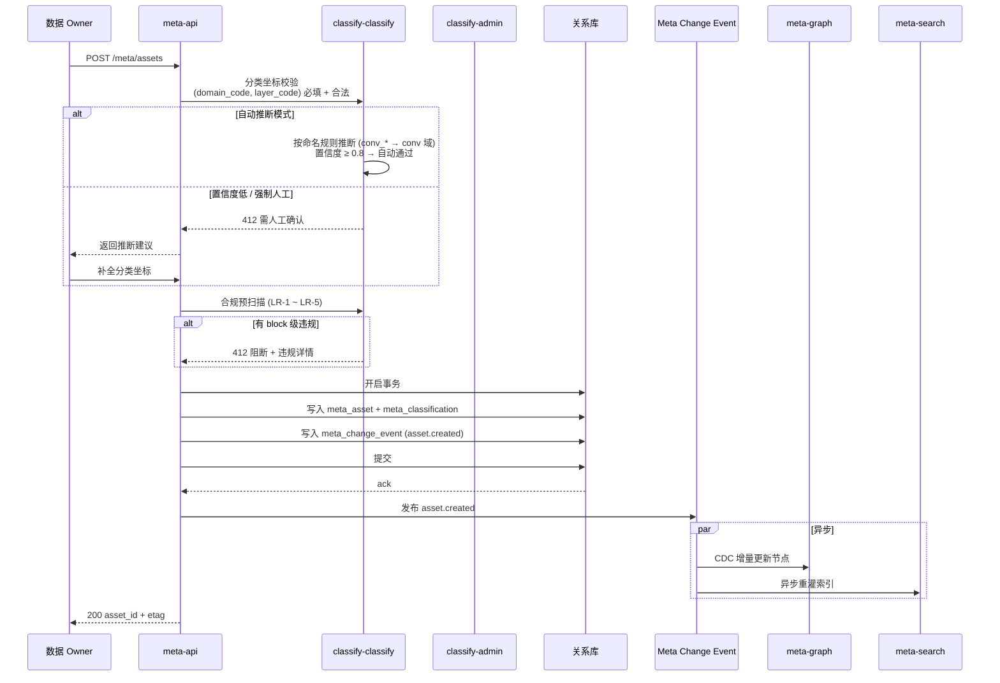
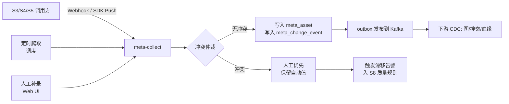
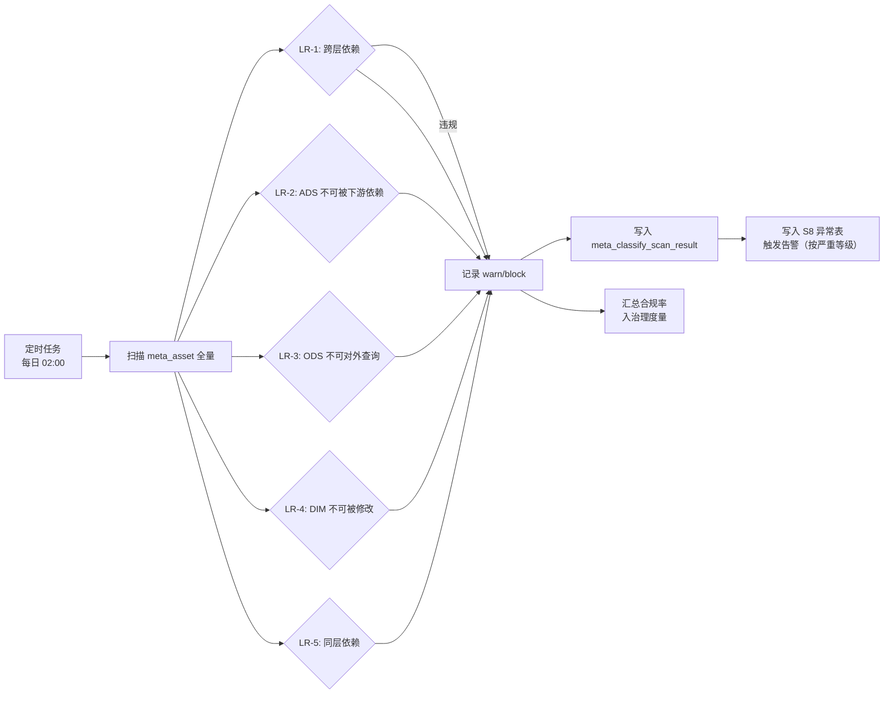
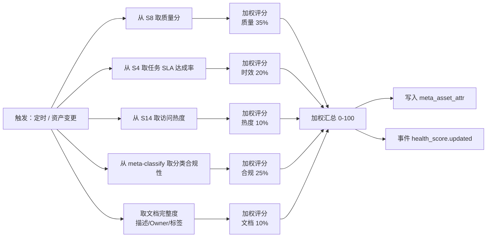

# S1 元数据与资产中心 — 软件实现设计说明书（SDD）

| 项 | 内容 |
|---|---|
| 文档编号 | `ADGS-S1-SDD-v1.0` |
| 文档类型 | 软件实现设计说明书（Software Design Document, SDD） |
| 所属系统 | 智能体数据治理系统（ADGS） |
| 子系统 | S1 元数据与资产中心 |
| 上游文档 | 《智能体数据治理系统-分析与设计文档》（`ADGS-ARD`，简称"主文档"）、《01-S1需求分析说明书》（`ADGS-S1-SRS`） |
| 版本 / 状态 | v1.0 / 设计评审稿 |
| 适用读者 | S1 研发工程师、测试工程师、SRE、数据治理运营、对接方（S2/S5/S6/S7/S11/S13）研发 |
| 密级 | 内部公开 |

> **阅读顺序**：先读同目录 `01-S1需求分析说明书.md`（解决"为什么做、做什么、做到什么程度"），再读本文（解决"怎么做、为什么这么做"）。
> 本文与需求分析说明书中的需求编号（FR-Mxx / NFR-xx / UC-S1-xx）一一对应，双向可追溯（见附录 A）。

## 修订记录

| 版本 | 日期 | 修订人 | 修订说明 |
|---|---|---|---|
| v1.0 | 2026-09-06 | 数据平台组 | 首次发布。由主文档配套实现设计拆分而来，并按 SDD 规范补齐：文档信息与修订记录、引言与术语、架构决策记录（ADR）、风险与开放问题、需求→设计追踪矩阵、安全与权限设计、错误码规范。 |

## 目录

| 章节 | 标题 | 对应标准 SDD 章节 |
|---|---|---|
| 0 | 引言（目的 / 术语 / 参考资料 / 约束 / 范围边界） | 1. Introduction |
| 1 | 实现范围与设计目标 | 1.2 Scope |
| 2 | 服务模块拆分 | 2.1 系统总体设计 · 模块视图 |
| 3 | 存储设计（多模存储 / 一致性 / DDL / 分区保留） | 4. 数据设计 |
| 4 | 核心接口设计（API / 事件订阅） | 5. 接口设计 |
| 5 | 关键流程（时序） | 6. 流程与时序设计 |
| 6 | 关键算法 | 7. 算法设计 |
| 7 | 缓存与一致性 | 3. 组件详细设计 |
| 8 | 容量与性能 | 8. 非功能性设计 · 性能 |
| 9 | 高可用与容灾（含部署架构、降级） | 2.2 部署视图 / 8. 非功能性设计 · 可用性 |
| 10 | 可观测性（含自举治理 NFR-15） | 8. 非功能性设计 · 可观测性 |
| 11 | 灰度与迁移 | 11. 部署与迁移 |
| 12 | 测试策略 | 10. 测试设计 |
| 13 | 架构决策记录（ADR） | 12. 设计决策 |
| 14 | 风险、开放问题与后续演进 | 12. 设计权衡与风险 |
| 附录 A | 需求 → 设计双向追踪矩阵 | — |
| 附录 B | 安全与权限设计 | 8. 非功能性设计 · 安全性 |
| 附录 C | 错误码与异常处理规范 | 9. 异常处理设计 |
| 附录 D | 跨子系统接口约定索引 | 5.3 外部接口 |

---

## 0. 引言

### 0.1 文档目的

本文定义 S1 元数据与资产中心的**实现级设计**，作为研发编码、测试用例编写、容量申请与上线评审的依据。本文回答四类问题：

1. **切成几个服务、各自负责什么**（§2）
2. **数据存在哪里、表怎么建、三份存储怎么保持一致**（§3、§7）
3. **对外提供什么契约、内部关键流程与算法如何执行**（§4、§5、§6）
4. **做到什么水位、挂了怎么办、怎么上线不出事**（§8、§9、§10、§11、§12）

不回答：需求本身的合理性（见需求分析说明书）、组织与运营机制（见主文档 §10）。

### 0.2 术语与缩写

| 术语 | 全称 / 说明 |
|---|---|
| 元元模型（L0） | Meta-Meta Model，定义"什么是实体、关系、属性"的那一层，支持无代码扩展 |
| 元模型（L1） | Meta Model，实体类型 + 关系类型 + 分类实体的定义集合 |
| 元数据实例（L2） | 具体资产，如 `event.session_start`、`table.dwd_conv_turn_di` |
| 分类坐标 | 二元组 `(subject_domain, data_layer)`，每份资产注册时必填，构成资产"地址" |
| 主题域 | Subject Domain，按业务过程划分的全域资产分类（user / conv / agent / invoke / content / quality / growth / ops / meta） |
| 数据分层 | Data Layer，按加工深度划分（ODS / DWD / DWM / DWS / ADS / DIM） |
| 跨层依赖规则 | LR-1 ~ LR-5，由 S1 定义、S5 执行校验的分层约束 |
| 元数据漂移 | 技术元数据（表结构）已变更但业务元数据（文档）未同步的状态 |
| 资产健康分 | 6 维加权（质量 / 时效 / 热度 / 文档完整度 / 分类合规性 / SLA 达成）的 0-100 分 |
| Meta Change Event | 元数据变更事件，S1 内部三存储一致性与对外通知的唯一机制 |
| 自举治理 | NFR-15：ADGS 用 ADGS 自身治理（S1 的元数据自身进入资产目录） |

### 0.3 参考资料

| 编号 | 文档 / 章节 | 关系 |
|---|---|---|
| R1 | 主文档 §1 系统定位与目标 | 需求来源 |
| R2 | 主文档 §2 需求建模（FR-M01~M09、NFR-01~15） | 需求来源 |
| R3 | 主文档 §3 总体分层架构与子系统依赖关系 | 架构约束 |
| R4 | 主文档 §S1 子系统分析与设计 | 功能定位、元模型、分类体系、LR-1~LR-5 |
| R5 | 主文档 §5.1 领域划分（限界上下文） | 领域边界 |
| R6 | 主文档 §6.2 命名规范 | 表/字段/事件命名约束 |
| R7 | 主文档 §8 接口与集成设计 | 接口风格总则 |
| R8 | 主文档 §9 非功能性设计 | 容量、SLA、高可用约束 |
| R9 | 《01-S1需求分析说明书》 | 直接上游 |
| R10 | 《架构图-3.3-子系统依赖关系.html》 | S1 对外依赖可视化 |

### 0.4 设计约束总览（不可协商项）

| 约束 | 来源 | 对设计的硬约束 |
|---|---|---|
| 治理面是唯一事实源：分类体系定义权在 S1 | 主文档 §S1 架构决策 | 主题域 / 分层注册表只在 S1 落库，其他子系统只读消费，禁止本地缓存写 |
| 命名中的「层」「主题域」token 取值来自 S1 注册表 | 主文档 §6.2 | S5/S2/S6 建模/注册时必须回查 S1，未注册取值一律拦截 |
| 一张表只能归属一个主题域 | 主文档 §S1 要点 3 | `meta_classification` 对 `asset_id` 唯一；跨域通过关联解决 |
| 敏感字段脱敏覆盖率 100%、访问 100% 留痕 | NFR-11 | 所有资产读接口强制鉴权 + 审计；字段级脱敏委托 S11 |
| 元数据变更后血缘与影响分析 5 分钟内可见 | NFR-04 | Meta Change Event 端到端 P95 ≤ 60s，消费端幂等 |
| 资产检索响应 ≤ 500ms、Top5 命中 ≥ 85% | NFR-13 | 读路径必须走搜索引擎，禁止回源关系库做全文检索 |
| 治理管控面可用性 ≥ 99.9% | NFR-05 | 读链路可降级（缓存/静态快照），写链路不降级但可排队 |
| 元模型可扩展（自定义实体/关系类型） | NFR-09 | L0/L1 必须数据化，禁止把实体类型硬编码进代码 |
| 系统自身 100% 自监控 | NFR-15 | S1 自身表与接口必须注册进 S1 资产目录并配置质量规则 |

### 0.5 本文不覆盖的内容

- 主文档已定义的元模型分层、主题域清单、分层规范、LR-1~LR-5 规则**内容**（此处仅引用，见 R4）；
- 数据面的实际存储与计算（S4/S5）、质量规则执行（S8）、指标计算（S6）；
- 数据门户的前端交互视觉稿（§2.2 仅给出模块职责与能力边界）；
- 组织 RACI 与运营节奏（主文档 §10）。

---

## 1. 实现范围与设计目标

### 1.1 实现范围

| 模块 | 范围 |
|---|---|
| **元模型管理** | L0 元元模型（Entity/Relation/Property 三类抽象 + 自定义扩展）、L1 元模型（资产类型与分类实体定义）、L2 实例（具体资产主数据） |
| **资产注册中心** | 资产全生命周期 CRUD：注册/版本/变更/退役/恢复 |
| **分类体系管理** | 主题域、数据分层的定义、变更、合并、拆分、废弃；跨层依赖规则维护 |
| **分类坐标挂载** | 资产注册时强制指定 `(主题域, 数据分层)`；批量挂载、自动推断、合规扫描 |
| **元数据采集** | 技术/业务/操作三类元数据的拉/推/订阅采集，含自动与人工双轨 |
| **资产目录与检索** | 全文检索 + 多维过滤 + 主题域/分层导航 + 资产关系图谱 |
| **资产健康分** | 6 维度加权评分（含分类合规性），输出至资产目录与团队治理排名 |
| **版本与审计** | 任何元数据变更（含分类体系）生成不可变版本快照，支持 diff/回滚 |
| **对外 API** | 元数据服务 API、元数据采集 Hook、Meta Change Event（事件订阅） |

### 1.2 设计目标

| 目标 | 锚定 NFR | 量化指标 |
|---|---|---|
| **全局元数据底座** | NFR-05 | S1 可用性 ≥ 99.9%；不可用时全治理能力降级 |
| **资产检索高效** | NFR-13 | 平均响应 ≤ 500 ms；Top5 命中率 ≥ 85% |
| **变更实时可见** | NFR-04 | 元数据变更后血缘/影响 5 分钟内可见（依托 S7）） |
| **自举治理** | NFR-15 | S1 自身的关键链路 100% 纳入 ADGS 自身监控（用 ADGS 治理 ADGS） |

---

## 2. 服务模块拆分

### 2.1 模块架构

```
┌────────────────────────────────────────────────────────────────┐
│                        S1 Service Cluster                      │
│                                                                │
│  ┌────────────────┐  ┌────────────────┐  ┌────────────────┐   │
│  │ meta-api        │  │ meta-collect   │  │ meta-classify  │   │
│  │ API 网关层      │  │ 元数据采集引擎  │  │ 分类与合规引擎  │   │
│  │ gRPC + HTTP    │  │ SDK/Webhook    │  │ 坐标挂载       │   │
│  │ 鉴权/限流/路由  │  │ 拉/推/订阅     │  │ 规则引擎       │   │
│  └────────────────┘  └────────────────┘  └────────────────┘   │
│                                                                │
│  ┌────────────────┐  ┌────────────────┐  ┌────────────────┐   │
│  │ meta-search     │  │ meta-graph     │  │ meta-audit     │   │
│  │ 资产检索        │  │ 资产关系图谱    │  │ 审计与版本     │   │
│  │ 全文+多维       │  │ 图查询/可视化   │  │ 变更快照/回滚  │   │
│  └────────────────┘  └────────────────┘  └────────────────┘   │
│                                                                │
│  ┌────────────────┐  ┌────────────────┐  ┌────────────────┐   │
│  │ classify-admin  │  │ health-score   │  │ meta-portal    │   │
│  │ 分类体系管理    │  │ 资产健康分      │  │ 资产目录门户    │   │
│  │ 主题域/分层     │  │ 6 维度加权     │  │ Web UI          │   │
│  └────────────────┘  └────────────────┘  └────────────────┘   │
│                                                                │
│  Meta Change Event Bus (Kafka)：所有变更统一发布，所有消费者（血缘、检索、审计等）订阅对齐 │
└────────────────────────────────────────────────────────────────┘
```

### 2.2 模块职责

| 模块 | 职责 | 关键能力 | 对外依赖 |
|---|---|---|---|
| **meta-api** | 对外 API 网关 | 资产 CRUD、批量操作、查询、检索、订阅；统一鉴权 (OIDC) + 限流 (Sentinel) + 审计日志 | 所有消费方（S2/S5/S6/S7/S11/S13） |
| **meta-collect** | 元数据采集引擎 | Hook 接入、表结构定时爬取、操作日志订阅、人工补录工作流；增量 + 全量并行；冲突仲裁（人工优先，保留自动值用于漂移检测） | S3（上报 Schema）、S4（任务血缘）、S5（建模产物） |
| **meta-classify** | 分类与合规引擎 | 资产注册时强制要求 (主题域, 分层)；自动推断（按命名规则/血缘）；人工确认；规则引擎执行 LR-1~LR-5 合规扫描 | classify-admin（主题域/分层定义） |
| **meta-search** | 资产检索 | 全文（中文 IK + 拼音）+ 多维过滤（域/层/类型/等级/Owner/标签）+ 热度/质量分排序；高亮与聚合 | Elasticsearch / OpenSearch |
| **meta-graph** | 资产关系图谱 | 邻居/路径查询、上下游追溯、子图导出（提供给 S7 血缘） | Neo4j / JanusGraph |
| **meta-audit** | 审计与版本 | 不可变变更事件日志；按资产 ID 拉版本快照；diff；回滚（需双人复核） | 关系库 + 对象存储（快照归档） |
| **classify-admin** | 分类体系管理 | 主题域/分层的 CRUD + 评审流程；变更影响分析（哪些资产受影响）；发布即生效 | 工作流引擎（S9） |
| **health-score** | 资产健康分 | 6 维度加权：质量、时效、热度、文档完整度、分类合规性、SLA 达成；周期任务 + 触发式（变更后增量重算） | S8（质量分）、S4（任务 SLA）、S14（治理度量） |
| **meta-portal** | 资产目录门户 | Web UI：搜索、浏览、详情、关系图、订阅、反馈；面向数据使用者（分析师/产品/算法） | 仅供内部登录访问 |

### 2.3 关键拆分决策

| 决策 | 理由 |
|---|---|
| **采集与 API 分离** | 采集是后台高吞吐任务（万级/小时），API 是低延迟交互（百毫秒级），混合部署会互相干扰 |
| **检索与图谱分离** | 检索是"按属性找资产"（全文+过滤），图谱是"按关系找资产"（邻居/路径）；索引结构完全不同 |
| **分类管理独立为 classify-admin** | 主题域与分层是"低频高影响"（半年级变更），需独立的工作流与权限；不应与高频资产 CRUD 混在一起 |
| **健康分独立服务** | 计算密集（聚合 6 维度 + 资产历史），单独扩缩容；可批处理（夜间）或触发式（实时） |

---

## 3. 存储设计

### 3.1 多模存储选型

依据主文档 4.x "关键设计要点 6（元数据存储选型）"：采用**图 + 搜索 + 关系库**三模组合。

| 存储 | 选型 | 承载内容 | 选型理由 |
|---|---|---|---|
| **关系库** | MySQL 8.0（分库分表） | L0/L1 元模型、资产主表、分类体系主表、版本快照元数据、审计日志 | 强事务保证元模型/分类体系变更的原子性；成熟的水平扩展工具（TiDB-Sharding） |
| **图存储** | Neo4j 5.x（Causal Cluster） | 资产关系（依赖/派生/分类挂载）、血缘（与 S7 共享） | 关系遍历性能优（毫秒级 3-5 hop），Cypher 查询表达力强 |
| **搜索** | Elasticsearch 8.x | 资产名称/标签/描述的全文索引、业务元数据过滤缓存 | 中文分词成熟（IK）、聚合丰富、与 Kibana 一体 |
| **对象存储** | S3 兼容存储 | 资产变更快照归档、Schema JSON 长文本、导入导出报表 | 成本低、容量无限 |

### 3.2 一致性架构

```
┌──────────────────────────────────────────────────────────────┐
│                     Meta Change Event Bus                    │
│                       (Kafka topic)                          │
│  asset.changed / classify.changed / version.snapshotted     │
└──────────────┬─────────────┬─────────────┬───────────────────┘
               │             │             │
       ┌───────▼──────┐ ┌────▼─────┐ ┌─────▼──────┐
       │ 关系库 (写)  │ │ 图(增量)  │ │ 搜索(重灌) │
       │ 同步写       │ │ CDC 订阅  │ │ 异步重灌   │
       │ 强一致       │ │ 最终一致  │ │ 最终一致   │
       └──────────────┘ └──────────┘ └────────────┘
```

**一致性 SLA**：
- 关系库 → 图：CDC 订阅端到端 ≤ 30s（P95）
- 关系库 → 搜索：异步重灌 ≤ 60s（P95）
- 关系库 → API：同步写，RTT ≤ 50ms

### 3.3 核心表 DDL

> 表名遵循主文档 §6.2 命名规范：`{系统域}_{子域}_{业务}_{粒度}`。S1 的系统域为 `meta`。

#### 3.3.1 元模型定义表（L1 层）

```sql
-- 资产类型定义（声明一类资产有哪些属性与关系）
CREATE TABLE meta_entity_type (
    entity_type_code   STRING       COMMENT '类型编码，如 Table/Event/Metric',
    entity_type_name   STRING       COMMENT '类型名称',
    category           STRING       COMMENT '分类：asset(资产)/classification(分类)',
    schema_json        STRING       COMMENT '属性 schema（JSON 数组，每个含 code/name/type/required）',
    relation_schema    STRING       COMMENT '允许的关系类型（JSON 数组）',
    owner_team         STRING       COMMENT '负责团队',
    is_system          BOOLEAN      COMMENT '是否系统预置',
    status             STRING       COMMENT '状态：draft/published/deprecated',
    version            INT          COMMENT '版本号，自增',
    created_at         TIMESTAMP,
    created_by         STRING,
    updated_at         TIMESTAMP,
    updated_by         STRING,
    etl_ts             TIMESTAMP    COMMENT 'CDC 时间戳'
)
COMMENT '资产类型元模型定义'
PARTITIONED BY (dt STRING)
STORED AS ORC;

-- 关系类型定义
CREATE TABLE meta_relation_type (
    relation_type_code STRING       COMMENT '关系编码，如 depends_on/belongs_to',
    relation_type_name STRING,
    cardinality       STRING       COMMENT '1:1 / 1:N / N:N',
    source_entity_types STRING     COMMENT '允许的源实体类型（JSON 数组）',
    target_entity_types STRING     COMMENT '允许的目标实体类型',
    description       STRING,
    status            STRING,
    etl_ts            TIMESTAMP
)
COMMENT '关系类型元模型'
PARTITIONED BY (dt STRING)
STORED AS ORC;
```

#### 3.3.2 分类体系表

```sql
-- 主题域（受主文档 4.x 主题域体系约束）
CREATE TABLE meta_subject_domain (
    domain_code        STRING       COMMENT '主题域编码（全局唯一 2-6 位，如 conv/agent）',
    domain_name        STRING       COMMENT '主题域名称',
    parent_domain_code STRING       COMMENT '父域编码（支持层级）',
    core_business_proc STRING       COMMENT '核心业务过程（JSON 数组）',
    core_entities      STRING       COMMENT '核心实体（JSON 数组）',
    domain_owner_team  STRING       COMMENT '域 Owner 团队',
    sla_level          STRING       COMMENT 'SLA 等级：S/A/B/C',
    status             STRING       COMMENT 'active/deprecated/archived',
    version            INT,
    effective_at       TIMESTAMP    COMMENT '生效时间',
    created_at         TIMESTAMP,
    created_by         STRING,
    etl_ts             TIMESTAMP
)
COMMENT '主题域定义（分类体系核心实体）'
PARTITIONED BY (dt STRING)
STORED AS ORC;

-- 数据分层
CREATE TABLE meta_data_layer (
    layer_code         STRING       COMMENT '分层编码：ODS/DWD/DWM/DWS/ADS/DIM',
    layer_name         STRING       COMMENT '分层名称',
    layer_seq          INT          COMMENT '层级序号，决定依赖方向',
    position           STRING       COMMENT '定位说明',
    modeling_method    STRING       COMMENT '建模方法约定',
    usage_constraint   STRING       COMMENT '使用约束（自由文本）',
    default_retention_days INT      COMMENT '默认保留期（天）',
    default_security_level STRING   COMMENT '默认安全等级',
    status             STRING,
    etl_ts             TIMESTAMP
)
COMMENT '数据分层定义'
PARTITIONED BY (dt STRING)
STORED AS ORC;

-- 分类坐标挂载（每份资产的强制二元组）
CREATE TABLE meta_classification (
    asset_id           STRING       COMMENT '资产主键（来自 meta_asset）',
    domain_code        STRING       COMMENT '主题域（FK）',
    layer_code         STRING       COMMENT '数据分层（FK）',
    classifier         STRING       COMMENT 'system(自动)/manual(人工)',
    confidence         DECIMAL(3,2) COMMENT '自动推断置信度（0.00-1.00）',
    classified_by      STRING       COMMENT '最终确认人',
    classified_at      TIMESTAMP,
    etl_ts             TIMESTAMP
)
COMMENT '资产分类坐标（强制二元组）'
PARTITIONED BY (dt STRING)
STORED AS ORC;

-- 分类合规扫描结果（周期任务写入）
CREATE TABLE meta_classify_scan_result (
    scan_id            STRING       COMMENT '扫描批次 ID',
    scan_at            TIMESTAMP,
    rule_id            STRING       COMMENT 'LR-1 ~ LR-5',
    asset_id           STRING,
    violation_detail   STRING       COMMENT '违规详情（JSON）',
    severity           STRING       COMMENT 'warn/block',
    etl_ts             TIMESTAMP
)
COMMENT '分类合规扫描结果'
PARTITIONED BY (dt STRING COMMENT '扫描日期 yyyy-MM-dd')
STORED AS ORC;
```

#### 3.3.3 资产主表

```sql
-- 资产主表（核心，覆盖 11 类资产）
CREATE TABLE meta_asset (
    asset_id           STRING       COMMENT '资产全局唯一 ID（UUID）',
    asset_code         STRING       COMMENT '业务编码（如 dwd_conv_turn_di）',
    asset_type_code    STRING       COMMENT '实体类型 FK（Table/Event/Metric/Dataset/Rule/API/Dashboard...）',
    asset_name         STRING       COMMENT '资产显示名',
    description        STRING       COMMENT '业务描述',
    domain_code        STRING       COMMENT '冗余：主题域（来自 classification）',
    layer_code         STRING       COMMENT '冗余：数据分层（来自 classification）',
    asset_level        STRING       COMMENT '资产等级：S/A/B/C',
    owner_team         STRING       COMMENT '业务 Owner 团队',
    owner_user         STRING       COMMENT '业务 Owner 个人',
    dpo_user           STRING       COMMENT '数据保护官（合规）',
    sla_level          STRING       COMMENT 'SLA 等级',
    tags               STRING       COMMENT '标签（JSON Array）',
    source_system      STRING       COMMENT '来源系统（CDC/SDK/手工录入）',
    status             STRING       COMMENT 'active/deprecated/archived/draft',
    version            INT          COMMENT '当前版本',
    deprecated_at      TIMESTAMP,
    created_at         TIMESTAMP,
    created_by         STRING,
    updated_at         TIMESTAMP,
    updated_by         STRING,
    etl_ts             TIMESTAMP    COMMENT 'CDC 时间戳（用于增量同步）'
)
COMMENT '资产主表（覆盖表/事件/指标/规则/API/数据集等）'
PARTITIONED BY (dt STRING)
STORED AS ORC;

-- 资产属性表（动态属性，按 entity_type.schema_json 渲染）
CREATE TABLE meta_asset_attr (
    asset_id           STRING,
    attr_code          STRING       COMMENT '属性编码（如 retention_days/p95_latency_ms）',
    attr_value         STRING       COMMENT '属性值（统一字符串，类型由 schema 限定）',
    attr_type          STRING       COMMENT 'string/int/float/bool/json',
    attr_source        STRING       COMMENT '属性来源：auto_collect/manual/business',
    updated_at         TIMESTAMP,
    etl_ts             TIMESTAMP
)
COMMENT '资产动态属性'
PARTITIONED BY (dt STRING)
STORED AS ORC;
```

#### 3.3.4 关系表（图存储的影子表，CDC 同步到 Neo4j）

```sql
-- 资产关系（dependency/derives_from/belongs_to/classified_by 等）
CREATE TABLE meta_relation (
    relation_id        STRING       COMMENT '关系 ID',
    relation_type_code STRING       COMMENT '关系类型 FK',
    source_asset_id    STRING,
    target_asset_id    STRING,
    properties            STRING       COMMENT '关系属性 JSON（如依赖强度、发现时间）',
    is_active          BOOLEAN,
    discovered_by      STRING       COMMENT 'auto(自动采集)/manual(人工声明)',
    confidence         DECIMAL(3,2) COMMENT '自动发现置信度',
    created_at         TIMESTAMP,
    created_by         STRING,
    etl_ts             TIMESTAMP
)
COMMENT '资产关系'
PARTITIONED BY (dt STRING)
STORED AS ORC;
```

#### 3.3.5 元数据变更事件（不可变审计）

```sql
-- 元数据变更事件（append-only，永久保留）
CREATE TABLE meta_change_event (
    event_id           STRING       COMMENT '事件 ID（UUID）',
    event_type         STRING       COMMENT 'asset.created/asset.updated/asset.deprecated/classification.changed/entity_type.published/...',
    resource_type      STRING       COMMENT 'asset/entity_type/subject_domain/data_layer/relation',
    resource_id        STRING,
    operation          STRING       COMMENT 'create/update/delete/deprecate',
    before_snapshot    STRING       COMMENT '变更前完整快照（JSON））',
    after_snapshot     STRING       COMMENT '变更后完整快照（JSON））',
    diff               STRING       COMMENT '字段级 diff（JSON））',
    actor_id           STRING       COMMENT '操作人',
    actor_type         STRING       COMMENT 'user/system/scheduler',
    reason             STRING       COMMENT '变更原因（人工填写）',
    ticket_id          STRING       COMMENT '关联工作流工单（人工变更时）',
    occurred_at        TIMESTAMP,
    etl_ts             TIMESTAMP
)
COMMENT '元数据变更事件（不可变、append-only，承载版本快照）'
PARTITIONED BY (dt STRING COMMENT '发生日期 yyyy-MM-dd')
STORED AS ORC;
```

> **回滚实现**：从 `before_snapshot` 重建主表与相关表 → 触发新的变更事件（事件类型 `asset.rollback`）→ Kafka 广播 → 下游 CDC 重放。

### 3.4 表分区与保留策略

| 表 | 分区粒度 | 保留期 | 理由 |
|---|---|---|---|
| meta_asset | dt（创建日期） | 永久（仅更新，不物理删除） | 资产是事实，退役资产仍需可追溯 |
| meta_asset_attr | dt（更新日期） | 永久 | 同上 |
| meta_relation | dt（创建日期） | 永久 | 关系需可追溯（含历史血缘） |
| meta_classification | dt（创建日期） | 永久 | 分类坐标不可丢 |
| meta_change_event | dt（发生日期） | **永久归档 + 冷存**（7 年） | 合规审计要求 |
| meta_classify_scan_result | dt（扫描日期） | 1 年热 + 3 年冷 | 周期性扫描结果 |

---

## 4. 核心接口设计

### 4.1 API 风格总则

| 维度 | 决策 | 理由 |
|---|---|---|
| **同步 API** | gRPC（主） + HTTP/JSON（次） | gRPC 性能高、强类型；HTTP 方便 Web/三方接入 |
| **异步事件** | Kafka topic `meta.change.events` | 解耦下游消费方；统一事件格式 |
| **认证** | OIDC + mTLS | S1 在 VPC 内，对外 HTTP 走 OIDC；内网 gRPC 走 mTLS |
| **限流** | Sentinel | 防止单租户/单调用方打爆 |
| **幂等** | 所有写操作接受 `Idempotency-Key` 头 | 防止重试导致重复 |
| **版本** | URI 含 v1/v2 | 主版本破坏性变更时强制新 URI |

### 4.2 元数据服务 API（核心）

> 与主文档 §8.1 内部子系统接口"元数据服务 API"对齐。

#### 4.2.1 资产注册

```http
POST /api/v1/meta/assets
Content-Type: application/json
Authorization: Bearer <token>
Idempotency-Key: <uuid>

{
  "asset_code": "dwd_conv_turn_di",
  "asset_type_code": "Table",
  "asset_name": "对话轮次事实表",
  "description": "一次会话轮次粒度的事实表，承载所有 Agent 交互的最小业务事件",
  "domain_code": "conv",                  // 主题域（必填）
  "layer_code": "DWD",                    // 数据分层（必填）
  "asset_level": "S",                     // S/A/B/C
  "owner_team": "agent-product",
  "owner_user": "u_xxx",
  "tags": ["agent", "conversation", "core"],
  "properties": {
    "retention_days": 180,
    "primary_key": ["tenant_id", "conversation_id", "turn_seq"],
    "partition_field": "dt"
  },
  "schema_version": "1
,
  "source_system": "s5-modeling"          // 由 meta-api 根据调用方 token 自动注入
}
```

**响应**：

```json
{
  "asset_id": "ast_2f9b8c1e7d",
  "asset_code": "dwd_conv_turn_di",
  "version": 1,
  "classification": {
    "domain_code": "conv",
    "layer_code": "DWD",
    "classifier": "manual",
    "classified_by": "u_xxx"
  },
  "compliance_scan": {
    "passed": true,
    "checked_rules": ["LR-1", "LR-2", "LR-4"],
    "violations": []
  },
  "etag": "W/\"v1-9f3a...\""
}
```

#### 4.2.2 资产检索（Top5 命中率 ≥ 85%）

```http
POST /api/v1/meta/assets/search
Content-Type: application/json
Authorization: Bearer <token>

{
  "q": "对话 轮次 智能体",               // 全文（中文分词 + 同义词扩展）
  "filters": [
    {"field": "domain_code", "op": "in", "values": ["conv", "agent"]},
    {"field": "layer_code", "op": "in", "values": ["DWD", "DWS"]},
    {"field": "asset_level", "op": "in", "values": ["S", "A"]},
    {"field": "status", "op": "=", "value": "active"}
  ],
  "sort_by": "health_score",
  "limit": 10,
  "highlight": true
}
```

**响应**：

```json
{
  "total": 23,
  "took_ms": 87,
  "items": [
    {
      "asset_id": "ast_2f9b8c1e7d",
      "asset_code": "dwd_conv_turn_di",
      "asset_name": "对话轮次事实表",
      "domain_code": "conv",
      "layer_code": "DWD",
      "asset_level": "S",
      "health_score": 92.3,
      "highlights": {
        "asset_name": "<em>对话</em><em>轮次</em>事实表"
      }
    }
  ],
  "facets": {
    "domain_code": {"conv": 12, "agent": 11},
    "layer_code": {"DWD": 14, "DWS": 9}
  }
}
```

#### 4.2.3 资产版本与回滚

```http
GET  /api/v1/meta/assets/{asset_id}/versions           # 列出版本
GET  /api/v1/meta/assets/{asset_id}/versions/{v}      # 查版本快照
POST /api/v1/meta/assets/{asset_id}/rollback          # 回滚到指定版本
```

回滚需双人复核（参考 §11.1 灰度策略）。

#### 4.2.4 元数据采集 Hook

> 与主文档 §8.1 "元数据采集 Hook"对齐。

**Webhook 上报（S**3** / S**4** / S**5** 调用）**：

```http
POST /api/v1/meta/collect/webhook
Content-Type: application/json
X-Source-System: s4-pipeline
X-Signature: <hmac-sha256>

{
  "resource_type": "table_schema",
  "resource_id": "dwd_conv_turn_di",
  "operation": "upsert",
  "snapshot": {
    "fields": [
      {"name": "turn_id", "type": "STRING", "comment": "轮次ID"},
      {"name": "turn_seq", "type": "INT", "comment": "轮次序号"}
    ],
    "partition_field": "dt",
    "storage_format": "ORC",
    "compression": "SNAPPY"
  },
  "collected_at": "2026-09-06T10:23:45Z"
}
```

**签名校验**：HMAC-SHA256(secret, body)，防伪造。secret 由 S1 在调用方首次接入时签发，存储在调用方配置中心。

### 4.3 Meta Change Event 订阅

S1 发布到 Kafka，所有下游消费方订阅：

```json
{
  "event_id": "evt_xxx",
  "event_type": "asset.classification_changed",
  "resource_type": "asset",
  "resource_id": "ast_2f9b8c1e7d",
  "operation": "update",
  "diff": {
    "classification": {
      "before": {"domain_code": "agent", "layer_code": "DWD"},
      "after":  {"domain_code": "conv",  "layer_code": "DWD"}
    }
  },
  "actor": "u_xxx",
  "occurred_at": "2026-09-06T10:23:45Z"
}
```

**事件类型清单**：

| event_type | 含义 | 主要消费方 |
|---|---|---|
| `asset.created` | 新资产注册 | S7（血缘起点）、搜索（索引）、图（节点） |
| `asset.updated` | 资产属性变更 | 搜索（更新）、图（更新）、S8（重算健康分） |
| `asset.classification_changed` | 分类坐标变更 | S7（影响分析）、S11（权限重算）、S12（生命周期策略重算） |
| `asset.deprecated` | 资产退役 | S7（标红）、S12（下线流程）、S14（治理度量扣分） |
| `asset.rollback` | 回滚到历史版本 | 全部（按版本重灌） |
| `classification.changed` | 主题域/分层定义变更 | **全体治理子系统**（影响面分析） |
| `entity_type.published` | 资产类型发布 | 检索、采集器（启用新类型） |

> **关键 SLA**：所有事件从 commit 到 Kafka 的延迟 ≤ 1s（P95）；下游消费方需在 5 分钟内对齐（与 NFR-04 一致）。

---

## 5. 关键流程

### 5.1 资产注册与分类坐标挂载



**关键设计要点**：

1. **事务边界**：资产主表 + 分类坐标 + 变更事件**同事务**（关系库内）；事件事件发布走 outbox 模式（防丢）。
2. **outbox 表**：`meta_outbox(event_id, payload, status)`，由独立 dispatcher 轮询 publish 到 Kafka，保证至少一次。
3. **合规预扫描**：在事务前执行，避免违规资产入库后的回滚成本。

### 5.2 元数据采集与漂移检测



**冲突仲裁规则**：
- 业务元数据（owner/描述/SLA）：以**最后人工确认**为准，自动采集仅作参考
- 技术元数据（schema/分区/存储量）：以**自动采集**为准，人工覆盖需通过审批
- 漂移检测：表结构变了但业务元数据文档没更新 → 触发 `meta_drift` 告警入 S8 规则

### 5.3 分类体系变更流程

**主题域或分层的任何变更**（新增、合并、拆分、废弃、层级调整）必须走工作流：

```
变更提案 (classify-admin) → 影响面分析 (S7 + S8 + S14)
        ↓
   评审会签 (S9 工作流引擎) → 域 Owner 签字 + 数据治理委员会批准
        ↓
   双写灰度 (新/老体系并行) → 至少 1 个版本周期
        ↓
   全量切流 (强制) → 老体系标记 deprecated
        ↓
   定期清理 (S12 生命周期策略)
```

**变更影响面分析**：
- 多少资产受影响（按 domain_code/layer_code 过滤）
- 多少指标依赖受影响（S6 引用统计）
- 多少服务 API 暴露受影响（S13 调用方统计）
- 影响等级：≥ 50 个资产或 ≥ 10 个调用方 → 必走委员会

### 5.4 合规扫描



**触发条件**：除定时外，支持变更触发（新资产注册后立即扫描、分类体系变更后扫描受影响资产）。

**严重等级**：block 级违规写入 `meta_change_event(operation='compliance_block')`，阻塞后续依赖创建（由 S8 卡点统一执行）。

### 5.5 资产健康分计算



权重表：

| 维度 | 权重 | 数据来源 | 计算方式 |
|---|---|---|---|
| 质量 | 35% | S8 | 资产所有关联规则的最近 7天通过率均值 |
| 合规 | 25% | meta-classify | 分类坐标完备率 + LR 扫描无 block 级违规 |
| 时效 | 20% | S4 | 最近 30 天任务产出 SLA 达成率 |
| 文档 | 10% | meta-asset | 描述/Owner/标签完备度评分 |
| 热度 | 10% | S14 | 30 天访问次数对数 + 下游引用数 |

> 权重经过**敏感性分析**确定（与主文档 §6.x 治理度量章节对齐）。允许按资产等级微调（S 级资产合规与质量权重上调至 40%/35%）。

---

## 6. 关键算法

### 6.1 分类坐标批量推断（命名规则引擎）

**输入**：资产名称 + 血缘上游 + 上游资产分类坐标
**输出**：建议 (domain_code, layer_code) + 置信度

```python
# 伪代码：分类坐标自动推断
def infer_classification(asset):
    code = asset.asset_code        # 如 dwd_conv_turn_di
    name = asset.asset_name

    # 1. 命名规则推断（按分层前缀）
    layer = infer_layer_from_prefix(code)  # dwd_* → DWD
    if layer is None:
        return None, 0.0

    # 2. 主题域推断（按域码关键词）
    domain = infer_domain_from_name(name, code)  # 关键词匹配 + 同义词
    confidence = 0.5 if domain else 0.0

    # 3. 上游资产投票（血缘已就绪的资产）
    if asset.upstream_assets:
        upstream_domains = [a.domain_code for a in asset.upstream_assets if a.domain_code]
        if upstream_domains:
            voted_domain = majority(upstream_domains)
            if voted_domain == domain:
                confidence = max(confidence, 0.95)  # 同源，置信度极高
            elif domain is None:
                domain, confidence = voted_domain, 0.7

    # 4. S/A 级资产：强制人工确认（不自动通过）
    if asset.asset_level in ('S', 'A'):
        confidence = min(confidence, 0.7)  # 强制人工确认

    return (domain, layer), confidence
```

**关键决策**：S/A 级资产自动推断置信度上限 0.7，强制人工确认（合规风险兜底）。

### 6.2 合规扫描（LR-1 ~ LR-5）

```python
# 伪代码：合规扫描
class ComplianceEngine:
    def scan(self, asset):
        violations = []
        # LR-1: 数据只能从低层流向高层，禁止跨层直读
        for dep in asset.dependencies:
            if not self.layer_seq[dep.layer_code] < self.layer_seq[asset.layer_code]:
                violations.append({
                    'rule_id': 'LR-1',
                    'severity': 'block',
                    'detail': f"依赖 {dep.asset_code}({dep.layer_code}) 高于本资产层({asset.layer_code})"
                })

        # LR-2: ADS 不可被下游依赖
        if asset.layer_code == 'ADS':
            downstream = self.get_downstream(asset)
            if downstream:
                violations.append({
                    'rule_id': 'LR-2', 'severity': 'block',
                    'detail': f"ADS 资产被 {len(downstream)} 个下游依赖"
                })

        # LR-3: ODS 不可对外提供查询权限（仅排障）
        if asset.layer_code == 'ODS':
            permissions = self.get_external_permissions(asset)
            non_emergency = [p for p in permissions if p.purpose != 'troubleshooting']
            if non_emergency:
                violations.append({
                    'rule_id': 'LR-3', 'severity': 'warn',
                    'detail': f"ODS 资产有 {len(non_emergency)} 个非排障权限"
                })

        # LR-4: DIM 不可被修改（只读共享）
        if asset.layer_code == 'DIM':
            write_pipelines = self.get_write_pipelines(asset)
            if write_pipelines:
                violations.append({
                    'rule_id': 'LR-4', 'severity': 'block',
                    'detail': f"DIM 资产被 {len(write_pipelines)} 个写管道访问"
                })

        # LR-5: 同层禁止互相依赖（DWS_A 依赖 DWS_B）
        if asset.layer_code in ('DWS', 'DWM'):
            for dep in asset.dependencies:
                if dep.layer_code == asset.layer_code:
                    violations.append({
                        'rule_id': 'LR-5', 'severity': 'warn',
                        'detail': f"同层依赖 {dep.asset_code}"
                    })
        return violations
```

### 6.3 资产健康分加权聚合

```python
# 伪代码：健康分计算
def compute_health_score(asset_id):
    dims = {
        'quality':  fetch_quality_score(asset_id),       # S8，最近 7 天规则通过率均值
        'timeliness': fetch_sla_achievement(asset_id),   # S4，最近 30 天 SLA 达成率
        'usage': fetch_usage_score(asset_id),            # S14，30 天访问 log + 下游引用
        'compliance': fetch_compliance_score(asset_id), # meta-classify，合规扫描通过率
        'documentation': fetch_doc_score(asset_id),      # meta-asset，完备度
    }
    # 不同等级资产权重微调
    level = get_asset_level(asset_id)
    if level == 'S':
        w = {'quality':0.40,'timeliness':0.20,'usage':0.05,'compliance':0.30,'documentation':0.05}
    elif level == 'A':
        w = {'quality':0.35,'timeliness':0.20,'usage':0.10,'compliance':0.25,'documentation':0.10}
    else:
        w = {'quality':0.30,'timeliness':0.20,'usage':0.15,'compliance':0.20,'documentation':0.15}

    # 加权聚合
    score = sum(dims[k] * w[k] for k in dims) * 100  # 转为 0-100
    # 关键维度兜底：任一维度 < 30 → 总分上限 60（避免单维度塌陷被其他维度掩盖）
    if any(dims[k] < 0.3 for k in ['quality', 'compliance']):
        score = min(score, 60)
    return round(score, 1)
```

### 6.4 增量采集调度

S3/S4/S5 的元数据采集**不能全量重采**（数百万资产 × 千字段），需增量：

```
meta-collect 启动时：
  1. 读取 Kafka offset，从上次 commit 处继续
  2. 启动定时全量校准（每日一次，凌晨低峰）
  3. 增量事件去重（用 event_id）

调度策略：
  - 高频资产（S 级）：实时采集（Webhook push）
  - 中频资产（A 级）：每 10 分钟定时爬取
  - 低频资产（B/C 级）：每小时定时爬取
  - 漂移检测：每次增量事件与最近一次完整快照对比，结构变化 → 触发人工 review
```

---

## 7. 缓存与一致性

### 7.1 多级缓存

| 缓存层 | 承载 | 失效策略 | TTL |
|---|---|---|---|
| **CDN** | meta-portal 静态资产 | 按版本号 | 永久（带 hash） |
| **网关本地** | 热点资产详情 | LRU | 5 min |
| **Redis 集群** | 检索结果、分类体系全集 | 事件驱动失效 + TTL | 10 min（事件失效立即生效） |
| **进程内** | 元模型定义（启动加载） | 启动加载，事件驱动 reload | 进程生命周期 |

**失效一致性**：所有写操作产生 `meta_change_event`，由统一 dispatcher 订阅并广播到各缓存失效通道（Redis pub/sub + 网关 SSE 推送）。

### 7.2 跨存储一致性

详见 §3.2 一致性架构。

**反查机制**：检索返回的资产详情强制二次反查关系库（用 asset_id），避免索引陈旧导致用户看到过期数据；用 ES 聚合结果 + 关系库详情合并展示。

---

## 8. 容量与性能

### 8.1 容量估算

> 与主文档 §9.1 容量估算对齐，并细化 S1 内部。

| 项 | 假设 | 结果 |
|---|---|---|
| 资产总数 | 14 类资产 × 平均 5 万/类 | 70 万资产 |
| 每日变更事件 | 1% 资产变更 × 70 万 = 7000；增量采集事件 5 万 | 约 5.7 万事件/日 |
| 关系总数 | 平均每资产 10 个关系（依赖/分类） | 700 万关系 |
| 变更事件保留 | 7 年 × 5.7 万/日 = 1.45 亿事件 | 冷存 500 GB / 热存 50 GB |
| 全文索引 | 70 万资产 × 平均 5 KB | ES 约 350 GB（含副本 1 TB） |
| 图存储 | 700 万节点 + 7000 万关系 | Neo4j 约 80 GB |

### 8.2 性能基线

| 指标 | 目标 | 监控位置 |
|---|---|---|
| 资产写入 P95 | ≤ 200 ms（含合规扫描） | meta-api |
| 资产读取 P95 | ≤ 50 ms | meta-api |
| 检索 P95 | ≤ 500 ms（NFR-13） | meta-search |
| 分类坐标挂载 P95 | ≤ 150 ms | meta-classify |
| 健康分计算 P95 | ≤ 1 s | health-score |
| 图谱 3-hop 查询 P95 | ≤ 200 ms | meta-graph |
| 变更事件发布延迟 P95 | ≤ 1 s | Kafka producer |

---

## 9. 高可用与容灾

### 9.1 部署架构

```
            ┌─────────── Region A (主)  ───────────┐
            │                                     │
   ┌────────────────┐                  ┌────────────────┐
   │ meta-api (3 副本)│                  │ meta-api (3 副本)│
   └────────────────┘                  └────────────────┘
            │                                     │
   ┌────────▼────────┐                ┌────────▼────────┐
   │ MySQL 主从 (读写分离)│            │ MySQL 主从 (灾备)│
   └────────┬────────┘                └────────┬────────┘
            │                                     │
   ┌────────▼────────┐                ┌────────▼────────┐
   │ Neo4j Cluster    │                │ Neo4j Cluster   │
   └────────┬────────┘                └────────┬────────┘
            │                                     │
   ┌────────▼────────┐                ┌────────▼────────┐
   │ ES Cluster       │                │ ES Cluster      │
   └─────────────────┘                └─────────────────┘

            ┌─────────── Region B (灾备，冷备 RPO 5min) ───────────┐
```

**SLA**：可用性 ≥ 99.9%（每月 ≤ 43 分钟不可用）。

### 9.2 降级策略

S1 不可用对 ADGS 是**全局性灾难**（所有治理能力降级）。需分级降级：

| 故障范围 | 降级行为 | 触发条件 |
|---|---|---|
| **完全不可用** | 所有治理子系统切换到**本地缓存**（最近一次同步的元数据快照）；S4 管道降级为"先跑后校验" | 健康检查连续 3 次失败 |
| **图存储不可用** | meta-graph 返回"关系未知"，API 仍可读写；血缘影响分析降级 | Neo4j 健康检查失败 |
| **搜索不可用** | 检索降级为关系库 LIKE 查询（性能降级，准确性下降） | ES 健康检查失败 |
| **变更事件不可用** | 写操作正常返回，但下游对齐延迟；启动 outbox 重放 | Kafka producer 健康检查失败 |

### 9.3 灾备与 RPO/RTO

| 指标 | 目标 |
|---|---|
| **RPO** | ≤ 5 分钟（关系库主从同步延迟） |
| **RTO** | ≤ 30 分钟（关系库切换 + 图/搜索重建） |
| **灾难演练** | 每季度一次全量切换演练 |

---

## 10. 可观测性

### 10.1 黄金信号

| 信号 | 指标 | 告警阈值 |
|---|---|---|
| **流量** | QPS（按 API 分组） | 突增 200% 持续 5 分钟 |
| **错误率** | 5xx 比例 | > 0.5% 持续 2 分钟 |
| **延迟** | P95/P99（按 API） | P95 > SLA × 1.5 |
| **饱和度** | CPU/内存/连接池/Kafka lag | > 80% 持续 5 分钟 |

### 10.2 自举治理（NFR-15）

S1 自身的关键链路 100% 纳入 ADGS 治理：

- S1 的 API 调用 → 上报到 S3 作为业务事件
- S1 的 meta_asset 表 → 注册到 S1 自身（meta-asset 类型）
- S1 的 API 质量 → 配置 S8 质量规则（Schema、响应码分布）
- S1 的延迟/SLA → 上报到 S4（meta-api-latency 任务）
- S1 的健康分 → 自身纳入治理度量（S14）

**特殊处理**：S1 注册自己的元数据时，绕开"分类坐标必须填写"的硬约束（用 `system=true` 标记），避免启动死锁。

---

## 11. 灰度与迁移

### 11.1 分类体系变更的灰度

```
Phase 1（提案）：classify-admin 提交变更 + 影响面分析
        ↓
Phase 2（评审）：工作流会签（S9）→ 双人复核 + 委员会批准
        ↓
Phase 3（双写）：新老体系并行存在
        - 老体系资产标 deprecated
        - 新老双 ID 可互查
        - 持续 1 个版本周期（≥ 30 天）
        ↓
Phase 4（全量切流）：强制切到新体系
        - 老体系标 archived
        - 老资产 ID 触发迁移事件
        ↓
Phase 5（清理）：S12 生命周期策略下，老体系数据冷存
```

### 11.2 资产回滚的双人复核

资产回滚是高风险操作（影响血缘、检索、权限、健康分），必须：

```
操作人提交回滚请求 → meta-audit 锁定版本快照
        ↓
复核人（必须非操作人）审核 → 工作流会签
        ↓
生成新事件 asset.rollback → 写入新版本（不是物理回滚，避免破坏审计链）
        ↓
所有下游重灌
```

---

## 12. 测试策略

### 12.1 测试层次

| 层次 | 工具 | 覆盖 |
|---|---|---|
| **单元测试** | Go testing | meta-classify 规则引擎、健康分计算、合规扫描算法（覆盖率 ≥ 80%） |
| **集成测试** | Testcontainers | meta-api + MySQL + Kafka + ES 全链路 |
| **契约测试** | Pact | meta-api 对外契约（与 S2/S5/S6/S7/S11/S13 的 API 一致性） |
| **性能测试** | k6 | API 读写 P95/P99、检索响应、健康分计算 |
| **灾备演练** | ChaosBlade | 注入网络/存储故障，验证降级策略与 RTO |
| **混沌测试** | ChaosBlade | 验证事件乱序/重复/丢失下的最终一致性 |

### 12.2 关键测试场景

- **合规扫描正确性**：构造违规资产（跨层直读、ADS 被依赖、ODS 对外权限、DIM 被写、同层依赖），验证扫描结果
- **回滚幂等性**：重复回滚同一资产，结果一致
- **事件最终一致性**：模拟 Kafka 延迟 60s 后，下游最终对齐
- **分类坐标强制约束**：未填 (domain, layer) 的资产注册请求必失败
- **健康分敏感性**：单维度变化对总分的影响（验证权重合理性）

---
---

## 13. 架构决策记录（ADR）

> 记录"为什么这样设计"以及**被否决的替代方案**。新增设计变更时，请在此追加 ADR 而非直接改代码。

### ADR-S1-01 · 元数据存储采用「关系库 + 图库 + 检索引擎」三写，最终一致

- **状态**：已接受（v1.0）
- **背景**：S1 需要同时支撑三种差异极大的访问模式：① 结构化 CRUD 与事务（资产注册、分类体系变更）；② 多跳关系遍历（血缘、依赖、影响面）；③ 中文全文 + 多维过滤检索（资产目录）。
- **候选方案**：
  - A. 单一关系库（递归 CTE 做关系遍历、LIKE 做检索）
  - B. 单一图库（关系天然，但事务与检索弱）
  - C. **关系库为写入主库 + 图库承载关系 + 检索引擎承载检索，CDC 事件驱动同步**
  - D. 全部下游通过 API 实时聚合（无冗余）
- **决策**：选 C。
- **理由**：A 在多跳遍历（≥3 跳）与中文检索上不可接受（NFR-04/NFR-13 无法达成）；B 缺乏事务与二级索引能力；D 每次检索都回源，P95 无法稳定在 500ms 内。C 的代价是三份数据的一致性问题，但元数据变更频率低（天级~小时级），用"单一写入口 + Meta Change Event + 对账任务"可控。
- **后果**：✅ 三类访问模式各自最优；❌ 引入最终一致窗口（设计目标 P95 ≤ 60s，见 ADR-S1-06）；❌ 运维三套存储。
- **关联**：FR-M02、FR-M04、NFR-04、NFR-13；§3.1、§3.2、§7.2

### ADR-S1-02 · 主题域与数据分层的定义权归属 S1（元模型层），S5 仅有消费与执行权

- **状态**：已接受（沿用主文档 §S1 架构决策）
- **背景**：主题域/分层是"描述数据的数据"，且被事件、指标、数据集、规则、API 五类非表资产共用。
- **候选方案**：A. 定义权在 S5 建模工具；B. **定义权在 S1 元数据底座**；C. 独立分类服务。
- **决策**：选 B。
- **理由**：① 适用范围不止数仓表，若定义权在 S5，则 S2/S6/S13 使用同一套分类体系需反向依赖数据面子系��，破坏"治理面是唯一事实源"；② 主题域是低频高影响的企业级标准，不能与高频建模动作混管；③ 跨资产类型的全局校验（如"ADS 不得被下游依赖"）只有持有全域元数据的 S1 具备视野。C 会增加一个不必要的服务与一次网络跳转。
- **后果**：✅ 分类体系单一事实源；❌ S1 成为强依赖（S5/S2/S6 建模路径上必须回查，需本地缓存 + 变更推送兜底，见 §7.1）。
- **关联**：FR-M06、FR-M07、FR-M08；主文档 §S1、§6.2

### ADR-S1-03 · 分类坐标 `(主题域, 分层)` 作为资产注册的强制属性，写入即校验

- **状态**：已接受
- **背景**：权限策略、生命周期策略、成本归因、检索导航四项能力都依赖分类坐标，完备率不足会让这些能力全部退化。
- **候选方案**：A. 选填 + 事后补录；B. **注册即强制 + 自动推断 + 人工确认**；C. 强制且不允许自动推断。
- **决策**：选 B。
- **理由**：A 会导致完备率长期低位（治理推动成本极高）；C 会显著抬高资产接入成本，违背 NFR-07（≤0.5 人日）。B 用命名规则推断（§6.1）+ 血缘继承把默认正确率做到 90%+，人工只需确认/修正 10%。
- **后果**：✅ 完备率目标 ≥98% 可达；❌ 需维护命名规则引擎与例外清单；❌ 存量资产需要一次性批量挂载（见 §11.1 灰度）。
- **关联**：FR-M06、FR-M07、FR-M08、NFR-07、NFR-08；§5.1、§6.1

### ADR-S1-04 · 资产回滚为不可逆高危操作，强制双人复核 + 全量留痕

- **状态**：已接受
- **背景**：元数据回滚会连带影响下游的血缘、权限、质量规则与资产目录展示，误操作影响面大且难以察觉。
- **候选方案**：A. 单人即可回滚；B. **双人复核（发起/审批分离）+ 回滚前自动生成影响清单 + 不可变审计**；C. 禁止回滚，只许前进式修正。
- **决策**：选 B。
- **理由**：A 风险不可控；C 在"分类体系批量误改"这类场景下不可行（必须能回退）。B 在可用性与安全之间取平衡，且复核动作本身由 S9 工作流承载，不额外开发审批引擎。
- **后果**：✅ 误操作可防可控；❌ 紧急回滚链路变长（P0 故障场景提供"紧急通道 + 事后 24h 补审"，见 §11.2）。
- **关联**：FR-M05、NFR-11；§4.2.3、§11.2

### ADR-S1-05 · 元数据采集「增量 CDC 为主 + 全量对账为辅」，冲突时人工元数据优先

- **状态**：已接受
- **背景**：自动采集保证覆盖率与及时性，人工补录保证业务语义完整性，两者会冲突。
- **候选方案**：A. 自动采集优先；B. **人工审核后的业务元数据优先，自动值保留用于漂移检测**；C. 时间戳最新优先。
- **决策**：选 B。
- **理由**：业务语义（口径、使用场景、等级）只有人能给出；但自动采集的结构信息（列名、类型、分区）是客观事实。B 把"谁更权威"按字段维度分开，同时保留自动值作为漂移检测基线（表结构变了但文档没更新 → 告警）。
- **后果**：✅ 语义质量与结构新鲜度兼得；❌ 需要字段级的来源标记（provenance），表设计增加复杂度（见 §3.3.3 `meta_asset_attr`）。
- **关联**：FR-M02、FR-M03、FR-M05；§5.2、§6.4

### ADR-S1-06 · 以 Meta Change Event 作为跨存储一致性与对外通知的唯一机制

- **状态**：已接受
- **背景**：三份存储需要同步，且 S7（血缘）、S11（权限）、S13（服务目录）、S14（治理度量）都需要感知元数据变更。
- **候选方案**：A. 各消费方定时轮询；B. 点对点 RPC 通知；C. **统一不可变事件日志 + 消息队列广播，消费方幂等**
- **决策**：选 C。
- **理由**：A 无法达成 NFR-04（5 分钟内可见）且浪费资源；B 会形成 N×M 的耦合与扇出风暴；C 天然满足审计（不可变日志）、重放（新消费方可追历史）、解耦，且三存储同步与对外通知共用一条链路，一致性语义统一。
- **后果**：✅ 可重放、可审计、可水平扩展消费；❌ 需要处理乱序与重复（消费方幂等 + 版本号单调）；❌ 事件积压会同时影响三存储同步与下游可见性（需独立告警，见 §10.1）。
- **关联**：FR-M04、FR-M05、NFR-04；§3.2、§4.3、§7.2

### ADR-S1-07 · 资产健康分采用 6 维加权，周期全量 + 变更触发增量重算

- **状态**：已接受
- **背景**：健康分要驱动检索排序、治理排名、上线卡点，需要既准又及时。
- **候选方案**：A. 每次读取实时计算；B. 纯周期（T+1）计算；C. **周期全量基线 + 变更触发增量重算**
- **决策**：选 C。
- **理由**：A 在检索路径上做 6 维聚合，P95 不可控；B 的 T+1 延迟会让"刚修好质量分却没变"成为高频吐槽；C 用周期任务保证基线正确，用事件触发保证分钟级新鲜，成本可控。
- **后果**：✅ 时效与成本平衡；❌ 需处理重算风暴（批量分类变更时做合并窗口，见 §5.5）。
- **关联**：FR-M03、FR-M09；§5.5、§6.3

---

## 14. 风险、开放问题与后续演进

| ID | 风险 / 开放问题 | 类型 | 影响 | 概率 | 缓解措施 | 责任方 | 触发升级条件 |
|---|---|---|---|---|---|---|---|
| RK-S1-01 | 三存储最终一致窗口内读到旧数据（如刚改分类但检索仍显示旧值） | 风险 | 用户困惑、误判 | 中 | 写后读一致性：注册/变更接口返回版本号，检索层对 60s 内变更的资产走主库回源；三存储对账任务每日全量比对 | S1 研发 | 一致窗口 P95 > 60s 连续 1 天 |
| RK-S1-02 | 存量资产无分类坐标，批量推断错误率高 | 风险 | 完备率不达标、误分类扩散 | 高 | 灰度分批（§11.1）：先 S/A 级资产人工确认，B/C 级走自动推断 + 抽样复核；提供"分类申诉"入口 | 数据治理组 + S1 | 抽样准确率 < 85% |
| RK-S1-03 | 合规扫描（LR-1~LR-5）误报导致建模被频繁阻断 | 风险 | 研发效率受损、绕过治理 | 中 | 规则分级：LR-2/LR-4 阻断，LR-5 告警 + 健康分扣减；提供豁免申请与理由留痕 | S1 + S5 | 误报率 > 10% |
| RK-S1-04 | Meta Change Event 积压导致下游（S7/S11）连锁延迟，违反 NFR-04 | 风险 | 影响分析失真 | 中 | 独立消费组 + 独立告警；积压超阈值自动降级为"仅同步核心字段" | S1 SRE | 积压 > 10 万条或延迟 > 5min |
| RK-S1-05 | 元数据采集对源端（数仓 MetaStore / 业务库）造成压力 | 风险 | 影响生产 | 低 | 采集走只读从库 + 限流 + 错峰；全量对账放在低峰 | S1 + 数仓 | 源端负载上涨 > 10% |
| OP-S1-01 | 主题域是否会细分到二级域（如 conv.text / conv.voice） | 开放 | 分类粒度与检索体验 | — | v1 保持一级域，用标签承载二级语义；观察检索 Top5 命中率再决定 | 数据治理组 | 命中率 < 85% 且因粒度粗导致 |
| OP-S1-02 | 数据分层是否需要新增"实时层 DWR" | 开放 | 分层规范与 LR 规则需同步扩展 | — | 分层注册表已支持扩展，新增层需同步提交 LR 规则变更评审 | S1 + S4 | 实时资产占比 > 20% |
| OP-S1-03 | 字段级血缘的采集成本与收益比 | 开放 | 存储与计算成本 | — | v1 只做表级（S7 主责），字段级在 S/A 级资产上试点 | S1 + S7 | — |

**后续演进（v2 候选）**：① 分类坐标自动推断升级为基于血缘 + 命名的embedding 相似匹配；② 资产目录引入自然语言问答式检索（"哪个表有用户首轮响应时长"）；③ 健康分与成本（S12）打通，引入"成本效率"维度。

---

## 附录 A · 需求 → 设计双向追踪矩阵

> 需求编号来自《01-S1需求分析说明书》。**"—"表示该需求由其他子系统的设计承载，S1 仅提供能力。**

| 需求 ID | 需求摘要 | 设计承载章节 | 承载模块 | 存储 / 接口 | 测试场景（§12.2） |
|---|---|---|---|---|---|
| FR-M01 | 业务对象注册与版本化 | §2.2、§5.1 | meta-api / meta-audit | `meta_entity_type`、`meta_asset`；`POST /api/v1/meta/assets` | TC-01 资产注册与分类校验 |
| FR-M02 | 技术元数据采集与同步 | §2.2、§5.2、§6.4 | meta-collect | `meta_asset_attr`；采集 Hook API | TC-02 采集漂移检测 |
| FR-M03 | 业务元数据维护与评审 | §2.2、§5.1 | meta-api / meta-portal / classify-admin | `meta_asset`；评审走 S9 | TC-03 业务元数据优先仲裁 |
| FR-M04 | 血缘关系建模与展示 | §2.2、§4.3 | meta-graph / meta-audit | `meta_relation`；Meta Change Event | TC-04 关系同步与图查询 |
| FR-M05 | 变更审计与版本 diff | §2.2、§4.2.3、§11.2 | meta-audit | `meta_change_event` | TC-05 版本 diff 与双人复核回滚 |
| FR-M06 | 主题域体系管理 | §2.2、§5.3 | classify-admin | `meta_subject_domain` | TC-06 主题域变更影响评估 |
| FR-M07 | 数据分层规范管理 | §2.2、§5.3 | classify-admin | `meta_data_layer` | TC-07 分层注册与 LR 规则绑定 |
| FR-M08 | 分类体系合规扫描 | §2.2、§5.4、§6.2 | meta-classify | `meta_classification`、`meta_classify_scan_result` | TC-08 LR-1~LR-5 扫描 |
| FR-M09 | 分类变更影响评估与评审 | §5.3、§11.1 | classify-admin + S9 | 变更事件 → S7 | TC-09 域合并影响清单 |
| FR-M10 | 资产检索与目录 | §2.2、§4.2.2、§7.1 | meta-search / meta-portal | Elasticsearch 索引 | TC-10 检索 P95 与 Top5 命中率 |
| FR-M11 | 资产等级与责任人管理 | §2.2、§5.1 | meta-api | `meta_asset.asset_level` / `owner` | TC-11 S 级资产强制项校验 |
| FR-M12 | 资产健康分 | §2.2、§5.5、§6.3 | health-score | 6 维输入聚合 | TC-12 健康分重算与风暴抑制 |
| NFR-04 | 变更 5 分钟内可见 | §3.2、§4.3、§7.2 | meta-audit → 消费方 | Meta Change Event | 积压与延迟告警 |
| NFR-05 | 管控面可用性 ≥ 99.9% | §9.1、§9.2 | 全模块 | 多可用区部署 | 故障注入演练 |
| NFR-09 | 元模型可扩展 | §3.3.1 | meta-api | `meta_entity_type` / `meta_relation_type` | 自定义实体类型接入测试 |
| NFR-11 | 脱敏 100% / 访问留痕 | 附录 B | meta-api + S11 | 审计日志 | 越权访问拦截测试 |
| NFR-13 | 检索 ≤500ms / Top5 ≥85% | §4.2.2、§8.2 | meta-search | ES 索引与排序策略 | 压测：检索混合场景 |
| NFR-15 | 自举治理 | §10.2 | 全模块 | S1 自身资产注册 | 自监控覆盖率检查 |

---

## 附录 B · 安全与权限设计

### B.1 认证：统一 OIDC + 服务间 mTLS

| 场景 | 机制 |
|---|---|
| 人员访问（portal / API） | 企业 OIDC 单点登录，JWT 携带 `sub / groups`，网关校验签名与有效期 |
| 子系统间调用 | mTLS 双向证书 + 服务身份（`X-Service-Id`），证书由内部 CA 签发并自动轮转 |
| 采集 Agent | 一机一密的 `client_id/secret`，按数据源维度授权，可吊销 |

### B.2 鉴权：RBAC 打底 + ABAC 按主题域授权

```
决策顺序：
1) 角色基线（RBAC）：admin / domain_owner / editor / viewer
2) 属性规则（ABAC）：resource.subject_domain ∈ user.owned_domains
                    OR resource.owner == user.id
                    OR 存在生效的授权单（S11 审批通过）
3) 默认拒绝（deny by default）
```

| 角色 | 读 | 写 | 分类体系变更 | 回滚 | 说明 |
|---|---|---|---|---|---|
| admin（治理平台管理员） | ✅ | ✅ | ✅（需评审） | ✅（复核人） | 不含"自己复核自己" |
| domain_owner（域 Owner） | 本域 ✅ | 本域 ✅ | ❌（可发起） | ❌（可发起） | 跨域需申请 |
| editor（数据开发/分析师） | ✅ | 自己创建的资产 ✅ | ❌ | ❌ | |
| viewer | ✅（脱敏后） | ❌ | ❌ | ❌ | 敏感字段按 S11 策略脱敏 |

- **字段级脱敏**：S1 不实现脱敏算法，只透传字段的安全分级标签，由 S11 在数据服务层（S13）执行；S1 门户展示层对敏感字段做默认掩码。
- **ODS 层访问**：LR-3 约束在鉴权层落地——ODS 资产默认无查询权限，仅排障工单临时授权（最长 4h，自动回收）。

### B.3 审计留痕（NFR-11）

| 审计项 | 落库 | 保留期 |
|---|---|---|
| 资产读（详情/检索点击） | 操作日志 → Kafka → 数仓 | 180 天 |
| 资产写（创建/变更/删除） | `meta_change_event`（不可变） | 永久 |
| 分类体系变更 | `meta_change_event` + S9 审批记录 | 永久 |
| 权限变更与临时授权 | S11 审计 | 365 天 |

### B.4 数据安全

- 传输：全链路 TLS 1.2+；存储：元数据不含业务明文数据，但资产样例值（sample value）需脱敏后入库（默认关闭采集样例）。
- 区域化：存在跨境场景时，资产注册需声明 `region` 属性，S1 按 region 路由到对应区域的存储实例（NFR-12）。

---

## 附录 C · 错误码与异常处理规范

### C.1 错误码格式

```
S1-{模块}-{三位数字}
模块：API / CLS（分类）/ COL（采集）/ SRC（检索）/ GRP（图谱）/ AUD（审计）/ HSC（健康分）
示例：S1-CLS-002  分类坐标不合法（主题域未注册）
```

### C.2 HTTP 映射与重试语义

| 类别 | HTTP | 客户端可重试 | 说明 |
|---|---|---|---|
| 参数/校验错误 | 400 | 否 | 需修正请求；响应体含 `invalid_fields` |
| 未认证 / 无权限 | 401 / 403 | 否 | 403 时返回申请入口链接 |
| 资源不存在 | 404 | 否 | |
| 冲突（版本不一致 / 唯一约束） | 409 | 否 | 返回当前版本号，客户端刷新后重试 |
| 限流 | 429 | 是（退避） | 返回 `Retry-After` |
| 服务内部错误 | 500 | 是（幂等请求） | 需携带 `Idempotency-Key` |
| 依赖不可用 | 503 | 是（退避） | 返回降级说明 |

### C.3 幂等与部分失败

- 所有写接口支持 `Idempotency-Key`（24h 窗口），重复请求返回首次结果。
- 批量接口（批量注册/批量分类挂载）返回**逐条结果**，采用 `207 Multi-Status` 语义，禁止"全成功或全失败"（避免一条脏数据阻塞整批）。

### C.4 降级矩阵（与 §9.2 对应）

| 依赖故障 | 降级动作 | 用户可见影响 |
|---|---|---|
| 图库不可用 | 关系查询返回"血缘暂不可用"，其余功能正常 | 详情页关系图空白 |
| 检索引擎不可用 | 降级为关系库前缀匹配（限 S/A 级资产 + 结果截断 50 条） | 检索变慢、结果不全 |
| 关系库只读 | 写接口返回 503 并引导稍后重试 | 无法变更，浏览正常 |
| 消息队列积压 | 暂停非核心消费（操作日志类），优先变更事件 | 热度/操作指标延迟 |

---

## 附录 D · 跨子系统接口约定索引

| 对端 | 方向 | 内容 | 契约位置 | 一致性 |
|---|---|---|---|---|
| S2 埋点治理 | S1 ← S2 | 事件/属性注册为资产，继承主题域 | §4.2.1 | 强一致（同步注册） |
| S2 | S1 → S2 | 主题域/分层注册表下发 | §4.3 事件 | 最终一致 |
| S3 采集网关 | S1 ← S3 | 上报 Schema 与未知事件统计 | §4.2.4 | 最终一致 |
| S4 管道编排 | S1 ← S4 | 任务与表级血缘 | §4.2.4 | 最终一致 |
| S4 | S1 → S4 | 分层生命周期默认策略 | §4.3 | 最终一致 |
| S5 数仓建模 | S1 ← S5 | 建模产物（表/字段）注册 | §4.2.1 | 强一致（建模卡点） |
| S5 | S1 → S5 | 分类注册表 + LR 规则 + 建模规范校验 | §4.3、§6.2 | 最终一致（本地缓存） |
| S6 指标平台 | S1 ← S6 | 指标注册为资产 | §4.2.1 | 强一致 |
| S7 血缘分析 | S1 → S7 | Meta Change Event + 关系快照 | §4.3 | 最终一致（≤5min，NFR-04） |
| S8 质量中心 | S1 ← S8 | 资产质量分（健康分输入） | §5.5 | 最终一致（T+1 + 触发） |
| S11 安全合规 | 双向 | 安全分级标签 / 脱敏策略 | 附录 B | 最终一致 |
| S12 生命周期 | S1 → S12 | 分层 → 默认保留期策略 | §4.3 | 最终一致 |
| S13 数据服务 | S1 ← S13 | 服务/数据集注册为资产 | §4.2.1 | 强一致 |
| S14 治理度量 | S1 → S14 | 分类坐标完备率、健康分分布 | §4.3 | 最终一致 |

---

> **文档结束。** 本 SDD 与《01-S1需求分析说明书》构成 S1 的完整交付文档集，变更时两文档需同步更新（追踪矩阵见附录 A）。
