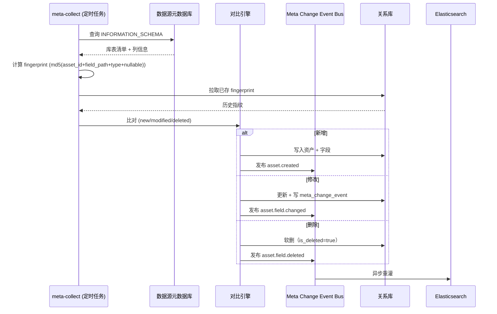
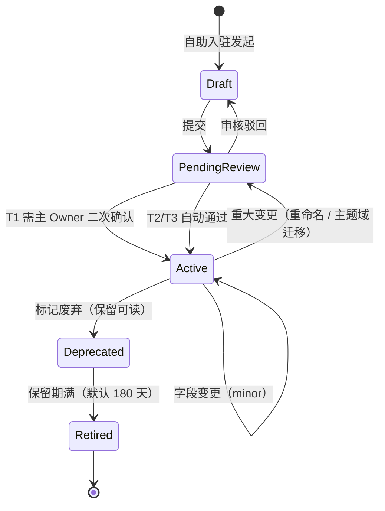
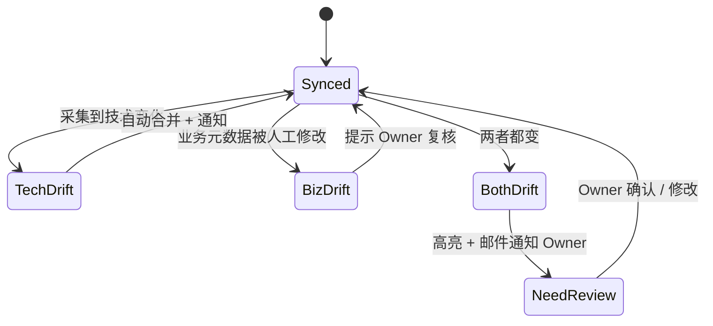
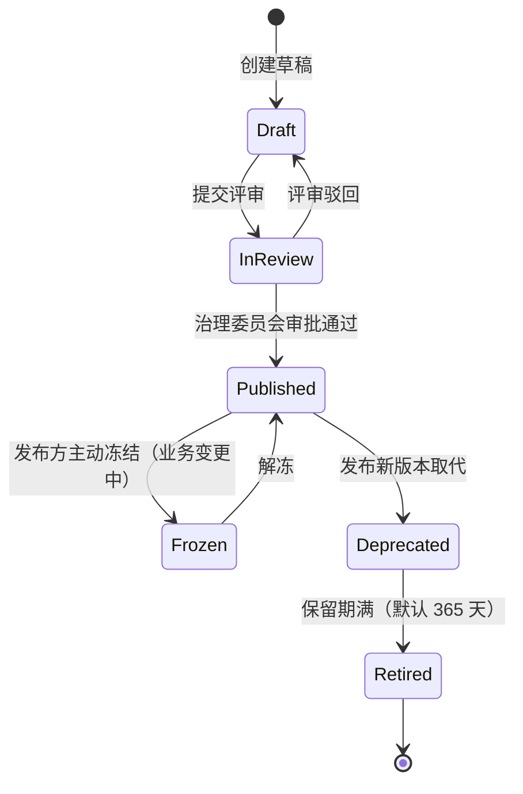
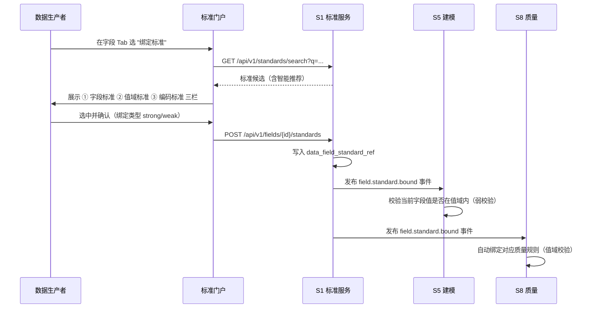
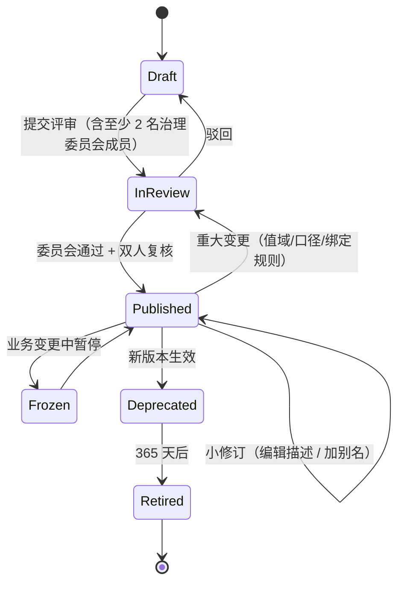

# 数据资产目录与数据标准 —— 软件实现设计与原型说明

> 文档编号：`ADGS-S1-DDD-03`
> 范围：**S1 元数据与资产中心 → 两个具体职责**：
> 1. **元数据管理** —— 数据资产目录（Data Catalog）
> 2. **数据架构管理** —— 数据标准（Data Standard）
>
> 上游：`02-S1软件实现设计说明书.md`（总册，本文为其深化篇）
> 上游：`智能体数据治理系统-分析与设计文档.md §S1` §6.2 §9
>
> 本文档不重复总册已定义的元模型/分类坐标/LR 规则内容，仅在其之上做**职责聚焦的产品化与工程化深化**。

---

## 目录

- [0. 引言](#0-引言)
- [1. 职责边界与设计哲学](#1-职责边界与设计哲学)
- [方向 A：数据资产目录](#方向-a数据资产目录)
- [方向 B：数据标准](#方向-b数据标准)
- [附录 A · 关键状态机汇总](#附录-a--关键状态机汇总)
- [附录 B · 与总册章节的对应关系](#附录-b--与总册章节的对应关系)
- [附录 C · 原型使用说明](#附录-c--原型使用说明)

---

## 0. 引言

### 0.1 文档目的

总册（《02-S1软件实现设计说明书.md》）将"资产目录"与"分类体系"作为能力列名提及，但**未展开两件事**：

1. **数据资产目录**作为**面向终端用户的产品**（分析师/产品/算法/治理负责人每天使用的产品形态）
2. **数据标准**作为**与分类体系并列的独立治理对象**（码表/字段标准/值域/命名/度量/主数据）

本篇补齐这两块的设计深度，作为研发实现与原型评审的依据。

### 0.2 术语

| 术语 | 全称 / 说明 |
|---|---|
| 资产目录 | Data Catalog，**面向用户**的产品形态，提供检索 / 浏览 / 详情 / 订阅 / 反馈等能力 |
| 数据标准 | Data Standard，对**字段 / 值域 / 命名 / 度量 / 编码 / 主数据**的统一定义集合，可被字段引用、可被程序校验 |
| 数据元 | Data Element，**字段**的标准化定义（中文名/英文名/类型/精度/值域/计量单位/业务含义） |
| 落标率 | 字段引用某标准的比率 = `已引用标准字段数 / 应引用字段数`，按主题域/分层/团队聚合 |
| 落标 | 字段→标准的映射关系（一个字段可对应多个标准） |
| 标准冲突 | 同名字段在不同资产中引用了不一致的标准，或同名字段在不同标准库中存在歧义 |
| 自助入驻 | 数据生产者无需治理团队介入即可完成资产登记、字段补录、Owner 认领的端到端流程 |
| 元数据漂移 | 技术元数据（Schema/字段类型）已变更但业务元数据（描述/Owner/标准引用）未同步 |

### 0.3 参考资料

| 编号 | 文档 | 关系 |
|---|---|---|
| R1 | 《02-S1软件实现设计说明书》§1-§2 范围与模块 | 能力边界 |
| R2 | 主文档 §S1 元模型 / 分类坐标 / LR-1~LR-5 | 元数据模型约束 |
| R3 | 主文档 §6.2 命名规范 | 命名标准落标基准 |
| R4 | 主文档 §9 NFR-13（检索）NFR-04（变更实时性）NFR-15（自举） | 量化约束 |
| R5 | DAMA-DMBOK2 第 10 章（参考数据与数据标准）/ 第 11 章（数据仓库与商务智能） | 国际框架 |
| R6 | Apache Atlas / DataHub / Unity Catalog / Datahub-LinkedIn 设计 | 产品对标 |

---

## 1. 职责边界与设计哲学

### 1.1 一张图看 S1 内部职责切分

```
S1 元数据与资产中心
│
├─ A. 数据资产目录（面向"找数据"）
│   ├─ 资产全生命周期（注册/版本/退役）
│   ├─ 元数据采集（拉/推/订阅）
│   ├─ 检索/浏览/详情/订阅
│   ├─ 关系图谱与血缘（与 S7 共享）
│   ├─ 标签 / 收藏 / 推荐 / 反馈
│   └─ 自助入驻流
│
├─ B. 数据架构管理（面向"定义规范"）
│   ├─ 分类体系（主题域 + 分层）—— 在总册已定义，本篇不重复
│   ├─ 数据标准（命名/字段/值域/编码/度量/主数据）—— 本篇重点
│   ├─ 字段-标准映射 / 落标率 / 自动落标
│   └─ 标准生命周期与变更影响
│
└─ C. 共同底座
    ├─ 元模型（L0/L1）
    ├─ 鉴权/审计/事件
    └─ 分类体系（主题域/分层/LR 规则）
```

### 1.2 两条设计哲学

> **A 让"找数据"足够轻** —— 资产目录必须让分析师**10 秒内找到需要的数据**；搜索 / 主题域导航 / 收藏 / 订阅必须做到"零治理团队介入"。
>
> **B 让"用错数据"足够难** —— 数据标准必须**渗透到字段级别**（不是只挂在资产上），让"用错码表 / 用错口径"变成不可能或很难；落标率是驱动行为改进的核心指标。

---

# 方向 A：数据资产目录

## A.1 产品能力地图

| 一级域 | 二级能力 | 用户故事 | 优先级 |
|---|---|---|---|
| **A1 检索与发现** | 全文搜索 / 多维过滤 / 主题域导航 / 推荐 / 热门 / 我订阅的 | "我想找 user 主题域里所有含 session_id 字段的 ODS 表" | P0 |
| **A2 资产详情** | 字段列表 / 血缘预览 / 质量预览 / SLA / 订阅 / 反馈 / 评论 | "这张表的字段含义、口径、Owner、最近更新是否可信" | P0 |
| **A3 资产注册** | 引导式自助入驻 / 批量采集接入 / 模板导入 / 字段映射 / Owner 认领 | "我新建了一张表，怎么告诉全公司" | P0 |
| **A4 元数据采集** | 拉模式（轮询）/ 推模式（Webhook）/ 订阅模式（Schema Registry）/ 人工补录 | "新表自动出现在目录里，无需手动登记" | P0 |
| **A5 标签与收藏** | 标签体系 / 我的收藏 / 团队空间 / 业务域 Wiki 关联 | "把这个资产收藏到我的工作区" | P1 |
| **A6 反馈与评论** | 字段级评论 / 问题反馈 / 数据问题工单（关联 S8） | "这个字段的口径有问题，我要反馈给 Owner" | P1 |
| **A7 资产关系** | 上游依赖 / 下游消费 / 同源表 / 同 Owner / 字段级血缘 | "这张表被谁消费、字段是哪儿来的" | P1 |
| **A8 推荐与热门** | 最近访问 / 同类推荐 / 团队常用 / 全站热门 | "我之前看的 / 我的同事也用" | P2 |
| **A9 自助入驻流** | 5 步引导（声明资产类型→选主题域→选分层→映射字段→指定 Owner→提交） | 数据生产者 5 分钟内完成 | P0 |
| **A10 移动端/嵌入** | 飞书/钉钉卡片 / SQL 编辑器内嵌 / BI 工具内元数据气泡 | "在用数据的地方就能看元数据" | P2 |

## A.2 信息架构（IA）

### A.2.1 一级导航

```
┌─ 资产目录
│  ├─ 首页（发现）
│  ├─ 浏览
│  │  ├─ 按主题域（树）
│  │  ├─ 按分层（ODS/DWD/DWS/...）
│  │  ├─ 按资产类型（表/事件/指标/模型/维度/API）
│  │  └─ 按团队
│  ├─ 搜索结果
│  ├─ 我的资产（Owner=我/订阅的/收藏的）
│  └─ 我入驻的（自助入驻发起）
│
├─ 数据标准（切到方向 B）
│
└─ 治理后台
   ├─ 资产注册管理
   ├─ 采集适配器配置
   ├─ 标签管理
   └─ 反馈处理
```

### A.2.2 资产详情页 IA（最关键页面）

```
┌──────────────────────────────────────────────────────────────┐
│  [面包屑] 主题域/user › 分层/DWD › 资产/conv_session_di      │
│                                                              │
│  ┌─────────────────────────────┬────────────────────────┐    │
│  │ conv_session_di             │  ⭐ 健康分 92/100      │    │
│  │ 会话主表（标准化）            │  📊 质量 95 │ ⏱ 时效 90│    │
│  │ DWD · user · dwd · di       │  🔥 热度 88 │ 📝 文档 95│    │
│  │ Owner: 张三 (data-platform)  │  ✓ 合规 100 │ 📈 SLA 92│    │
│  │ 最近更新: 2h ago by 李四     │                        │    │
│  │ [+ 订阅变更] [+ 收藏]       │  [查看健康分明细]      │    │
│  │                             │                        │    │
│  │ ## 描述                     │                        │    │
│  │ 标准化后的会话主表...         │                        │    │
│  │ ## 数据标准（4/8 落标）     │                        │    │
│  │ ## 质量规则（12）           │                        │    │
│  └─────────────────────────────┴────────────────────────┘    │
│                                                              │
│  Tabs: [字段 (28)] [血缘] [质量] [消费方] [订阅] [评论] [版本]│
│                                                              │
│  [字段 Tab]                                                  │
│  ┌─────┬──────────┬──────┬──────┬──────┬───────────────┐   │
│  │ #   │ 字段名    │ 类型 │ 注释 │ 标准 │ 质量 │ 热度  │   │
│  ├─────┼──────────┼──────┼──────┼──────┼───────────────┤   │
│  │ 1   │ session_id│ string│ 会话ID│ ★GB-T 20091 │ 🟢 │ 🔥 │   │
│  │ 2   │ user_id   │ bigint│ 用户ID│ ★自定-uid   │ 🟢 │ 🔥 │   │
│  │ 3   │ start_ts  │ ts    │ 开始 │ ★ISO8601   │ 🟡 │ ─  │   │
│  │ 4   │ ...       │      │      │ ⚠ 未落标   │ 🟢 │ ─  │   │
│  └─────┴──────────┴──────┴──────┴──────┴───────────────┘   │
│                                                              │
│  [血缘预览 Tab]                                              │
│  ┌─────┐    ┌─────┐    ┌──────────┐    ┌─────┐              │
│  │ODS  │───▶│DWD  │───▶│DWS session│───▶│ADS │              │
│  │session│   │conv │    │_agg_dd  │    │ ... │              │
│  │_raw  │    │_session│  │         │    │     │              │
│  └─────┘    └─────┘    └──────────┘    └─────┘              │
│  ↑ 上游 2 跳（点击展开）    ↓ 下游 3 跳                    │
└──────────────────────────────────────────────────────────────┘
```

## A.3 核心数据模型

> 与总册 §3.3 表族对齐。本节给出**资产目录特有的字段级补充**与新增的辅助表。

### A.3.1 资产主表（`meta_asset`）字段补充

在总册 §3.3.3 的基础上，对**资产目录查询路径上需要的字段**做强化：

```sql
ALTER TABLE meta_asset
  ADD COLUMN data_source_type   STRING COMMENT '存储类型:hive/iceberg/doris/kafka/api',
  ADD COLUMN storage_location    STRING COMMENT '库.表或 topic 名',
  ADD COLUMN row_count_estimate  BIGINT COMMENT '行数估算（采集）',
  ADD COLUMN size_bytes          BIGINT COMMENT '占用字节（采集）',
  ADD COLUMN last_refreshed_at   TIMESTAMP COMMENT '最近刷新',
  ADD COLUMN sla_level           STRING COMMENT 'T1/T2/T3 业务关键度',
  ADD COLUMN access_credential   STRING COMMENT '凭据引用 ID（实际凭证在 S11）',
  ADD COLUMN popularity_7d       INT COMMENT '近 7 天访问次数（来自查询审计）',
  ADD COLUMN bookmark_count      INT COMMENT '被收藏次数',
  ADD COLUMN feedback_count      INT COMMENT '未关闭反馈数',
  ADD COLUMN portal_visible      BOOLEAN DEFAULT TRUE COMMENT '是否在目录门户可见';
```

### A.3.2 新增表 —— 字段级元数据（核心）

> 字段级元数据是**数据标准落标的最小载体**，也是详情页字段 Tab 的直接数据源。

```sql
CREATE TABLE meta_field (
    field_id           STRING       PRIMARY KEY,
    asset_id           STRING       NOT NULL  COMMENT '所属资产',
    field_path         STRING       NOT NULL  COMMENT '字段名，支持嵌套 a.b.c',
    data_type          STRING       COMMENT 'string/bigint/double/decimal(p,s)/timestamp/json',
    nullable           BOOLEAN      COMMENT '是否可空',
    description        STRING       COMMENT '字段中文注释',
    description_en     STRING       COMMENT '字段英文注释',
    is_partition       BOOLEAN      DEFAULT FALSE,
    is_primary_key     BOOLEAN      DEFAULT FALSE,
    sensitivity_level  STRING       COMMENT 'L1/L2/L3/L4（来自 S11）',
    standard_refs      JSON         COMMENT '引用的标准 ID 列表（与 data_standard 多对多）',
    quality_rule_refs  JSON         COMMENT '绑定的质量规则 ID 列表（与 S8 对接）',
    sample_values      JSON         COMMENT '最近一次采样的前 N 条值（用于值域自动检测）',
    source_hash        STRING       COMMENT '技术元数据指纹（用于漂移检测）',
    version_no         INT          DEFAULT 1,
    is_deleted         BOOLEAN      DEFAULT FALSE,
    created_at         TIMESTAMP    DEFAULT CURRENT_TIMESTAMP,
    updated_at         TIMESTAMP    DEFAULT CURRENT_TIMESTAMP ON UPDATE CURRENT_TIMESTAMP,
    INDEX idx_asset (asset_id),
    INDEX idx_type (data_type),
    INDEX idx_sens (sensitivity_level)
) COMMENT '资产字段元数据，L2 实例层';
```

### A.3.3 新增表 —— 标签与收藏

```sql
-- 标签体系
CREATE TABLE meta_tag (
    tag_id       STRING  PRIMARY KEY,
    tag_name     STRING  UNIQUE NOT NULL,
    tag_category STRING  COMMENT '业务/技术/合规/治理',
    color        STRING  COMMENT '显示色 HEX',
    owner_team   STRING,
    usage_count  INT     DEFAULT 0,
    is_system    BOOLEAN DEFAULT FALSE,
    created_at   TIMESTAMP DEFAULT CURRENT_TIMESTAMP
);

-- 资产-标签多对多
CREATE TABLE meta_asset_tag (
    asset_id STRING,
    tag_id   STRING,
    added_by STRING,
    added_at TIMESTAMP DEFAULT CURRENT_TIMESTAMP,
    PRIMARY KEY (asset_id, tag_id)
);

-- 收藏
CREATE TABLE meta_bookmark (
    user_id   STRING,
    asset_id  STRING,
    folder    STRING  COMMENT '收藏夹名',
    created_at TIMESTAMP DEFAULT CURRENT_TIMESTAMP,
    PRIMARY KEY (user_id, asset_id, folder)
);
```

### A.3.4 新增表 —— 反馈与评论

```sql
CREATE TABLE meta_feedback (
    feedback_id   STRING  PRIMARY KEY,
    target_type   STRING  COMMENT 'asset/field',
    target_id     STRING  NOT NULL,
    feedback_type STRING  COMMENT 'description_clarity/data_quality/access_issue/other',
    title         STRING,
    content       STRING,
    submitter     STRING,
    status        STRING  DEFAULT 'open' COMMENT 'open/in_progress/resolved/closed',
    assignee      STRING,
    related_ticket STRING COMMENT '关联 S8 工单 ID',
    created_at    TIMESTAMP DEFAULT CURRENT_TIMESTAMP,
    resolved_at   TIMESTAMP,
    INDEX idx_target (target_type, target_id),
    INDEX idx_status (status)
);
```

### A.3.5 新增表 —— 采集适配器

```sql
CREATE TABLE meta_collector (
    collector_id    STRING  PRIMARY KEY,
    collector_type  STRING  COMMENT 'pull/poll/push/webhook/subscribe',
    source_type     STRING  COMMENT 'hive/iceberg/doris/kafka/api/postgres',
    endpoint        STRING  COMMENT 'JDBC URL / Kafka topic / API URL',
    cron_expr       STRING  COMMENT '拉模式周期',
    filter_rule     JSON    COMMENT '白/黑名单（库/表/字段）',
    field_mapping   JSON    COMMENT '外部字段→S1 内部字段映射',
    status          STRING  DEFAULT 'active' COMMENT 'active/paused/error',
    last_run_at     TIMESTAMP,
    last_run_status STRING,
    owner_team      STRING,
    created_at      TIMESTAMP DEFAULT CURRENT_TIMESTAMP
);
```

## A.4 采集适配器（拉 / 推 / 订阅 / 人工）

### A.4.1 三模式总览

| 模式 | 触发方式 | 适用场景 | 实时性 | 实现要点 |
|---|---|---|---|---|
| **拉** | 定时拉取元数据库 | Hive/Iceberg/Doris 等有元数据库 | 分钟级 | `INFORMATION_SCHEMA`/Metastore API/直连；变更对比指纹 |
| **推** | 上游主动推送 | 自研系统、业务侧 SDK | 秒级 | Webhook + 签名 + 幂等键；适配 OpenMetadata/JSON Schema |
| **订阅** | 监听变更日志 | Postgres CDC、Kafka topic | 秒级 | Debezium/MySQL Binlog；事件契约与 S1 表结构解耦 |
| **人工** | Web 录入 / Excel 导入 | 缺失元数据库的外部数据 | 异步 | 模板校验 + 字段映射预览 + 批量落库 |

### A.4.2 拉模式详解（最高频）

**采集时序**：



**关键算法：漂移检测**

```text
技术漂移 = 采集指纹 ≠ 上次指纹
业务漂移 = 技术未变 ∧ (描述/标准引用/Owner 已变)

判定规则：
- 仅技术漂移 → 自动合并到采集事件，标记 health_score 下降
- 仅业务漂移 → 提示用户审查（不动技术元数据）
- 双向漂移 → 高亮，标记 "需 Owner 复核"
```

### A.4.3 推模式 SDK（数据生产者侧）

```typescript
// 推模式 SDK 用法（数据生产者嵌入）
import { S1Client } from '@adgs/s1-sdk';

const client = new S1Client({ endpoint: 'https://s1.adgs.internal', apiKey: process.env.S1_KEY });

// 1. 注册资产
await client.registerAsset({
  code: 'ods.session_raw_di',
  type: 'Table',
  subjectDomain: 'conv',
  dataLayer: 'ODS',
  owner: 'data-platform-team',
  fields: [
    { path: 'session_id', dataType: 'string', nullable: false, description: '原始会话ID' },
    // ...
  ],
});

// 2. 推送变更（幂等）
await client.pushChange({
  assetCode: 'ods.session_raw_di',
  changeId: `${Date.now()}-${process.pid}`,  // 幂等键
  operations: [
    { op: 'add_field', path: 'client_ip', dataType: 'string', description: '客户端 IP' },
    { op: 'modify_field', path: 'session_id', description: '会话ID（已废弃，使用 user_session_id）' },
  ],
});
```

**幂等保证**：服务端 24h 内对相同 `changeId` 返回原结果；超过 24h 的 `changeId` 直接拒绝（避免重复落库）。

### A.4.4 冲突仲裁

| 冲突类型 | 优先级 | 仲裁策略 |
|---|---|---|
| 技术元数据 vs 技术元数据 | 后采集者覆盖前者 | 适合 1 个上游改、多个采集源 |
| 业务元数据 vs 业务元数据 | 人工元数据优先 | 保留自动值用于漂移提示 |
| 技术 vs 业务 | 不视为冲突（独立维度） | 分别记录 |
| 跨资产同名字段口径不一致 | 触发标准冲突工单（关联 S8） | 通知 Owner 整改 |

## A.5 自助入驻（5 步引导）

> 这是降低治理成本的关键设计——让数据生产者无需找治理团队就能完成登记。

```
步骤 1/5：声明资产类型与基础信息
   ├─ 资产类型：Table / Event / Metric / Model / Dimension / API
   ├─ 名称（强校验，引用命名规范自动推荐）
   ├─ 业务描述（≥ 30 字，AI 自动补全草稿）
   └─ 提交

步骤 2/5：选择分类坐标
   ├─ 主题域（下拉，仅可选已注册域）
   ├─ 数据分层（下拉，仅可选已注册层）
   └─ 校验 LR 规则（如选 ODS 则禁止声明主键）

步骤 3/5：字段映射
   ├─ 三选一：① 直连采集（推荐）② 手动录入 ③ 上传 JSON Schema
   ├─ 自动识别字段类型 / 是否可空 / 是否分区字段
   ├─ 自动推荐数据标准（见方向 B §B.5 自动落标）
   └─ 必填项：每字段 ≥ 10 字中文注释

步骤 4/5：指定 Owner 与权限
   ├─ 主 Owner（团队 + 个人）
   ├─ 协 Owner
   ├─ 默认可见范围（公开/限团队/限密级）
   └─ SLA 等级（T1/T2/T3）

步骤 5/5：预览与提交
   ├─ 全量预览卡片
   ├─ 一键发布（创建事件 → 通知 Owner → 上架门户）
   └─ 7 天观察期后转正式资产
```

**校验时机**：每一步提交时阻断式校验，跳过即报错。SLA 等级 T1 资产需要主 Owner 实名二次确认。

## A.6 检索与发现

### A.6.1 检索架构

```
用户 Query
  │
  ▼
┌─────────────┐    ┌────────────────┐    ┌──────────────┐
│ Query Parser│ → │ ES 全文 + 多维  │ → │ Reranker     │
│ - 分词 IK    │    │ - 主题域/分层    │    │ - 热度       │
│ - 同义词扩展 │    │ - 类型/等级/Owner│    │ - 健康分     │
│ - 拼音       │    │ - 标签          │    │ - 我的最近访问│
└─────────────┘    └────────────────┘    └──────────────┘
                                                  │
                                                  ▼
                                          Top 50 → 前端分页
```

### A.6.2 排序权重

```text
最终得分 = 0.30 × 文本相关分
        + 0.20 × 健康分
        + 0.15 × 热度（近 30 天）
        + 0.15 × 用户个性化（同团队/Owner/订阅）
        + 0.10 × 合规性
        + 0.10 × 时效性（最近更新越近分越高）
```

### A.6.3 推荐场景

- **同类推荐**：在详情页底部推荐同主题域、同分层、字段相似度 ≥ 0.7 的资产
- **同 Owner 推荐**：在团队空间推荐同 Owner 的其他资产
- **热门榜单**：每周 TOP 100（按 7d 访问量）；按主题域分层聚合
- **最近使用**：登录用户在搜索栏下方展示最近 10 次访问的资产

## A.7 详情页（最关键页面设计）

### A.7.1 头部信息卡

| 字段 | 来源 | 显示规则 |
|---|---|---|
| 资产名 + 中文标题 | `meta_asset.name` + `display_name` | 大字号，hover 显示全称 |
| 主题域 + 分层徽标 | `meta_classification` | 彩色 chip，点击跳转主题域 |
| 健康分（6 维雷达） | `health_score` | 0-100 环形图，悬停展示分维度明细 |
| Owner 头像 + 团队 | `meta_asset.owner_team` + `owner_user` | 团队 + 个人头像；点击跳团队空间 |
| SLA 等级 | `meta_asset.sla_level` | T1 红 / T2 黄 / T3 蓝 |
| 最近更新 | `meta_change_event` 最近一条 | "2h ago by 李四（加字段 client_ip）" |
| 操作按钮 | — | 订阅变更、收藏、反馈、申请权限 |

### A.7.2 Tabs 设计

| Tab | 内容 | 数据源 | 加载策略 |
|---|---|---|---|
| 字段 | 字段列表 + 注释 + 标准 + 质量 | `meta_field` + 标准引用 + 质量规则摘要 | 首屏 SSR + 滚动加载 |
| 血缘 | 上游 / 下游 3 跳预览（可展开全图） | `meta_graph` + S7 | 懒加载，点击展开 |
| 质量 | 规则列表 + 最近一次跑分 | S8 订阅 | 首屏 SSR |
| 消费方 | 哪些 ADS / 报表 / 模型在用 | `meta_graph` 下游 | 首屏 SSR |
| 订阅 | 订阅者列表 + 通知渠道 | `meta_bookmark` + 通知服务 | 首屏 SSR |
| 评论 | 字段级 + 资产级评论 | `meta_feedback` | 滚动加载 |
| 版本 | 版本时间线 + diff | `meta_change_event` 聚合 | 首屏 SSR |
| 标准 | 已落标标准 + 落标率 | `data_standard` 引用 | 首屏 SSR |

### A.7.3 字段 Tab 的关键列设计

```
┌───┬──────┬──────┬───────┬──────┬──────┬──────┬─────┬──────┐
│ # │ 字段 │ 类型 │ 注释  │ 标准 │ 质量 │ 热度 │ 密级│ 标签 │
├───┼──────┼──────┼───────┼──────┼──────┼──────┼─────┼──────┤
│ 1 │session│string│会话ID│ ★GB  │ 🟢98%│ 🔥86%│ L2 │核心 │
│   │_id   │      │      │ -T   │      │      │    │      │
│   │      │      │      │ 20091│      │      │    │      │
│   │      │      │      │      │      │      │    │      │
│   │[⚙ 详情]│     │       │      │      │      │    │      │
├───┼──────┼──────┼───────┼──────┼──────┼──────┼─────┼──────┤
│ 2 │user_ │bigint│用户ID│ ★自定│ 🟢99%│ 🔥92%│ L3 │PII  │
│   │id    │      │      │ -uid │      │      │    │      │
└───┴──────┴──────┴───────┴──────┴──────┴──────┴─────┴──────┘
点击列：注释弹编辑器；标准弹选择器；质量弹规则列表；热度弹趋势
```

## A.8 与其他子系统的接口

| 调用方 | 调用 S1 的接口 | 用途 |
|---|---|---|
| S2 数据接入 | `POST /api/v1/assets` 批量注册 | 新建物理表时自动注册 |
| S5 建模 | `GET /api/v1/classification/active` | 取主题域/分层注册表（消费侧只读） |
| S5 建模 | `POST /api/v1/assets/{id}/fields` 同步字段 | 建模产物自动同步 |
| S8 质量 | `GET /api/v1/fields?asset=...` | 取字段列表关联质量规则 |
| S7 血缘 | `POST /api/v1/assets/{id}/relations` | 血缘落图 |
| S11 安全 | `GET /api/v1/assets/{id}/fields?sensitive=true` | 敏感字段识别 |
| S13 服务 | `GET /api/v1/search?q=...` | 服务市场内嵌检索 |
| 全部消费者 | 订阅 `meta.change.event.*` Kafka topic | 实时感知资产变更 |

| S1 调用 | 调用对方 | 用途 |
|---|---|---|
| S1 → S8 | `GET /api/v1/quality/rules?asset=...` | 健康分"质量"维度取数 |
| S1 → S11 | `POST /api/v1/sensitivity/classify-fields` | 字段敏感等级标注 |
| S1 → S9 | `POST /api/v1/workflow/launch` | 主题域/分层变更审批 |
| S1 → S14 | `POST /api/v1/metrics/asset-health` | 健康分上报 |

## A.9 关键性能指标

| 指标 | 目标 | 测量方法 |
|---|---|---|
| 检索响应 | P95 ≤ 500 ms（已锚定 NFR-13） | APM trace |
| 资产入库延迟（推模式） | P95 ≤ 60 s（从推送到达元数据可检索） | 端到端 trace |
| 资产入库延迟（拉模式） | P95 ≤ 10 min（含全表字段） | 任务耗时监控 |
| 自助入驻完成率 | ≥ 85%（发起后未中断） | 漏斗 |
| 字段落标率 | M3 ≥ 80%，M6 ≥ 95%（按主题域聚合） | 落标率看板 |
| 资产健康分计算 | 周期任务 ≤ 4 h 跑完全量 | 任务耗时 |
| 反馈关闭率 | ≥ 70%（30 天内） | 反馈工单表 |

## A.10 关键状态机

### A.10.1 资产状态机



### A.10.2 元数据漂移处置



---

# 方向 B：数据标准

## B.1 数据标准的内容模型（6 大类）

| 大类 | 子类型 | 示例 | 落标粒度 |
|---|---|---|---|
| **B1 命名标准** | 表命名 / 字段命名 / 事件命名 / 指标命名 / 模型命名 | `表名 = ${layer}_${domain}_${entity}_${partition}_${refresh}` | 表 / 字段 |
| **B2 字段标准**（数据元） | 数据元 / 业务术语 / 字段属性模板 | GB-T 20091（用户ID）、自定-uid | 字段 |
| **B3 值域标准** | 枚举 / 范围 / 正则 / 引用码表 | 性别∈{男,女,未知}；金额≥0；引用 B6 码表 | 字段 |
| **B4 编码标准** | 国标 / 行标 / 企标 / ISO / 内部码 | GB 2261（性别代码）、ISO 3166（国家代码） | 字段 / 码表 |
| **B5 度量标准** | 计量单位 / 精度 / 口径 / 计算公式 | 金额=元（保留 2 位小数）、DAU=去重活跃用户 | 字段 / 指标 |
| **B6 主数据 / 参考数据** | 核心实体 / 业务实体 / 维表 | 用户主数据、产品 SKU 码表、城市码表 | 实体 / 字段 |

**关系示意**：

```
B1 命名标准 ─────┐
B2 字段标准 ─────┤
B3 值域标准 ─────┼──> meta_field.standard_refs (多对多)
B4 编码标准 ─────┤
B5 度量标准 ─────┤
B6 主数据 ────────┘
```

> **一个字段可同时引用多个标准**（如 `gender` 字段可同时引用：字段标准"性别" + 值域标准"性别枚举" + 编码标准"GB 2261"）。

## B.2 数据标准的核心数据模型

### B.2.1 标准主表

```sql
CREATE TABLE data_standard (
    standard_id     STRING  PRIMARY KEY  COMMENT '标准唯一 ID，格式 std-{type}-{code}',
    standard_type   STRING  NOT NULL     COMMENT 'naming/field/value_domain/code/unit/masterdata',
    standard_code   STRING  NOT NULL     COMMENT '标准编码（人类可读）',
    standard_name   STRING  NOT NULL     COMMENT '标准中文名',
    standard_name_en STRING              COMMENT '标准英文名',
    category        STRING               COMMENT '业务/技术/合规/财务/...',
    definition      STRING               COMMENT '标准定义/口径说明',
    formula         STRING               COMMENT '计算公式（B5 度量专用）',
    unit            STRING               COMMENT '计量单位',
    precision_rule  STRING               COMMENT '精度/舍入规则',
    value_domain    JSON                 COMMENT '值域定义（详见 B.2.3）',
    code_system_ref STRING               COMMENT '引用外部编码体系',
    masterdata_ref  STRING               COMMENT '引用主数据资产 ID',
    owner_team      STRING,
    owner_user      STRING,
    source          STRING               COMMENT '来源：国标/行标/企标/内部',
    source_doc      STRING               COMMENT '来源文档 URL',
    lifecycle       STRING  DEFAULT 'draft' COMMENT 'draft/review/published/frozen/deprecated',
    current_version INT     DEFAULT 1,
    published_at    TIMESTAMP,
    effective_from  DATE,
    effective_until DATE,
    created_at      TIMESTAMP DEFAULT CURRENT_TIMESTAMP,
    updated_at      TIMESTAMP DEFAULT CURRENT_TIMESTAMP ON UPDATE CURRENT_TIMESTAMP,
    UNIQUE KEY uk_code (standard_code, current_version),
    INDEX idx_type (standard_type),
    INDEX idx_lifecycle (lifecycle)
) COMMENT '数据标准主表';
```

### B.2.2 标准版本表

```sql
CREATE TABLE data_standard_version (
    version_id      STRING  PRIMARY KEY,
    standard_id     STRING  NOT NULL,
    version_no      INT     NOT NULL,
    snapshot_json   JSON    NOT NULL  COMMENT '整行快照',
    diff_from_prev  JSON              COMMENT '与上一版 diff',
    change_summary  STRING,
    author          STRING,
    approver        STRING,
    approved_at     TIMESTAMP,
    change_reason   STRING,
    created_at      TIMESTAMP DEFAULT CURRENT_TIMESTAMP,
    UNIQUE KEY uk_std_ver (standard_id, version_no)
);
```

### B.2.3 值域的 JSON 结构

```json
{
  "type": "enum",
  "items": [
    {"code": "M",   "name": "男",   "desc": "男性"},
    {"code": "F",   "name": "女",   "desc": "女性"},
    {"code": "U",   "name": "未知", "desc": "未提供或无法识别"}
  ],
  "allow_null": false,
  "default": "U"
}
```

或：

```json
{
  "type": "range",
  "min": 0,
  "max": null,
  "min_inclusive": true,
  "unit": "元"
}
```

或：

```json
{
  "type": "regex",
  "pattern": "^[A-Z]{2}-\\d{6}$",
  "examples": ["BJ-000001", "SH-100023"]
}
```

或：

```json
{
  "type": "code_table_ref",
  "ref_standard_id": "std-masterdata-city",
  "value_column": "city_code",
  "label_column": "city_name"
}
```

### B.2.4 字段-标准映射表

```sql
CREATE TABLE data_field_standard_ref (
    ref_id           STRING  PRIMARY KEY,
    field_id         STRING  NOT NULL,
    standard_id      STRING  NOT NULL,
    standard_version INT     NOT NULL     COMMENT '绑定时的标准版本号（快照）',
    binding_type     STRING  DEFAULT 'strong' COMMENT 'strong/weak',
    binding_status   STRING  DEFAULT 'active' COMMENT 'active/pending_review/revoked',
    binding_source   STRING  COMMENT 'manual/auto_suggest/auto_apply',
    binding_reason   STRING,
    bound_by         STRING,
    bound_at         TIMESTAMP DEFAULT CURRENT_TIMESTAMP,
    UNIQUE KEY uk_field_std (field_id, standard_id),
    INDEX idx_field (field_id),
    INDEX idx_std (standard_id)
) COMMENT '字段→标准的多对多映射';
```

## B.3 标准生命周期



**变更必须留痕**：每次状态切换生成 `data_standard_version`，记录 diff 与审批人。

## B.4 字段-标准映射流程



**绑定类型语义**：
- `strong`：必须满足；S5 写入时会阻断（不一致直接拒绝）；S8 触发 P0 级质量规则
- `weak`：应当满足；不一致仅告警；S8 触发 P2 级质量规则

## B.5 自动落标（Auto-Labeling）

> **目标**：让数据生产者**不需要主动找标准**，系统基于采集到的字段名/类型/样本值自动推荐候选标准。

### B.5.1 推荐算法

```text
输入：field(path, type, nullable, sample_values, description)
候选：所有 data_standard WHERE lifecycle='published'

步骤 1：精确匹配
   IF field.path 命中 标准.standard_code 或 别名表 → 直接绑定（confidence=1.0）

步骤 2：命名相似度
   候选 = 所有标准 WHERE Levenshtein(field.path, alias) / max_len > 0.7

步骤 3：类型兼容
   过滤掉 type 不兼容的候选（string 字段排除 numeric 标准）

步骤 4：值域匹配
   对值域标准：sample_values ⊆ value_domain.items → confidence += 0.2

步骤 5：描述语义
   embedding(field.description) vs embedding(standard.definition)
   相似度 > 0.85 → 入候选

步骤 6：排序输出
   Top 5，按 confidence 降序
```

### B.5.2 自动 vs 人工

| 置信度 | 行为 | 通知 |
|---|---|---|
| ≥ 0.95 | 自动绑定（弱 strong），通知 Owner | 邮件 + 站内 |
| 0.75 ~ 0.95 | 推送到 "待确认" 工作台，Owner 7 天内确认 | 站内红点 |
| < 0.75 | 不推荐，人工绑定 | — |

**反对绑定**：Owner 可一键拒绝，反馈原因进入模型训练样本，3 个月内同模式不再推荐。

## B.6 落标率指标体系

### B.6.1 指标定义

```text
落标率（按主题域）
  = Σ(已绑定 strong 标准的字段数) / Σ(应绑定标准的字段数)

"应绑定" 由谁决定？
  ├─ 显式标记：字段被人工打上 required_standard=true
  └─ 隐式规则：所有 PII 字段必须绑定；所有金额字段必须绑定度量标准；所有 enum 字段必须绑定值域标准
```

### B.6.2 指标看板

```
┌─ 数据标准 · 全局落标率（最近 30 天趋势）
│
├─ 按主题域
│  user      96.2% ━━━━━━━━━━━━━━  ▓▓▓▓▓▓▓▓▓▓▓▓
│  conv      88.4% ━━━━━━━━━━━     ▓▓▓▓▓▓▓▓▓░
│  invoke    72.1% ━━━━━━━━━       ▓▓▓▓▓▓▓░░░  ← 黄色提醒
│  content   94.0% ━━━━━━━━━━━━    ▓▓▓▓▓▓▓▓▓▓
│  quality   65.3% ━━━━━━━━        ▓▓▓▓▓░░░░░  ← 红色
│  ...
│
├─ 按分层
│  ODS   45.0% ━━━━━              ▓▓▓░░░░░░░
│  DWD   92.0% ━━━━━━━━━━━       ▓▓▓▓▓▓▓▓▓
│  ...
│
├─ 按团队
│  data-platform   97.0%
│  growth          89.0%
│  ...
│
└─ 异常
   - 未落标的 PII 字段：23（高危）
   - 未落标的金额字段：156
   - 值域冲突（同名字段不同值域）：8
```

### B.6.3 行为闭环

- **周报**：落标率最低 3 个主题域/团队进入数据治理负责人周会
- **红线**：核心域（P0）落标率 < 80% → 自动升级到治理委员会
- **激励**：月度落标率环比 +5% 以上的团队进入"标准先锋"榜

## B.7 标准变更影响分析

### B.7.1 变更影响计算

```text
输入：standard_id, new_version
查询：所有 field WHERE standard_refs CONTAINS standard_id AND binding_status='active'
输出：
  - 直接受影响资产数
  - 受影响字段数
  - 受影响资产清单（按主题域/分层/Owner 分组）
  - 估值差异样本数（采样对照新旧值域）
```

### B.7.2 变更影响页面（见原型 §6）

四区布局：
1. **左**：当前版本 vs 新版本 diff（值域/精度/口径）
2. **中上**：受影响资产清单（可分组、导出、可发通知）
3. **中下**：受影响字段抽样比对（旧值域 → 新值域）
4. **右**：变更流程（评审人 / 时间线 / 灰度比例）

## B.8 与其他子系统的集成

| 接口 | 方向 | 用途 |
|---|---|---|
| `GET /api/v1/standards?lifecycle=published` | S1 → S2/S5/S6 | 建模时校验命名/字段是否符合标准 |
| `POST /api/v1/fields/{id}/standards` | S1 → S1 内部 | 字段绑定标准 |
| `POST /api/v1/scan/standard-compliance` | S1 → S8 | 触发标准符合性扫描（规则形式投递） |
| `field.standard.bound` 事件 | S1 → S5/S8/S11 | 绑定发生时通知相关方 |
| `standard.version.published` 事件 | S1 → 全部 | 新版本发布，影响所有引用方 |
| S8 反馈 → S1 | 反向 | 质量异常字段触发"标准冲突"工单 |

## B.9 关键状态机：标准发布



## B.10 数据标准的反向价值：标准冲突检测

> 标准库做大后，会自然出现**同名字段在不同资产引用了不同标准**。这类冲突是治理重点。

### B.10.1 冲突类型

| 类型 | 示例 | 处理 |
|---|---|---|
| **同名异义** | 两个资产都有 `user_id` 字段，分别引用不同口径 | 创建"标准冲突"工单，治理委员会仲裁 |
| **同义异名** | `user_id` / `uid` / `member_id` 指向同一标准 | 建议合并字段名 |
| **口径漂移** | 同一字段在不同资产里值域不同 | 启动标准版本切换流程 |

### B.10.2 检测算法（每周跑）

```sql
-- 同名异义
SELECT f.field_path, COUNT(DISTINCT r.standard_id) AS std_count
FROM meta_field f
JOIN data_field_standard_ref r ON f.field_id = r.field_id
WHERE r.binding_status='active'
GROUP BY f.field_path
HAVING std_count > 1;
```

→ 触发工单 + 通知治理负责人。

---

## 附录 A · 关键状态机汇总

| 状态机 | 文档位置 |
|---|---|
| 资产生命周期 | §A.10.1 |
| 元数据漂移处置 | §A.10.2 |
| 标准生命周期 | §B.3 |
| 标准发布流程 | §B.9 |

---

## 附录 B · 与总册章节的对应关系

| 本文章节 | 对应总册 |
|---|---|
| A.3 核心数据模型 | 总册 §3.3 核心表 DDL |
| A.4 采集适配器 | 总册 §2.2 meta-collect + §5.2 元数据采集与漂移检测 |
| A.5 自助入驻 | 总册 §5.1 资产注册与分类坐标挂载 |
| A.6 检索 | 总册 §2.2 meta-search |
| A.7 详情页 | 总册 §2.2 meta-portal |
| B.2 标准数据模型 | 总册 §3.3 新增 |
| B.4 映射流程 | 总册 §5.5 资产健康分计算 中的"分类合规性"维度 |
| B.6 落标率指标 | 总册 §1.2 健康分目标 + NFR-13 |

---

## 附录 C · 原型使用说明

本文档配套交付一份 HTML 软件原型：

**`S1-元数据与资产中心/原型-数据资产目录与数据标准.html`**

| 视图 | 路径（左侧导航） | 模拟内容 |
|---|---|---|
| 资产目录首页 | §1 首页 | 主题域导航 + 推荐资产 + 热门榜单 + 最近访问 |
| 数据集详情 | §2 资产详情 | 头部信息卡 + 字段 Tab + 血缘 Tab + 标准 Tab |
| 主题域浏览 | §3 主题域 | 树形导航 + 主题域资产列表 |
| 数据标准库 | §4 标准库 | 6 大类标准卡片 + 检索 + 状态徽标 |
| 标准详情 | §5 标准详情 | 值域 + 引用字段 + 版本时间线 |
| 变更影响分析 | §6 影响分析 | diff 区 + 受影响资产 + 抽样 + 变更流程 |

**如何使用**：
- 浏览器双击打开即可（单文件、零外部依赖）；
- 顶部导航切换 6 个视图；
- 详情页可切换 Tabs；
- 所有数据为模拟数据，用于评审交互形态与信息密度，不用于压测。