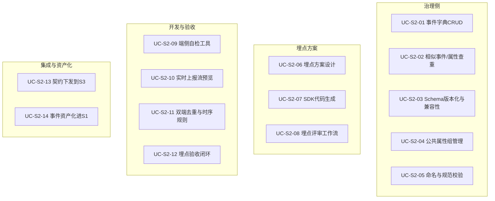

# S2 埋点与事件治理平台 — 需求分析说明书

| 项目代号 | ADGS · S2 |
|---|---|
| 文档编号 | ADGS-S2-SRS-001 |
| 版本 | v1.0 |
| 编写日期 | 2026-09-06 |
| 编写人 | 数据平台团队（埋点治理组） |
| 适用读者 | 产品经理 / 数据治理负责人 / 客户端与服务端开发 / 架构评审 / BA / QA / SRE |
| 密级 | 内部公开 |
| 文档状态 | 评审稿 |

> 本文档回答"为什么做、做什么、做到什么程度"，对应主文档《智能体数据治理系统-分析与设计文档》第 3.3 / 6.2 / 7.1 节。
>
> 配套文档：
> - 《02-S2 软件实现设计说明书》回答"怎么做、为什么这么做"
> - 《03-事件字典与埋点观测深化设计》对方向 A、B 做纵深

---

## 修订记录

| 版本 | 日期 | 修订人 | 主要变更 |
|---|---|---|---|
| v0.1 | 2026-08-20 | 埋点治理组 | 初稿，基于主文档 §6.2 拆解 |
| v0.5 | 2026-08-28 | 埋点治理组 | 增加用例 UC-S2-09~12，对接 Agent 语义事件、双端上报去重 |
| v0.9 | 2026-09-02 | 埋点治理组 | 接入 S1/S3/S8/S9 接口矩阵；NFR-15 自举治理纳入 |
| v1.0 | 2026-09-06 | 埋点治理组 | 基线版，作为 SDD 输入 |

---

## 目录

- 0. 引言
- 1. 业务背景与问题分析
- 2. 干系人与角色
- 3. 业务场景与用例
- 4. 功能性需求
- 5. 非功能性需求
- 6. 数据需求
- 7. 接口与外部依赖需求
- 8. 约束、假设与依赖
- 9. 需求优先级与版本规划
- 10. 验收标准与需求追踪矩阵

---

## 0. 引言

### 0.1 编写目的

S2 埋点与事件治理平台是 ADGS 在"采集入口"环节的**质量左移核心载体**，承担"把 60% 的数据质量问题消灭在需求阶段"的承诺（见主文档 §1.3 设计原则）。本说明书回答：

1. S2 解决哪些业务痛点、面向哪些用户；
2. 需要支撑哪些业务场景与用例；
3. 功能性与非功能性需求的可量化指标；
4. 与外部子系统的接口与依赖；
5. 优先级、版本规划与上线验收 Gate。

### 0.2 范围

**In-Scope**

- 事件与属性的字典化管理（在线注册、状态机、相似事件查重、相似属性查重）
- 埋点方案（Tracking Plan）全生命周期：草稿→评审→通过→开发→验收→发布→废弃
- Schema 版本化与兼容性自动检测（新增选填=兼容；删字段/改类型=破坏性）
- 公共属性组（Property Group）机制
- 评审工作流与权限（提报人 / 数据治理 / 开发 / Owner 四角色会签）
- SDK 代码模板生成（Web / 桌面 / 移动 / 服务端 / Agent 运行时 5 类）
- 端侧自检工具（浏览器 DevTools 扩展、桌面 SDK 自检页、移动 SDK 调试面板）
- 实时上报流预览（拉流而非拉批）
- 埋点验收（覆盖率、完整率、时序正确、与服务端日志对账）
- 双端上报去重规则定义与下发
- 与 S1 联动（已发布事件自动资产化）
- 与 S3 联动（事件契约下发，供网关校验）
- 与 S8 联动（验收任务触发与结果回写）
- 与 S9 联动（埋点需求工单）
- NFR-15 自举治理（S2 用 S2 治理）

**Out-of-Scope**

- 事件数据加工与建模（→ S5）
- 指标定义与口径管理（→ S6）
- 业务质量稽核（→ S8）
- 业务事件逻辑实现（业务开发负责）
- SDK 本身的运行时优化（→ S2 提供规范与模板，实现由各端开发负责）
- 客户端性能监控（→ 厂商 APM 或 S8 的扩展）

### 0.3 术语与缩写

| 术语 | 含义 |
|---|---|
| Event | 一次可被观察的用户/系统行为，如 `agent_card_click`、`turn_complete` |
| Property | 事件的属性/字段，如 `conversation_id`、`latency_ms` |
| EventSchema | 事件契约，定义事件名 + 属性清单 + 每个属性的类型/必填/枚举/示例 |
| TrackingPlan | 埋点方案，把多个事件按业务目标组织在一起，含关联需求、Owner、验收标准 |
| TrackingRequirement | 埋点需求工单（产品→数据团队） |
| PropertyGroup | 公共属性组，由 SDK 自动注入，避免各事件重复定义 |
| SchemaVersion | 语义化版本（major.minor.patch）+ 兼容性标记 |
| Similarity Check | 相似事件/相似属性查重（命名相似 + 语义向量 + 属性重合度） |
| Dual-Reporting Dedup | 双端上报去重，定义主体端优先规则（客户端 vs 服务端） |
| Tracking Context | 埋点上下文（user/device/session/app/agent 五元组） |
| SDK | Software Development Kit，本文指埋点上报 SDK |
| Contract | 契约，本文中"事件契约"="EventSchema 的下发版本" |

### 0.4 参考资料

| 编号 | 资料 | 关系 |
|---|---|---|
| R-01 | 《智能体数据治理系统-分析与设计文档》第 3.3 / 6.2 / 7.1 节 | 顶层架构与流程定义 |
| R-02 | 《R1 智能体数据治理系统-分析与设计文档》第 6.2 节"埋点治理"表格 | FR-T01~T06 来源 |
| R-03 | 《附录 A 埋点命名与事件字典样例》 | 命名规范、字典样例 |
| R-04 | 《02-S2 软件实现设计说明书》 | 本文配套 SDD |
| R-05 | 《03-事件字典与埋点观测深化设计》 | 方向 A、B 纵深 |
| R-06 | Segment.io / Amplitude Tracking Plan 公开文档 | 业界对标 |
| R-07 | Snowplow / RudderStack 事件治理白皮书 | 业界对标 |

### 0.5 需求编号规则与优先级

- **功能性需求**：`FR-Txx`（T = Tracking），共 24 项（FR-T01~T24）
- **非功能性需求**：引用主文档 NFR-01~15 + S2 特化 NFR-T-S2-01~05
- **用例**：`UC-S2-xx`，共 14 个
- **接口需求**：`API-S2-xx`
- **优先级**：P0（必做）/ P1（应做）/ P2（可选）

---

## 1. 业务背景与问题分析

### 1.1 业务背景

WorkBuddy Agent 业务中，**70% 以上的可观测性数据来自埋点**：产品效果分析、Agent 评估、模型优化、A/B 实验、用户增长、异常排查无一不依赖埋点。S2 是 ADGS 在"采集入口"环节的**唯一可信源**：所有进入数据面的事件都必须先在 S2 注册并通过 Schema 校验。

S2 在 ADGS 中的位置（节选自主文档 §3.3）：

```
产品 → S2（埋点治理） → S3（采集网关） → S4（管道编排） → S5（数仓建模）
                                  ↓
                              S8（质量稽核） ←—— 验收联动
```

### 1.2 现状痛点（按场景分组）

| 场景 | 痛点 | 量化指标（现状） |
|---|---|---|
| **P1 · 埋点命名混乱** | 同一"用户登录"被命名为 `login`/`signin`/`user_login`/`usr_lg` | 重复/近义事件 ≥ 800 个，字典利用率 < 30% |
| **P2 · 必填校验后置** | 上报时才发现字段缺失，事后补埋代价高 | 字段缺失导致的返工占需求延期 25% |
| **P3 · 双端口径不一** | 客户端埋点和服务端埋点对"会话开始"的口径不同 | 跨端一致性率 78%（低于合格线 99%） |
| **P4 · 跨端接入碎片** | 5 端（Web/桌面/移动/Android/iOS/Agent 运行时）各自为政 | 平均接入成本 3 人日/端/需求 |
| **P5 · 智能体语义事件无标准** | Agent 工具调用、模型推理、引用溯源无统一 Schema | 90% Agent 事件为"自定义 dict" |
| **P6 · 验收滞后上线** | 需求上线 2-4 周后才能从下游发现埋点问题 | 平均发现延迟 18 天 |
| **P7 · 公共属性散落** | user_id、device_id 在每条事件里都重复定义，类型不一致 | 公共属性利用率 12%，字段不一致率 8% |
| **P8 · 评审流口头化** | 埋点需求口头评审，无法追溯责任与时效 | 评审记录可追溯率 < 20% |
| **P9 · 上报流不可观测** | 端侧 SDK 失败、上报丢失无监控 | 客户端丢包率 5-12% 无任何告警 |
| **P10 · 废弃事件无人清理** | 已下线功能的事件仍持续上报，污染字典 | 字典中"僵尸事件"占比 18% |

### 1.3 问题根因

1. **缺乏"需求阶段即冻结 Schema"的系统**——所有治理动作都发生在"已经上报"之后。
2. **没有统一的事件字典与命名规范**——靠口头约定。
3. **没有"规范→校验→拒收"的强制链路**——S3 收不到契约，因此无从校验。
4. **没有跨端 SDK 模板生成**——每个端都重复实现相同逻辑。
5. **没有验收前置**——质量稽核只在下游，无法左移。
6. **公共属性组缺失**——每个事件重复定义 user/device/session。
7. **埋点需求工单未系统化**——靠产品口头提报。
8. **Agent 语义事件无标准**——Tool call、模型推理、引用溯源是 Agent 业务独有，没有先例可参考。

### 1.4 建设目标与成功度量

| 维度 | 目标（上线 12 个月后） |
|---|---|
| 规范覆盖 | 埋点规范覆盖率 100%（已注册事件 / 实际上报事件）；新增埋点评审通过率 ≥ 95% |
| 准确性 | 核心指标准确率 ≥ 99.9%；埋点字段完整率 ≥ 99%；上报时序正确率 ≥ 99% |
| 接入效率 | 新增一个事件的接入成本 ≤ 0.5 人日；新增一个端到端需求 ≤ 1 人日 |
| 资产化 | 已发布事件 100% 自动资产化进入 S1；自动生成 DDL 建议进入 S5 |
| 验收左移 | 埋点验收从"上线后 18 天"左移到"上线前 ≤ 2 工作日" |
| 字典健康度 | 相似事件查重触发率 100%；僵尸事件占比 ≤ 2% |
| 双端一致性 | 双端去重规则覆盖率 100%；主体事件优先规则执行率 100% |
| 自举治理（NFR-15） | S2 自身的关键链路 100% 埋点自监控（自身用自身治理） |

---

## 2. 干系人与角色

### 2.1 角色定义与对 S2 的特化诉求

| 角色 | 主诉求 | 关键场景 |
|---|---|---|
| **产品经理（PM）** | "我提了埋点需求，能不能告诉我什么时候能用数据？" | 需求提报、进度跟踪、上线后取数 |
| **客户端开发（FE/Mobile）** | "埋点方案在哪查？SDK 怎么用？自检工具在哪？" | 方案查阅、SDK 接入、自检、提测 |
| **服务端开发（BE）** | "服务端要补的事件有哪些？时序怎么保证？" | 服务端事件注册、去重策略、时序定义 |
| **Agent 运行时开发** | "Agent 语义事件 Schema 怎么定义？" | 工具调用、模型推理、引用溯源的事件定义 |
| **数据治理（DG）** | "评审要多久？命名规范谁负责？" | 评审主持、规范制定、字典治理 |
| **数据开发（DE）** | "事件字段进数仓的 Schema 怎么对齐？" | DDL 建议、血缘、验收规则 |
| **业务 Owner** | "哪些事件在支撑我的业务？健康度如何？" | 事件订阅、健康分、影响面分析 |
| **测试（QA）** | "样本数据怎么抓？验收标准怎么定？" | 自检工具、样本比对、对账 |
| **SRE / 平台运维** | "SDK 在线升级怎么灰度？上报丢包如何告警？" | 端侧 SDK 灰度、上报可观测、灾备 |

### 2.2 RACI 摘要

| 活动 | PM | 开发（端） | 数据治理 | 数据开发 | QA | Owner |
|---|---|---|---|---|---|---|
| 埋点需求提报 | R/A | C | C | I | I | I |
| 命名与规范制定 | C | C | R/A | C | C | I |
| 事件 Schema 设计 | C | C | R/A | C | I | C |
| 埋点方案评审 | C | R | R/A | R | I | I |
| SDK 模板生成 | I | R/A | C | C | I | I |
| SDK 接入与埋点开发 | I | R/A | I | I | C | I |
| 自检与提测 | I | R/A | I | C | R | I |
| 验收 | C | C | A | R/A | R | C |
| 发布与资产化 | I | C | R/A | R | I | I |
| 日常监控与运维 | I | R | A | C | C | C |

> R = Responsible，A = Accountable，C = Consulted，I = Informed

---

## 3. 业务场景与用例

### 3.1 用例总览



### 3.2 用例规约

#### UC-S2-01 · 事件字典 CRUD

- **角色**：数据治理（DG）/ 数据开发（DE）
- **前置**：DG 已登录；目标主题域已存在（S1 中）
- **触发**：新建/修改/废弃一个事件定义
- **主流程**：
  1. DG 进入事件字典，新建事件，填写：事件名、事件分类、主题域、所属业务对象、属性清单
  2. 命名规范校验（自动）：小写下划线、对象\_动作、不与已有事件名冲突
  3. 相似事件查重（自动）：返回 Top-5 相似事件，DG 选择"复用"或"创建新事件（说明差异）"
  4. 属性校验（自动）：类型、必填、枚举收敛（枚举值集合 vs 历史上报值的 Jaccard 相似度）
  5. 状态置为"设计中"，保存为草稿
- **后置**：事件进入字典，状态"设计中"
- **异常**：命名冲突 → 拦截；相似事件未说明 → 警告但允许；枚举值冲突 → 阻塞
- **验收**：规范校验拦截率 100%；相似事件查重触发率 100%

#### UC-S2-02 · 相似事件 / 相似属性查重

- **角色**：DG（被动接收）/ DE（主动查询）
- **触发**：注册新事件 / 季度治理巡检
- **主流程**：
  1. 相似事件 = 命名相似度（Jaro-Winkler ≥ 0.85）+ 语义向量余弦 ≥ 0.75 + 属性集合 Jaccard ≥ 0.5
  2. 任意两条相似度 ≥ 0.75 → 进入"相似事件池"
  3. 平台推送"相似事件待处理"工单，DG 在 5 个工作日内决定合并 / 区分 / 废弃
  4. 合并：源事件置"已废弃"，引用其字段的资产同步更新
  5. 区分：在事件备注里写明"与 X 的差异"，避免后续再被合并
- **验收**：僵尸事件占比 ≤ 2%（上线 12 个月后）

#### UC-S2-03 · Schema 版本化与兼容性检测

- **角色**：DG / DE
- **触发**：修改已有事件 Schema
- **主流程**：
  1. 修改类型分类：增字段、改描述、改示例（兼容）vs 删字段、改类型、收紧枚举（破坏性）
  2. 兼容变更 → 自动 major.minor+1，可直接发布
  3. 破坏性变更 → 强制 major+1，必须走"影响评估"流程，列出所有引用本事件的资产，要求下游确认
  4. 每次发布产出"兼容性报告"，标注向后兼容 / 部分兼容 / 不兼容
- **验收**：破坏性变更拦截率 100%；旧客户端可继续上报旧版本，至 schema_version 字段标记

#### UC-S2-04 · 公共属性组管理

- **角色**：DG
- **触发**：新建主题域 / 字段一致性巡检
- **主流程**：
  1. 预置公共属性组：`user_group`（user_id/anonymous_id/tenant_id）、`device_group`（device_id/os/browser）、`app_group`（app_id/app_version/channel）、`session_group`（session_id/seq/started_at）、`agent_group`（agent_id/conversation_id/turn_seq）
  2. DG 可创建自定义公共属性组（如 `experiment_group`）
  3. SDK 启动时按组加载，事件注册时引用组名而非逐字段定义
- **验收**：公共属性组利用率 ≥ 90%；同名字段类型一致性 100%

#### UC-S2-05 · 命名与规范自动校验

- **角色**：DG（自动触发）
- **触发**：所有事件/属性的注册/修改
- **主流程**：
  1. 事件名正则：`^[a-z][a-z0-9_]*_[a-z]+$`（小写开头，object\_verb 形式）
  2. 属性名正则：`^[a-z][a-z0-9_]*$`
  3. 禁止名单：`tmp`、`test`、`debug`、`xxx`、`fuck`、`shit` 等
  4. 类型合规：枚举值集合 vs 历史上报 Jaccard < 0.5 时报警
  5. 必填校验：核心字段（user_id、device_id、event_id、client_ts）必须为必填
  6. 校验失败立即阻断保存并提示具体规则编号
- **验收**：命名违规拦截率 100%；脏数据字典占比 ≤ 1%

#### UC-S2-06 · 埋点方案设计（Tracking Plan）

- **角色**：DG（设计）/ DE（评审）
- **前置**：已通过 UC-S2-01~05 注册事件
- **触发**：产品经理提报埋点需求（关联 FR-T02 与 S9 流程）
- **主流程**：
  1. 新建埋点方案：基本信息（名称/关联需求/产品模块/负责人/目标上线版本）
  2. 业务目标：明确"要回答什么问题、依赖哪些指标"
  3. 事件清单：从事件字典拖入事件，可重命名属性别名（场景特化）
  4. 公共属性组引用：方案级引用，自动继承
  5. 触发时机与上报端定义（每个事件 + 每个端）
  6. 双端去重策略：若双端上报，定义主体端（默认服务端）
  7. 验收标准：必填字段非空率 ≥ 99%、上报时序正确率 ≥ 99%、与日志对账一致率 ≥ 99.5%
  8. 保存为草稿，提交评审
- **后置**：方案状态为"评审中"
- **验收**：方案完整性自动校验通过率 100%

#### UC-S2-07 · SDK 代码模板生成

- **角色**：DG（自动生成）/ 开发（消费）
- **触发**：埋点方案通过评审
- **主流程**：
  1. 平台为每个端生成代码骨架：Web（TypeScript）、桌面（Rust 桥到 TS）、移动（Swift / Kotlin）、服务端（Go / Java / Python）、Agent 运行时（Python）
  2. 包含：常量定义（事件名/属性名）、类型定义、上报函数封装、初始化引导
  3. 提供 npm/cargo/pip/maven 依赖坐标
  4. 自动生成 mock 数据集供开发联调
  5. 模板由 DG 维护，可 fork 但必须经过评审
- **验收**：5 端 SDK 模板齐备；接入平均成本 ≤ 0.5 人日/事件

#### UC-S2-08 · 埋点评审工作流

- **角色**：PM 提报 / DG 评审 / DE 确认 / Owner 会签
- **前置**：埋点方案已存在草稿
- **主流程**：
  1. PM 提报"埋点需求工单"，关联产品需求 ID
  2. DG 在 1 个工作日内做"可行性评估"：现有事件能否支撑？若能直接给取数方案；若不能进入设计阶段
  3. 设计阶段：DG 在 S2 创建埋点方案；自动触发规范校验
  4. 评审：DG 主持，DE 与数据开发参与（线下会或线上一键通过）；通过后锁定 Schema v1.0
  5. 实施阶段：DE 拉取 SDK 模板，完成埋点开发
  6. 自测：DE 在灰度环境上报，使用端侧自检工具检查
  7. 提测：DE 提交"提测单"，附自检结果
  8. 验收：QA + DE + DG 三方会签；触发 S8 验收任务（覆盖率/完整率/时序/对账）
  9. 发布：验收通过 → 自动资产化进 S1，事件上线
- **后置**：方案状态"已发布"；事件进入资产化链路
- **验收**：单需求全周期 ≤ 5 工作日；评审留痕率 100%

#### UC-S2-09 · 端侧自检工具

- **角色**：DE（被动消费）
- **触发**：埋点开发完成后
- **主流程**：
  1. **Web**：浏览器扩展（Chrome DevTools Panel），实时显示上报事件流、字段缺失提示、JSON 预览、Schema 对比
  2. **桌面**：调试菜单 "埋点自检" 入口，显示本地缓冲队列、网络状态、失败重试
  3. **移动**：调试面板（摇一摇触发），显示已上报事件 + 待上报事件
  4. **服务端**：CLI 工具 `wb-tracker check`，订阅上报流并对比 Schema
  5. **Agent 运行时**：Python SDK 提供 `tracker.assert_schema(event)`，单元测试中触发
- **验收**：自检覆盖率 100%；自检发现的问题占验收问题的 ≥ 60%

#### UC-S2-10 · 实时上报流预览

- **角色**：DE / QA
- **触发**：开发/测试环境
- **主流程**：
  1. 通过 S2 的"实时事件流"面板，订阅指定 app_id + env 的上报
  2. 按事件类型分组、最近 100 条事件瀑布流
  3. 字段级对比：与 Schema 定义对比，标红缺失字段、标黄类型不符
  4. 支持过滤：按事件名 / 端 / 时间窗 / 用户
  5. 支持"导出为样本"：导出当前窗口为 JSON，供 QA 比对
- **验收**：流延迟 ≤ 3s（P95）；样本导出成功率 100%

#### UC-S2-11 · 双端去重与时序规则

- **角色**：DG（定义）/ BE（实施）
- **触发**：存在客户端 + 服务端双端上报的同一事件
- **主流程**：
  1. 事件级标记 `reporting_mode = 'dual'`
  2. 平台预置规则：服务端事件为主体（默认），客户端事件为补充
  3. DWD 层（属于 S5）按 `(conversation_id, turn_seq, event_name)` 主键去重，保留服务端
  4. 例外：纯端侧属性（如 `viewport_size`、`scroll_depth`）仅客户端上报
  5. 时序：服务端事件 `server_ts` 为权威；客户端 `client_ts` 仅供延迟监控
  6. Schema 中标注"主体端"字段，DW 层引用即可正确去重
- **验收**：双端事件 DWD 去重后唯一性 100%；时序偏差 ≤ 100ms 的 ≥ 99%

#### UC-S2-12 · 埋点验收闭环

- **角色**：QA（执行）/ DG（监督）/ DE（修复）
- **前置**：埋点已开发完成、已提交提测单
- **主流程**：
  1. 验收触发：自动（提测后）+ 手动（QA 触发）
  2. 4 类自动验收：
     - **覆盖率**：实际触发数 / 期望触发数 ≥ 99%
     - **完整率**：必填字段非空比例 ≥ 99%
     - **时序**：服务端 ts 与客户端 ts 偏差 ≤ 100ms
     - **对账**：与原始日志（日志平台）一致率 ≥ 99.5%
  3. 验收任务交给 S8 执行（与 S8 的稽核引擎共享算力）
  4. 验收结果回写 S2，标记方案状态"验收通过/未通过"
  5. 不通过 → 自动生成修复工单（含具体事件名、字段、缺失样本），状态回"实施中"
  6. 通过 → 触发事件资产化（UC-S2-14）
- **验收**：验收任务平均耗时 ≤ 4 小时；通过率 ≥ 95%

#### UC-S2-13 · 契约下发到 S3 采集网关

- **角色**：S2（自动）/ S3（消费）
- **触发**：埋点方案发布后 / Schema 版本变更后
- **主流程**：
  1. S2 发布事件变更事件 `SchemaVersionPublished` 到 Kafka 主题 `s2.schema.published`
  2. 事件内容：app_id、schema_version、event_list、compat_mark（backward/partial/breaking）
  3. S3 订阅该主题，热更新本地契约缓存
  4. 校验时机：上报时即时校验（毫秒级）；新增选填字段直接通过；破坏性变更上报 5xx 并附 deprecation 头
  5. 网关升级部署后再次主动拉取契约全量对账（避免消息丢失）
- **验收**：契约下发延迟 ≤ 30s（P95）；契约一致性 100%

#### UC-S2-14 · 事件资产化进入 S1

- **角色**：S2（推送）/ S1（消费）
- **触发**：埋点方案发布后
- **主流程**：
  1. S2 推 `EventPublished` 事件到 Kafka 主题 `s2.event.published`
  2. 内容：事件名、属性、版本、所属方案、Owner、上线时间
  3. S1 订阅后在 `meta_asset` 表写入资产记录（type='event'），自动挂主题域、分层（ODS）
  4. 同时推 DDL 建议到 S5：`CREATE TABLE ods_<event_name> (...)`
  5. 资产目录自动可见该事件；详情页可看到"埋点方案"反向链接
- **验收**：资产化延迟 ≤ 5 分钟；DDL 建议采纳率 ≥ 80%

---

## 4. 功能性需求

### 4.1 需求总表

| 模块 | 编号 | 描述 | 优先级 | 主用例 |
|---|---|---|---|---|
| 事件字典 | FR-T01 | 支持事件与属性的在线注册、Schema 定义（类型/必填/枚举/值域/示例） | P0 | UC-S2-01 |
| 事件字典 | FR-T02 | 支持事件分类（通用/交互/业务过程/系统/Agent 语义）多视图 | P0 | UC-S2-01 |
| 事件字典 | FR-T03 | 相似事件/属性查重（命名相似 + 语义向量 + 属性重合度） | P0 | UC-S2-02 |
| Schema 版本 | FR-T04 | Schema 语义化版本（major.minor.patch）+ 兼容性自动检测 | P0 | UC-S2-03 |
| Schema 版本 | FR-T05 | 破坏性变更强制影响评估（引用资产清单 + 下游确认） | P0 | UC-S2-03 |
| 公共属性组 | FR-T06 | 5 个预置公共属性组（user/device/app/session/agent） | P0 | UC-S2-04 |
| 公共属性组 | FR-T07 | 公共属性组引用 + 字段类型一致性约束 | P0 | UC-S2-04 |
| 命名规范 | FR-T08 | 命名式校验（正则 + 禁止名单） | P0 | UC-S2-05 |
| 命名规范 | FR-T09 | 枚举收敛检查（枚举值 vs 历史上报 Jaccard） | P0 | UC-S2-05 |
| 命名规范 | FR-T10 | 必填字段约定（user_id/device_id/event_id/client_ts 必填） | P0 | UC-S2-05 |
| 埋点方案 | FR-T11 | 埋点方案 CRUD + 状态机 + 版本化 | P0 | UC-S2-06 |
| 埋点方案 | FR-T12 | 业务目标与关联需求 ID 强绑定 | P0 | UC-S2-06 |
| 埋点方案 | FR-T13 | 触发时机、上报端、双端去重策略定义 | P0 | UC-S2-06, UC-S2-11 |
| SDK 生成 | FR-T14 | 自动生成 5 端 SDK 代码模板（Web/桌面/移动/服务端/Agent） | P0 | UC-S2-07 |
| SDK 生成 | FR-T15 | 自动生成常量、类型、上报函数、初始化引导、mock 数据 | P0 | UC-S2-07 |
| 评审流 | FR-T16 | 需求→评估→设计→评审→实施→验收六阶段流程线上化 | P0 | UC-S2-08 |
| 评审流 | FR-T17 | 四角色会签（DG/DE/QA/Owner）+ 责任留痕 | P0 | UC-S2-08 |
| 自检工具 | FR-T18 | Web 浏览器扩展、桌面调试面板、移动调试面板、服务端 CLI、Agent 断言 | P0 | UC-S2-09 |
| 自检工具 | FR-T19 | 实时字段级对比 + 缺失字段标红 + 类型不符标黄 | P0 | UC-S2-09 |
| 实时观测 | FR-T20 | 实时上报流预览（按 app_id/env/事件名过滤） | P0 | UC-S2-10 |
| 实时观测 | FR-T21 | 样本导出（JSON）+ 字段对比 | P1 | UC-S2-10 |
| 双端去重 | FR-T22 | 双端上报主体端规则定义与下发 | P0 | UC-S2-11 |
| 验收闭环 | FR-T23 | 4 类自动验收（覆盖率/完整率/时序/对账）+ 与 S8 联动 | P0 | UC-S2-12 |
| 资产化 | FR-T24 | 已发布事件自动写入 S1 meta_asset + S5 DDL 建议 | P0 | UC-S2-14 |
| 智能辅助 | FR-T25 | 基于需求描述自动生成埋点方案建议（语义向量检索） | P1 | UC-S2-08 |

### 4.2 分模块详述

#### 4.2.1 event-dict（事件字典 CRUD + 命名/查重/枚举校验）

- **职责**：事件与属性的增删改查、状态机、相似度查重、规范校验
- **API**：`POST/GET/PUT/DELETE /api/v1/s2/events` + `/api/v1/s2/events/{id}/similarity-check`
- **状态机**：`draft → designing → reviewing → published → deprecated`
- **关键算法**：Jaro-Winkler（命名相似）、Sentence-BERT（语义向量）、属性 Jaccard（重合度）

#### 4.2.2 schema-svc（Schema 版本化与兼容性）

- **职责**：管理 Schema 多版本、兼容性检测、契约下发
- **API**：`GET /api/v1/s2/schemas/{event_name}`、`POST /api/v1/s2/schemas/{event_name}/version`
- **核心逻辑**：diff 新旧 Schema，分类兼容/破坏性，自动递增版本号

#### 4.2.3 property-group（公共属性组）

- **职责**：公共属性组 CRUD、引用关系、类型一致性约束
- **预置 5 组**：user、device、app、session、agent
- **API**：`GET /api/v1/s2/property-groups`、`POST /api/v1/s2/property-groups/{id}/resolve`

#### 4.2.4 plan-admin（埋点方案 CRUD）

- **职责**：埋点方案 CRUD、版本化、状态机、关联需求 ID
- **API**：`POST/GET/PUT /api/v1/s2/plans` + `/api/v1/s2/plans/{id}/events`
- **状态机**：`draft → reviewing → approved → developing → acceptance → published → deprecated`

#### 4.2.5 plan-designer（埋点方案设计器 UI）

- **职责**：Web 前端可视化设计器
- **核心交互**：左侧事件树拖入、中间画布事件块、右侧属性编辑、底部 SDK 代码实时生成

#### 4.2.6 sdk-codegen（SDK 代码模板生成）

- **职责**：根据埋点方案生成 5 端 SDK 骨架
- **模板**：TypeScript（Web）、TS+Rust 桥（桌面）、Swift/Kotlin（移动）、Go/Java/Python（服务端）、Python（Agent）
- **产物**：`git init` 脚手架、`constants.ts`、上报函数封装、单元测试 mock

#### 4.2.7 requirement-svc（埋点需求工单）

- **职责**：埋点需求工单（产品→数据团队）、与 S9 联动
- **API**：`POST /api/v1/s2/requirements`、订阅 S9 工单事件

#### 4.2.8 acceptance-svc（验收工作流）

- **职责**：触发验收任务、查询验收结果、与 S8 联动
- **API**：`POST /api/v1/s2/plans/{id}/acceptance`、`GET /api/v1/s2/plans/{id}/acceptance-result`
- **4 类自动验收**：覆盖率、完整率、时序、对账

#### 4.2.9 track-selfcheck（端侧自检工具）

- **职责**：浏览器扩展、桌面调试面板、移动调试面板、CLI、Agent 断言
- **核心能力**：实时显示上报事件流、字段缺失提示、Schema 对比

#### 4.2.10 live-tap（实时上报流预览）

- **职责**：实时事件流订阅、字段对比、样本导出
- **技术**：Kafka Consumer + WebSocket 推送到前端

---

## 5. 非功能性需求

| 编号 | 维度 | 描述 | 指标 |
|---|---|---|---|
| NFR-01 | 可用性 | S2 整体可用性 | ≥ 99.95% |
| NFR-02 | 性能 | 事件查询 P99 | ≤ 200ms |
| NFR-02 | 性能 | 规范校验 P99 | ≤ 300ms（含相似度计算） |
| NFR-03 | 扩展性 | 字典规模 | 单主题域 5000 事件，整体 50000 事件 |
| NFR-04 | 兼容性 | SDK 模板 5 端齐备 | Web/桌面/移动/服务端/Agent 全部支持 |
| NFR-05 | 安全性 | 事件 Schema 含敏感字段时必填脱敏 | 100% |
| NFR-06 | 可维护 | 命名规范规则可配置 | 规则编号 + 提示消息 + 严重度 |
| NFR-07 | 可扩展 | 新增一个事件接入成本 | ≤ 0.5 人日 |
| NFR-08 | 一致性 | 契约下发后 S3 在 30s 内生效 | P95 ≤ 30s |
| NFR-09 | 可观测 | 关键链路全埋点 | 100%（NFR-15 自举） |
| NFR-10 | 容灾 | 主从切换时间 | ≤ 60s；RPO ≤ 5min |
| NFR-11 | 审计 | 所有 Schema 修改 | 全留痕，含变更人/变更内容/diff |
| NFR-T-S2-01 | 字典健康 | 相似事件查重触发率 | 100% |
| NFR-T-S2-02 | 字典健康 | 僵尸事件占比 | ≤ 2% |
| NFR-T-S2-03 | 验收左移 | 验收平均前置时间 | ≤ 2 工作日 |
| NFR-T-S2-04 | SDK 一致 | 5 端 SDK API 风格统一 | 100% |
| NFR-T-S2-05 | 自检覆盖 | 端侧自检工具覆盖 | 5/5 端齐备 |

---

## 6. 数据需求

### 6.1 核心表与字段

#### 6.1.1 `track_event_dict`（事件字典）

```sql
CREATE TABLE `track_event_dict` (
  `id`              BIGINT       NOT NULL AUTO_INCREMENT,
  `event_name`      VARCHAR(128) NOT NULL COMMENT '事件名，小写_下划线',
  `display_name`    VARCHAR(256) NOT NULL COMMENT '展示名',
  `event_category`  VARCHAR(32)  NOT NULL COMMENT '分类:generic/interaction/business/system/agent',
  `subject_domain`  VARCHAR(64)  NOT NULL COMMENT '主题域',
  `business_object` VARCHAR(128)          COMMENT '所属业务对象',
  `description`     TEXT                  COMMENT '事件含义',
  `trigger_condition` TEXT                COMMENT '触发时机描述',
  `status`          VARCHAR(32)  NOT NULL DEFAULT 'designing' COMMENT 'designing/reviewing/published/deprecated',
  `schema_version`  VARCHAR(16)  NOT NULL DEFAULT '0.0.1',
  `reporting_mode`  VARCHAR(16)  NOT NULL DEFAULT 'single' COMMENT 'single/dual',
  `primary_side`    VARCHAR(16)           COMMENT 'client/server',
  `owner`           VARCHAR(64)  NOT NULL,
  `created_by`      VARCHAR(64)  NOT NULL,
  `created_at`      DATETIME     NOT NULL DEFAULT CURRENT_TIMESTAMP,
  `updated_at`      DATETIME     NOT NULL DEFAULT CURRENT_TIMESTAMP ON UPDATE CURRENT_TIMESTAMP,
  `published_at`    DATETIME              COMMENT '上线时间',
  PRIMARY KEY (`id`),
  UNIQUE KEY `uk_event_name` (`event_name`),
  KEY `idx_subject_domain` (`subject_domain`),
  KEY `idx_status` (`status`)
) ENGINE=InnoDB DEFAULT CHARSET=utf8mb4 COMMENT='事件字典';
```

#### 6.1.2 `track_property_dict`（属性字典）

```sql
CREATE TABLE `track_property_dict` (
  `id`           BIGINT       NOT NULL AUTO_INCREMENT,
  `prop_name`    VARCHAR(128) NOT NULL,
  `display_name` VARCHAR(256) NOT NULL,
  `data_type`    VARCHAR(32)  NOT NULL COMMENT 'string/int/double/bool/enum/timestamp/json',
  `required`     TINYINT(1)   NOT NULL DEFAULT 0,
  `enum_values`  JSON                  COMMENT '枚举值集合',
  `value_range`  JSON                  COMMENT '值域范围',
  `description`  TEXT,
  `example`      VARCHAR(512),
  `is_pii`       TINYINT(1)   NOT NULL DEFAULT 0 COMMENT '是否敏感',
  `group_id`     BIGINT                COMMENT '所属公共属性组',
  `created_at`   DATETIME     NOT NULL DEFAULT CURRENT_TIMESTAMP,
  PRIMARY KEY (`id`),
  UNIQUE KEY `uk_prop_name` (`prop_name`)
) ENGINE=InnoDB DEFAULT CHARSET=utf8mb4 COMMENT='属性字典';
```

#### 6.1.3 `track_event_property`（事件-属性关联）

```sql
CREATE TABLE `track_event_property` (
  `id`            BIGINT     NOT NULL AUTO_INCREMENT,
  `event_id`      BIGINT     NOT NULL,
  `prop_id`       BIGINT     NOT NULL,
  `required`      TINYINT(1) NOT NULL DEFAULT 0,
  `alias_name`    VARCHAR(128)         COMMENT '事件内的属性别名',
  `enum_override` JSON                 COMMENT '事件级枚举覆盖',
  PRIMARY KEY (`id`),
  UNIQUE KEY `uk_event_prop` (`event_id`, `prop_id`)
) ENGINE=InnoDB DEFAULT CHARSET=utf8mb4 COMMENT='事件-属性关联';
```

#### 6.1.4 `track_event_schema_version`（事件 Schema 版本历史）

```sql
CREATE TABLE `track_event_schema_version` (
  `id`              BIGINT       NOT NULL AUTO_INCREMENT,
  `event_id`        BIGINT       NOT NULL,
  `version`         VARCHAR(16)  NOT NULL,
  `compat_mark`     VARCHAR(16)  NOT NULL COMMENT 'backward/partial/breaking',
  `property_diff`   JSON                 COMMENT '属性 diff',
  `change_summary`  TEXT,
  `change_by`       VARCHAR(64)  NOT NULL,
  `change_at`       DATETIME     NOT NULL DEFAULT CURRENT_TIMESTAMP,
  `effective_at`    DATETIME              COMMENT '生效时间',
  `published`       TINYINT(1)   NOT NULL DEFAULT 0,
  PRIMARY KEY (`id`),
  UNIQUE KEY `uk_event_version` (`event_id`, `version`)
) ENGINE=InnoDB DEFAULT CHARSET=utf8mb4 COMMENT='事件 Schema 版本历史';
```

#### 6.1.5 `track_plan`（埋点方案）

```sql
CREATE TABLE `track_plan` (
  `id`              BIGINT       NOT NULL AUTO_INCREMENT,
  `plan_name`       VARCHAR(256) NOT NULL,
  `requirement_id`  VARCHAR(64)           COMMENT '关联产品需求 ID',
  `product_module`  VARCHAR(128) NOT NULL,
  `target_release`  VARCHAR(64)           COMMENT '目标上线版本',
  `business_goal`   TEXT                  COMMENT '业务目标：要回答什么问题',
  `owner`           VARCHAR(64)  NOT NULL,
  `reviewer_dg`     VARCHAR(64)           COMMENT '数据治理评审人',
  `reviewer_de`     VARCHAR(64)           COMMENT '开发确认人',
  `status`          VARCHAR(32)  NOT NULL DEFAULT 'draft' COMMENT 'draft/reviewing/approved/developing/acceptance/published/deprecated',
  `version`         VARCHAR(16)  NOT NULL DEFAULT '0.0.1',
  `acceptance_criteria` JSON              COMMENT '4 类验收标准阈值',
  `created_at`      DATETIME     NOT NULL DEFAULT CURRENT_TIMESTAMP,
  `published_at`    DATETIME,
  PRIMARY KEY (`id`),
  KEY `idx_status` (`status`),
  KEY `idx_requirement` (`requirement_id`)
) ENGINE=InnoDB DEFAULT CHARSET=utf8mb4 COMMENT='埋点方案';
```

#### 6.1.6 `track_plan_event`（方案-事件关联）

```sql
CREATE TABLE `track_plan_event` (
  `id`            BIGINT     NOT NULL AUTO_INCREMENT,
  `plan_id`       BIGINT     NOT NULL,
  `event_id`      BIGINT     NOT NULL,
  `reporting_end` VARCHAR(16) NOT NULL COMMENT 'web/desktop/mobile/server/agent',
  `trigger_desc`  TEXT                  COMMENT '触发时机描述',
  `property_overrides` JSON             COMMENT '属性覆盖',
  `sort_order`    INT NOT NULL DEFAULT 0,
  PRIMARY KEY (`id`),
  UNIQUE KEY `uk_plan_event_end` (`plan_id`, `event_id`, `reporting_end`)
) ENGINE=InnoDB DEFAULT CHARSET=utf8mb4 COMMENT='方案-事件关联';
```

### 6.2 数据字典（关键枚举）

| 字段 | 取值 |
|---|---|
| `track_event_dict.status` | designing / reviewing / published / deprecated |
| `track_event_dict.event_category` | generic / interaction / business / system / agent |
| `track_event_dict.reporting_mode` | single / dual |
| `track_event_dict.primary_side` | client / server |
| `track_event_schema_version.compat_mark` | backward / partial / breaking |
| `track_plan.status` | draft / reviewing / approved / developing / acceptance / published / deprecated |
| `track_plan_event.reporting_end` | web / desktop / mobile / server / agent |
| `track_property_dict.data_type` | string / int / double / bool / enum / timestamp / json |

### 6.3 数据生命周期

| 数据 | 保留期 | 归档 |
|---|---|---|
| 事件字典 | 长期 | 软删除，保留 7 年可追溯 |
| Schema 版本 | 长期 | 永久保留，含兼容性报告 |
| 埋点方案 | 长期 | 软删除 + 全量版本 |
| 上报流样本（实时） | 7 天 | 滚动清理，仅用于实时比对 |
| 验收报告 | 3 年 | 冷归档至对象存储 |

---

## 7. 接口与外部依赖需求

### 7.1 对外接口契约（与主文档 §8 + SDD §4 对齐）

| 接口 | 提供方 | 消费方 | 协议 | 描述 |
|---|---|---|---|---|
| 事件契约服务 API | S2 | S3 | gRPC + Kafka | 事件 Schema 下发 |
| 事件字典 API | S2 | 内部 / 工具 | HTTP | 字典 CRUD |
| 埋点方案 API | S2 | 内部 / S9 | HTTP | 方案 CRUD |
| 事件资产化事件 | S2 | S1 | Kafka `s2.event.published` | 已发布事件资产化 |
| 契约变更事件 | S2 | S3 | Kafka `s2.schema.published` | Schema 版本变更 |
| 验收任务触发 | S2 | S8 | HTTP | 触发 S8 验收任务 |
| 验收结果回写 | S8 | S2 | HTTP + Kafka | 验收结果回写到 S2 |
| 埋点需求工单 | S9 | S2 | HTTP / Kafka | 需求工单拉入 |
| 元数据反向写入 | S1 | S2 | Kafka | 主题域 / 分层变更同步 |
| 需求 ID 关联 | PM 系统 | S2 | HTTP | 需求 ID 关联 |

### 7.2 接口风格

- **同步 API**：gRPC（性能优先：字典查询、契约查询、方案 CRUD）+ HTTP REST（管理与查询）
- **异步事件**：Kafka（契约下发、事件资产化、验收结果）
- **SDK 自检**：HTTP POST + WebSocket 推送（实时事件流）
- **错误码**：`S2-NNNN` 段，前缀语义对齐 SDD §13（见附录 C）
- **幂等性**：所有写入操作要求携带 `Idempotency-Key` 头

### 7.3 外部依赖矩阵

| 依赖 | 类型 | 用途 | 失败影响 |
|---|---|---|---|
| S1 元数据与资产中心 | RPC + Event | 主题域/分层引用、资产化 | 中：可降级为本地缓存 |
| S3 多端采集网关 | Event | 契约下发 | 高：契约无法实时校验 |
| S8 数据质量治理中心 | RPC | 验收任务 | 中：降级为本地规则执行 |
| S9 数据协作与工作流 | Event | 需求工单 | 中：可降级为本地工单 |
| Kafka | 基础设施 | 事件分发 | 高：降级为 HTTP 轮询 |
| 对象存储 | 基础设施 | 模板与归档 | 低：仅影响冷数据 |
| LLM 服务 | API | 语义相似度 + 智能辅助 | 中：降级为关键词相似 |

---

## 8. 约束、假设与依赖

### 8.1 业务约束

1. **所有进入 S3 的事件必须先在 S2 注册**——S2 是契约的唯一可信源。
2. **公共属性组不可被事件级覆盖**——避免不一致（可在字段级做 alias，但类型必须一致）。
3. **破坏性 Schema 变更必须经引用资产下游确认**——强制流程。
4. **5 端 SDK 风格必须统一**——命名、错误码、回调签名。
5. **端侧自检工具覆盖所有 5 端**——任何一端缺失视为 SDK 未达"可用"标准。
6. **Agent 语义事件必须有 `agent_id` + `conversation_id` + `turn_seq` 三元组**——为去重与回溯奠基。

### 8.2 技术约束

1. **相似度计算 ≤ 300ms**（P99）——Sentence-BERT 推理 1 次平均 80ms，可接受。
2. **契约下发 ≤ 30s**（P95）——Kafka + 网关心跳重试双重保障。
3. **实时事件流 ≤ 3s 延迟**（P95）——Kafka + WebSocket 长连接。
4. **SDK 模板必须开源**——DG 可 fork 与自定义。

### 8.3 假设

1. 业务团队愿意接受"先在 S2 注册，再开发"的流程——这意味着治理面左移的共识。
2. S3 已支持 Schema 热更新（即在不重启网关的情况下接收新契约）。
3. S8 已有验收任务调度能力（事实已具备，见 S8 §5）。
4. 工作流引擎 S9 已上线并提供工单拉入接口。

### 8.4 风险与缓解

| 编号 | 风险 | 影响 | 概率 | 缓解 |
|---|---|---|---|---|
| RSK-S2-01 | 治理左移阻力大，开发不愿意先在 S2 注册 | 阻塞整体目标 | 中 | 提供 SDK 模板 + 自检工具降低门槛；试点团队先跑 |
| RSK-S2-02 | 相似度查重误报多 | 降低 DG 工作效率 | 中 | 阈值可调；DG 可"标记差异"豁免 |
| RSK-S2-03 | 双端去重规则定义不清晰 | DWD 层去重错误 | 中 | 预置规则模板；提供示例 |
| RSK-S2-04 | 端侧自检工具维护成本高 | 5 端都做需要大量人力 | 高 | 用浏览器扩展 + 通用 SDK 调试框架复用；只做端侧适配层 |
| RSK-S2-05 | Agent 语义事件标准无先例 | 设计反复 | 高 | 与 S1/S6 协同；参考 OpenTelemetry GenAI Semantic Conventions |
| RSK-S2-06 | LLM 服务不可用影响语义相似度 | 查重功能降级 | 低 | 降级到 Jaro-Winkler + 属性 Jaccard |

---

## 9. 需求优先级与版本规划

### 9.1 优先级总览

| 优先级 | 项数 | 备注 |
|---|---|---|
| P0 | 22 | 必须首批交付 |
| P1 | 2 | 第二批或试点交付 |
| P2 | 1 | 第三批（探索性） |

### 9.2 版本规划

#### V1.0（MVP · 上线 3 个月内）

- FR-T01、T02、T08、T09、T10、T11、T12、T13、T16、T17、T22、T23、T24
- UC-S2-01、UC-S2-05、UC-S2-06、UC-S2-08、UC-S2-11、UC-S2-12、UC-S2-13、UC-S2-14
- 目标：核心业务事件 100% 纳管，评审流线上化

#### V1.5（增强 · 上线 6 个月内）

- FR-T03、T06、T07、T14、T15、T18、T19
- UC-S2-02、UC-S2-04、UC-S2-07、UC-S2-09
- 目标：5 端 SDK 模板齐备，自检工具全端覆盖

#### V2.0（智能 · 上线 12 个月内）

- FR-T04、T05、T20、T21、T25
- UC-S2-03、UC-S2-10
- 目标：智能埋点辅助上线，端到端覆盖率达 99%

### 9.3 上线 Gate（自检清单）

- [ ] 全部 P0 用例通过 QA 回归
- [ ] 事件字典规范校验拦截率 100%（用历史数据回放）
- [ ] 相似事件查重 F1 ≥ 0.85（用标注数据集）
- [ ] 5 端 SDK 模板完整（Web/桌面/移动/服务端/Agent）
- [ ] 契约下发 E2E 测试：S2 → Kafka → S3 → 网关校验 ≤ 30s
- [ ] 验收任务与 S8 联动 E2E：通过
- [ ] 自举治理：S2 自身关键链路 100% 埋点
- [ ] 灾备演练：主从切换 ≤ 60s
- [ ] 安全审计：所有 PII 字段标注正确率 100%

---

## 10. 验收标准与需求追踪矩阵

### 10.1 验收标准总则

- 每个 FR 必须有 1 个或多个 UC 支撑；
- 每个 P0 FR 必须有可量化的验收指标；
- 每个 UC 必须有自动化测试覆盖（E2E 或集成）；
- NFR 全部有压测报告与可观测大盘支撑。

### 10.2 需求追踪矩阵（FR ↔ UC ↔ SDD 章节 ↔ 测试用例）

| FR 编号 | UC | SDD 章节 | 测试用例 | 优先级 |
|---|---|---|---|---|
| FR-T01 | UC-S2-01 | §3.3.1, §4.2 | TC-T01-01~04 | P0 |
| FR-T02 | UC-S2-01 | §4.2 | TC-T02-01~02 | P0 |
| FR-T03 | UC-S2-02 | §6.1 | TC-T03-01~03 | P0 |
| FR-T04 | UC-S2-03 | §6.2 | TC-T04-01~03 | P0 |
| FR-T05 | UC-S2-03 | §6.2 | TC-T05-01~02 | P0 |
| FR-T06 | UC-S2-04 | §3.3.3 | TC-T06-01~02 | P0 |
| FR-T07 | UC-S2-04 | §3.3.3 | TC-T07-01~02 | P0 |
| FR-T08 | UC-S2-05 | §6.3 | TC-T08-01~02 | P0 |
| FR-T09 | UC-S2-05 | §6.3 | TC-T09-01~02 | P0 |
| FR-T10 | UC-S2-05 | §6.3 | TC-T10-01~02 | P0 |
| FR-T11 | UC-S2-06 | §3.3.5 | TC-T11-01~03 | P0 |
| FR-T12 | UC-S2-06 | §3.3.5 | TC-T12-01~02 | P0 |
| FR-T13 | UC-S2-06/11 | §3.3.5, §6.4 | TC-T13-01~03 | P0 |
| FR-T14 | UC-S2-07 | §4.6 | TC-T14-01~05（5 端） | P0 |
| FR-T15 | UC-S2-07 | §4.6 | TC-T15-01~02 | P0 |
| FR-T16 | UC-S2-08 | §5.4 | TC-T16-01~04 | P0 |
| FR-T17 | UC-S2-08 | §5.4 | TC-T17-01~02 | P0 |
| FR-T18 | UC-S2-09 | §4.9 | TC-T18-01~05（5 端） | P0 |
| FR-T19 | UC-S2-09 | §4.9 | TC-T19-01~02 | P0 |
| FR-T20 | UC-S2-10 | §4.10 | TC-T20-01~03 | P0 |
| FR-T21 | UC-S2-10 | §4.10 | TC-T21-01~02 | P1 |
| FR-T22 | UC-S2-11 | §6.4 | TC-T22-01~02 | P0 |
| FR-T23 | UC-S2-12 | §5.5 | TC-T23-01~04 | P0 |
| FR-T24 | UC-S2-14 | §5.6 | TC-T24-01~02 | P0 |
| FR-T25 | UC-S2-08 | §6.5 | TC-T25-01~02 | P1 |

### 10.3 非功能需求追踪

| NFR 编号 | 测试方法 | 验收指标 |
|---|---|---|
| NFR-01 可用性 | 故障注入 + 月度统计 | ≥ 99.95% |
| NFR-02 性能 | 压测（JMeter/k6） | P99 ≤ 200ms / 300ms |
| NFR-03 扩展性 | 字典规模 5000/单主题域回放 | 性能不劣化 > 10% |
| NFR-04 兼容性 | 5 端 SDK 模板生成验证 | 5/5 通过 |
| NFR-05 安全性 | 字段 PII 标注扫描 | 100% |
| NFR-06 可维护 | 规则配置变更测试 | 1 人日变更全量规则 |
| NFR-07 可扩展 | 接入成本实测 | ≤ 0.5 人日/事件 |
| NFR-08 一致性 | 契约下发延迟监控 | P95 ≤ 30s |
| NFR-09 可观测 | 自举大盘核验 | 100% |
| NFR-10 容灾 | 切换演练 | RPO ≤ 5min, RTO ≤ 60s |
| NFR-11 审计 | 审计日志完整性 | 100% |
| NFR-T-S2-01 字典健康 | 季度巡检 | 100% |
| NFR-T-S2-02 僵尸事件 | 季度巡检 | ≤ 2% |
| NFR-T-S2-03 验收左移 | 验收耗时统计 | ≤ 2 工作日 |
| NFR-T-S2-04 SDK 一致 | 5 端 API 风格对比 | 100% |
| NFR-T-S2-05 自检覆盖 | 5 端工具可用性测试 | 5/5 齐备 |

---

**文档结束。**

> 本说明书是《02-S2 软件实现设计说明书》的输入。SDD 应回答"怎么做"与"为什么这么做"，并通过附录 A 给出需求↔设计的双向追踪矩阵。