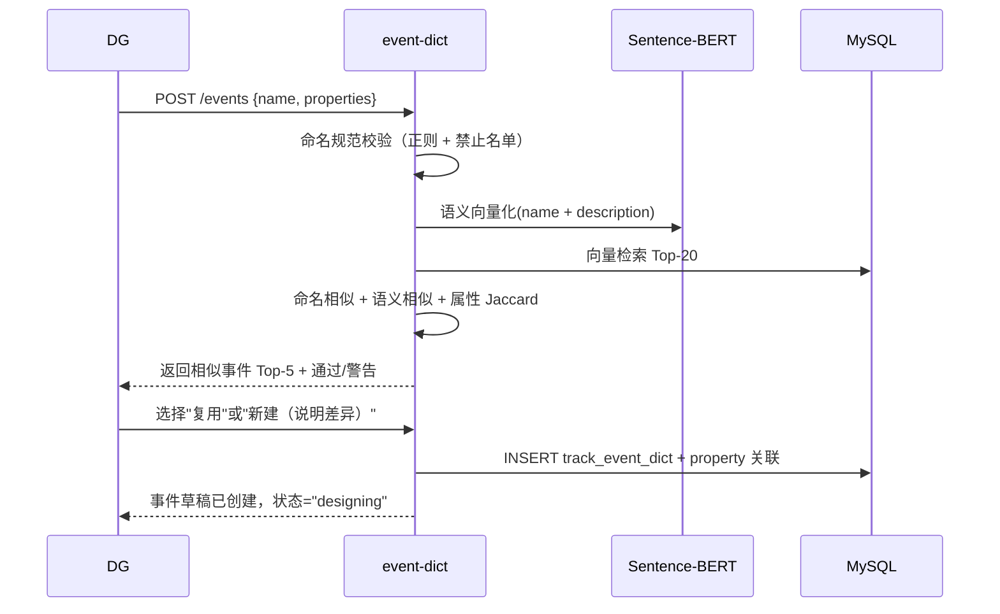
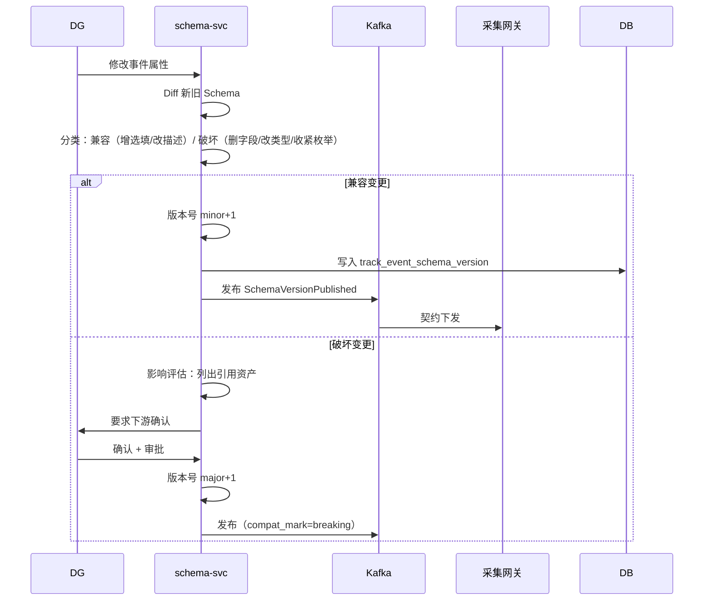
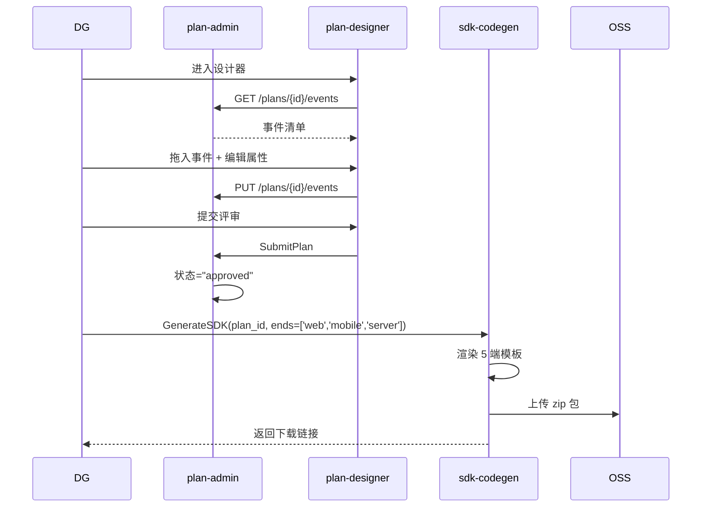
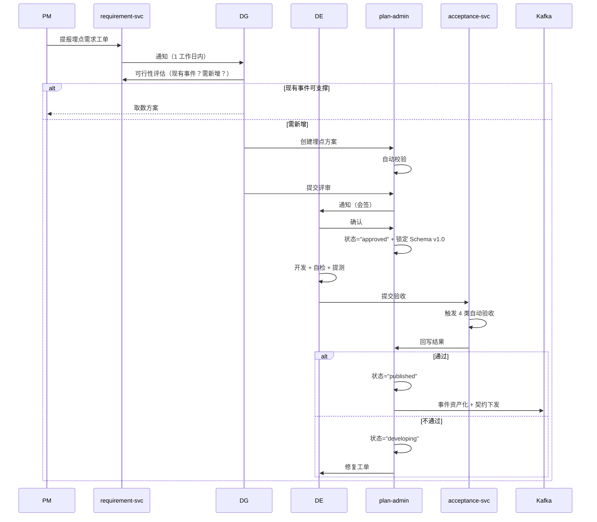
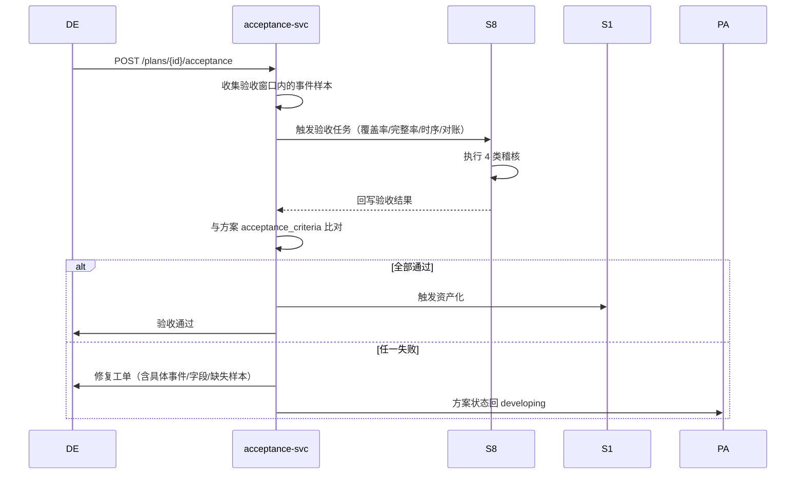
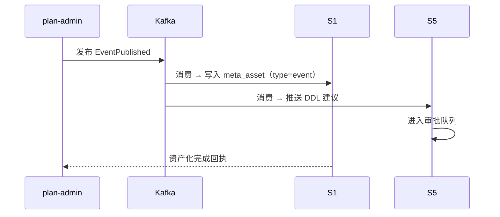

# S2 埋点与事件治理平台 — 软件实现设计说明书（SDD）

| 项目代号 | ADGS · S2 |
|---|---|
| 文档编号 | ADGS-S2-SDD-002 |
| 版本 | v1.0 |
| 编写日期 | 2026-09-06 |
| 编写人 | 埋点治理组 |
| 适用读者 | 研发 / 测试 / SRE / S1/S3/S8/S9 对接方 |
| 密级 | 内部公开 |
| 文档状态 | 评审稿 |
| 配套输入 | 《01-S2 需求分析说明书》 |

---

## 修订记录

| 版本 | 日期 | 修订人 | 主要变更 |
|---|---|---|---|
| v0.1 | 2026-08-22 | 埋点治理组 | 初稿 |
| v0.5 | 2026-08-30 | 埋点治理组 | 模块拆分定稿（10 个服务模块） |
| v0.9 | 2026-09-03 | 埋点治理组 | ADR 七项确定，错误码规范对齐 S1 |
| v1.0 | 2026-09-06 | 埋点治理组 | 基线版，作为编码与测试输入 |

---

## 目录

- 0. 引言
- 1. 实现范围与设计目标
- 2. 服务模块拆分
- 3. 存储设计
- 4. 核心接口设计
- 5. 关键流程
- 6. 关键算法
- 7. SDK 模板与端侧自检
- 8. 与 S3 采集网关的契约下发
- 9. 容量与性能
- 10. 高可用与容灾
- 11. 可观测性
- 12. 灰度与迁移
- 13. 测试策略
- 14. 架构决策记录（ADR）
- 15. 风险、开放问题与后续演进
- 附录 A · 需求 → 设计双向追踪矩阵
- 附录 B · 安全与权限设计
- 附录 C · 错误码与异常处理规范
- 附录 D · 跨子系统接口约定索引

---

## 0. 引言

### 0.1 文档目的

回答"怎么做 S2 埋点与事件治理平台、为什么这么做"。与《01-S2 需求分析说明书》配套：本文不重复需求侧的"为什么"，而聚焦实现侧的"怎么做"。读者预期已读过 SRS 或主文档相关章节。

### 0.2 术语与缩写

| 术语 | 含义 |
|---|---|
| Plan | 埋点方案（Tracking Plan） |
| Schema | 事件契约，含事件名 + 属性清单 + 类型 + 必填 + 枚举 + 版本 |
| Contract | 即 Schema 的发布版本，可被 S3 网关消费 |
| Compat Mark | 兼容性标记（backward / partial / breaking） |
| Property Group | 公共属性组，由 SDK 自动注入 |
| Similarity Check | 相似度查重（命名 + 语义 + 属性） |
| Acceptance | 验收（覆盖率 / 完整率 / 时序 / 对账） |
| SDK | 埋点上报 SDK，含 5 端实现 |
| Codegen | SDK 代码模板生成 |
| Self-Check | 端侧自检工具 |

### 0.3 参考资料

| 编号 | 资料 | 关系 |
|---|---|---|
| R-01 | 《01-S2 需求分析说明书》 | 本文输入 |
| R-02 | 《智能体数据治理系统-分析与设计文档》§3.3/§6.2/§7.1 | 顶层架构与流程 |
| R-03 | 《附录 A 埋点命名与事件字典样例》 | 命名规范 |
| R-04 | 《03-事件字典与埋点观测深化设计》 | 方向 A、B 纵深 |
| R-05 | 《S1 元数据与资产中心 SDD》 | 资产化集成参考 |
| R-06 | 《S8 数据质量治理中心 SDD》 | 验收联动参考 |
| R-07 | 《S3 多端采集与接入网关 SDD》 | 契约消费方参考 |
| R-08 | Segment / Amplitude / Snowplow Tracking Plan | 业界对标 |

### 0.4 设计约束总览（不可协商项）

1. **所有事件必须先在 S2 注册**——S2 是契约的唯一可信源。
2. **5 端 SDK 模板必须齐备且 API 风格统一**——任何一端缺失视为 SDK 未达"可用"标准。
3. **契约下发链路不可断**——S2 → Kafka → S3 延迟 P95 ≤ 30s。
4. **破坏性变更必须走影响评估**——列出所有引用资产并要求下游确认。
5. **公共属性组类型一致性强制**——同名字段类型必须一致。
6. **S2 自身关键链路 100% 埋点自监控**（NFR-15 自举）。
7. **所有错误码符合附录 C 规范**——前缀 `S2-NNNN`。
8. **所有写入操作要求 `Idempotency-Key` 头**——避免重复提交。
9. **所有 PII 字段必须标注 `is_pii=1`**——为脱敏奠基。

### 0.5 本文不覆盖的内容

1. 事件数据加工与建模（→ S5）
2. 指标定义与口径管理（→ S6）
3. 业务质量稽核（→ S8）—— S2 仅"调用验收能力"
4. 业务事件逻辑实现（→ 业务开发）
5. SDK 运行时优化（→ 各端开发）
6. 客户端性能监控（→ 厂商 APM）
7. 客户端 UI 设计（→ design 团队）

---

## 1. 实现范围与设计目标

### 1.1 实现范围

实现 SRS §0.2 所列全部 P0 FR（P0 共 22 项）+ 5 项 NFR + 7 项 P1。具体范围：

- 10 个服务模块（event-dict / schema-svc / property-group / plan-admin / plan-designer / sdk-codegen / requirement-svc / acceptance-svc / track-selfcheck / live-tap）
- 6 张核心表 + 4 张支撑表
- 端侧自检工具 5 端齐备（Web 扩展 / 桌面调试面板 / 移动调试面板 / 服务端 CLI / Agent 断言）
- SDK 模板 5 端齐备（Web/桌面/移动/服务端/Agent）
- 4 类自动验收能力（覆盖率/完整率/时序/对账）
- 5 类集成接口（S1/S3/S8/S9/Kafka）

### 1.2 设计目标

| 维度 | 目标 |
|---|---|
| 质量 | 治理面左移：60% 的质量问题在需求阶段拦截；上线前 100% 走完 4 类验收 |
| 效率 | 接入成本 ≤ 0.5 人日/事件；评审全周期 ≤ 5 工作日 |
| 一致性 | 5 端 SDK API 风格 100% 一致；契约下发 P95 ≤ 30s |
| 可扩展 | 字典规模 50000 事件；新增端 SDK 模板 ≤ 2 周 |
| 可观测 | 自举治理：S2 自身关键链路 100% 埋点 |
| 资产化 | 已发布事件 ≤ 5 分钟自动进入 S1 与 S5 DDL 建议 |

---

## 2. 服务模块拆分

### 2.1 模块架构

```
┌─────────────────────────────────────────────────────────────────────┐
│                            S2 埋点与事件治理平台                          │
├─────────────────────────────────────────────────────────────────────┤
│  ┌────────────┐  ┌────────────┐  ┌────────────┐  ┌────────────┐       │
│  │ event-dict │  │schema-svc  │  │property-   │  │ plan-admin │       │
│  │ 事件字典   │  │Schema版本化│  │  group     │  │ 埋点方案   │       │
│  │            │  │  + 契约下发 │  │ 公共属性组 │  │   CRUD     │       │
│  └─────┬──────┘  └─────┬──────┘  └─────┬──────┘  └─────┬──────┘       │
│        │               │              │              │               │
│  ┌─────┴──────┐  ┌─────┴──────┐  ┌─────┴──────┐  ┌─────┴──────┐       │
│  │plan-       │  │ sdk-codegen│  │requirement- │  │acceptance- │       │
│  │ designer   │  │ SDK 代码生成│  │   svc      │  │   svc      │       │
│  │ 设计器 UI  │  │ 5 端模板   │  │ 需求工单    │  │ 验收工作流  │       │
│  └────────────┘  └────────────┘  └────────────┘  └────────────┘       │
│                                                                       │
│  ┌────────────┐  ┌────────────┐                                       │
│  │track-      │  │  live-tap  │                                       │
│  │ selfcheck  │  │ 实时事件流 │                                       │
│  │ 端侧自检 5 端│  │  预览     │                                       │
│  └────────────┘  └────────────┘                                       │
├─────────────────────────────────────────────────────────────────────┤
│  共享层：DB（MySQL 8）+ ES 8 + OSS + Kafka + Redis 7 + LLM 网关       │
└─────────────────────────────────────────────────────────────────────┘
```

### 2.2 模块职责

| 模块 | 职责 | 复用公共组件 |
|---|---|---|
| event-dict | 事件与属性的 CRUD、状态机、相似度查重、规范校验、命名拦截 | 规则引擎（自研）、Sentence-BERT |
| schema-svc | Schema 版本化、兼容性检测、契约下发 | Kafka Producer |
| property-group | 公共属性组 CRUD、引用关系、类型一致性 | - |
| plan-admin | 埋点方案 CRUD、版本化、状态机 | - |
| plan-designer | 埋点方案设计器 UI（Web SPA） | - |
| sdk-codegen | SDK 代码模板生成（5 端） | OSS（模板存储） |
| requirement-svc | 埋点需求工单，与 S9 联动 | - |
| acceptance-svc | 验收工作流，触发 S8 任务、查询结果 | S8 RPC |
| track-selfcheck | 端侧自检工具 5 端 | - |
| live-tap | 实时上报流预览、字段对比、样本导出 | Kafka Consumer + WebSocket |

### 2.3 关键拆分决策

- **SDK 代码生成独立模块**：5 端模板差异大，独立部署便于升级。
- **端侧自检工具独立模块**：5 端实现方式完全不同（浏览器扩展/原生调试面板/CLI/Python 断言），但共享"上报流聚合+Schema 对比"内核（通过 HTTP 拉流）。
- **验收独立模块**：与 S8 稽核引擎解耦，S2 只负责"触发任务+接收结果"。
- **实时流独立模块**：纯 Kafka Consumer + WebSocket 推送，零业务逻辑，便于横向扩展。

---

## 3. 存储设计

### 3.1 多模存储选型

| 数据 | 存储 | 理由 |
|---|---|---|
| 事件/属性/方案主数据 | MySQL 8 | 强一致、事务、关联查询 |
| 字典全文检索 | Elasticsearch 8 | 名称/描述模糊匹配，跨字段查询 |
| 相似度向量 | Milvus 2 / pgvector | 语义向量检索 |
| 实时上报流 | Kafka 3 | 流式处理、横向扩展 |
| 模板与归档 | OSS | 低成本、可版本化 |
| 热点缓存 | Redis 7 | 字典热点、契约缓存 |
| LLM 调用 | LLM 网关（外部） | 语义相似度、智能辅助 |

### 3.2 一致性架构

- **MySQL 为唯一事实源**，ES / Milvus / Redis 通过 CDC（基于 Binlog + Canal）增量同步。
- **契约下发走 Kafka**：契约发布 → Kafka → S3 网关订阅 → 热更新本地缓存。
- **跨子系统事件**：S2 → Kafka → S1 / S8 / S9 消费；订阅失败时降级为 HTTP 轮询。

### 3.3 核心表 DDL

#### 3.3.1 事件字典 `track_event_dict`

```sql
CREATE TABLE `track_event_dict` (
  `id`                BIGINT       NOT NULL AUTO_INCREMENT,
  `event_name`        VARCHAR(128) NOT NULL,
  `display_name`      VARCHAR(256) NOT NULL,
  `event_category`    VARCHAR(32)  NOT NULL  COMMENT 'generic/interaction/business/system/agent',
  `subject_domain`    VARCHAR(64)  NOT NULL,
  `business_object`   VARCHAR(128)          COMMENT '所属业务对象',
  `description`       TEXT,
  `trigger_condition` TEXT                  COMMENT '触发时机',
  `status`            VARCHAR(32)  NOT NULL DEFAULT 'designing' COMMENT 'designing/reviewing/published/deprecated',
  `schema_version`    VARCHAR(16)  NOT NULL DEFAULT '0.0.1',
  `reporting_mode`    VARCHAR(16)  NOT NULL DEFAULT 'single' COMMENT 'single/dual',
  `primary_side`      VARCHAR(16)           COMMENT 'client/server',
  `owner`             VARCHAR(64)  NOT NULL,
  `is_pii`            TINYINT(1)   NOT NULL DEFAULT 0,
  `created_by`        VARCHAR(64)  NOT NULL,
  `created_at`        DATETIME     NOT NULL DEFAULT CURRENT_TIMESTAMP,
  `updated_at`        DATETIME     NOT NULL DEFAULT CURRENT_TIMESTAMP ON UPDATE CURRENT_TIMESTAMP,
  `published_at`      DATETIME,
  PRIMARY KEY (`id`),
  UNIQUE KEY `uk_event_name` (`event_name`),
  KEY `idx_subject_domain` (`subject_domain`),
  KEY `idx_status` (`status`)
) ENGINE=InnoDB DEFAULT CHARSET=utf8mb4 COMMENT='事件字典';
```

#### 3.3.2 属性字典 `track_property_dict`

```sql
CREATE TABLE `track_property_dict` (
  `id`           BIGINT       NOT NULL AUTO_INCREMENT,
  `prop_name`    VARCHAR(128) NOT NULL,
  `display_name` VARCHAR(256) NOT NULL,
  `data_type`    VARCHAR(32)  NOT NULL  COMMENT 'string/int/double/bool/enum/timestamp/json',
  `required`     TINYINT(1)   NOT NULL DEFAULT 0,
  `enum_values`  JSON                     COMMENT '枚举值集合',
  `value_range`  JSON                     COMMENT '值域范围',
  `description`  TEXT,
  `example`      VARCHAR(512),
  `is_pii`       TINYINT(1)   NOT NULL DEFAULT 0,
  `group_id`     BIGINT                   COMMENT '所属公共属性组',
  `created_at`   DATETIME     NOT NULL DEFAULT CURRENT_TIMESTAMP,
  PRIMARY KEY (`id`),
  UNIQUE KEY `uk_prop_name` (`prop_name`),
  KEY `idx_group` (`group_id`)
) ENGINE=InnoDB DEFAULT CHARSET=utf8mb4 COMMENT='属性字典';
```

#### 3.3.3 公共属性组 `track_property_group`

```sql
CREATE TABLE `track_property_group` (
  `id`           BIGINT       NOT NULL AUTO_INCREMENT,
  `group_name`   VARCHAR(64)  NOT NULL  COMMENT 'user/device/app/session/agent',
  `display_name` VARCHAR(256) NOT NULL,
  `property_ids` JSON                     COMMENT '属性 ID 列表',
  `is_preset`    TINYINT(1)   NOT NULL DEFAULT 0 COMMENT '是否预置',
  `created_at`   DATETIME     NOT NULL DEFAULT CURRENT_TIMESTAMP,
  PRIMARY KEY (`id`),
  UNIQUE KEY `uk_group_name` (`group_name`)
) ENGINE=InnoDB DEFAULT CHARSET=utf8mb4 COMMENT='公共属性组';
```

预置 5 组：`user`（user_id/anonymous_id/tenant_id）、`device`（device_id/os/browser/resolution）、`app`（app_id/app_version/channel/sdk_version）、`session`（session_id/seq/started_at）、`agent`（agent_id/conversation_id/turn_seq/model_id）。

#### 3.3.4 事件-属性关联 `track_event_property`

```sql
CREATE TABLE `track_event_property` (
  `id`            BIGINT     NOT NULL AUTO_INCREMENT,
  `event_id`      BIGINT     NOT NULL,
  `prop_id`       BIGINT     NOT NULL,
  `required`      TINYINT(1) NOT NULL DEFAULT 0,
  `alias_name`    VARCHAR(128)         COMMENT '事件内属性别名',
  `enum_override` JSON                 COMMENT '事件级枚举覆盖',
  PRIMARY KEY (`id`),
  UNIQUE KEY `uk_event_prop` (`event_id`, `prop_id`)
) ENGINE=InnoDB DEFAULT CHARSET=utf8mb4 COMMENT='事件-属性关联';
```

#### 3.3.5 埋点方案 `track_plan` + `track_plan_event`

```sql
CREATE TABLE `track_plan` (
  `id`                  BIGINT       NOT NULL AUTO_INCREMENT,
  `plan_name`           VARCHAR(256) NOT NULL,
  `requirement_id`      VARCHAR(64)           COMMENT '关联产品需求 ID',
  `product_module`      VARCHAR(128) NOT NULL,
  `target_release`      VARCHAR(64),
  `business_goal`       TEXT                  COMMENT '业务目标：要回答什么问题',
  `owner`               VARCHAR(64)  NOT NULL,
  `reviewer_dg`         VARCHAR(64),
  `reviewer_de`         VARCHAR(64),
  `status`              VARCHAR(32)  NOT NULL DEFAULT 'draft' COMMENT 'draft/reviewing/approved/developing/acceptance/published/deprecated',
  `version`             VARCHAR(16)  NOT NULL DEFAULT '0.0.1',
  `acceptance_criteria` JSON                 COMMENT '4 类验收标准阈值',
  `created_at`          DATETIME     NOT NULL DEFAULT CURRENT_TIMESTAMP,
  `published_at`        DATETIME,
  PRIMARY KEY (`id`),
  KEY `idx_status` (`status`),
  KEY `idx_requirement` (`requirement_id`)
) ENGINE=InnoDB DEFAULT CHARSET=utf8mb4 COMMENT='埋点方案';

CREATE TABLE `track_plan_event` (
  `id`                  BIGINT     NOT NULL AUTO_INCREMENT,
  `plan_id`             BIGINT     NOT NULL,
  `event_id`            BIGINT     NOT NULL,
  `reporting_end`       VARCHAR(16) NOT NULL COMMENT 'web/desktop/mobile/server/agent',
  `trigger_desc`        TEXT,
  `property_overrides`  JSON,
  `sort_order`          INT        NOT NULL DEFAULT 0,
  PRIMARY KEY (`id`),
  UNIQUE KEY `uk_plan_event_end` (`plan_id`, `event_id`, `reporting_end`)
) ENGINE=InnoDB DEFAULT CHARSET=utf8mb4 COMMENT='方案-事件关联';
```

#### 3.3.6 Schema 版本历史 `track_event_schema_version`

```sql
CREATE TABLE `track_event_schema_version` (
  `id`              BIGINT       NOT NULL AUTO_INCREMENT,
  `event_id`        BIGINT       NOT NULL,
  `version`         VARCHAR(16)  NOT NULL,
  `compat_mark`     VARCHAR(16)  NOT NULL COMMENT 'backward/partial/breaking',
  `property_diff`   JSON,
  `change_summary`  TEXT,
  `change_by`       VARCHAR(64)  NOT NULL,
  `change_at`       DATETIME     NOT NULL DEFAULT CURRENT_TIMESTAMP,
  `effective_at`    DATETIME,
  `published`       TINYINT(1)   NOT NULL DEFAULT 0,
  PRIMARY KEY (`id`),
  UNIQUE KEY `uk_event_version` (`event_id`, `version`)
) ENGINE=InnoDB DEFAULT CHARSET=utf8mb4 COMMENT='Schema 版本历史';
```

### 3.4 表分区与保留策略

- `track_event_dict` / `track_property_dict`：不分区，长期保留
- `track_event_schema_version`：按 event_id 分区（水平拆分）
- `track_plan` / `track_plan_event`：长期保留
- 实时事件流样本（live-tap）：Kafka 保留 7 天
- 验收报告：MySQL 保留 90 天 + OSS 冷归档 3 年

---

## 4. 核心接口设计

### 4.1 API 风格总则

- **gRPC（性能优先）**：字典查询、契约查询、方案 CRUD
- **HTTP REST（管理与查询）**：CRUD、文件上传、看板
- **Kafka（异步事件）**：契约下发、事件资产化、验收结果
- **WebSocket（实时流）**：实时事件流推送
- **错误码**：附录 C 规范
- **幂等性**：所有写入要求 `Idempotency-Key` 头
- **鉴权**：OIDC + mTLS + 主题域级 RBAC

### 4.2 核心 API

#### 4.2.1 事件字典 CRUD（gRPC + HTTP）

```protobuf
// EventDictService.proto
service EventDictService {
  rpc CreateEvent(CreateEventRequest) returns (Event);
  rpc GetEvent(GetEventRequest) returns (Event);
  rpc UpdateEvent(UpdateEventRequest) returns (Event);
  rpc DeleteEvent(DeleteEventRequest) returns (Empty);
  rpc ListEvents(ListEventsRequest) returns (ListEventsResponse);
  rpc SimilarityCheck(SimilarityCheckRequest) returns (SimilarityCheckResponse);
  rpc PublishEvent(PublishEventRequest) returns (Empty);
}
```

#### 4.2.2 Schema 版本化（gRPC）

```protobuf
service SchemaService {
  rpc GetSchema(GetSchemaRequest) returns (Schema);          // 含指定版本
  rpc DiffSchema(DiffSchemaRequest) returns (SchemaDiff);    // 新旧 diff + 兼容性
  rpc PublishSchemaVersion(PublishSchemaVersionRequest) returns (Empty);
  rpc ListVersions(ListVersionsRequest) returns (ListVersionsResponse);
}
```

#### 4.2.3 埋点方案 CRUD（gRPC）

```protobuf
service PlanService {
  rpc CreatePlan(CreatePlanRequest) returns (Plan);
  rpc UpdatePlan(UpdatePlanRequest) returns (Plan);
  rpc ListPlans(ListPlansRequest) returns (ListPlansResponse);
  rpc AddEventToPlan(AddEventRequest) returns (Plan);
  rpc SubmitPlan(SubmitPlanRequest) returns (Empty);            // 进入评审
  rpc GenerateSDK(GenerateSDKRequest) returns (SDKArtifact);    // 生成代码
}
```

#### 4.2.4 验收工作流（HTTP）

```protobuf
service AcceptanceService {
  rpc TriggerAcceptance(TriggerRequest) returns (AcceptanceTask);
  rpc GetResult(GetResultRequest) returns (AcceptanceResult);
  rpc ListFailures(ListFailuresRequest) returns (ListFailuresResponse);
}
```

### 4.3 事件订阅

#### 4.3.1 Kafka 事件格式

**`s2.schema.published`（契约下发）**

```json
{
  "schema_version_id": 12345,
  "event_id": 678,
  "event_name": "turn_complete",
  "version": "1.2.0",
  "compat_mark": "backward",
  "property_diff": { "added": [...], "removed": [...], "modified": [...] },
  "published_at": "2026-09-06T12:00:00Z",
  "app_id": "workbuddy_desktop"
}
```

**`s2.event.published`（事件资产化）**

```json
{
  "event_id": 678,
  "event_name": "turn_complete",
  "subject_domain": "agent",
  "owner": "data-team",
  "ddl_suggestion": "CREATE TABLE ods_turn_complete (...)",
  "plan_id": 42
}
```

**`s2.acceptance.completed`（验收完成）**

```json
{
  "plan_id": 42,
  "passed": false,
  "failures": [
    { "event": "turn_complete", "type": "completeness", "actual": 0.94, "threshold": 0.99 }
  ]
}
```

---

## 5. 关键流程

### 5.1 事件注册与相似度查重



### 5.2 Schema 版本化与兼容性



### 5.3 埋点方案设计与 SDK 生成



### 5.4 评审工作流



### 5.5 验收闭环



### 5.6 事件资产化与 DDL 建议



---

## 6. 关键算法

### 6.1 相似事件查重（命名 + 语义 + 属性）

```python
def similarity_check(new_event):
    # 1. 命名相似度：Jaro-Winkler
    name_sim = jaro_winkler(new_event.name, candidate.name) for candidate in all_events
    
    # 2. 语义相似度：Sentence-BERT 余弦
    new_vec = sbert.encode(new_event.name + " " + new_event.description)
    cand_vec = sbert.encode(candidate.name + " " + candidate.description)
    sem_sim = cosine(new_vec, cand_vec)
    
    # 3. 属性 Jaccard
    new_props = set(new_event.properties)
    cand_props = set(candidate.properties)
    prop_jaccard = len(new_props & cand_props) / len(new_props | cand_props)
    
    # 4. 综合得分
    score = 0.4 * name_sim + 0.4 * sem_sim + 0.2 * prop_jaccard
    
    # Top-5 ≥ 0.75 → 触发"相似事件待处理"
    return top_k(score, 5, threshold=0.75)
```

### 6.2 Schema 兼容性检测

```python
def detect_compat(old_schema, new_schema):
    added = new_schema.properties - old_schema.properties
    removed = old_schema.properties - new_schema.properties
    modified = {p for p in old_schema & new_schema if old_schema[p].type != new_schema[p].type}
    
    # 兼容性规则
    if removed or modified:
        return 'breaking', {'removed': removed, 'modified': modified}
    
    # 新增字段若是必填 → 不兼容
    if any(new_schema[p].required for p in added):
        return 'breaking', {'required_added': added}
    
    # 新增选填 / 仅修改描述 / 修改示例 → 兼容
    return 'backward', {'added_optional': added}
```

### 6.3 命名规范校验（正则 + 规则引擎）

```python
NAMING_RULES = [
    {'name': 'event_name_regex', 'pattern': r'^[a-z][a-z0-9_]*_[a-z]+$',
     'message': '事件名必须为 object_verb 形式（小写+下划线）', 'severity': 'block'},
    {'name': 'prop_name_regex', 'pattern': r'^[a-z][a-z0-9_]*$',
     'message': '属性名必须小写+下划线', 'severity': 'block'},
    {'name': 'forbidden_names', 'blacklist': ['tmp', 'test', 'debug', 'xxx', 'fuck'],
     'message': '禁止使用临时/测试名', 'severity': 'block'},
    {'name': 'required_core_fields', 'fields': ['user_id', 'device_id', 'event_id', 'client_ts'],
     'message': '核心字段必填', 'severity': 'block'},
    {'name': 'enum_jaccard', 'threshold': 0.5,
     'message': '枚举值与历史上报差异过大', 'severity': 'warn'},
]

def validate_naming(event):
    errors = []
    for rule in NAMING_RULES:
        if not check(event, rule):
            errors.append({'rule': rule['name'], 'message': rule['message'],
                          'severity': rule['severity']})
    return errors
```

### 6.4 双端去重规则与 DWD 层去重（协作 S5）

```python
# DWD 层去重（由 S5 执行，S2 定义规则）
def dwd_dedup_rule(plan, event):
    if event.reporting_mode == 'dual':
        # 服务端为主体
        return f"""
        CREATE TABLE dwd_{event.name} AS
        SELECT * FROM (
            SELECT *, ROW_NUMBER() OVER (
                PARTITION BY {primary_key(plan)}
                ORDER BY CASE WHEN reporting_end='server' THEN 1 ELSE 2 END
            ) AS rn
            FROM ods_{event.name}
        ) t WHERE rn = 1
        """
```

### 6.5 智能埋点辅助（基于 LLM）

```python
async def suggest_plan(requirement_description):
    # 1. 检索现有相似事件（向量）
    similar_events = await vector_search(requirement_description, top_k=10)
    
    # 2. LLM 提示词工程
    prompt = f"""
    基于以下产品需求，推荐埋点方案：
    需求描述：{requirement_description}
    
    现有事件（前 10 个最相似）：
    {json.dumps(similar_events)}
    
    请输出 JSON：
    - reuse_events: 复用的事件名 + 说明
    - new_events: 需要新增的事件 + 属性
    - business_metrics: 业务目标对应的指标
    """
    
    response = await llm.complete(prompt)
    return parse_plan_suggestion(response)
```

---

## 7. SDK 模板与端侧自检

### 7.1 SDK 模板设计

#### 7.1.1 Web（TypeScript）

```typescript
// wb-tracker-web SDK（自动生成）
export const EventName = {
  AGENT_CARD_CLICK: 'agent_card_click',
  TURN_COMPLETE: 'turn_complete',
} as const;

export interface AgentCardClickProps {
  agent_id: string;
  card_id: string;
  position: 'top' | 'middle' | 'bottom';
}

export class Tracker {
  track(event: string, props: Record<string, unknown>): void {
    // 1. Schema 校验（内置精简版）
    // 2. 公共属性组注入
    // 3. 批量 + 失败重试
  }
}
```

#### 7.1.2 桌面（Rust 桥 + WebView）

```rust
// 自动生成：Rust 桥层 + TS 接口
// Rust 端负责缓冲与上报，TS 端暴露 API
#[wasm_bindgen]
pub fn track(event_name: &str, props: JsValue) -> Result<(), JsValue> {
    // 调用 wb-tracker-core 的 Rust 实现
}
```

#### 7.1.3 移动（Swift / Kotlin）

```swift
// 自动生成
public enum EventName: String {
    case agentCardClick = "agent_card_click"
    case turnComplete = "turn_complete"
}

public struct AgentCardClickProps: Encodable {
    let agentId: String
    let cardId: String
    let position: String
}

public class Tracker {
    public func track(_ event: EventName, props: Encodable) { ... }
}
```

#### 7.1.4 服务端（Go / Java / Python）

```go
// 自动生成
const (
    EventAgentCardClick = "agent_card_click"
    EventTurnComplete   = "turn_complete"
)

type AgentCardClickProps struct {
    AgentID  string `json:"agent_id"`
    CardID   string `json:"card_id"`
    Position string `json:"position"`
}

func (t *Tracker) Track(event string, props interface{}) error { ... }
```

#### 7.1.5 Agent 运行时（Python）

```python
# 自动生成
from wb_tracker_agent import Tracker, EventName

tracker = Tracker()

tracker.track(
    EventName.TURN_COMPLETE,
    conversation_id="c_xxx",
    turn_seq=3,
    model_id="gpt-x",
    input_tokens=512,
    output_tokens=340,
    latency_ms=2380,
    tool_call_count=2,
)
```

### 7.2 端侧自检工具

| 端 | 形态 | 核心能力 |
|---|---|---|
| Web | Chrome DevTools 扩展 | 实时事件流 + 字段标红/标黄 + 缺失字段提示 + JSON 预览 |
| 桌面 | 调试菜单"埋点自检" | 本地缓冲队列 + 网络状态 + 失败重试 + 导出样本 |
| 移动 | 摇一摇触发的调试面板 | 已上报事件 + 待上报事件 + 字段缺失提示 |
| 服务端 | CLI `wb-tracker check` | 订阅上报流并对比 Schema |
| Agent | Python `tracker.assert_schema()` | 单元测试中触发，CI 阶段拦截 |

---

## 8. 与 S3 采集网关的契约下发

### 8.1 下发链路

```
S2 schema-svc 发布 SchemaVersionPublished → Kafka 主题 s2.schema.published
                          ↓
                 S3 采集网关订阅（消费者组 s3-track-gateway）
                          ↓
                 热更新本地契约缓存（Redis + 内存）
                          ↓
                 上报时即时校验（毫秒级）
```

### 8.2 兼容性处理

- **backward**：新契约生效，老客户端继续上报老版本（带 `schema_version` 字段标记）。
- **partial**：部分字段变更，老客户端上报触发 warn 头。
- **breaking**：上报直接 5xx 并附 `Deprecation` 头，要求客户端升级。

### 8.3 可靠性保障

1. **Kafka 多分区**：契约事件按 app_id 分区，保证顺序。
2. **S3 主动重试**：网关定时拉 `/api/v1/s2/schemas?since=...` 对账。
3. **S2 监控**：契约下发失败告警（Kafka 投递失败 + 对账 diff）。
4. **失败回退**：网关保留上一版本契约，新版本应用失败时回退。

---

## 9. 容量与性能

### 9.1 容量估算

| 项 | 当前规模 | 12 月规模 |
|---|---|---|
| 事件总数 | 1000 | 5000 |
| 属性总数 | 5000 | 30000 |
| 埋点方案 | 200 | 2000 |
| Schema 版本数 | 2000 | 10000 |
| 实时上报 QPS | 50K | 500K |
| 实时流订阅连接 | 200 | 5000 |

### 9.2 性能基线

| 操作 | P50 | P95 | P99 |
|---|---|---|---|
| 事件字典查询 | 20ms | 80ms | 200ms |
| 规范校验 | 50ms | 200ms | 300ms |
| 相似度查重 | 100ms | 250ms | 400ms |
| Schema diff | 50ms | 150ms | 300ms |
| 契约下发（Kafka 投递） | 1s | 10s | 30s |
| 实时事件流延迟 | 500ms | 2s | 3s |
| SDK 模板生成 | 200ms | 1s | 3s |

### 9.3 自举治理（NFR-15）

S2 自身关键链路 100% 埋点（注册/发布/验收/契约下发），由 S2 自身的事件字典承接：

| 事件名 | 触发时机 | 用途 |
|---|---|---|
| `s2_event_created` | 事件创建 | 治理大盘"新增事件" |
| `s2_event_published` | 事件发布 | 契约下发计数 |
| `s2_schema_version_published` | Schema 版本发布 | 版本活跃度 |
| `s2_plan_submitted` | 方案提交评审 | 评审待办 |
| `s2_acceptance_triggered` | 验收触发 | 验收工作流监控 |
| `s2_acceptance_completed` | 验收完成 | 验收通过率 |

---

## 10. 高可用与容灾

### 10.1 部署架构

- **多区域部署**：上海（主）+ 北京（灾备）
- **无状态服务**：所有 10 个模块均为无状态，K8s 部署 ≥ 3 副本
- **MySQL 主从 + 双向同步**：保证两地都有可读副本
- **Kafka 多 Broker + MirrorMaker**：跨区域复制
- **Redis 主从 + Sentinel**：热点契约缓存

### 10.2 降级策略

| 故障 | 降级方案 | 影响 |
|---|---|---|
| Sentence-BERT 不可用 | 降级为 Jaro-Winkler + 属性 Jaccard | 查重精度略降 |
| LLM 网关不可用 | 降级为基于规则的智能辅助 | 智能辅助不可用 |
| Kafka 不可用 | 契约下发降级为 HTTP 轮询（每 30s） | 下发延迟到 P95 ≤ 5min |
| Milvus 不可用 | 降级为 ES 全文检索 | 相似度查重性能略降 |
| MySQL 主从切换 | 自动故障转移（≤ 60s） | 短暂不可写 |

### 10.3 灾备与 RPO/RTO

- **RPO**：≤ 5 分钟（MySQL Binlog + Kafka 双写）
- **RTO**：≤ 60 秒（自动故障转移）
- **灾备演练**：每季度一次，异地切换演练

---

## 11. 可观测性

### 11.1 黄金信号

- **Latency**：API P50/P95/P99、契约下发延迟、相似度查重耗时
- **Traffic**：QPS、契约事件量、实时上报流量
- **Errors**：4xx/5xx 比例、契约下发失败率
- **Saturation**：DB 连接池、Redis 内存、Kafka lag

### 11.2 业务可观测性

- 字典健康度大盘：相似事件处理率、僵尸事件占比、规范违规趋势
- 评审流大盘：方案全周期耗时、各阶段停留时长、各角色 SLA
- 验收大盘：4 类验收通过率、平均修复时间、异常事件分布
- 契约下发大盘：下发延迟分布、兼容性标记分布、S3 接收率

### 11.3 自举治理

S2 自身所有关键链路 100% 埋点（见 §9.3），自身治理大盘基于 S2 自身采集的事件构建。

---

## 12. 灰度与迁移

### 12.1 规则灰度

1. **规则配置变更（命名规则 / 必填规则）**：先小主题域灰度（10%），1 周后扩大至全量。
2. **相似度算法升级**：双跑对比 7 天，结果一致后再切换。
3. **SDK 主版本升级**：每个端独立灰度（10% → 50% → 100%），每阶段 ≥ 1 周。

### 12.2 字典迁移

1. **存量事件导入**：从 Sheet/Confluence 导入，强制走"规范校验 + 相似度查重"。
2. **僵尸事件清理**：季度巡检，标记僵尸，30 天确认期后强制废弃。

### 12.3 告警渠道迁移

- 邮件 → 飞书 → S9 工单系统（与 S8 一致）

---

## 13. 测试策略

### 13.1 测试层次

| 层次 | 工具 | 重点 |
|---|---|---|
| 单元测试 | pytest / Jest | 相似度算法、规范校验、Schema diff |
| 集成测试 | Testcontainers | DB / Kafka / Redis 集成 |
| 契约测试 | Pact | 与 S1/S3/S8 接口契约 |
| E2E | Playwright | 完整流程（提报需求 → 验收 → 资产化） |
| 性能压测 | k6 / JMeter | API、相似度、契约下发 |
| 混沌工程 | ChaosBlade | 故障注入（Kafka 断连、DB 主从切换） |

### 13.2 关键测试场景

1. **TC-T01** 事件注册 → 命名违规拦截
2. **TC-T03** 相似事件查重 → F1 ≥ 0.85
3. **TC-T05** 破坏性 Schema 变更 → 影响评估拦截
4. **TC-T14** 5 端 SDK 模板生成 → 各端可编译
5. **TC-T18** 5 端自检工具 → 各端实时显示
6. **TC-T23** 4 类自动验收 → 与 S8 联动
7. **TC-T25** 契约下发 E2E：S2 → Kafka → S3 → 网关校验 ≤ 30s

---

## 14. 架构决策记录（ADR）

### ADR-S2-01 · 事件命名采用 `object_verb` 形式（小写下划线）

- **决策**：所有事件命名必须 `^[a-z][a-z0-9_]*_[a-z]+$`
- **理由**：业界主流、可读性高、与数据对象映射
- **后果**：历史事件需做兼容性适配（一次性）

### ADR-S2-02 · 公共属性组采用 5 个预置 + 自定义扩展

- **决策**：user / device / app / session / agent 5 个预置组，业务方可自定义扩展
- **理由**：Agent 业务有 agent_id / conversation_id / turn_seq 等特有属性
- **后果**：SDK 启动时按需加载组，避免冗余

### ADR-S2-03 · 双端上报主体端默认 server，可逐事件覆盖

- **决策**：默认服务端主体，事件级 `primary_side` 可覆盖
- **理由**：服务端数据更准，客户端补充端侧属性
- **后果**：DWD 层去重规则统一，下游无需差异化处理

### ADR-S2-04 · 破坏性 Schema 变更强制影响评估

- **决策**：删除字段、改类型、收紧枚举必须 major+1 且走影响评估
- **理由**：避免下游"突然收不到字段"导致的静默错误
- **后果**：变更成本上升但可控

### ADR-S2-05 · SDK 5 端统一 API 风格，模板由 DG 维护

- **决策**：所有端 SDK 暴露同名 `Tracker.track(event, props)`
- **理由**：降低开发者认知负担，便于文档生成
- **后果**：DG 维护模板成本上升；通过评审机制保证质量

### ADR-S2-06 · 契约下发走 Kafka，S3 主动重试对账

- **决策**：Kafka 为下发主链路，HTTP 轮询为兜底对账
- **理由**：Kafka 顺序保证 + 多消费者；HTTP 兜底避免消息丢失
- **后果**：双链路需监控告警

### ADR-S2-07 · 验收由 S8 算力承载，S2 只负责触发与结果回写

- **决策**：4 类验收触发 S8 任务，S2 接收结果并更新方案状态
- **理由**：避免重复建设，S8 已有完整稽核引擎
- **后果**：S8 不可用时降级为本地简化规则

---

## 15. 风险、开放问题与后续演进

| 编号 | 风险 | 缓解 |
|---|---|---|
| RSK-S2-01 | 治理左移阻力大，开发不愿先注册 | 提供 SDK 模板 + 自检工具降低门槛；试点团队先跑 |
| RSK-S2-02 | 相似度查重误报多 | 阈值可调；DG 可"标记差异"豁免 |
| RSK-S2-03 | 端侧自检工具维护成本高 | 用通用 SDK 调试框架复用；只做端侧适配层 |
| RSK-S2-04 | Agent 语义事件标准无先例 | 参考 OpenTelemetry GenAI Semantic Conventions |
| RSK-S2-05 | 5 端 SDK 风格统一难度大 | ADR-S2-05 + 模板评审机制 |
| RSK-S2-06 | 字典膨胀（50000 事件）后性能下降 | ES / Milvus 增量同步 + 按主题域分区 |

**后续演进方向**：
- V2.0+：智能埋点辅助（基于 LLM）规模化
- V3.0：埋点变更"自动评审"（基于历史评审数据训练模型）
- 长期：埋点可观测性从"验收"扩展到"持续监控"（每事件持续校验）

---

## 附录 A · 需求 → 设计双向追踪矩阵

| FR | 满足的 SDD 章节 | 满足的模块 |
|---|---|---|
| FR-T01 | §3.3.1, §4.2 | event-dict |
| FR-T02 | §4.2 | event-dict |
| FR-T03 | §6.1 | event-dict + Sentence-BERT |
| FR-T04 | §3.3.6, §6.2 | schema-svc |
| FR-T05 | §5.2 | schema-svc |
| FR-T06 | §3.3.3 | property-group |
| FR-T07 | §3.3.3 | property-group |
| FR-T08 | §6.3 | event-dict |
| FR-T09 | §6.3 | event-dict |
| FR-T10 | §6.3 | event-dict |
| FR-T11 | §3.3.5, §4.2 | plan-admin |
| FR-T12 | §3.3.5 | plan-admin |
| FR-T13 | §3.3.5, §6.4 | plan-admin |
| FR-T14 | §7.1 | sdk-codegen |
| FR-T15 | §7.1 | sdk-codegen |
| FR-T16 | §5.4 | requirement-svc + plan-admin |
| FR-T17 | §5.4 | plan-admin |
| FR-T18 | §7.2 | track-selfcheck |
| FR-T19 | §7.2 | track-selfcheck |
| FR-T20 | §4.3 | live-tap |
| FR-T21 | §4.3 | live-tap |
| FR-T22 | §6.4 | event-dict + schema-svc |
| FR-T23 | §5.5 | acceptance-svc |
| FR-T24 | §5.6 | plan-admin |
| FR-T25 | §6.5 | plan-admin + LLM 网关 |

---

## 附录 B · 安全与权限设计

### B.1 认证：统一 OIDC + 服务间 mTLS

- 用户登录：OIDC 协议（与公司统一身份认证对接）
- 服务间调用：mTLS（双向 TLS）
- 端侧 SDK：API Key（per app_id）

### B.2 鉴权：RBAC 打底 + ABAC 按主题域授权

- **角色**：DG / DE / PM / QA / Owner / SRE
- **动作**：create_event / review_event / publish_event / generate_sdk / trigger_acceptance
- **资源**：事件 / 属性 / 公共属性组 / 方案
- **ABAC**：按主题域授权（DG 只能在自己负责的主题域评审）

### B.3 审计留痕（NFR-11）

- 所有 Schema 修改、方案状态变更、SDK 生成均全量留痕
- 审计日志写入 Kafka + 归档至 OSS
- 保留期：7 年

### B.4 数据安全

- 字段级 PII 标注（`is_pii=1`）
- 公共属性组中 PII 字段 SDK 端自动脱敏
- 实时事件流预览中 PII 字段脱敏展示

---

## 附录 C · 错误码与异常处理规范

### C.1 错误码格式

`S2-NNNN`：4 位数字，按模块段划分

| 段 | 范围 | 含义 |
|---|---|---|
| `S2-1xxx` | 1001-1999 | 事件字典 |
| `S2-2xxx` | 2001-2999 | Schema 版本化 |
| `S2-3xxx` | 3001-3999 | 埋点方案 |
| `S2-4xxx` | 4001-4999 | SDK 生成 |
| `S2-5xxx` | 5001-5999 | 验收工作流 |
| `S2-6xxx` | 6001-6999 | 实时上报流 |
| `S2-9xxx` | 9001-9999 | 通用错误 |

### C.2 HTTP 映射与重试语义

| 错误码 | HTTP | 重试 | 含义 |
|---|---|---|---|
| `S2-1001` | 400 | 否 | 事件命名不符合规范 |
| `S2-1002` | 409 | 否 | 事件名已存在 |
| `S2-1003` | 409 | 否 | 相似事件未说明差异 |
| `S2-2001` | 400 | 否 | Schema 破坏性变更未走影响评估 |
| `S2-2002` | 409 | 否 | Schema 版本已存在 |
| `S2-3001` | 400 | 否 | 方案完整性校验失败 |
| `S2-3002` | 403 | 否 | 当前用户无主题域权限 |
| `S2-4001` | 500 | 是 | SDK 模板渲染失败 |
| `S2-5001` | 404 | 否 | 验收任务不存在 |
| `S2-5002` | 409 | 否 | 方案不在验收阶段 |
| `S2-6001` | 503 | 是 | 实时流连接断开 |
| `S2-9001` | 500 | 否 | 内部错误 |
| `S2-9002` | 503 | 是 | 依赖不可用（Kafka / LLM） |

### C.3 关键异常场景处置

| 场景 | 处置 |
|---|---|
| 契约下发失败 | 立即告警 + 自动重试 3 次 + 升级为人工 |
| 相似度查询失败 | 降级为 Jaro-Winkler 单维度 |
| 验收任务超时（> 4h） | 自动重试 1 次 + 告警 |
| 端侧 SDK 自检失败 | 客户端立即提示，不阻塞上报 |

### C.4 降级矩阵（与 §10.2 对应）

| 故障 | 降级 | 触发条件 |
|---|---|---|
| LLM 网关不可用 | 智能辅助降级为基于规则 | 503 / timeout |
| Kafka 不可用 | 契约下发降级为 HTTP 轮询 | 投递失败率 > 5% |
| Sentence-BERT 不可用 | 相似度查重降级为 Jaro-Winkler + 属性 Jaccard | 模型推理失败 |
| Milvus 不可用 | 降级为 ES 全文检索 | 5xx |

---

## 附录 D · 跨子系统接口约定索引

| 接口 | 提供方 | 消费方 | 协议 | 详细定义 |
|---|---|---|---|---|
| EventDictAPI | S2 | 内部/S1/S9 | gRPC + HTTP | §4.2.1 |
| SchemaAPI | S2 | S3/S1 | gRPC + Kafka | §4.2.2, §8.1 |
| PlanAPI | S2 | S9/S1 | gRPC + HTTP | §4.2.3 |
| AcceptanceAPI | S2 | S8 | HTTP | §4.2.4 |
| SchemaVersionPublished | S2 | S3 | Kafka `s2.schema.published` | §4.3.1 |
| EventPublished | S2 | S1 | Kafka `s2.event.published` | §4.3.1 |
| AcceptanceCompleted | S2 | S1/S9 | Kafka `s2.acceptance.completed` | §4.3.1 |
| 埋点需求工单 | S9 | S2 | HTTP + Kafka | §5.4 |
| 主题域 / 分层变更 | S1 | S2 | Kafka | §3.2 |

---

**文档结束。**

> 本 SDD 作为 S2 子系统的编码与测试依据。后续若有架构变更，须更新对应章节并新增 ADR 记录。