# S8 数据质量治理中心 — 需求分析说明书

| 项 | 内容 |
|---|---|
| 文档编号 | `ADGS-S8-SRS-v1.0` |
| 文档类型 | 需求分析说明书（Software/System Requirements Specification, SRS） |
| 所属系统 | 智能体数据治理系统（ADGS） |
| 子系统 | S8 数据质量治理中心 |
| 上游文档 | 《智能体数据治理系统-分析与设计文档》（`ADGS-ARD`）§1~§3、§4.S8、§7.2 |
| 下游文档 | 《02-S8软件实现设计说明书》（`ADGS-S8-SDD`） |
| 版本 / 状态 | v1.0 / 设计评审稿 |
| 适用读者 | 数据平台研发、S8 业务方代表（数据工程师、Owner）、架构评审组、SRE、测试 |
| 密级 | 内部公开 |

> **配套关系**：本文与同目录 `02-S8软件实现设计说明书.md`（SDD）构成 S8 的完整交付集。本文档定义"为什么做、做什么、做到什么程度"；SDD 定义"怎么做、为什么这么做"。两文档的需求编号（FR-Qxx / NFR-xx / UC-S8-xx）一一对应、双向可追溯（SDD 附录 A）。

## 修订记录

| 版本 | 日期 | 修订人 | 修订说明 |
|---|---|---|---|
| v1.0 | 2026-09-06 | 数据平台组 | 首次发布。基于主文档 §S8、§7.2 与 NFR-01~15 编写，结构按 SRS 标准（引言、背景、干系人、用例规约、FR/NFR、数据/接口、约束、规划、追踪矩阵）。 |

## 目录

- 0. 引言
- 1. 业务背景与问题分析
- 2. 干系人与角色
- 3. 业务场景与用例
- 4. 功能性需求
- 5. 非功能性需求
- 6. 数据需求
- 7. 接口与外部依赖需求
- 8. 约束、假设与依赖
- 9. 需求优先级与版本规划
- 10. 验收标准与需求追踪矩阵

---

## 0. 引言

### 0.1 编写目的

本文对 S8 数据质量治理中心的**业务需求**进行完整、清晰、可验收的描述，作为产品研发、测试用例编写、上线评审、运营考核的统一依据。

文档回答四个层面的问题：

1. **要解决什么业务问题**（§1）
2. **谁会用、能用来做什么**（§2、§3）
3. **功能上要做到什么程度**（§4、§6、§7）
4. **做到什么质量水位**（§5、§9、§10）

### 0.2 范围

**本文覆盖**（In Scope）：

- S8 子系统的全部业务功能：6 维度规则体系、模板/SQL/对比三类规则定义、定时稽核、网关实时校验、异常告警与降噪、影响面分析、数据回溯、埋点质量专项、资产质量分。
- S8 与主文档其他子系统（S1/S2/S3/S4/S7/S9/S13/S14）的**外部接口契约**。
- 性能、可用性、可观测、可扩展、合规、安全相关的非功能性需求。

**本文不覆盖**（Out of Scope）：

- 调度引擎本身的实现（S4 内部设计，S8 仅消费其能力）；
- 工单流转引擎（S9）的实现，S8 仅发起工单；
- 血缘图计算（S7），S8 仅查询影响面；
- 业务规则的**具体阈值**（由数据工程师在规则市场配置，属运营范畴）。

### 0.3 术语与缩写

| 术语 | 说明 |
|---|---|
| 质量维度 | 完整性 / 准确性 / 一致性 / 及时性 / 唯一性 / 有效性（+ 埋点质量专项） |
| DQRule | 质量规则，含模板型 / SQL 型 / 对比型三类定义方式 |
| 严重等级 | `Block`（阻断 + 电话）/ `Warn`（通知 Owner）/ `Info`（仅记录） |
| 卡点（Gate） | 任务产出后、下游执行前的强制稽核闸门 |
| Backfill | 数据回溯：修复后重跑历史分区并自动推导下游重跑 |
| 异常聚合 | 同一规则 × 同资产 × 同窗口内多次失败合并为一个异常 |
| 抑制期 | 已告警异常在指定窗口内不再重复通知（但仍记录） |
| 质量分 | 6 维加权 0-100 分，输出至 S1 健康分 |
| rule-gateway | 部署在 S3 采集网关侧的轻量校验模块 |
| 详见 SDD §0.2 | 完整术语 |

### 0.4 参考资料

| 编号 | 文档 / 章节 | 用途 |
|---|---|---|
| R1 | 主文档 §1 系统定位与目标 | 业务背景与设计目标 |
| R2 | 主文档 §2 需求建模 | 干系人、角色、需求矩阵、NFR |
| R3 | 主文档 §3 总体分层架构 | 系统上下文与依赖关系 |
| R4 | 主文档 §S8 子系统分析与设计 | 定位、6 维度、DQRule 模型、4 条设计要点 |
| R5 | 主文档 §7.2 数据质量异常闭环流程 | 主流程基线 |
| R6 | 主文档 §8 接口与集成设计 | 接口风格总则 |
| R7 | 主文档 §9 非功能性设计 | 容量、时效 SLA、高可用约束 |
| R8 | 主文档 §6.2 命名规范 | 表命名约束（`dq_*` 系统域） |

### 0.5 需求编号规则与优先级

- **需求 ID**：FR-Qxx（功能性）/ NFR-xx（引用主文档 NFR-01~15）/ UC-S8-xx（用例）
- **优先级**：
  - **P0**：阻断上线，无此能力系统不可用（M1 完成）
  - **P1**：核心能力，缺失显著降低系统价值（M2 完成）
  - **P2**：增强能力，后续版本（M3+）
- **验收方式**：可量化指标（数值）或可演示结果。

---

## 1. 业务背景与问题分析

### 1.1 业务背景

智能体产品对数据可信度的要求远高于传统 Web/移动产品：

1. **驱动决策**：会话时长、Token 成本、Badcase 率、模型调用成功率等直接进入业务看板与产品决策，错误的数据会导致错误的产品方向。
2. **评测与训练**：评测集与训练语料对数据质量极敏感，一条脏数据会污染模型对比结果。
3. **跨域关联**：会话 × 工具调用 × 模型推理 × 检索召回的链路中任一节点错误都会导致整条链路结论失效，**需要全局视角**。
4. **实时性要求**：用户在使用 Agent 时遇到错误，下游看板需"小时级"看到影响，否则优化方向会持续跑偏。

而当前（基线）数据治理普遍存在四类问题：

- **事后发现**：质量缺陷通常在用户/分析师反馈时才被发现，根因定位耗时 1-3 天。
- **修复成本高**：错误已写入数仓且下游已消费，回溯会引发大规模重跑。
- **告警疲劳**：阈值配置不当，告警渠道被屏蔽，新告警无人查看。
- **左移无抓手**：网关层、埋点设计阶段缺少自动校验，脏数据一路流到数仓。

### 1.2 现状痛点

| 痛点 | 场景描述 | 后果 |
|---|---|---|
| **找不到错** | 1 周前上线了新字段，事后发现服务端未上报，导致留存指标虚高 | 影响 2 周决策 |
| **改不起** | 修了脏数据，下游 10 张表/5 个指标/3 个看板全部要重跑，人工成本极高 | 修复时间 ≥ 1 周 |
| **告警无效** | 单日告警 500+ 条，关键告警被淹没 | 运营屏蔽渠道 |
| **责任不清** | 异常分派靠 @群，Owner 反复推诿 | 闭环周期 ≥ 5 天 |
| **对账歧义** | 客户端 vs 服务端、实时 vs 离线、流批结果不一致，口径不明 | 信任度下降 |
| **规则失管** | 规则爆炸（>1000 条），僵尸规则无人维护 | 有效告警率 < 50% |

### 1.3 问题根因

| 根因 | 解释 |
|---|---|
| 校验全在后置 | 95% 规则放在数仓层离线稽核，未在网关拦截 |
| 告警无分级 | 所有异常走同一渠道、同一处理流程 |
| 闭环断裂 | 异常发现→告警→定位→修复→回溯→复检的链路有断点 |
| 责任未制度化 | 没有 Owner 制度、没有工单 SLA、没有升级机制 |
| 评估缺位 | 团队/资产/规则没有量化质量分 |

### 1.4 建设目标与成功度量

| 目标 | 指标 | 验收基线 | 衡量时点 |
|---|---|---|---|
| 源头拦截 | 网关侧规则拦截的脏事件占比 | ≥ 70% | M2 月底 |
| 及时发现 | 核心资产业务异常平均发现时间（MTTD） | ≤ 15min（Block）/ ≤ 1h（Warn） | M1 起监测 |
| 闭环效率 | 异常闭环周期（发现 → 关闭） | ≤ 1 工作日（Block）/ ≤ 3 工作日（Warn） | M1 起监测 |
| 有效告警 | 有效告警率（非噪音告警占比） | ≥ 90% | M2 月底 |
| 影响可控 | 规则变更上线后 24h 内的回滚率 | ≤ 5% | M1 起监测 |
| 修复可信 | 回溯复检通过率 | ≥ 95% | M2 月底 |
| 核心可信 | S/A 级资产质量分 ≥ 80 分占比 | ≥ 80% | M2 月底 |
| 全链路覆盖 | 埋点质量专项指标（覆盖率/丢失率） | 覆盖率 ≥ 98%、丢失率 ≤ 2% | M1 起监测 |
| 接入成本 | 新增一个规则上线人力 | ≤ 0.5 人日 | M1 起监测 |
| 体系自洽 | S8 自身稽核任务与告警链路 100% 自监控 | 100% | 上线前 Gate |

---

## 2. 干系人与角色

### 2.1 角色定义与对 S8 的特化诉求

| 角色 | 主要职责 | 对 S8 的特化诉求 | 主要使用场景 |
|---|---|---|---|
| **数据治理负责人** | 治理策略与度量 | 规则市场能驱动行为、有效告警率可量化 | 规则审批、度量复盘 |
| **质量管理员**（运营） | 日常质量运维 | 告警降噪、规则沉淀、复盘 | 告警处置、规则模板维护 |
| **数据工程师** | 规则配置与处理 | 规则市场好用、回溯能闭环、SQL 规则有安全护栏 | 配置规则、处理工单、回溯修复 |
| **资产 Owner** | 资产负责 | 异常自动分派到我、有工具能定位 | 接收告警、定位、修复 |
| **业务方** | 消费数据/看板 | 异常不要污染看板、希望提前知道 | 看质量看板、订阅资产质量 |
| **SRE** | 可用性与成本 | 自举治理覆盖 S8 自身 | 监控、容量、值班 |
| **安全合规** | 数据安全 | 稽核结果与告警不得泄漏敏感明细 | 审计、权限 |
| **管理层** | 决策与 ROI | 质量分驱动排名 | 月度/季度汇报 |

### 2.2 RACI 摘要

| 活动 | R | A | C | I |
|---|---|---|---|---|
| 规则配置与发布 | 数据工程师 + 质量管理员 | 资产 Owner | 数据治理负责人 | 业务方 |
| 规则审批（重大规则） | 质量管理员 | 数据治理负责人 | 数据架构组 | 管理层 |
| 异常告警分派 | S8 自动 + 质量管理员 | 资产 Owner | 数据工程师 | 数据治理负责人 |
| 异常处置与修复 | 资产 Owner + 数据工程师 | 资产 Owner | 质量管理员 | 业务方 |
| 数据回溯发起 | 资产 Owner | 资产 Owner | 数据工程师 | 治理运营 |
| 回溯复检 | S8 自动 + 质量管理员 | 资产 Owner | 数据治理负责人 | — |
| 告警渠道维护 | SRE | 质量管理员 | 安全合规 | — |

---

## 3. 业务场景与用例

### 3.1 用例总览

```mermaid
graph TB
  subgraph Actors
    QA[质量管理员]
    DE[数据工程师]
    OWNER[资产 Owner]
    GOV[数据治理负责人]
    BIZ[业务方]
    SRE[SRE]
    SEC[安全合规]
  end

  subgraph S8ADGS["S8 数据质量治理中心"]
    UC01[UC-S8-01 规则市场与规则配置]
    UC02[UC-S8-02 规则绑定与调度]
    UC03[UC-S8-03 定时稽核执行]
    UC04[UC-S8-04 网关侧实时校验]
    UC05[UC-S8-05 异常告警与降噪]
    UC06[UC-S8-06 异常工单闭环]
    UC07[UC-S8-07 异常影响面分析]
    UC08[UC-S8-08 数据回溯 Backfill]
    UC09[UC-S8-09 埋点质量专项]
    UC10[UC-S8-10 资产质量分与看板]
    UC11[UC-S8-11 复盘与规则沉淀]
    UC12[UC-S8-12 SLA 与及时性监控]
    UC13[UC-S8-13 自定义 SQL 规则安全护栏]
    UC14[UC-S8-14 告警渠道与升级]
  end

  GOV --> UC01
  GOV --> UC10
  QA --> UC01
  QA --> UC05
  QA --> UC11
  QA --> UC14
  DE --> UC01
  DE --> UC02
  DE --> UC03
  DE --> UC13
  OWNER --> UC06
  OWNER --> UC08
  OWNER --> UC12
  BIZ --> UC10
  SRE --> UC14
  SEC --> UC13
```

### 3.2 用例规约

---

#### UC-S8-01 · 规则市场与规则配置

- **主参与者**：数据工程师（创建/修改）、质量管理员（审批/上架）、治理负责人（重大规则审批）
- **前置条件**：① 已登录且具备 `editor` 或更高角色；② 资产已注册到 S1；③ 模板规则仅依赖内置模板，SQL 规则需通过 §UC-S8-13 安全护栏
- **主流程**：
  1. 用户进入规则市场（rule-admin）：浏览内置模板（按 6 维度分类）+ 我的规则 + 团队共享规则
  2. 创建规则：
     - **模板型**：选择模板 → 选择资产 → 设置阈值、严重等级（Block/Warn/Info）、告警渠道、抑制窗口
     - **SQL 型**：编写 SQL → 系统做安全检查（§UC-S8-13）→ 设置绑定与频率
     - **对比型**：选择对比对象（跨表/跨端/流批）→ 配置对账键与容忍度 → 同上
  3. 规则预览：基于最近 7 天样本数据给出预估扫描量、命中样本、失败样本示例（脱敏）
  4. 保存为草稿 → 提交审批（按规则严重性与影响自动决定审批人）
  5. 审批通过 → 规则上线
- **异常/分支**：
  - SQL 含 DDL/DML → 阻断
  - SQL 缺少分区条件 → 阻断 + 提示
  - 预估扫描量超阈值 → 阻断 + 建议加分区条件
  - 审批驳回 → 草稿保留 + 驳回原因
- **业务规则**：
  - BR-01：规则必须有 Owner 与有效期（默认 1 年），过期前 30 天提醒
  - BR-02：Block 级规则必须 Owner + 治理负责人双签
  - BR-03：同一资产同维度规则最多 5 条（防规则爆炸）
  - BR-04：所有规则均需 `meta_asset_id` 挂载（S1 中存在）
- **验收标准**：
  - 模板规则配置 P95 ≤ 2min
  - SQL 规则配置 P95 ≤ 5min（含安全检查）
  - 规则版本化，任意版本可回滚
- **关联需求**：FR-Q01、FR-Q02

---

#### UC-S8-02 · 规则绑定与调度

- **主参与者**：数据工程师、S4（调度系统）
- **前置条件**：规则已存在
- **主流程**：
  1. 用户配置规则绑定：① 资产（表/事件/字段）+ ② 分区范围（all / last_n_days / specific）+ ③ 执行频率（cron / 事件触发）+ ⑤ 依赖（前置任务列表）
  2. 提交后系统生成执行计划（执行节点 + 数据源 + 计算引擎）
  3. 注册到 S4 调度系统（同步调用 S4 API）
  4. 上线即开始按计划执行
- **异常/分支**：
  - 调度注册失败 → 重试 3 次 → 仍失败则告警 + 人工介入
  - 调度周期与依赖冲突 → 提示 + 由 Owner 调整
- **业务规则**：
  - BR-05：执行频率最低 5 分钟（避免无效扫）
  - BR-06：批量绑定（同一规则绑多资产）支持，单次 ≤ 100 资产
- **验收标准**：
  - 绑定生效 P95 ≤ 30s
  - 执行计划生成 P95 ≤ 1min（含资源预估）
- **关联需求**：FR-Q02

---

#### UC-S8-03 · 定时稽核执行

- **主参与者**：S4 调度（触发）、S8 稽核引擎（执行）
- **前置条件**：① 规则已绑定并上线；② 计算引擎资源可用
- **主流程**：
  1. S4 按调度触发稽核任务
  2. S8 拉取执行计划（rule-compiler 已生成）→ 提交到对应引擎
  3. 引擎返回结果 → S8 写入 `dq_result`（按 run_id 幂等）
  4. 若失败 → 按严重等级处理（记录 / 告警 / 阻断）
  5. 完成后回调 S4 通知下游可继续（同步卡点）或继续放行（异步稽核）
- **异常/分支**：
  - 执行超时（默认 30min，可按规则配置） → 标记 failed + 告警 S8 自身
  - 引擎故障 → 重试 1 次 → 仍失败则告警 + 标记为"未稽核"
  - 资源不足 → 排队等待 + 通知 Owner
- **业务规则**：
  - BR-07：每次执行写入唯一 `run_id`，结果幂等
  - BR-08：失败规则不直接阻塞其他规则（独立队列）
- **验收标准**：
  - 单规则执行超时阈值可配置（默认 30min）
  - 执行失败重试 1 次（瞬时故障可恢复）
  - 结果可查 P95 ≤ 2s
- **关联需求**：FR-Q02

---

#### UC-S8-04 · 网关侧实时校验（rule-gateway）

- **主参与者**：S3 采集网关（被 S8 加挂）、数据工程师（推送规则）
- **前置条件**：① rule-gateway 已部署在 S3 网关；② 规则已上线且标记为"网关侧"
- **主流程**：
  1. 数据工程师在 S8 规则市场标记规则为"网关侧"
  2. S8 把规则推送到 rule-gateway（默认 30s 内完成）
  3. 网关收到事件 → rule-gateway 内联执行校验（Schema/类型/值域/必填/枚举/格式）
  4. 通过 → 放行入数仓
  5. 失败 → ① 阻断写入隔离队列；② 计数上报到 S8；③ 抽样保留失败样本（脱敏）
- **异常/分支**：
  - 校验超时（>5ms） → fail-open（放行 + 计数 + 告警）
  - rule-gateway 不可用 → S3 走默认行为（记录但不拦截）
  - 规则推送失败 → 网关保留上一版本规则 + 上报配置漂移
- **业务规则**：
  - BR-09：fail-open 是默认降级，不因校验拖垮上报链路
  - BR-10：仅 Schema/类型/值域/必填/枚举在网关侧执行（成本低）；业务准确性稽核仍在数仓
  - BR-11：网关规则不存储敏感业务数据，仅校验结构
- **验收标准**：
  - 单条校验 P99 ≤ 5ms
  - 网关 CPU 占用因校验额外开销 ≤ 10%
  - 规则推送 P95 ≤ 30s
- **关联需求**：FR-Q01、FR-Q06、NFR-01、NFR-02

---

#### UC-S8-05 · 异常告警与降噪

- **主参与者**：S8 anomaly-hub / alert-center、资产 Owner
- **前置条件**：稽核结果已写入 `dq_result`，失败项已识别
- **主流程**：
  1. **聚合**：以"规则 × 资产 × 窗口（默认 5min）"为聚合键合并多次失败为一个异常（fingerprint 计算）
  2. **定级**：依据资产等级 + 影响面（调 S7）确定严重性等级（升级/降级）
  3. **抑制**：若同一指纹在抑制期内（默认 30min）则不重复告警
  4. **告警发送**：
     - Block → IM + 邮件 + 电话（工作时间）+ 自动建工单（S9）
     - Warn → IM + 邮件 + 工单
     - Info → 工单（仅记录）
  5. **升级**：30min 内未响应 → 抄送治理负责人；2h 未响应 → 升级到数据治理负责人
- **异常/分支**：
  - 单规则单日告警超阈值（如 50 条）→ 强制熔断（转入日报，通知规则 Owner）
  - 渠道不可用 → 降级到备份渠道（IM → 邮件 → 工单）
  - 全渠道失败 → 写入"未送达"队列 + 升级给 SRE
- **业务规则**：
  - BR-12：聚合键 = 规则 ID × 资产 ID × 指纹（基于规则类型与字段）
  - BR-13：定级时结合资产等级（S/A→Block、 B→Warn、C→Info 默认），可人工覆盖
  - BR-14：告警内容不得携带明细数据，只带指标与影响面链接
- **验收标准**：
  - 有效告警率 ≥ 90%
  - 告警响应（从发现到发送）P95 ≤ 1min
  - 单规则单日告警上限 50 条（防爆）
- **关联需求**：FR-Q03、FR-Q04

---

#### UC-S8-06 · 异常工单闭环

- **主参与者**：资产 Owner、S9 工作流、质量管理员
- **前置条件**：异常已生成且严重等级 ≥ Warn
- **主流程**：
  1. S8 自动创建工单（含异常指纹、影响面链接、首次失败时间）
  2. S9 按资产 Owner 路由分派
  3. Owner 认领 → 定位（使用 S7 血缘逐层上溯）→ 修复 → 提交修复结果
  4. S8 自动判定"是否需要回溯"（基于异常是否影响历史分区）
  5. 工单关闭条件：① 修复提交 + ② 当前分区复检通过 + ③ 历史回溯复检通过（如触发）
  6. 关闭后 S8 通知治理运营 + 沉淀规则建议
- **异常/分支**：
  - Owner 拒绝 → 必须填写理由，触发升级
  - 修复后仍失败 → 自动重开工单 + 通知治理运营
  - 工单长期未关闭（>7 天）→ 自动归入"治理待办"
- **业务规则**：
  - BR-15：工单状态机固定：created → assigned → ack → in_progress → verified → closed（或 rejected）
  - BR-16：未经过当前分区复检不得关闭
  - BR-17：工单关闭必须留痕修复方案（≥ 20 字）
- **验收标准**：
  - Block 工单闭环周期 ≤ 1 工作日
  - Warn 工单闭环周期 ≤ 3 工作日
  - 工单长期未关占比 < 5%
- **关联需求**：FR-Q03

---

#### UC-S8-07 · 异常影响面分析

- **主参与者**：S8（异常定级）、S7（血缘图）、资产 Owner
- **前置条件**：异常已识别、S7 可用
- **主流程**：
  1. S8 拿到异常资产 ID
  2. 调用 S7 查询：① 直接下游资产数；② 涉及指标数；③ 涉及看板数；④ 跨境/敏感标记
  3. 计算影响面分（0-100）= `f(下游资产 × 指标 × 看板 × 跨境)` 加权
  4. 影响面分参与定级（ADR-S8-04）
  5. 影响面写入 `dq_anomaly`，工单与告警均附影响面链接
- **异常/分支**：
  - S7 不可用 → 降级为"直接下游 1 层"，影响面分标注 stale
  - 跨境/敏感资产 → 提升定级 + 通知安全合规
- **业务规则**：
  - BR-18：影响面分析是定级的硬输入，不可省略
  - BR-19：跨境/敏感资产的影响面必须邮件通知安全合规
- **验收标准**：
  - 影响面分析 P95 ≤ 5s
  - 影响面可信（抽样 50 个核对真实血缘）≥ 95%
- **关联需求**：FR-Q04

---

#### UC-S8-08 · 数据回溯 Backfill

- **主参与者**：资产 Owner、治理运营、S4（重跑）
- **前置条件**：① 异常已修复；② 影响历史分区；③ 回溯范围 Owner 已确认
- **主流程**：
  1. Owner 提交回溯申请（含范围、时间窗口、影响预估）
  2. S8 调用 S7 推导下游依赖链路
  3. S8 计算预估计算成本与下游资产数
  4. **审批**：超阈值（影响资产 > 200 或成本 > X）→ 治理负责人二级审批
  5. S8 调用 S4 发起回溯（带 run_id）
  6. S4 分批重跑，状态实时回传 S8
  7. 全部完成 → S8 自动触发"回溯复检"
  8. 复检通过 → 关闭工单；未通过 → 自动重开工单 + 通知
- **异常/分支**：
  - 回溯中途失败 → 保留已完成分区 + 记录断点 + 续跑
  - 部分成功 → 不允许关闭工单，必须全成
  - 影响面变化 → 重新评估 + 通知 Owner
- **业务规则**：
  - BR-20：回溯必须带影响清单与审批记录
  - BR-21：回溯完成后必须复检（未复检不得关闭工单）
  - BR-22：单次回溯影响资产 > 200 需二级审批
- **验收标准**：
  - 回溯发起 P95 ≤ 2min（含审批）
  - 回溯状态实时可见
  - 复检通过率 ≥ 95%
- **关联需求**：FR-Q05

---

#### UC-S8-09 · 埋点质量专项

- **主参与者**：质量管理员、产品经理
- **前置条件**：埋点需求已通过 S2 验收 + 数据已采集
- **主流程**：
  1. **覆盖率**：基于 S2 验收通过的事件清单 vs S3 实际上报的事件清单 → 计算覆盖事件占比
  2. **丢失率**：基于服务端计数 vs 端侧上报 → 计算丢失率
  3. **重复率**：基于 `event_id` 去重后的事件数 vs 原始事件数
  4. **属性填充率**：必填属性的非空率
  5. **端侧失败率**：基于 SDK 上报错误日志
  6. 上述 5 项指标按天/周/月聚合，进入埋点质量专项看板
  7. 异常 → 自动创建工单（S9）分派给埋点 Owner
- **异常/分支**：
  - 端侧 SDK 异常聚合失败 → 标记 stale，专项看板告警
  - 服务端基准本身异常 → 禁止计算比率（避免误导）
- **业务规则**：
  - BR-23：覆盖率 = 实际触发事件数 / 需求触发事件数
  - BR-24：丢失率必须基于服务端计数为基准（v1）
  - BR-25：专项指标独立展示在 quality-portal 埋点质量专区
- **验收标准**：
  - 5 项指标计算 P95 ≤ 5min（T+1）
  - 看板实时刷新（延迟 ≤ 15min）
- **关联需求**：FR-Q06

---

#### UC-S8-10 · 资产质量分与看板

- **主参与者**：质量管理员、治理运营、资产 Owner、管理层
- **前置条件**：稽核结果已生成（覆盖 6 维度）
- **主流程**：
  1. **周期任务**（T+1 凌晨）：汇总 6 维度 → 加权 0-100 分
  2. **触发式重算**：规则结果变化时合并重算（5min 窗口）
  3. 质量分写入 `dq_quality_score` → 输出到 S1 健康分（仅质量维度）
  4. 质量门户看板：
     - 全局质量分趋势
     - 资产健康度排名（Top/Bottom）
     - 维度雷达（6 维度）
     - 失败规则 TOP
     - 团队治理排名
- **异常/分支**：
  - 维度数据源不可用 → 维度值保留上次 + 标 stale，整体分暂不显示
  - 指标计算超时 → 标记本轮失败，下一轮补算
- **业务规则**：
  - BR-26：6 维度权重：完整性 20、准确性 25、一致性 15、及时性 15、唯一性 10、有效性 15
  - BR-27：质量分连续 3 天 < 60 → 自动加入"治理待办"
  - BR-28：质量分影响：① 上线卡点；② 团队排名；③ 资产目录排序
- **验收标准**：
  - 周期重算 P95 ≤ 2h（10 万资产规模）
  - 触发重算 P95 ≤ 60s
  - 看板实时刷新（≤ 5min）
- **关联需求**：FR-Q07

---

#### UC-S8-11 · 复盘与规则沉淀

- **主参与者**：质量管理员、治理负责人
- **前置条件**：已有异常工单关闭数据
- **主流程**：
  1. 周期（月度）自动生成"质量复盘报告"：
  - Top 10 频发异常（规则/资产/根因）
  - 闭环时长分布
  - 团队/Owner 排名
  - 告警噪音率
  2. 治理运营对典型异常做根因归类：
  - 是否数据问题？
  - 是否规则问题？
  - 是否流程问题？
  3. 沉淀到规则市场：新增规则模板 / 调整现有规则阈值 / 优化稽核频次
- **异常/分支**：
  - 复盘数据不足 → 跳过本月报告 + 提醒人工
  - 沉淀的规则上线前需走 §UC-S8-01 流程
- **业务规则**：
  - BR-29：每月至少产出 1 份复盘报告
  - BR-30：每季度沉淀 ≥ 5 条新规则或规则优化
  - BR-31：复盘结果纳入团队治理考核
- **验收标准**：
  - 报告生成 P95 ≤ 10min
  - 沉淀规则采纳率（被团队启用）≥ 50%
- **关联需求**：FR-Q01、FR-Q07

---

#### UC-S8-12 · SLA 与及时性监控

- **主参与者**：数据工程师、Owner、质量管理员
- **前置条件**：规则已绑定并上线
- **主流程**：
  1. 资产粒度声明 SLA（产出时间、可用性、延迟）
  2. S8 按时效性维度自动稽核
  3. SLA 达成率写入 `dq_result`（特别通道）
  4. SLA 看板：按资产/分层/团队聚合达成率
  5. 未达成 → 工单 + 影响指标
- **异常/分支**：
  - 调度延迟（如上游延迟） → 区分"上游责任"与"自身责任"，不影响下游指标
  - 节假日调休 → 按调休日历配置
- **业务规则**：
  - BR-32：S 级资产 SLA 必填（产出时间 + 延迟阈值）
  - BR-33：SLA 达成率 < 99% → 工单自动升级
- **验收标准**：
  - SLA 监测延迟 P95 ≤ 5min
  - SLA 看板实时（≤ 5min）
- **关联需求**：FR-Q02

---

#### UC-S8-13 · 自定义 SQL 规则安全护栏

- **主参与者**：数据工程师（编写规则）、S8（静态检查与运行时防护）
- **前置条件**：用户具备 `editor` 角色
- **主流程**：
  1. **静态检查（保存前）**：
  - 禁止 DDL/DML/DCL → 阻断
  - 必须含分区条件（按规则资产识别主分区字段） → 否则阻断
  - 跨库/跨资产访问 → 阻断
  - 成本预估：扫描量超阈值 → 阻断 + 建议加分区
  2. **运行时防护**：
  - 执行账号只读 + 限定资产范围
  - 单规则最大扫描行数（默认 1 亿）→ 超限熔断
  - 单规则超时（默认 30min）→ 熔断
- **异常/分支**：
  - 静态检查不通过 → 阻断 + 给出修改建议
  - 运行时超限 → 标记 failed + 告警 + 强制调整
- **业务规则**：
  - BR-34：SQL 规则仅允许 SELECT
  - BR-35：分区条件可由模板辅助生成（按资产识别主分区字段）
  - BR-36：扫描量阈值可按资产等级分级（S/A 可放宽）
- **验收标准**：
  - 静态检查 P95 ≤ 1s
  - 注入/全表扫描事件 = 0
  - 误阻断率 < 5%
- **关联需求**：FR-Q01、NFR-11

---

#### UC-S8-14 · 告警渠道与升级

- **主参与者**：质量管理员、SRE
- **前置条件**：渠道已配置
- **主流程**：
  1. **渠道配置**：IM（企业微信/钉钉）、邮件、短信、电话、工单
  2. **渠道分层**：核心渠道 + 备份渠道（核心故障时降级）
  3. **升级策略**：未响应按时间升级（个人 → 团队 → 治理负责人）
  4. **值班**：7×24 排班 + 节假日覆盖
- **异常/分支**：
  - 渠道不可用 → 自动降级到备份
  - 全部渠道失败 → 升级给 SRE
  - 节假日无值班 → 升级到"治理负责人 + SRE 双通道"
- **业务规则**：
  - BR-37：核心渠道必须有备份
  - BR-38：升级时间可按严重等级配置
  - BR-39：值班表每周一自动同步
- **验收标准**：
  - 渠道降级延迟 ≤ 30s
  - 升级送达率 ≥ 99%
- **关联需求**：FR-Q03、NFR-05

---

## 4. 功能性需求

### 4.1 需求总表

| 需求 ID | 需求名称 | 需求描述 | 优先级 | 来源用例 | 验收标准（可量化） |
|---|---|---|---|---|---|
| FR-Q01 | 质量规则配置 | 支持模板型/SQL 型/对比型三类规则的 CRUD 与版本化 | P0 | UC-S8-01, UC-S8-13 | 配置 P95 ≤ 5min；版本完整 |
| FR-Q02 | 规则绑定与定时调度 | 规则绑定资产、定时调度执行、结果可视化 | P0 | UC-S8-02, UC-S8-03, UC-S8-12 | 调度生效 P95 ≤ 30s；执行可观测 |
| FR-Q03 | 异常自动告警、分派与工单闭环 | 异常自动告警（含降噪与升级）、自动分派、S9 工单闭环 | P0 | UC-S8-05, UC-S8-06, UC-S8-14 | 有效告警率 ≥ 90%；闭环周期达标 |
| FR-Q04 | 异常影响面分析 | 异常资产的下游影响面（调用 S7） | P0 | UC-S8-07 | 影响面分析 P95 ≤ 5s；可信 ≥ 95% |
| FR-Q05 | 数据回溯 | Backfill 发起、跟踪、结果校验 | P0 | UC-S8-08 | 复检通过率 ≥ 95%；闭环 |
| FR-Q06 | 埋点质量专项 | 覆盖率/丢失率/重复率/属性填充率/端侧失败率 | P0 | UC-S8-09 | 5 项指标可计算、可视化 |
| FR-Q07 | 资产质量分与排名 | 6 维加权 0-100 分；进入 S1 健康分 | P0 | UC-S8-10 | P95 ≤ 60s 触发重算；看板实时 |
| FR-Q08 | 卡点与熔断（任务级） | Block 级规则失败时阻断下游 | P0 | UC-S8-03 | 阻断延迟 P95 ≤ 10s |
| FR-Q09 | 网关侧实时校验 | rule-gateway 在 S3 网关做 Schema/值域/必填校验 | P0 | UC-S8-04 | 单条校验 P99 ≤ 5ms；规则推送 ≤ 30s |
| FR-Q10 | 规则市场与共享 | 团队共享规则、规则沉淀 | P1 | UC-S8-01, UC-S8-11 | 规则模板 ≥ 30；沉淀采纳率 ≥ 50% |
| FR-Q11 | 规则灰度与回滚 | 新规则先观察再告警；规则版本回滚 | P1 | UC-S8-01 | 灰度可中断；回滚 P95 ≤ 30s |
| FR-Q12 | 复盘与报告 | 月度复盘报告自动生成 | P1 | UC-S8-11 | 报告生成 P95 ≤ 10min |
| FR-Q13 | 跨端/流批对账 | 客户端 vs 服务端、实时 vs 离线对比型规则 | P1 | UC-S8-01 | 差异率 ≤ 1%（默认阈值） |
| FR-Q14 | 告警渠道管理 | 多渠道配置、降级、值班 | P1 | UC-S8-14 | 降级延迟 ≤ 30s |
| FR-Q15 | 自定义 SQL 规则安全护栏 | 静态检查 + 运行时限制 | P1 | UC-S8-13 | 注入/全表扫描 = 0 |
| FR-Q16 | 异常根因自动归因 | 结合 S7 血缘自动给出疑似根因 | P2 | UC-S8-07 | 准确率 ≥ 70% |
| FR-Q17 | 动态阈值与异常检测 | 基于历史分布自动学习阈值 | P2 | UC-S8-01 | 误报率 ≤ 5% |
| FR-Q18 | 规则推荐 | 基于资产类型与历史异常自动推荐规则模板 | P2 | UC-S8-11 | 推荐采纳率 ≥ 30% |
| FR-Q19 | SLA 协议与达成率报表 | 资产 SLA 声明、达成率报表、节假日调休 | P1 | UC-S8-12 | 报表实时 |
| FR-Q20 | 质量分变化趋势与归因 | 团队/资产质量分下降自动归因 | P2 | UC-S8-10 | 归因解释 ≥ 60% |

### 4.2 分模块详述

> 按服务模块（参考 SDD §2）列出功能点 + 业务规则 + 验收标准。

#### 4.2.1 rule-admin（规则 CRUD 与版本）

| 功能点 | 业务规则 | 验收 |
|---|---|---|
| 规则 CRUD | 必须有 Owner + 有效期 | 100% |
| 模板规则 | 内置 ≥ 30 个模板，按 6 维度分类 | 模板完整 |
| SQL 规则 | 静态检查（§UC-S8-13） | 阻断率 100% |
| 版本管理 | 任意版本可回滚 | P95 ≤ 30s |
| 灰度发布 | "观察模式"+"按资产灰度" | 可中断 |

#### 4.2.2 rule-compiler（规则编译）

| 功能点 | 业务规则 | 验收 |
|---|---|---|
| SQL 解析 | 支持 Hive/Spark/Presto 方言 | 编译成功率 ≥ 99% |
| 模板编译 | 按绑定资产自动填充 | 100% |
| 执行计划优化 | 谓词下推、分区裁剪 | 扫描量减少 ≥ 30% |
| 成本预估 | 超阈值阻断 | 误阻断 < 5% |

#### 4.2.3 audit-engine（稽核执行引擎）

| 功能点 | 业务规则 | 验收 |
|---|---|---|
| 调度接入 | 与 S4 集成，事件触发 + cron | 触发延迟 P95 ≤ 5s |
| 执行 | 拉数 + 跑规则 + 产出结果 | 幂等 |
| 状态机 | pending/running/success/failed/timeout | 全状态可查 |
| 资源隔离 | 独立队列与资源池 | 不影响数据面 |
| 卡点判定 | Block 级失败阻断下游 | 判定延迟 P95 ≤ 10s |
| fail-open | S8 不可用时放行，事后补检 | 降级可恢复 |

#### 4.2.4 anomaly-hub（异常中心）

| 功能点 | 业务规则 | 验收 |
|---|---|---|
| 异常聚合 | 指纹 = 规则 × 资产 × 类型 | 聚合有效率 ≥ 90% |
| 影响面分析 | 调用 S7 | P95 ≤ 5s |
| 定级 | 资产等级 + 影响面加权 | 可解释 |
| 工单创建 | 自动调 S9 | 100% 自动创建 |
| 工单状态回写 | S9 状态变更回流 | 实时 |

#### 4.2.5 alert-center（告警与降噪）

| 功能点 | 业务规则 | 验收 |
|---|---|---|
| 渠道管理 | IM/邮件/短信/电话/工单 | 渠道可配 |
| 抑制窗口 | 同指纹在窗口内不重复告警 | 默认 30min 可配 |
| 升级策略 | 按时间升级 | 可配 |
| 渠道降级 | 核心故障时自动切备份 | 延迟 ≤ 30s |
| 告警熔断 | 单规则单日上限 50 | 自动熔断 |

#### 4.2.6 backfill-svc（数据回溯）

| 功能点 | 业务规则 | 验收 |
|---|---|---|
| 回溯申请 | 含范围/影响/审批 | 二级审批可配 |
| 下游推导 | 调 S7 + 调 S4 | 推导 P95 ≤ 10s |
| 状态跟踪 | 实时回传 S4 状态 | 看板可见 |
| 回溯复检 | 完成后自动触发 | 100% 复检 |
| 失败重跑 | 部分失败可续跑 | 断点恢复 |

#### 4.2.7 track-quality（埋点质量专项）

| 功能点 | 业务规则 | 验收 |
|---|---|---|
| 覆盖率 | S2 验收通过 vs S3 实际上报 | T+1 可查 |
| 丢失率 | 服务端基准 vs 端侧上报 | T+1 可查 |
| 重复率 | event_id 去重 | T+1 可查 |
| 属性填充率 | 必填属性非空率 | T+1 可查 |
| 端侧失败率 | SDK 错误日志聚合 | T+1 可查 |
| 专项看板 | 独立专区 | 实时 |

#### 4.2.8 quality-portal（质量门户）

| 功能点 | 业务规则 | 验收 |
|---|---|---|
| 资产质量分 | 按主题域/分层/Owner 聚合 | 实时 |
| 维度雷达 | 6 维度可视化 | 实时 |
| 失败规则 TOP | 按频次排序 | 实时 |
| 团队排名 | 按质量分 | 实时 |
| 规则市场 | 浏览/启用规则 | 实时 |

#### 4.2.9 qscore-service（资产质量分）

| 功能点 | 业务规则 | 验收 |
|---|---|---|
| 6 维加权 | 完整性 20/准确性 25/一致性 15/及时性 15/唯一性 10/有效性 15 | 权重可配 |
| 周期任务 | T+1 凌晨 | P95 ≤ 2h |
| 触发式重算 | 合并窗口 5min | P95 ≤ 60s |
| 输出至 S1 | 健康分质量维度 | 一致性 100% |

#### 4.2.10 rule-gateway（网关侧实时校验）

| 功能点 | 业务规则 | 验收 |
|---|---|---|
| 规则本地缓存 | 无网络回源 | P99 校验 ≤ 5ms |
| 规则推送 | S8 → 网关 | P95 ≤ 30s |
| 内联校验 | Schema/类型/值域/必填/枚举 | 准确率 ≥ 99% |
| 失败处理 | 隔离队列 + 计数上报 | 不阻断上报 |
| fail-open | 校验异常放行 + 计数 | 不拖垮链路 |

---

## 5. 非功能性需求

> 编号沿用主文档 NFR-01~15，本文仅对 S8 强相关项做细化与裁剪。

| 需求 ID | 指标 | S8 适用范围与细化 | 验收方式 |
|---|---|---|---|
| NFR-01 | 峰值 QPS ≥ 50 万 | 网关侧校验需支撑 50 万 QPS，单条 ≤ 5ms | 压测报告 |
| NFR-02 | 实时链路 P95 ≤ 30s | 网关校验阻塞上报 ≤ 30s（含全部校验） | 端到端压测 |
| NFR-03 | 离线 SLA ≥ 99.5% | 稽核不得影响数据面 SLA；稽核自身 SLA ≥ 99% | 月度统计 |
| NFR-04 | 变更 5min 可见 | S1 元数据变更影响规则绑定需 5min 内生效 | 端到端埋点 |
| NFR-05 | 管控面可用性 ≥ 99.9% | S8 全模块；月度停机 ≤ 43min | 故障注入演练 |
| NFR-06 | 准确性 ≥ 99.9% | S/A 级核心资产准确性规则覆盖率 100% | 月度盘点 |
| NFR-07 | 资产接入 ≤ 0.5 人日 | 新增规则上线 ≤ 0.5 人日 | 实测 |
| NFR-08 | 数据源接入 ≤ 1 人日 | 不适用（S8 通过 S4 消费） | — |
| NFR-09 | 元模型可扩展 | 不适用（S8 用 S1 元模型） | — |
| NFR-10 | Schema 变更向后兼容 | S8 自身 API 向后兼容，破坏性变更需双写 ≥ 1 周期 | 兼容性测试 |
| NFR-11 | 访问留痕 100% | 规则变更、告警处置、回溯操作 100% 留痕 | 自动化检查 |
| NFR-12 | 跨境/区域化 | 稽核结果按区域存储；跨境资产走专用规则 | 配置验证 |
| NFR-13 | 检索 ≤ 500ms / Top5 ≥ 85% | 质量门户检索响应 ≤ 1s | 压测 |
| NFR-14 | 成本逐年下降 ≥ 20% | 稽核计算成本按年下降 | 容量月报 |
| NFR-15 | 自举治理 100% | S8 自身的稽核任务与告警链路 100% 自监控 | 覆盖率检查 |

**S8 特化的内部 NFR**：

| 需求 ID | 指标 | 验收 |
|---|---|---|
| NFR-S8-01 | 有效告警率 ≥ 90% | 月度统计 |
| NFR-S8-02 | 源头拦截率（网关侧）≥ 70% | 网关日志 vs 数仓稽核差异 |
| NFR-S8-03 | MTTD（核心资产） ≤ 15min | 工单数据 |
| NFR-S8-04 | 回溯复检通过率 ≥ 95% | 月度统计 |
| NFR-S8-05 | 网关校验额外 CPU 开销 ≤ 10% | 网关监控 |
| NFR-S8-06 | 规则爆炸上限：单团队规则 ≤ 100 条 | 月度盘点 |
| NFR-S8-07 | 卡点 fail-open 后补检覆盖率 100% | 对账任务 |

---

## 6. 数据需求

### 6.1 核心表与字段

| 表名 | 关键字段 | 用途 |
|---|---|---|
| `dq_rule` | rule_id、rule_type（template/sql/compare）、severity、owner、bind_asset_id、schedule、threshold | 规则定义 |
| `dq_result` | run_id、rule_id、asset_id、partition、exec_ts、status、metric_value、passed、sample_size | 稽核结果（按天分区） |
| `dq_anomaly` | anomaly_id、fingerprint、rule_id、asset_id、severity、impact_score、impact_assets、status、created_at | 异常聚合 |
| `dq_alert` | alert_id、anomaly_id、channel、recipient、sent_at、status、acked_at、resolved_at | 告警与处置 |
| `dq_backfill` | backfill_id、anomaly_id、scope、downstream、approval_record、status、retry_count、created_at | 回溯编排 |
| `dq_track_quality` | date、event_id、coverage_rate、loss_rate、duplicate_rate、fill_rate、sdk_fail_rate | 埋点专项 |
| `dq_quality_score` | asset_id、dimension、score、period、computed_at、is_stale | 资产质量分（6 维） |

### 6.2 数据字典（关键枚举）

| 字段 | 取值约束 |
|---|---|
| `dq_rule.rule_type` | `template` / `sql` / `compare` |
| `dq_rule.severity` | `Block` / `Warn` / `Info` |
| `dq_result.status` | `success` / `failed` / `timeout` / `engine_error` / `no_data` |
| `dq_anomaly.severity` | `Block` / `Warn` / `Info` |
| `dq_anomaly.status` | `open` / `in_progress` / `verified` / `closed` / `reopened` |
| `dq_alert.status` | `pending` / `sent` / `acked` / `escalated` / `resolved` |
| `dq_backfill.status` | `created` / `approved` / `running` / `partial_success` / `success` / `failed` |

### 6.3 数据生命周期

| 表名 | 在线保留 | 归档保留 | 归档存储 |
|---|---|---|---|
| `dq_rule` | 永久 | — | — |
| `dq_result` | 90 天（明细） | 365 天（聚合） | 对象存储 |
| `dq_anomaly` | 365 天 | — | — |
| `dq_alert` | 365 天 | — | — |
| `dq_backfill` | 365 天 | — | — |
| `dq_track_quality` | 90 天 | 永久（聚合） | 数仓 |
| `dq_quality_score` | 90 天 | 永久（聚合） | 数仓 |

---

## 7. 接口与外部依赖需求

### 7.1 对外接口契约（与 SDD §4 + 主文档 §8 对齐）

| 对端 | 方向 | 接口 / 事件 | 关键约束 |
|---|---|---|---|
| S1 元数据 | S8 ← S1 | 资产列表、等级、分类坐标、Owner | 最终一致（≤5min） |
| S1 | S8 → S1 | 资产质量分（健康分的质量维） | 最终一致（T+1 + 触发） |
| S2 埋点治理 | S8 ← S2 | 埋点需求与验收通过事件清单 | 最终一致 |
| S3 采集网关 | 双向 | 规则推送到 rule-gateway；网关回传校验失败与未知事件 | 规则推送 ≤30s |
| S4 管道编排 | S8 ← S4 | 任务产出完成事件触发稽核 | 强一致触发 |
| S4 | S8 → S4 | 卡点判定（放行/阻断）；回溯任务发起 | 同步判定，超时 fail-open |
| S7 血缘分析 | S8 → S7 | 查询异常资产下游影响面 | 查询时调用 |
| S9 协作工作流 | S8 → S9 | 自动创建异常工单；工单状态回写 | 最终一致 |
| S13 数据服务 | S8 ← S13 | 服务/数据集资产纳入质量监控 | 最终一致 |
| S14 治理度量 | S8 → S14 | 质量达标率、告警响应时长、团队排名 | 最终一致 |

### 7.2 接口风格

| 维度 | 约定 |
|---|---|
| API 协议 | HTTP/JSON（管理面）、gRPC（高频内部） |
| 鉴权 | OIDC（人员）+ mTLS（服务） |
| 路径 | `/api/v1/dq/...` |
| 版本 | URL 内 `/v1/`，破坏性变更升 `/v2/` |
| 幂等 | 写操作支持 `Idempotency-Key` |
| 限流 | 默认 500 QPS/租户 |
| 错误码 | `S8-{模块}-{三位}` |
| 重试 | 5xx 与 429 可重试；4xx 不可 |
| 审计 | 写操作 100% 落审计日志 |

### 7.3 外部依赖矩阵

| 依赖对象 | 必要性 | 替代方案 | 故障降级 |
|---|---|---|---|
| S4 调度 | 强 | 自研轻量调度 | 卡点 fail-open + 补检 |
| S7 血缘 | 强 | 1 层下游遍历 | 1 层降级 + stale 标记 |
| S9 工单 | 强 | 邮件 + IM | 邮件 + IM 降级 |
| 关系库（MySQL/PG） | 强 | 无 | 写排队 + 缓存读 |
| 消息队列（Kafka） | 强 | 无 | 内存缓冲 |
| 计算引擎（Spark/Hive/Presto） | 强 | 多引擎适配 | 调度到其他引擎 |
| S3 采集网关（rule-gateway） | 强 | 仅离线稽核 | 仅离线（质量左移目标丧失） |
| S11 / S13 / S14 | 中 | 走主文档 §8 兜底 | 见各降级矩阵 |

---

## 8. 约束、假设与依赖

### 8.1 业务约束

- C-01：源头拦截率 ≥ 70% 是质量左移的核心 KPI（M2 月底达成）。
- C-02：S/A 级资产必须配置准确性规则，缺失则健康分扣减。
- C-03：Block 级规则变更需 Owner + 治理负责人双签。
- C-04：工单闭环周期上限：Block ≤ 1 工作日、Warn ≤ 3 工作日。
- C-05：审计日志保留 365 天，不可变。
- C-06：自定义 SQL 规则仅允许 SELECT，禁止跨库/跨资产。

### 8.2 技术约束

- C-T01：稽核链路不影响数据面产出（S8 不可用时卡点默认放行，事后补检）。
- C-T02：网关侧 fail-open 是默认行为，禁止因校验拖垮上报链路。
- C-T03：单规则单日告警上限 50 条，超限自动熔断。
- C-T04：单规则扫描量超阈值（默认 1 亿行）必须熔断。
- C-T05：稽核任务需走独立资源池。

### 8.3 假设

- A-01：企业已批准 6 维度规则体系的阈值基线（M0 阶段冻结）。
- A-02：S4 调度按约定协议提供事件与回溯接口。
- A-03：S7 血缘可查询（覆盖 S/A 级资产 ≥ 95%）。
- A-04：S9 工单 SLA 满足 Block ≤ 1 工作日（依赖 S9 自身能力）。
- A-05：用户具备 OIDC 账号，且组织信息可同步。
- A-06：rule-gateway 部署在 S3 采集网关侧，可获取资源预算。
- A-07：NFR 中"日均事件量 ≥ 50 亿条"指的是数据面，S8 仅承载元数据访问量（≤ 500 QPS）与网关校验（≤ 50 万 QPS）。

### 8.4 风险与缓解

| 风险 | 概率 | 影响 | 缓解 |
|---|---|---|---|
| 告警风暴 | 高 | 治理失效 | 聚合+抑制+分级；规则熔断；新规则先观察 |
| 稽核挤占生产资源 | 中 | 数据产出延迟 | 独立资源池；成本预估；超阈值阻断 |
| 回溯雪崩 | 中 | 集群过载 | 分批 + 全局并发上限 + 二级审批 |
| 网关校验引入延迟 | 中 | 数据丢失/上报失败 | fail-open；本地缓存；硬性 5ms |
| 自定义 SQL 全表扫描 | 中 | 集群故障 | 静态检查 + 预编译 + 只读账号 |
| 规则爆炸 | 中 | 噪音增加 | Owner+有效期；僵尸规则自动休眠 |
| S8 不可用导致卡点阻塞 | 低 | 数据延迟 | 卡点 fail-open（事后补检） |

---

## 9. 需求优先级与版本规划

### 9.1 优先级总览

| 优先级 | 需求数 | 占比 |
|---|---|---|
| P0 | 9 | 45% |
| P1 | 6 | 30% |
| P2 | 5 | 25% |

> 详细优先级见 §4.1 FR 需求总表"优先级"列。

### 9.2 版本规划

| 版本 | 时间窗口 | 范围 | 关键验收 |
|---|---|---|---|
| **M0 · 夯基** | 0-3 个月 | 规则 CRUD + 定时稽核 + 异常告警 + 工单闭环 + 卡点 | 1000 条规则在线；有效告警率 ≥ 80% |
| **M1 · 闭环** | 4-6 个月 | rule-gateway 实时校验 + 影响面分析 + 数据回溯 + 埋点质量专项 | 源头拦截 ≥ 50%；回溯闭环；5 项专项指标上线 |
| **M2 · 成熟** | 7-12 个月 | 规则市场 + 跨端对账 + 告警渠道升级 + 复盘报告 + 动态阈值（试点） | 源头拦截 ≥ 70%；有效告警 ≥ 90%；动态阈值试点 5 资产 |
| **M3+** | 12 个月+ | 异常根因自动归因 + 规则推荐 + 智能降噪 | 治理 ROI 提升 ≥ 30% |

### 9.3 上线 Gate（自检清单）

- [ ] P0 需求 100% 实现 + 通过测试
- [ ] 有效告警率 ≥ 90%
- [ ] 源头拦截率 ≥ 70%（M2）
- [ ] 工单闭环周期达标
- [ ] 回溯复检通过率 ≥ 95%
- [ ] NFR-05（管控面可用性 ≥ 99.9%）达标
- [ ] NFR-15（S8 自身稽核 100% 自监控）达标
- [ ] 故障注入演练通过
- [ ] 文档齐全：需求分析 / SDD / 接口契约 / 运营手册

---

## 10. 验收标准与需求追踪矩阵

### 10.1 验收标准总则

- **量化优先**：每个需求至少 1 个可量化指标。
- **可演示**：每个 P0 需求必须能在 30 分钟内端到端演示通过。
- **可追溯**：每个测试用例可追溯到 FR 与 UC。
- **环境对等**：验收环境与生产同构（资源、网络、依赖版本）。

### 10.2 需求追踪矩阵（FR ↔ UC ↔ SDD 章节 ↔ 测试用例）

| 需求 ID | UC | SDD 设计章节 | 测试用例 ID | 验收 |
|---|---|---|---|---|
| FR-Q01 质量规则配置 | UC-S8-01, UC-S8-13 | §2.2 rule-admin/rule-compiler；§6.1 | TC-01 | 配置 P95 ≤ 5min；安全护栏 |
| FR-Q02 规则绑定与定时调度 | UC-S8-02, UC-S8-03, UC-S8-12 | §2.2 rule-admin/audit-engine；§5.1 | TC-02 | 调度生效 P95 ≤ 30s |
| FR-Q03 异常告警与工单闭环 | UC-S8-05, UC-S8-06, UC-S8-14 | §2.2 anomaly-hub/alert-center；§6.2/§6.4 | TC-03 | 有效告警 ≥ 90% |
| FR-Q04 异常影响面分析 | UC-S8-07 | §2.2 anomaly-hub；§6.2 | TC-04 | 影响面 P95 ≤ 5s |
| FR-Q05 数据回溯 | UC-S8-08 | §2.2 backfill-svc；§5.4；§7.1/§7.2 | TC-05 | 复检通过 ≥ 95% |
| FR-Q06 埋点质量专项 | UC-S8-09 | §2.2 track-quality/rule-gateway；§5.3 | TC-06 | 5 项指标可计算 |
| FR-Q07 资产质量分 | UC-S8-10 | §2.2 qscore-service；§6.3 | TC-07 | P95 ≤ 60s 触发；看板实时 |
| FR-Q08 卡点与熔断 | UC-S8-03 | §7.1 卡点机制 | TC-08 | 阻断 P95 ≤ 10s；fail-open |
| FR-Q09 网关侧实时校验 | UC-S8-04 | §2.2 rule-gateway；§5.2 | TC-09 | 单条 P99 ≤ 5ms |
| FR-Q10 规则市场与共享 | UC-S8-01, UC-S8-11 | §2.2 rule-admin | TC-10 | 模板 ≥ 30；采纳率 ≥ 50% |
| FR-Q11 规则灰度与回滚 | UC-S8-01 | §12.1 规则灰度 | TC-11 | 灰度可中断；回滚 ≤ 30s |
| FR-Q12 复盘与报告 | UC-S8-11 | §11.2 业务可观测 | TC-12 | 报告生成 ≤ 10min |
| FR-Q13 跨端/流批对账 | UC-S8-01 | §6.1 rule-compiler | TC-13 | 差异率 ≤ 1% |
| FR-Q14 告警渠道管理 | UC-S8-14 | §2.2 alert-center；§6.4 | TC-14 | 降级 ≤ 30s |
| FR-Q15 SQL 规则安全护栏 | UC-S8-13 | §2.2 rule-compiler；§6.1 | TC-15 | 注入/全表扫描 = 0 |
| FR-Q16 异常根因自动归因 | UC-S8-07 | §6.2 anomaly-hub（v2） | TC-16 | 准确率 ≥ 70% |
| FR-Q17 动态阈值 | UC-S8-01 | §6.1 rule-admin（v2） | TC-17 | 误报率 ≤ 5% |
| FR-Q18 规则推荐 | UC-S8-11 | §2.2 rule-admin（v2） | TC-18 | 采纳率 ≥ 30% |
| FR-Q19 SLA 协议与达成率 | UC-S8-12 | §2.2 audit-engine | TC-19 | 报表实时 |
| FR-Q20 质量分趋势归因 | UC-S8-10 | §2.2 qscore-service（v2） | TC-20 | 归因解释 ≥ 60% |

### 10.3 非功能需求追踪

| 需求 ID | 验收指标 | 测量方式 | 频率 |
|---|---|---|---|
| NFR-01 | 网关校验支撑 50 万 QPS | 压测报告 | 上线前 + 季度 |
| NFR-02 | 实时链路 P95 ≤ 30s | 端到端埋点 | 实时 |
| NFR-05 | 管控面可用性 ≥ 99.9% | 月度统计 | 月度 |
| NFR-06 | S/A 级准确性规则覆盖率 100% | 月度盘点 | 月度 |
| NFR-11 | 访问留痕 100% | 自动化检查 | 周度 |
| NFR-15 | 自举治理覆盖率 100% | 覆盖率检查 | 上线前 + 季度 |
| NFR-S8-01 | 有效告警率 ≥ 90% | 月度统计 | 月度 |
| NFR-S8-02 | 源头拦截率 ≥ 70% | 网关日志 vs 数仓差异 | 月度 |
| NFR-S8-03 | MTTD ≤ 15min | 工单数据 | 月度 |
| NFR-S8-04 | 回溯复检通过率 ≥ 95% | 月度统计 | 月度 |
| NFR-S8-05 | 网关额外 CPU 开销 ≤ 10% | 网关监控 | 实时 |
| NFR-S8-06 | 单团队规则 ≤ 100 条 | 月度盘点 | 月度 |
| NFR-S8-07 | fail-open 后补检覆盖率 100% | 对账任务 | 月度 |

---

> **文档结束。** 本需求分析说明书与《02-S8软件实现设计说明书》构成 S8 的完整交付文档集。变更时两文档须同步更新（追踪矩阵见 §10）。