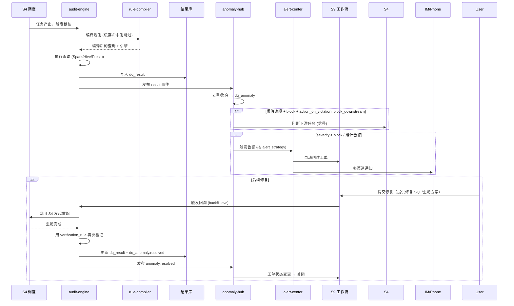
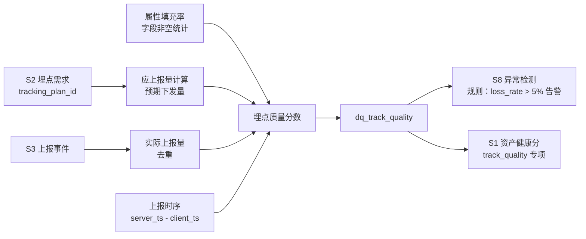

# S8 数据质量治理中心 — 软件实现设计说明书（SDD）

| 项 | 内容 |
|---|---|
| 文档编号 | `ADGS-S8-SDD-v1.0` |
| 文档类型 | 软件实现设计说明书（Software Design Document, SDD） |
| 所属系统 | 智能体数据治理系统（ADGS） |
| 子系统 | S8 数据质量治理中心 |
| 上游文档 | 《智能体数据治理系统-分析与设计文档》（`ADGS-ARD`，简称"主文档"）、《01-S8需求分析说明书》（`ADGS-S8-SRS`） |
| 版本 / 状态 | v1.0 / 设计评审稿 |
| 适用读者 | S8 研发工程师、测试工程师、SRE、数据工程师（规则配置方）、对接方（S3/S4/S7/S9）研发 |
| 密级 | 内部公开 |

> **阅读顺序**：先读同目录 `01-S8需求分析说明书.md`（为什么做、做什么、做到什么程度），再读本文（怎么做、为什么这么做）。
> 本文与需求文档中的需求编号（FR-Qxx / NFR-xx / UC-S8-xx）一一对应，双向可追溯（见附录 A）。

## 修订记录

| 版本 | 日期 | 修订人 | 修订说明 |
|---|---|---|---|
| v1.0 | 2026-09-06 | 数据平台组 | 首次发布。由主文档配套实现设计拆分而来，并按 SDD 规范补齐：文档信息与修订记录、引言与术语、架构决策记录（ADR）、风险与开放问题、需求→设计追踪矩阵、安全与权限设计、错误码规范、告警降级矩阵。 |

## 目录

| 章节 | 标题 | 对应标准 SDD 章节 |
|---|---|---|
| 0 | 引言（目的 / 术语 / 参考资料 / 约束 / 范围边界） | 1. Introduction |
| 1 | 实现范围与设计目标 | 1.2 Scope |
| 2 | 服务模块拆分 | 2.1 系统总体设计 · 模块视图 |
| 3 | 存储设计（多模选型 / DDL / 分区保留） | 4. 数据设计 |
| 4 | 核心接口设计（API / 事件订阅） | 5. 接口设计 |
| 5 | 关键流程（质量闭环 / 实时校验 / 埋点专项 / 回溯） | 6. 流程与时序设计 |
| 6 | 关键算法（规则编译 / 异常聚合 / 质量分 / 降噪） | 7. 算法设计 |
| 7 | 与 S4 的卡点集成（卡点机制 / 回溯编排） | 5.2 内部接口 + 6. 流程设计 |
| 8 | 告警降噪与抑制 | 3. 组件详细设计 |
| 9 | 容量与性能（含自举治理） | 8. 非功能性设计 · 性能 |
| 10 | 高可用与容灾（含部署架构、降级） | 2.2 部署视图 / 8. 非功能性设计 · 可用性 |
| 11 | 可观测性（黄金信号 / 业务大盘 / 自举） | 8. 非功能性设计 · 可观测性 |
| 12 | 灰度与迁移（规则灰度 / 引擎双跑 / 渠道迁移） | 11. 部署与迁移 |
| 13 | 测试策略 | 10. 测试设计 |
| 14 | 架构决策记录（ADR） | 12. 设计决策 |
| 15 | 风险、开放问题与后续演进 | 12. 设计权衡与风险 |
| 附录 A | 需求 → 设计双向追踪矩阵 | — |
| 附录 B | 安全与权限设计 | 8. 非功能性设计 · 安全性 |
| 附录 C | 错误码与异常处理规范 | 9. 异常处理设计 |
| 附录 D | 跨子系统接口约定索引 | 5.3 外部接口 |

---

## 0. 引言

### 0.1 文档目的

本文定义 S8 数据质量治理中心的**实现级设计**，作为研发编码、测试用例编写、容量申请与上线评审的依据。本文回答四类问题：

1. **切成几个服务、各自负责什么，为什么把校验放到网关侧**（§2、§5.2）
2. **规则、结果、异常、告警、回溯怎么建模与存储**（§3）
3. **对外提供什么契约、质量闭环与回溯如何编排、关键算法如何执行**（§4、§5、§6、§7）
4. **告警如何不变成噪音、挂了怎么办、规则变更如何安全上线**（§8、§9、§10、§12）

不回答：质量维度与规则分类的业务定义（见主文档 §S8 与需求分析说明书）、组织 RACI 与运营节奏（主文档 §10）。

### 0.2 术语与缩写

| 术语 | 全称 / 说明 |
|---|---|
| 质量维度 | 完整性 / 准确性 / 一致性 / 及时性 / 唯一性 / 有效性（+ 埋点质量专项） |
| DQRule | 质量规则，含模板型 / SQL 型 / 对比型三类定义方式 |
| 严重等级 | `Block`（阻断下游 + 电话告警）/ `Warn`（通知 Owner）/ `Info`（仅记录） |
| 卡点（Gate） | 任务产出后、下游执行前的强制稽核闸门，由 S8 判定放行或阻断 |
| Backfill | 数据回溯：修复后重跑历史分区并自动推导下游重跑 |
| 异常聚合 | 同一规则 × 同资产 × 同窗口内多次失败合并为一个异常，避免告警风暴 |
| 抑制期 | 已告警异常在指定窗口内不再重复通知（但仍记录） |
| 质量分 | 6 维加权 0-100 分，作为 S1 资产健康分的"质量"维度输入 |
| rule-gateway | 部署在 S3 采集网关侧的轻量校验模块，做 Schema / 值域 / 必填实时校验 |
| 埋点丢失率 | 应上报量 vs 实际上报量的差异比例，跨端对账口径 |
| 自举治理 | NFR-15：S8 自身的稽核任务、规则执行、告警链路 100% 纳入自监控 |

### 0.3 参考资料

| 编号 | 文档 / 章节 | 关系 |
|---|---|---|
| R1 | 主文档 §1 系统定位与目标 | 需求来源 |
| R2 | 主文档 §2 需求建模（FR-Q01~Q07、NFR-01~15） | 需求来源 |
| R3 | 主文档 §3 总体分层架构与子系统依赖关系 | 架构约束 |
| R4 | 主文档 §S8 子系统分析与设计 | 质量维度、DQRule 模型、核心能力、4 条设计要点 |
| R5 | 主文档 §7.2 数据质量异常闭环流程 | 主流程基线 |
| R6 | 主文档 §8 接口与集成设计 | 接口风格总则 |
| R7 | 主文档 §9 非功能性设计 | 容量、SLA 分级、高可用约束 |
| R8 | 主文档 §6.2 命名规范 | 表命名约束（`dq_*` 系统域） |
| R9 | 《01-S8需求分析说明书》 | 直接上游 |
| R10 | 《架构图-3.3-子系统依赖关系.html》 | S8 对外依赖可视化 |

### 0.4 设计约束总览（不可协商项）

| 约束 | 来源 | 对设计的硬约束 |
|---|---|---|
| 质量左移：70% 规则应在网关与埋点设计阶段生效 | 主文档 §S8 要点 2 | 必须提供 `rule-gateway` 侧布点，且规则支持"前置执行"标记 |
| 严重等级决定处置方式，避免告警疲劳 | 主文档 §S8 要点 1 | Block 才阻断 + 电话；Warn 仅通知；告警必须有明确 Owner 与处理入口 |
| 回溯是最后一公里，回溯结果也要被稽核 | 主文档 §S8 要点 3 | Backfill 完成后强制触发复检，复检不通过不得关闭工单 |
| 质量分要驱动行为 | 主文档 §S8 要点 4 | 质量分必须输出到 S1 健康分、团队排名、上线卡点 |
| 核心指标端到端准确率 ≥ 99.9% | NFR-06 | S/A 级资产必须配置准确性规则，缺失则健康分扣减 |
| 实时链路端到端延迟 P95 ≤ 30s | NFR-02 | 网关侧校验必须同步内联执行，单条校验 P99 ≤ 5ms |
| 峰值 QPS ≥ 50 万 | NFR-01 | 网关校验必须本地规则缓存，禁止每次回源 |
| 治理管控面可用性 ≥ 99.9% | NFR-05 | 稽核链路不影响数据面产出：S8 不可用时卡点默认"放行 + 补检"（见 §10.2） |
| 系统自身 100% 自监控 | NFR-15 | S8 的稽核任务与规则执行结果自身进入质量看板 |

### 0.5 本文不覆盖的内容

- 质量维度的业务定义与典型规则阈值（主文档 §S8）；
- 数据面调度引擎本身的实现（S4）、工单流转引擎（S9）、血缘图计算（S7）；
- 埋点设计阶段的规范校验（S2 主责，S8 消费其结果做覆盖率统计）；
- 具体规则的业务阈值配置（由数据工程师在规则市场配置，属运营范畴）。

---

## 1. 实现范围与设计目标

### 1.1 实现范围

| 模块 | 范围 |
|---|---|
| **规则市场** | 模板规则库（6 维 × 20+ 模板）+ 自定义 SQL 规则 + 对比规则（跨表/跨端/流批）；规则复用与共享 |
| **定时稽核** | 与 S4 调度集成（任务产出后触发）；独立定时稽核（Cron）；实时校验（采集网关侧回调） |
| **卡点执行** | Block 级规则挂载到 S4 管道节点；违规阻断下游；Warn/Info 仅通知 |
| **异常闭环** | 告警 → 工单（自动创建 S9）→ 分派 → 处理 → 验证 → 关闭；全程留痕 |
| **影响面分析** | 异常资产的下游调用方/服务/指标 → 通知范围 + 告警等级 |
| **数据回溯** | 修复后发起 Backfill；自动推导下游重跑；回溯任务结果纳入质量校验 |
| **埋点质量专项** | 端到端：埋点需求覆盖率、丢失率、重复率、属性填充率、上报时序正确率 |
| **资产质量分** | 综合 6 维度（完整性/准确性/一致性/及时性/唯一性/有效性）+ 埋点专项 → 0-100 分 → 入 S1 资产健康分 |

### 1.2 设计目标

| 目标 | 锚定 NFR | 量化指标 |
|---|---|---|
| **时效** | NFR-02 | 实时链路质量异常检测延迟 P95 ≤ 30s |
| **时效** | NFR-03 | 离线稽核按小时/天产出，SLA 达成率 ≥ 99.5% |
| **准确性** | NFR-06 | 核心指标端到端准确率 ≥ 99.9%（准确性维度必须严格保证） |
| **易用** | NFR-13 | 资产检索响应 ≤ 500ms（含异常资产的快速定位） |
| **可扩** | NFR-08 | 新增一个数据源接入 ≤ 1 人日（规则模板化） |

---

## 2. 服务模块拆分

### 2.1 模块架构

```
┌────────────────────────────────────────────────────────────────┐
│                        S8 Service Cluster                      │
│                                                                │
│  ┌────────────────┐  ┌────────────────┐  ┌────────────────┐   │
│  │ rule-admin      │  │ audit-engine   │  │ rule-compiler  │   │
│  │ 规则管理        │  │ 稽核执行引擎    │  │ 规则编译器      │   │
│  │ 模板/CRUD/版本  │  │ 调度/执行/收数  │  │ SQL/表达式→执行计划│   │
│  └────────────────┘  └────────────────┘  └────────────────┘   │
│                                                                │
│  ┌────────────────┐  ┌────────────────┐  ┌────────────────┐   │
│  │ anomaly-hub     │  │ alert-center   │  │ backfill-svc   │   │
│  │ 异常中心        │  │ 告警与降噪     │  │ 数据回溯        │   │
│  │ 异常聚合/工单   │  │ 通知渠道/抑制  │  │ Backfill 编排   │   │
│  └────────────────┘  └────────────────┘  └────────────────┘   │
│                                                                │
│  ┌────────────────┐  ┌────────────────┐  ┌────────────────┐   │
│  │ track-quality   │  │ quality-portal │  │ qscore-service │   │
│  │ 埋点质量专项    │  │ 质量门户 UI    │  │ 资产质量分      │   │
│  └────────────────┘  └────────────────┘  └────────────────┘   │
│                                                                │
│  ┌────────────────┐                                              │
│  │ rule-gateway    │  ← 部署在 S3 采集网关侧（实时校验）       │
│  └────────────────┘                                              │
└────────────────────────────────────────────────────────────────┘
```

### 2.2 模块职责

| 模块 | 职责 | 关键能力 |
|---|---|---|
| **rule-admin** | 规则 CRUD 与版本 | 模板库（6 维度 × 内置规则）；规则绑定（资产 × 分区 × 频率）；版本化；CRUD 工作流 |
| **rule-compiler** | 规则编译 | SQL 解析 → 执行计划（Spark/Hive/Presto）；模板规则生成；规则优化（谓词下推、分区裁剪） |
| **audit-engine** | 稽核执行引擎 | 调度（与 S4 集成）；执行（拉取数据、跑规则、产出结果）；状态机（pending/running/success/failed） |
| **anomaly-hub** | 异常中心 | 异常聚合（去重：同一规则 × 同资产 × 同窗口 N 分钟内只算一次）；影响面分析（调用 S7）；自动创建工单（S9） |
| **alert-center** | 告警与降噪 | 多渠道（IM/邮件/短信/电话，按严重等级）；抑制（连续 N 次触发才告警、抑制期窗口、维护期）；升级 |
| **backfill-svc** | 数据回溯 | 修复后发起回溯；自动推导下游重跑（S4）；回溯任务执行结果再次稽核 |
| **track-quality** | 埋点质量专项 | 端到端计算：需求覆盖率（按 S2 验收通过的事件/总需求）、丢失率（应上报 vs 实际上报）、重复率、属性填充率、上报时序 |
| **quality-portal** | 质量门户 | 资产质量分趋势、维度雷达、失败规则 TOP、团队治理排名、规则市场（浏览/启用） |
| **qscore-service** | 资产质量分 | 6 维度加权 → 0-100 分；周期任务 + 触发式（规则结果变化时）；输出至 S1 健康分（仅 6 维度中的"质量"维度） |
| **rule-gateway** | 采集网关侧实时校验 | 部署在 S3 网关：Schema 校验、字段类型、值域、必填；异常事件上报到 anomaly-hub |

### 2.3 关键拆分决策

| 决策 | 理由 |
|---|---|
| **规则编译与执行分离** | 编译是低频（规则变更时），执行是高频（每分钟数千任务）；分离后编译可独立做 SQL 静态分析与优化 |
| **告警与异常中心分离** | 异常中心聚焦"异常事件本身"，告警中心聚焦"何时如何通知谁"；告警降噪逻辑复杂，单独演进 |
| **回溯独立服务** | 回溯与"日常稽核"语义不同（一次性、定向、需要人工确认）；单独工作流、权限、审计 |
| **rule-gateway 部署在 S3 侧** | 实时校验必须在数据进入 ODS 前生效（成本最低）；作为独立进程/容器部署，通过 mTLS 与 S8 通信 |

---

## 3. 存储设计

### 3.1 多模存储选型

| 存储 | 选型 | 承载 |
|---|---|---|
| **关系库** | MySQL 8.0 分库分表 | DQRule、DQResult、Anomaly、Alert、BackfillTask |
| **OLAP** | ClickHouse / StarRocks | DQResult 详情、稽核明细（高吞吐写入 + 复杂聚合） |
| **时序** | Prometheus + VictoriaMetrics | 稽核任务执行指标（成功率/延迟/吞吐） |
| **对象存储** | S3 兼容 | 异常现场（数据样本导出、回溯前后对比快照） |

### 3.2 核心表 DDL

> 系统域：`dq`

#### 3.2.1 规则定义表

```sql
-- 质量规则
CREATE TABLE dq_rule (
    rule_id            STRING       COMMENT '规则 ID（UUID）',
    rule_code          STRING       COMMENT '规则业务编码（如 RULE_TBL_DWD_TURN_NON_NULL_TURN_ID）',
    rule_name          STRING       COMMENT '规则名称',
    quality_dim        STRING       COMMENT '质量维度：completeness/accuracy/consistency/timeliness/uniqueness/validity/track_quality',
    rule_type          STRING       COMMENT 'template(模板)/sql(自定义SQL)/compare(对比)',
    severity           STRING       COMMENT 'block/warn/info',
    asset_id           STRING       COMMENT '绑定的资产（FK to meta_asset）',
    asset_field        STRING       COMMENT '绑定的字段（可选）',
    schedule_type      STRING       COMMENT 'cron/post_task(任务产出后)/realtime',
    schedule_expr      STRING       COMMENT 'cron 表达式 / S4 任务 ID',
    -- 模板规则参数
    template_code      STRING       COMMENT '模板编码（如 NON_NULL/ENUM/RANGE/COUNT_DRIFT/...）',
    template_params    STRING       COMMENT '模板参数（JSON）',
    -- SQL 规则
    sql_template       STRING       COMMENT '自定义 SQL 模板（含占位符 ${asset}, ${partition_field}）',
    -- 对比规则
    compare_type       STRING       COMMENT 'cross_table/cross_endpoint/cross_batch/yoy_mom',
    compare_config     STRING       COMMENT '对比配置（JSON）',
    -- 阈值
    threshold_value    DECIMAL(18,6),
    threshold_op       STRING       COMMENT 'lte/gte/eq/range',
    threshold_range    STRING       COMMENT '区间值 [low, high]',
    -- 告警策略
    alert_strategy     STRING       COMMENT 'consecutive_n(连续N次)/first(首次)/suppress_window',
    alert_consecutive  INT          COMMENT '连续 N 次触发才告警',
    suppress_window_min INT         COMMENT '抑制窗口（分钟）',
    -- 处置
    action_on_violation STRING       COMMENT 'block_downstream/alert_only/auto_backfill',
    -- 工作流
    status             STRING       COMMENT 'draft/active/paused/deprecated',
    owner_team         STRING,
    owner_user         STRING,
    version            INT,
    created_at         TIMESTAMP,
    created_by         STRING,
    updated_at         TIMESTAMP,
    etl_ts             TIMESTAMP
)
COMMENT '质量规则定义'
PARTITIONED BY (dt STRING COMMENT '创建日期')
STORED AS ORC;
```

#### 3.2.2 稽核结果表

```sql
-- 稽核结果（任务执行后写入）
CREATE TABLE dq_result (
    result_id          STRING,
    rule_id            STRING,
    asset_id           STRING,
    asset_partition    STRING       COMMENT '执行的分区（如 dt=2026-09-06）',
    task_id            STRING       COMMENT '关联的 S4 任务',
    execution_id       STRING       COMMENT '稽核执行实例 ID',
    exec_start_at      TIMESTAMP,
    exec_end_at        TIMESTAMP,
    exec_duration_ms   INT,
    status             STRING       COMMENT 'success/failed/timeout/skipped',
    -- 检查结果
    checked_rows       BIGINT       COMMENT '检查的总行数',
    failed_rows        BIGINT       COMMENT '失败行数',
    fail_rate          DECIMAL(8,6) COMMENT '失败率',
    threshold_value    DECIMAL(18,6),
    passed             BOOLEAN,
    -- 异常样本
    sample_data        STRING       COMMENT '异常样本（前 100 行，JSON）',
    -- 上下文
    exec_engine        STRING       COMMENT 'spark/hive/presto/sql_endpoint',
    exec_query         STRING       COMMENT '实际执行的查询',
    etl_ts             TIMESTAMP
)
COMMENT '质量稽核结果'
PARTITIONED BY (dt STRING COMMENT '执行日期')
STORED AS ORC;

-- 异常聚合（用于异常中心、告警去重）
CREATE TABLE dq_anomaly (
    anomaly_id         STRING,
    rule_id            STRING,
    asset_id           STRING,
    asset_partition    STRING,
    first_seen_at      TIMESTAMP    COMMENT '首次发现时间',
    last_seen_at       TIMESTAMP    COMMENT '最近一次发现',
    occurrence_count   INT          COMMENT '累计出现次数',
    consecutive_count  INT          COMMENT '连续触发次数（用于告警抑制）',
    severity           STRING,
    status             STRING       COMMENT 'open/acknowledged/fixing/resolved/closed',
    ticket_id          STRING       COMMENT '关联工单（S9）',
    impact_assets      STRING       COMMENT '受影响的下游资产 ID 列表（JSON，由 S7 算）',
    sla_impact         STRING       COMMENT '影响的核心指标/服务（JSON）',
    resolved_at        TIMESTAMP,
    resolved_by        STRING,
    resolution_note    STRING,
    etl_ts             TIMESTAMP
)
COMMENT '质量异常聚合'
PARTITIONED BY (dt STRING)
STORED AS ORC;
```

#### 3.2.3 告警与回溯

```sql
-- 告警记录
CREATE TABLE dq_alert (
    alert_id           STRING,
    anomaly_id         STRING,
    rule_id            STRING,
    severity           STRING,
    channel            STRING       COMMENT 'im/email/sms/phone',
    recipients         STRING       COMMENT '接收人（JSON 数组）',
    sent_at            TIMESTAMP,
    delivery_status    STRING       COMMENT 'sent/failed/throttled',
    escalation_level   INT          COMMENT '升级层级（0=首次, 1=15min未响应, 2=1h未响应）',
    acked_at           TIMESTAMP,
    acked_by           STRING,
    etl_ts             TIMESTAMP
)
COMMENT '告警投递记录'
PARTITIONED BY (dt STRING)
STORED AS ORC;

-- 回溯任务
CREATE TABLE dq_backfill (
    backfill_id        STRING,
    anomaly_id         STRING,
    target_asset_id    STRING,
    target_partition   STRING       COMMENT '回溯的目标分区',
    fix_type           STRING       COMMENT 'recompute/repair/reimport',
    fix_config         STRING       COMMENT '修复配置（JSON，含修复逻辑 SQL）',
    downstream_assets  STRING       COMMENT '需要联动重跑的下游资产（自动推导，JSON）',
    status             STRING       COMMENT 'pending/approved/running/success/failed/cancelled',
    approver           STRING,
    approved_at        TIMESTAMP,
    task_id            STRING       COMMENT 'S4 调度任务',
    verification_rule_id STRING     COMMENT '回溯完成后跑哪条规则验证',
    verification_result STRING      COMMENT 'verification_passed/failed',
    created_at         TIMESTAMP,
    created_by         STRING,
    completed_at       TIMESTAMP,
    etl_ts             TIMESTAMP
)
COMMENT '数据回溯任务'
PARTITIONED BY (dt STRING)
STORED AS ORC;
```

#### 3.2.4 埋点质量专项

```sql
-- 埋点质量聚合（每日/每小时）
CREATE TABLE dq_track_quality (
    event_code         STRING       COMMENT '事件编码（来自 S2 Event Schema）',
    asset_id           STRING       COMMENT '对应事件资产 ID',
    window_start       TIMESTAMP    COMMENT '窗口起点',
    period             STRING       COMMENT 'hour/day',
    -- 五个核心指标
    expected_count     BIGINT       COMMENT '应上报数（按 S2 验收通过的下发量算）',
    actual_count       BIGINT       COMMENT '实际上报数',
    loss_rate          DECIMAL(8,6) COMMENT '丢失率 = 1 - actual/expected',
    duplicate_rate     DECIMAL(8,6) COMMENT '去重后重复率',
    field_fill_rate    DECIMAL(8,6) COMMENT '关键属性填充率',
    sequence_ok_rate   DECIMAL(8,6) COMMENT '上报时序正确率（client_ts 与 server_ts 偏差在阈值内）',
    -- 关联 S2
    tracking_plan_id   STRING,
    requirement_id   TEXT,
    etl_ts             TIMESTAMP
)
COMMENT '埋点质量专项聚合（端到端）'
PARTITIONED BY (dt STRING COMMENT '统计日期')
STORED AS ORC;
```

### 3.3 表分区与保留策略

| 表 | 分区粒度 | 保留期 | 理由 |
|---|---|---|---|
| dq_rule | dt（创建日期） | 永久 | 规则定义需可追溯 |
| dq_result | dt（执行日期） | **90 天热 + 1 年冷** | 详单量大，过期价值低；合规要求保留 1 年 |
| dq_anomaly | dt（首次发现日期） | 永久（仅更新） | 异常生命周期长 |
| dq_alert | dt（发送日期） | 1 年 | 告警投递记录的合规保留 |
| dq_backfill | dt（创建日期） | 永久 | 回溯是高风险操作，全程审计 |
| dq_track_quality | dt（统计日期） | 2 年 | 埋点质量追溯 |

---

## 4. 核心接口设计

### 4.1 API 风格总则

| 维度 | 决策 |
|---|---|
| **同步 API** | HTTP/JSON（主） + gRPC（内网高频） |
| **异步事件** | Kafka topic `dq.results`（稽核结果）、`dq.anomalies`（异常）、`dq.alerts`（告警） |
| **认证** | OIDC（外部）+ mTLS（内网） |
| **告警订阅** | Webhook + IM Bot（飞书/企微） |

### 4.2 核心 API

#### 4.2.1 规则 CRUD

```http
POST /api/v1/dq/rules
Content-Type: application/json
Authorization: Bearer <token>

{
  "rule_code": "RULE_TBL_DWD_TURN_NON_NULL_TURN_ID",
  "rule_name": "DWD 对话轮次表 turn_id 非空率",
  "quality_dim": "completeness",
  "rule_type": "template",
  "severity": "block",
  "template_code": "NON_NULL",
  "asset_id": "ast_dwd_conv_turn_di",
  "asset_field": "turn_id",
  "schedule_type": "post_task",
  "schedule_expr": "task_dwd_conv_turn_di",
  "threshold_value": 0.9999,
  "alert_strategy": "consecutive_n",
  "alert_consecutive": 3,
  "action_on_violation": "block_downstream",
  "owner_team": "agent-product"
}
```

**响应**：

```json
{
  "rule_id": "rul_8a3e1c2f",
  "rule_code": "RULE_TBL_DWD_TURN_NON_NULL_TURN_ID",
  "version": 1,
  "compiled_query": "SELECT COUNT(*) AS failed FROM dwd_conv_turn_di WHERE turn_id IS NULL OR turn_id = ''",
  "compiled_engine": "spark",
  "est_cost": {"cpu_hours": 0.5, "scanned_gb": 12}
}
```

> **编译即时返回**：rule-compiler 同步编译，SQL 静态分析（语法 + 引用资产存在性）+ 估算扫描量。

#### 4.2.2 触发稽核

```http
POST /api/v1/dq/audit/trigger
Content-Type: application/json
Authorization: Bearer <token>

{
  "rule_id": "rul_8a3e1c2f",
  "partition": "dt=2026-09-06",
  "priority": "high"
}
```

**响应**：

```json
{
  "execution_id": "exe_xxx",
  "rule_id": "rul_8a3e1c2f",
  "partition": "dt=2026-09-06",
  "status": "pending",
  "estimated_completion_at": "2026-09-06T10:25:00Z"
}
```

#### 4.2.3 告警订阅

```http
POST /api/v1/dq/alerts/subscriptions
Content-Type: application/json
Authorization: Bearer <token>

{
  "filters": [
    {"field": "severity", "op": "in", "values": ["block", "warn"]},
    {"field": "domain_code", "op": "in", "values": ["conv", "agent"]},
    {"field": "asset_level", "op": "in", "values": ["S", "A"]}
  ],
  "destinations": [
    {"type": "im", "target": "feishu://chat/oc_xxx"},
    {"type": "phone", "target": "+86-xxx"}
  ],
  "active_hours":": "00:00-24:00"     // 维护期由 alert-center 统一管控
}
```

### 4.3 事件订阅

S8 发布到 Kafka 的事件：

| topic | event_type | 消费方 |
|---|---|---|
| dq.results | result.passed / result.failed | S1（资产质量分更新）、S14（治理度量） |
| dq.anomalies | anomaly.opened / anomaly.acknowledged / anomaly.resolved | S9（工单）、S1（资产健康分）、S11（安全事件联动） |
| dq.alerts | alert.sent / alert.escalated | S14（告警响应时长度量） |
| dq.backfill | backfill.started / backfill.completed | S1（资产状态）、S4（调度） |

---

## 5. 关键流程

### 5.1 质量闭环



### 5.2 实时校验（采集网关侧）

```
S3 采集网关上报事件
        ↓
rule-gateway（部署在网关侧）本地缓存规则
        ↓
逐事件校验（Schema + 值域 + 必填）
        ↓
├─ 通过 → 写入 Kafka 主流
└─ 失败 → 写入死信队列 (DLQ)
        ↓
定期聚合 DLQ → anomaly-hub → 上报质量（按"未知事件""未知字段""Schema 失败"等模板规则）
```

**为什么本地缓存**：网关侧要求 P95 ≤ 5ms 完成校验，不能每次调用 S8。规则变更由 S8 主动推送（Kafka 推送 → rule-gateway 内存加载）。

### 5.3 埋点质量专项



**关键算法**：

```python
def calc_track_quality(event_code, window):
    plan = fetch_tracking_plan(event_code)
    # 应上报量 = S2 验收通过的需求覆盖的预期下发量（按渠道×版本×用户群聚合）
    expected = aggregate_expected_count(plan, window)
    # 实际上报量 = S3 入库量（去重）
    actual = aggregate_actual_count(event_code, window)
    loss_rate = max(0, 1 - actual / expected) if expected > 0 else 0
    # 重复率 = (原始条数 - 去重后条数) / 原始条数
    raw, deduped = aggregate_raw_and_deduped(event_code, window)
    dup_rate = (raw - deduped) / raw if raw > 0 else 0
    # 关键属性填充率（按 tracking_plan 中标记为 required 的属性）
    fill_rate = aggregate_required_field_fill(event_code, window)
    # 时序正确率：server_ts - client_ts 在阈值内的比例
    seq_ok = aggregate_timing_correctness(event_code, window, threshold_seconds=5)
    return {event_code, expected, actual, loss_rate, dup_rate, fill_rate, seq_ok}
```

### 5.4 数据回溯

详见 §7 "与 S4 的卡点集成" 中的回溯子流程。

---

## 6. 关键算法

### 6.1 规则编译与执行计划生成

```python
# 伪代码：SQL 规则编译
class RuleCompiler:
    def compile(self, rule):
        if rule.rule_type == 'template':
            sql = self.expand_template(rule.template_code, rule.template_params, rule.asset_id)
        elif rule.rule_type == 'sql':
            sql = rule.sql_template
        else:
            sql = self.expand_compare(rule.compare_type, rule.compare_config)

        # SQL 静态分析
        parsed = parse_sql(sql)
        self._validate(parsed)  # 语法校验、注入检查、资产存在性校验
        self._optimize(parsed)  # 谓词下推、分区裁剪、列裁剪

        # 选择执行引擎
        engine = self._select_engine(parsed)
        return {'sql': sql, 'engine': engine}

    def _select_engine(self, parsed):
        # 规则类型 + 数据量 + 时效要求 → 引擎选择
        if parsed.requires_aggregation and parsed.estimated_scan_gb > 100:
            return 'spark'
        elif parsed.estimated_scan_gb < 1 and parsed.latency_requirement_ms < 5000:
            return 'presto'
        else:
            return 'hive'
```

### 6.2 异常聚合与去重

```python
# 伪代码：异常聚合（关键：避免告警风暴）
class AnomalyAggregator:
    def aggregate(self, new_result):
        # 去重 key: rule_id + asset_id + partition + 时间窗口
        key = (new_result.rule_id, new_result.asset_id, new_result.partition)
        anomaly = self.find_open_anomaly(key)
        if anomaly is None:
            anomaly = self.create_anomaly(new_result)
        else:
            anomaly.occurrence_count += 1
            anomaly.last_seen_at = new_result.exec_end_at
            if anomaly.consecutive_count == 0:  # 仅在新连续触发时增加
                anomaly.consecutive_count += 1
            anomaly.save()

        # 触发告警的条件（去重 + 抑制）：
        should_alert = (
            new_result.passed == False
            and anomaly.severity in ('block', 'warn')
            and (
                anomaly.consecutive_count >= self.rule.alert_consecutive
                or anomaly.first_seen_at + self.suppress_window_minutes <= now()
            )
        )
        if should_alert:
            self.alert_center.trigger(anomaly)
```

### 6.3 资产质量分计算

```python
# 伪代码：资产质量分（仅 S8 维度，输出至 S1 健康分）
def compute_asset_quality_score(asset_id):
    # 取该资产所有规则的最近 7 天结果
    results = fetch_recent_results(asset_id, window_days=7)
    if not results:
        return 100  # 无规则不扣分（视为未覆盖，但提醒运营配置）

    # 按维度分组计算通过率
    by_dim = defaultdict(list)
    for r in results:
        if r.status == 'success':
            by_dim[r.quality_dim].append(r.fail_rate)  # 失败率

    dim_scores = {}
    for dim, fails in by_dim.items():
        # 该维度得分 = 1 - 平均失败率
        dim_scores[dim] = max(0, 1 - mean(fails))

    # 加权聚合（仅质量维度，权重对应主文档 6 维度）
    w = {'completeness':0.20, 'accuracy':0.30, 'consistency':0.20,
         'timeliness':0.15, 'uniqueness':0.10, 'validity':0.05}
    score = sum(dim_scores.get(k, 1.0) * w[k] for k in w) * 100
    return round(score, 1)
```

### 6.4 告警降噪（多策略组合）

| 策略 | 规则 |
|---|---|
| **连续触发抑制** | 同一异常连续 N 次才告警（按规则的 `alert_consecutive`） |
| **抑制窗口** | 同一异常告警后 M 分钟内不再告警 |
| **维护期** | 全局维护期（资产变更/数仓迁移期间）所有告警降级为 Info |
| **静默期** | 非工作时间（22:00-08:00）+ 法定假日，warn 级降为 IM 不电话 |
| **影响面阈值** | 仅下游 ≥ N 个资产或 ≥ M 个 S 级指标才告警（避免冷门资产噪音） |
| **Owner 屏蔽** | 同一 Owner 当日 ≥ 3 次告警后，自动合并为日报 |
| **修复期** | 工单处理中（status=fixing）期间，不重复告警 |

---

## 7. 与 S4 的卡点集成

### 7.1 卡点机制

Block 级规则的 `action_on_violation=block_downstream` 触发卡点：

```
S4 管道任务产出 → 触发 S8 稽核 (post_task)
        ↓
S8 执行 → 写结果到 dq_result
        ↓
├─ 全部通过 → S4 继续下游
└─ 有 block 失败 → S8 回调 S4 (信号: BLOCK)
        ↓
S4 阻塞下游 + 通知任务 Owner
```

**实现机制**：
- S4 在触发稽核时调用 `audit/trigger` 获得 `execution_id`，轮询直到 status=success/failed
- 或异步：稽核完成后 S8 回调 S4 webhook `/（`4/integrations/s8/block?task_id=xxx`
- 阻塞窗口：默认 5 分钟（可配置）；超时未完成则放行下游 + 告警"稽核超时"

### 7.2 回溯触发与编排

```
User 在 S9 工单中提交修复方案
        ↓
S9 调用 backfill-svc: POST /backfills
        ↓
backfill-svc:
  1. 解析修复类型（recompute/repair/reimport）
  2. 调用 S7 查下游资产链
  3. 调用 S4 发起重跑任务（含下游）
  4. 任务完成 → 调用 S8 跑 verification_rule_id
  5. 通过 → 更新 anomaly.status=resolved；工单关闭
  6. 失败 → 工单重开 + 升级
```

**双重稽核**：回溯任务本身也要跑质量规则（避免修复引入新问题）。

---

## 8. 告警降噪与抑制

详见 §6.4 算法。

**关键指标**：
- 告警疲劳度 = 7 天人均告警数 / 7 天资产数（目标 ≤ 0.5%）
- 误警率 = 7 天内被标记 false_positive 的告警 / 总告警（目标 ≤ 5%）

**运营动作**：
- 每月评审规则模板，停用低价值/高噪音规则
- 每季度评审告警阈值，结合资产等级 + 业务反馈

---

## 9. 容量与性能

### 9.1 容量估算

| 项 | 假设 | 结果 |
|---|---|---|
| 规则总数 | 14 类资产 × 平均 30 条规则/类（含模板） | 约 25 万条规则 |
| 稽核任务数 | 25 万规则 × 平均 6 次/天（含 post_task + cron） | 约 150 万次稽核/日 |
| 稽核结果记录 | 150 万/日 × 365 = 5.5 亿/年 | OLAP 5 TB/年（90 天热 + 1 年冷） |
| 异常总数 | 平均每规则 1 个 open 异常 | 约 5 万 open 异常 |
| 告警数 | 每日新触发告警（已降噪后） | 约 2000-5000 条/日 |

### 9.2 性能基线

| 指标 | 目标 |
|---|---|
| 规则编译 P95 | ≤ 500 ms |
| 稽核执行 P95 | ≤ 60 s（轻量规则）/ ≤ 5 min（重量级规则） |
| 异常聚合去重延迟 P95 | ≤ 5 s |
| 告警投递延迟 P95 | ≤ 30 s |
| 实时校验（rule-gateway）P95 | ≤ 5 ms（每事件） |
| 埋点质量聚合延迟 P95 | ≤ 5 min（小时窗口）/ ≤ 30 min（日窗口） |

### 9.3 自举治理（NFR-15）

S8 自身的稽核结果也要上报：

- dq_rule 表本身被 S1 录入元数据，分类为 meta 域 ADS 层
- audit-engine 的执行链路被 S4 调度覆盖
- 规则质量（误警率、修复率）作为质量分输入
- 告警渠道的可达性作为质量规则（如 "alert-center 不可达"）

---

## 10. 高可用与容灾

### 10.1 部署架构

```
            ┌─────────── Region A (主)  ───────────┐
   ┌────────────────┐    ┌────────────────┐    ┌────────────────┐
   │ rule-admin (3)  │    │ audit-engine (10+)│    │ anomaly-hub (5)│
   └────────────────┘    └────────────────┘    └────────────────┘
            │                     │                      │
   ┌────────▼─────────────────────▼──────────────────────▼────────┐
   │ Kafka: dq.results / dq.anomalies / dq.alerts / dq.backfill │
   └────────┬─────────────────────┬──────────────────────┬────────┘
            │                     │                      │
   ┌────────▼────────┐    ┌───────▼────────┐    ┌────────▼────────┐
   │ ClickHouse 集群  │    │ 关系库主从     │    │ 告警渠道网关      │
   └─────────────────┘    └────────────────┘    └────────────────┘
```

**SLA**：可用性 ≥ 99.9%（治理面要求同 NFR-05）。

### 10.2 降级策略

| 故障 | 降级行为 |
|---|---|
| audit-engine 部分不可用 | 排队等待可用实例；超时任务标记 failed + 通知 |
| ClickHouse 不可用 | 稽核结果降级写 MySQL（容量受限）；后续补写 |
| 告警渠道（IM/短信）不可用 | 降级为邮件；多次失败 → 升级到电话 |
| rule-gateway 离线 | S3 网关侧跳过实时校验 → 上报到异常中心 → 运维补漏 |

### 10.3 灾备

- RPO ≤ 5 分钟（MySQL 主从同步）
- RTO ≤ 30 分钟

---

## 11. 可观测性

### 11.1 黄金信号

| 信号 | 指标 | 告警阈值 |
|---|---|---|
| 流量 | 稽核 QPS | 突增 200% / 突降 50% |
| 错误率 | 稽核失败率（status=failed） | > 5% |
| 延迟 | 稽核 P95 / 告警投递 P95 | 超 SLA |
| 饱和度 | ClickHouse 磁盘 / Kafka lag | > 80% |

### 11.2 业务可观测性

- **质量大盘**：规则通过率趋势、Top 失败规则、团队质量排名
- **告警大盘**：告警量趋势、误警率、响应时长分布
- **回溯大盘**：回溯频率、平均修复时长、回溯失败率
- **埋点质量大盘**：按事件 × 渠道 × 版本的热力图

### 11.3 自举治理

S8 自身的关键链路 100% 纳入 ADGS 治理：
- S8 API 调用 → 上报到 S3
- S8 稽核任务 → 注册到 S4
- S8 质量规则 → S1 元数据注册
- S8 告警可达性 → 自身质量规则

---

## 12. 灰度与迁移

### 12.1 规则灰度

新规则上线必须灰度：

```
Phase 1 (draft)：规则定义完成但未激活
        ↓
Phase 2 (active, severity=info)：仅观察，不告警，不阻断（持续 7 天）
        ↓
Phase 3 (active, severity=warn)：产生告警但不阻断（持续 14 天）
        ↓
Phase 4 (active, severity=block)：生效并可阻断（持续 30 天）
        ↓
Phase 5：纳入基线规则库
```

每阶段需检查：误警率、修复率、覆盖目标资产比例。

### 12.2 规则引擎版本灰度

S8 规则编译/执行引擎升级时：
- 新旧引擎并行运行，对比结果（双跑）
- 差异率 < 0.1% 后切换流量
- 保留 1 个月的回滚能力

### 12.3 告警渠道迁移

切换告警渠道（IM/邮件/短信厂商）时：
- 双 投递，结果对比
- 7 天稳定后切流
- 老渠道保留 1 个月兜底

---

## 13. 测试策略

### 13.1 测试层次

| 层次 | 工具 | 覆盖 |
|---|---|---|
| 单元测试 | Go testing | 规则编译、异常聚合、告警降噪、质量分计算 |
| 集成测试 | Testcontainers | audit-engine + ClickHouse + Kafka + S4 webhook |
| 契约测试 | Pact | 与 S4/S7/S9/S14 的 API 一致性 |
| 性能测试 | k6 / JMeter | 稽核并发、告警吞吐、实时校验延迟 |
| 灾备演练 | ChaosBlade | ClickHouse / Kafka 故障下的降级行为 |

### 13.2 关键测试场景

- **规则编译正确性**：构造 SQL 注入、引用不存在资产、循环依赖等异常模板，验证编译拒绝
- **稽核幂等性**：重复执行同一规则，结果一致
- **卡点正确性**：block 规则失败时，下游任务被阻塞；修复并重跑后，下游解锁
- **告警降噪**：连续触发 N 次只告警一次；抑制窗口内不重复；维护期不告警
- **回溯闭环**：修复 → 重跑 → 验证 → 工单关闭 全链路
- **埋点质量计算**：构造丢失、属性缺失、时序异常数据，验证 4 个指标的准确性

### 13.3 性能压测场景

- 10 万规则同时调度（资源隔离 + 队列限流）
- 单规则扫描 100 亿行（执行引擎性能 + 资源隔离）
- 告警风暴：1 万异常同时触发（去重与降噪效果）
- 实时校验：单节点 10 万 QPS（rule-gateway 性能）

---


---

## 14. 架构决策记录（ADR）

> 记录"为什么这样设计"以及**被否决的替代方案**。新增设计变更时，请在此追加 ADR 而非直接改代码。

### ADR-S8-01 · 规则表达采用「模板型 + SQL 型 + 对比型」三类，统一编译为执行计划

- **状态**：已接受（v1.0）
- **背景**：规则配置者能力差异极大——数据工程师会写 SQL，业务运营只会填空；同时存在跨表/跨端/流批对账这类无法用单表 SQL 表达的场景。
- **候选方案**：
  - A. 只允许 SQL 规则
  - B. 只允许模板规则（下拉选择）
  - C. **三类并存，统一 IR（中间表示）→ 编译为目标引擎执行计划**
- **决策**：选 C。
- **理由**：A 把 80% 的简单规则变成写 SQL 的负担，且无法做优化与成本估算；B 无法覆盖对账类需求；C 通过"模板 → IR → 执行计划"的编译层，既降低使用门槛，又保留表达能力，且执行前可做谓词下推、分区裁剪等优化（§6.1），还能统一做成本预估与高危拦截。
- **后果**：✅ 覆盖度与易用性兼顾；❌ 需自研规则编译器（约 2 人月）并持续适配引擎方言；❌ 自定义 SQL 有注入与全表扫描风险，需静态检查（禁 DDL/DML、强制分区条件）。
- **关联**：FR-Q01、FR-Q02；§2.2 rule-compiler、§6.1

### ADR-S8-02 · 质量左移：在 S3 采集网关侧部署 rule-gateway 做实时校验

- **状态**：已接受
- **背景**：数据错误越晚发现，修复成本越高（网关拦截 < 埋点设计 < 数仓层）。NFR-01 要求峰值 50 万 QPS。
- **候选方案**：A. 全部规则在数仓层离线稽核；B. **网关内联校验（Schema/类型/值域/必填）+ 数仓层业务准确性稽核**；C. 网关异步旁路校验（只记录不拦截）。
- **决策**：选 B（C 作为灰度期过渡形态，见 §12.1）。
- **理由**：A 让脏数据一路流到数仓，回溯成本极高；C 无法阻止脏数据入库；B 在成本最低的入口拦截。为达成 NFR-01/NFR-02，rule-gateway 必须：规则本地缓存（无网络回源）、单条校验 P99 ≤ 5ms、失败时 fail-open（不得因校验拖垮上报链路）。
- **后果**：✅ 源头拦截，修复成本最低；❌ 网关侧规则变更有推送延迟（目标 ≤ 30s）；❌ 占用网关 CPU 预算（需限流与采样，见 §9）。
- **关联**：FR-Q01、NFR-01、NFR-02、NFR-06；§2.2 rule-gateway、§5.2

### ADR-S8-03 · 异常必须先「聚合 → 去重 → 定级 → 抑制」再告警

- **状态**：已接受
- **背景**：一条规则 × N 个分区 × 每 5 分钟一次，一夜可产生上万条原始失败；直接告警等于没有告警。
- **候选方案**：A. 每条失败即告警；B. 按小时汇总成报表；C. **聚合键（规则×资产×窗口）合并 + 影响面定级 + 抑制窗口 + 升级机制**
- **决策**：选 C。
- **理由**：A 造成告警疲劳，运营会屏蔽渠道；B 丧失及时性（Block 级不能等 1 小时）；C 在两者之间取平衡：聚合去重压缩量级，严重度与影响面决定渠道与时效，抑制窗口防止重复打扰，未及时响应则自动升级。
- **后果**：✅ 告警量与有效告警率可控（目标：有效告警率 ≥ 90%）；❌ 聚合逻辑复杂（§6.2），存在"新异常被旧异常抑制"的风险，需按异常指纹（fingerprint）而非仅规则 ID 聚合。
- **关联**：FR-Q03、FR-Q04；§2.2 anomaly-hub / alert-center、§6.2、§6.4、§8

### ADR-S8-04 · 严重等级（Block / Warn / Info）决定处置方式，而非配置自由组合

- **状态**：已接受
- **背景**：放任配置者自由组合"是否阻断 / 告警渠道 / 通知范围"会导致规则间行为不一致、责任不清。
- **候选方案**：A. 完全自由配置；B. **三级枚举，每级绑定固定的处置矩阵，仅允许在级内微调渠道**
- **决策**：选 B。
- **理由**：A 在实践中必然演化为"全都配成最高级"或"全都配成最低级"；B 把"影响面 → 等级 → 处置"的映射固化，使行为可预测、可审计，且降级/升级路径清晰。等级可由资产等级（S1）+ 影响面（S7）自动建议，人工确认。
- **后果**：✅ 行为可预测、告警可信；❌ 灵活性受限，特殊场景需走"例外申请 + 留痕"。
- **关联**：FR-Q03；主文档 §S8 要点 1；§6.4

### ADR-S8-05 · 与 S4 深度集成实现卡点与回溯，且回溯结果强制复检

- **状态**：已接受
- **背景**：没有回溯能力的质量治理只能保证"未来正确"，无法修复"历史错误"；但回溯会引发下游大规模重跑。
- **候选方案**：A. 仅告警，人工去 S4 操作；B. **S8 发起回溯 → S4 推导下游重跑 → 完成后回调 S8 复检 → 复检通过才关单**；C. S8 自研调度直接重跑。
- **决策**：选 B。
- **理由**：A 的闭环断裂（工单关了但数据没修）；C 重复造轮子且与 S4 调度冲突（资源争抢、状态不一致）；B 复用 S4 的依赖编排能力，并通过"复检"这一强制环节保证回溯真的修好了数据。
- **后果**：✅ 闭环完整、职责清晰；❌ 跨系统状态机复杂（需对账任务兜底异常状态，见 §7.2）；❌ 大规模回溯可能压垮集群，需限流与分批（§7.2）。
- **关联**：FR-Q05；主文档 §S8 要点 3；§5.4、§7.1、§7.2

### ADR-S8-06 · 质量分仅贡献 S1 健康分的「质量」维度，不重复计算其他维度

- **状态**：已接受
- **背景**：S8 的资产质量分与 S1 的资产健康分都覆盖质量维度，容易重复计算或口径冲突。
- **候选方案**：A. S8 独立发布质量分，与 S1 健康分并列；B. **S8 只算 6 个质量维度分，作为 S1 健康分的质量维输入，S1 负责加权汇总**；C. S1 直接读取稽核结果自行计算。
- **决策**：选 B。
- **理由**：A 会出现"两个分"的认知混乱；C 让 S1 需要理解稽核细节，耦合过重；B 保持"谁产生数据谁定义分"的原则，且只有一份对外分数（健康分），符合"单一事实源"。
- **后果**：✅ 口径唯一；❌ S1 健康分依赖 S8 可用性（S8 不可用时健康分保留上次值并标记 stale，见 §10.2）。
- **关联**：FR-Q07；§6.3、§11.2

### ADR-S8-07 · 稽核结果分区化存储 + 冷归档，异常与告警长保留

- **状态**：已接受
- **背景**：稽核结果随规则数与频率线性增长（§9.1 容量估算），但 90% 的查询集中在近 7 天。
- **候选方案**：A. 单表全量存储；B. **结果表按天分区 + 90 天冷归档 + 异常/告警表独立长保留（365 天）**
- **决策**：选 B。
- **理由**：A 在半年后单表超百亿行，查询与 DDL 都不可用；B 把"高频明细"与"需要长期追溯的异常"分离，成本与查询性能兼顾，且异常表数据量小（仅失败记录），可支撑趋势分析与复盘。
- **后果**：✅ 成本可控、查询稳定；❌ 跨归档周期的历史趋势查询需走离线聚合宽表（由 S14 消费）。
- **关联**：FR-Q02、FR-Q07；§3.2、§3.3

---

## 15. 风险、开放问题与后续演进

| ID | 风险 / 开放问题 | 类型 | 影响 | 概率 | 缓解措施 | 责任方 | 触发升级条件 |
|---|---|---|---|---|---|---|---|
| RK-S8-01 | 告警风暴：规则配置不当导致单日告警数千条，渠道被屏蔽 | 风险 | 治理失效 | 高 | 聚合 + 抑制 + 分级（ADR-S8-03/04）；新规则上线前走"只记录"观察期（§12.1）；单规则单日告警数上限熔断 | S8 研发 + 数据工程师 | 单日告警 > 500 条或有效告警率 < 80% |
| RK-S8-02 | 稽核任务挤占生产计算资源，影响离线 SLA（NFR-03） | 风险 | 数据产出延迟 | 中 | 稽核走独立队列与资源池；规则执行前做成本预估，超阈值需审批；谓词下推 + 分区裁剪（§6.1） | S8 + 数仓 | 稽核导致 SLA 达成率 < 99.5% |
| RK-S8-03 | 回溯引发下游雪崩式重跑 | 风险 | 集群过载、成本激增 | 中 | 回溯分批 + 全局并发上限 + 影响面预估；超阈值需二级审批（§7.2） | S8 + S4 | 单次回溯影响资产 > 200 或预估计算成本超阈值 |
| RK-S8-04 | 网关校验引入上报延迟或失败，影响 NFR-02 / NFR-06 | 风险 | 数据丢失 | 中 | fail-open 降级（校验超时/异常一律放行并计数）；本地缓存无回源；单条 P99 ≤ 5ms 硬约束（§5.2） | S8 + S3 | 网关校验耗时 P99 > 5ms 或校验导致上报失败率上升 |
| RK-S8-05 | 自定义 SQL 规则全表扫描 / 注入 | 风险 | 集群故障 | 中 | 静态检查（禁 DDL/DML、强制分区条件）+ 预编译 + 只读账号 + 成本预估拦截（§6.1） | S8 研发 | 出现任一规则扫描量超阈值 |
| RK-S8-06 | 规则爆炸：数千条规则无人维护，僵尸规则产生噪音 | 风险 | 维护成本、噪音 | 中 | 规则需绑定 Owner 与有效期；连续 90 天未触发且未被查看的规则自动进入"休眠"并通知 Owner | 数据治理组 | 僵尸规则占比 > 20% |
| RK-S8-07 | S8 不可用导致卡点阻塞全链路产出 | 风险 | 数据大面积延迟 | 低 | 卡点默认 fail-open（S8 超时/不可用视为放行，事后补检并标记），见 §10.2 | S8 SRE | 卡点不可用时长 > 10min |
| OP-S8-01 | 流批对账差异率阈值（≤1%）是否合理 | 开放 | 误报/漏报平衡 | — | 上线后按资产分别统计差异分布，分资产设定阈值而非全局统一 | 数据工程师 | 误报率 > 10% |
| OP-S8-02 | 埋点丢失率的"应上报量"基准如何确定 | 开放 | 指标可信度 | — | v1 采用服务端计数为基准，端侧上报为对比；后续引入端侧心跳与抽样重传校验 | S8 + S3 | — |
| OP-S8-03 | 是否需要引入基于历史分布的自动阈值（动态基线） | 开放 | 减少人工调参 | — | v1 固定阈值 + 同比环比波动规则；v2 试点动态基线 | S8 研发 | 人工调参工时占比 > 30% |

**后续演进（v2 候选）**：① 动态阈值与异常检测（基于历史分布自动学习）；② 根因自动定位（结合 S7 血缘 + 变更事件自动归因）；③ 规则推荐（基于资产类型与历史异常自动推荐规则模板）。

---

## 附录 A · 需求 → 设计双向追踪矩阵

| 需求 ID | 需求摘要 | 设计承载章节 | 承载模块 | 存储 / 接口 | 测试场景（§13.2） |
|---|---|---|---|---|---|
| FR-Q01 | 质量规则配置（6 维度 × 3 类定义） | §2.2、§6.1 | rule-admin / rule-compiler | `dq_rule`；规则 CRUD API | TC-01 三类规则配置与编译 |
| FR-Q02 | 规则绑定资产、定时调度执行、结果可视化 | §2.2、§5.1、§6.1 | audit-engine / quality-portal | `dq_result`；触发稽核 API | TC-02 定时稽核与结果写入 |
| FR-Q03 | 异常自动告警、分派与工单闭环 | §2.2、§5.1、§6.2、§6.4 | anomaly-hub / alert-center | `dq_anomaly`、`dq_alert`；S9 工单 | TC-03 告警降噪与工单闭环 |
| FR-Q04 | 异常影响面分析 | §2.2、§6.2 | anomaly-hub → S7 | 调用 S7 影响面 API | TC-04 影响面驱动定级 |
| FR-Q05 | 数据回溯发起、跟踪与结果校验 | §2.2、§5.4、§7.2 | backfill-svc → S4 | `dq_backfill` | TC-05 回溯闭环与复检 |
| FR-Q06 | 埋点质量专项（覆盖率/丢失率/重复率/端侧失败率） | §2.2、§5.3 | track-quality / rule-gateway | `dq_track_quality` | TC-06 埋点专项指标计算 |
| FR-Q07 | 资产质量分计算与排名 | §2.2、§6.3 | qscore-service | 输出至 S1 健康分 | TC-07 质量分计算与输出 |
| FR-Q08 | 卡点与熔断（任务级） | §7.1 | audit-engine + S4 | 卡点判定 API | TC-08 Block 级阻断与 fail-open |
| NFR-01 | 峰值 50 万 QPS | §5.2、§9.1 | rule-gateway | 本地规则缓存 | 网关压测（§13.3） |
| NFR-02 | 实时链路 P95 ≤ 30s | §5.2 | rule-gateway | 内联校验 | 端到端时延测试 |
| NFR-03 | 离线 SLA 达成率 ≥ 99.5% | §9.1、§9.2 | audit-engine | 独立资源队列 | 稽核不抢占演练 |
| NFR-05 | 管控面可用性 ≥ 99.9% | §10.1、§10.2 | 全模块 | 多可用区 + fail-open | 故障注入演练 |
| NFR-06 | 核心指标准确率 ≥ 99.9% | §6.1、§6.3 | rule-compiler / qscore | S/A 级强制准确性规则 | 端到端对账测试 |
| NFR-11 | 访问留痕 | 附录 B | rule-admin / quality-portal | 审计日志 | 越权访问拦截测试 |
| NFR-15 | 自举治理 | §9.3、§11.3 | 全模块 | S8 自身稽核任务入看板 | 自监控覆盖率检查 |

---

## 附录 B · 安全与权限设计

### B.1 认证与鉴权

| 角色 | 规则查看 | 规则创建/修改 | 规则删除/停用 | 告警处置 | 回溯发起 |
|---|---|---|---|---|---|
| 质量管理员 | 全域 ✅ | 全域 ✅ | ✅（需审批） | ✅ | ✅（超阈值需二级审批） |
| 资产 Owner | 本资产 ✅ | 本资产 ✅ | 本资产 ✅ | ✅（自己资产） | ✅（自己资产） |
| 数据工程师 | ✅ | ✅（需 Owner 确认） | ❌ | ✅（被分派） | 可申请 |
| 业务方 / viewer | ✅（只看结果） | ❌ | ❌ | ❌ | ❌ |

- 认证：统一 OIDC；服务间调用 mTLS + 服务身份。
- 规则执行的**数据访问权限**：稽核引擎以只读账号执行，且按规则绑定资产的最小范围授权；自定义 SQL 仅允许 SELECT，禁止跨库访问未授权资产。

### B.2 敏感数据处理

- 稽核结果中的**样例值**（如失败样本的主键值）默认脱敏展示（哈希/掩码），查看原始值需申请并留痕。
- 告警内容不得携带明细数据（只带指标值、分区、影响面链接），避免告警渠道（IM/邮件）造成数据外泄。
- 埋点质量专项涉及用户标识的统计一律使用聚合值，禁止输出个体级明细。

### B.3 审计留痕（NFR-11）

| 审计项 | 内容 | 保留期 |
|---|---|---|
| 规则变更 | 变更前后快照、操作人、原因 | 365 天 |
| 告警处置 | 认领/忽略/升级/关闭动作与原因 | 365 天 |
| 回溯操作 | 发起人、范围、影响资产数、审批记录 | 365 天 |
| 规则执行 | 执行账号、SQL 文本、扫描量 | 90 天 |

---

## 附录 C · 错误码与异常处理规范

### C.1 错误码格式

```
S8-{模块}-{三位数字}
模块：RUL（规则）/ CMP（编译）/ AUD（稽核）/ ANM（异常）/ ALT（告警）/ BKF（回溯）/ TRK（埋点专项）/ QSC（质量分）
示例：S8-RUL-003  规则 SQL 校验不通过（缺少分区条件）
      S8-AUD-007  稽核任务执行超时
```

### C.2 HTTP 映射与重试语义

| 类别 | HTTP | 客户端可重试 | 说明 |
|---|---|---|---|
| 规则定义非法 | 400 | 否 | 返回 `invalid_fields` 与修复建议 |
| 未认证 / 无权限 | 401 / 403 | 否 | |
| 规则不存在 | 404 | 否 | |
| 版本冲突（规则被他人修改） | 409 | 否 | 返回当前版本号 |
| 限流 | 429 | 是（退避） | 含 `Retry-After` |
| 稽核执行失败 | 500 | 是（幂等） | 需区分"规则错误"与"引擎故障" |
| 依赖不可用（S4/S7） | 503 | 是（退避） | 返回降级说明 |

### C.3 关键异常场景处置

| 场景 | 处置 | 一致性保证 |
|---|---|---|
| 稽核任务执行超时 | 标记 `timeout` 并重试 1 次；仍失败则标记 `failed` 并告警 S8 自身（自举） | 结果表以 `run_id` 幂等写入 |
| 卡点判定接口超时 | **fail-open**：S4 视为放行，S8 事后补检并标记"未卡点产出" | 补检结果写入异常表 |
| 回溯任务中途失败 | 保留已完成分区，记录断点，支持续跑；禁止部分成功即关单 | `dq_backfill` 状态机 + 对账任务 |
| 告警渠道不可用 | 降级到备份渠道（IM → 邮件 → 工单）；全部失败则写入"未送达"并升级给管理员 | 未送达清单可重投 |
| 规则推送到网关失败 | 网关继续使用上一版本规则并上报配置漂移告警 | 版本号单调，重启后可恢复 |

### C.4 告警降级矩阵（与 §10.2 对应）

| 故障 | 降级动作 | 用户可见影响 |
|---|---|---|
| 稽核引擎不可用 | 卡点 fail-open；定时任务排队等待恢复后补跑 | 产出不受阻，质量保障暂时弱化 |
| 图库 / S7 不可用 | 影响面分析降级为"直接下游 1 层" | 定级可能偏低，事后校正 |
| 检索引擎不可用 | 质量看板降级为预聚合宽表 | 明细查询不可用 |
| 告警中心不可用 | 告警写入待发送队列，恢复后补发（去重后） | 通知延迟 |
| 对象存储（样例归档）不可用 | 跳过样例归档，仅存指标值 | 无法回溯查看失败样本 |

---

## 附录 D · 跨子系统接口约定索引

| 对端 | 方向 | 内容 | 契约位置 | 一致性 |
|---|---|---|---|---|
| S1 元数据 | S8 ← S1 | 资产列表、等级、分类坐标、Owner（规则绑定与定级依据） | §4.3 事件订阅 | 最终一致（≤5min，NFR-04） |
| S1 | S8 → S1 | 资产质量分（健康分的质量维输入） | §6.3 | 最终一致（T+1 + 触发） |
| S2 埋点治理 | S8 ← S2 | 埋点需求与验收通过事件清单（覆盖率分母） | §5.3 | 最终一致 |
| S3 采集网关 | 双向 | 规则下发到 rule-gateway；网关回传校验失败与未知事件统计 | §4.3、§5.2 | 最终一致（规则推送 ≤30s） |
| S4 管道编排 | S8 ← S4 | 任务产出完成事件触发稽核 | §4.3、§5.1 | 强一致触发 |
| S4 | S8 → S4 | 卡点判定（放行/阻断）；回溯任务发起 | §7.1、§7.2 | 强一致（同步判定，超时 fail-open） |
| S7 血缘分析 | S8 → S7 | 查询异常资产下游影响面 | §6.2 | 最终一致（查询时调用） |
| S9 协作工作流 | S8 → S9 | 自动创建异常工单；工单状态回写 | §5.1 | 最终一致 |
| S13 数据服务 | S8 ← S13 | 服务/数据集资产纳入质量监控 | §4.3 | 最终一致 |
| S14 治理度量 | S8 → S14 | 质量达标率、告警响应时长、团队排名 | §11.2 | 最终一致 |

---

> **文档结束。** 本 SDD 与《01-S8需求分析说明书》构成 S8 的完整交付文档集，变更时两文档需同步更新（追踪矩阵见附录 A）。
