# 智能体数据治理系统（ADGS）
## 系统分析与设计文档

| 项目 | 内容 |
|---|---|
| 系统名称 | 智能体数据治理系统（Agent Data Governance System，简称 ADGS） |
| 服务产品 | WorkBuddy（AI Agent 产品，桌面端 / 移动端 / Web / 服务端） |
| 文档版本 | v1.0 |
| 文档状态 | 系统设计基线（评审稿） |
| 建模方法 | 结构化系统分析 + 领域驱动设计（DDD）+ C4 分层建模 |
| 文档范围 | 需求建模、系统分解、领域模型、数据模型、关键流程、接口与非功能设计、演进路线 |

---

## 目录

- [0. 术语表](#0-术语表)
- [1. 系统定位与目标](#1-系统定位与目标)
- [2. 需求建模](#2-需求建模)
- [3. 系统上下文与总体架构](#3-系统上下文与总体架构)
- [4. 子系统分析与设计](#4-子系统分析与设计)
- [5. 领域模型设计](#5-领域模型设计)
- [6. 数据模型设计](#6-数据模型设计)
- [7. 核心业务流程建模](#7-核心业务流程建模)
- [8. 接口与集成设计](#8-接口与集成设计)
- [9. 非功能性设计](#9-非功能性设计)
- [10. 治理运营机制设计](#10-治理运营机制设计)
- [11. 演进路线](#11-演进路线)
- [12. 风险与开放问题](#12-风险与开放问题)
- [附录 A 埋点命名与事件字典样例](#附录-a-埋点命名与事件字典样例)
- [附录 B 核心表 DDL 样例](#附录-b-核心表-ddl-样例)
- [附录 C 指标定义卡模板](#附录-c-指标定义卡模板)

---

## 0. 术语表

| 术语 | 全称 / 英文 | 说明 |
|---|---|---|
| ADGS | Agent Data Governance System | 本文档所述系统本体 |
| 事件 / Event | Event | 一次用户或系统行为的最小记录单元，含事件名与属性集合 |
| 属性 / Property | Property | 事件或对象上的字段，含类型、取值域、是否必填等约束 |
| 业务对象 | Business Object | 具备稳定身份与生命周期的业务实体，如 User、Session、Conversation |
| 主体 | Subject | 数据描述的核心实体，Agent 场景下表现为 User / Session / Conversation / Agent |
| 原子指标 | Atomic Metric | 不可再拆分的度量，在特定业务过程下对某一度量的统计，如"会话数" |
| 派生指标 | Derived Metric | 原子指标 + 时间周期 + 修饰词 + 维度切片，如"近 7 日 iOS 端人均会话数" |
| 复合指标 | Composite Metric | 由多个原子/派生指标按公式计算，如"Agent 健康度分" |
| 维度 | Dimension | 观察数据的角度，如时间、平台、Agent、模型、用户分层 |
| 血缘 | Lineage | 数据从源头到消费端的加工链路，含表级与字段级 |
| 主题域 | Subject Domain | 面向业务过程的**全域资产分类单元**（不限于数仓表），如会话交互域、工具调用域；由 S1 统一定义与管理 |
| 数据分层 | Data Layer | 按加工深度划分的资产层级（ODS/DWD/DWM/DWS/ADS/DIM），是**全域资产的公共组织维度**；由 S1 统一定义，S5 在建模环节执行校验 |
| 会话 / Session | Session | 一次应用使用周期，从启动/登录到退出/超时 |
| 对话 / Conversation | Conversation | 一次围绕特定任务的持续多轮交互，可跨 Session |
| 轮次 / Turn | Turn | 一次"用户提问 → 助手应答"的完整交互单元 |
| Trace | Trace | 一次请求在 Agent 运行时内的完整调用链，由若干 Span 组成 |
| DQC | Data Quality Check | 数据质量稽核规则与执行实例 |
| SLA / SLO | Service Level Agreement / Objective | 数据时效与质量的服务等级约定 |

---

## 1. 系统定位与目标

### 1.1 业务背景与系统存在的前提

WorkBuddy 是 AI Agent 形态的产品，其数据特征与传统 App 存在本质差异，这决定了本系统不能是一套通用 BI 工具的简单复用：

| 维度 | 传统 App 数据 | Agent 产品数据 | 对系统的要求 |
|---|---|---|---|
| 数据粒度 | 页面浏览、点击等离散事件 | 多轮对话、工具调用、模型推理的长链路过程数据 | 必须支持**过程态**建模（Session → Conversation → Turn → ToolCall），而非仅事件流 |
| 数据形态 | 以结构化行为日志为主 | 结构化事件 + 长文本 + 多模态产物 + 半结构化 Trace | 需同时承载**结构化指标计算**与**非结构化语料治理** |
| 评价对象 | 功能使用率、留存、转化 | 任务完成率、答案质量、工具调用成功率、Token 成本 | 指标体系需覆盖**效果、效率、成本、安全**四象限 |
| 迭代速度 | 版本周期以周/月计 | 模型、Prompt、技能、工具按天甚至按小时灰度 | 数据模型必须具备**强版本化与可扩展属性** |
| 消费方 | 产品、运营、BI | 产品、运营、BI + **算法评测、模型训练、Prompt 工程** | 需同时提供**统计型数据服务**与**样本型数据集服务** |
| 合规敏感度 | 一般行为数据 | 对话内容可能含 PII、代码、企业机密 | 需内建**分级脱敏、留存策略、删除权**机制 |

**结论：**ADGS 不是"报表系统"，而是一套**以元数据为内核、以契约为准绳、以质量为闭环**的数据生产要素供给系统。它要解决的不是"如何出报表"，而是"如何让 WorkBuddy 的每一次迭代都能被准确度量、可追溯归因、可低成本复盘"。

### 1.2 问题域定义（系统要消除的痛点）

| 编号 | 痛点 | 表现 | 系统应对子系统 |
|---|---|---|---|
| P1 | 对象模型不统一 | 同一"会话"在客户端、服务端、算法侧口径不同，跨端无法对齐 | S1 元数据与资产中心、S2 埋点与事件治理平台 |
| P2 | 埋点质量不可控 | 漏埋、错埋、命名混乱、参数缺失；需求上线后才被发现 | S2 埋点治理、S8 数据质量治理中心 |
| P3 | 指标口径分裂 | 同一"日活"在不同看板数值不同，跨团队对不上 | S6 指标与语义层平台 |
| P4 | 变更影响不可知 | 某个字段调整后，影响多少下游表、多少看板，无人能答 | S7 血缘与影响分析系统 |
| P5 | 质量问题被动发现 | 数据错了由业务方先发现，缺少主动稽核与回溯机制 | S8 数据质量治理中心 |
| P6 | 数据资产找不到、不敢用 | 表多、口径不清、不知道该用哪张 | S1 元数据与资产中心（数据地图） |
| P7 | 协作流程靠口口相传 | 需求 → 埋点 → 验收无系统承载，责任与时效不可追踪 | S9 数据协作与工作流引擎 |
| P8 | Agent 效果无法量化 | 缺少评测数据集与 Trace 归因链路，模型优化凭感觉 | S10 Agent 评测与 Trace 数据平台 |
| P9 | 数据膨胀与成本失控 | 明细数据无限期留存，存储与计算成本线性增长 | S12 数据生命周期与成本治理系统 |
| P10 | 隐私合规风险 | 对话内容含敏感信息，脱敏与留存策略缺失 | S11 数据安全与合规治理系统 |

### 1.3 系统定义与边界

**系统定义：**ADGS 是面向 WorkBuddy Agent 业务的**企业级数据治理与数据生产要素供给平台**。它以元数据为核心枢纽，将"业务对象建模 → 埋点设计 → 数据采集 → 管道加工 → 数仓建模 → 指标定义 → 质量稽核 → 资产服务 → 分析消费"全链路纳入统一管控，为产品分析、Agent 评估、模型优化与业务决策提供可信、可解释、可复用的数据能力。

**系统边界（在系统内）：**
- 业务对象、事件、模型、指标、维度的**定义权与元数据管理**
- **全域资产分类体系（主题域、数据分层）的定义与管理**
- 埋点规范的制定、评审、发布、验收与版本管理
- 数据采集的统一接入、清洗、路由与协议治理
- 数据仓库的建模设计、建模规范执行与公共维度设计
- 数据质量的规则定义、稽核执行、异常闭环与回溯
- 数据血缘的采集、解析、存储与影响分析
- 指标的统一定义、计算、服务化与口径仲裁
- 数据资产的编目、检索、权限、评价与运营
- 分析数据集（含评测集、训练语料）的构建、版本与分发

**系统边界（不在系统内，由外部系统承担）：**
- 业务数据库（用户中心、订单、计费）的**事务处理逻辑** —— 仅接入其变更日志
- 通用 BI 工具的**可视化渲染能力** —— ADGS 通过指标 API / 数据集对外供数，不承担图表渲染
- 模型训练与推理框架本身 —— ADGS 只负责提供样本与特征数据
- 基础设施层（K8s、存储、网络）—— 由云平台提供

### 1.4 设计目标与原则

#### 设计目标（可度量）

| 目标类别 | 目标 | 度量方式 |
|---|---|---|
| 统一性 | 核心业务对象（User/Session/Conversation/Agent）在全域唯一定义 | 对象定义复用率 ≥ 90%；跨端 ID 打通率 ≥ 99.5% |
| 规范性 | 埋点全面纳入规范管控 | 埋点规范覆盖率 100%；新增埋点评审通过率 ≥ 95% |
| 准确性 | 数据可信 | 核心指标准确率 ≥ 99.9%；埋点字段完整率 ≥ 99% |
| 及时性 | 数据可用 | 实时链路端到端延迟 P95 ≤ 30s；离线核心表 SLA 达成率 ≥ 99.5% |
| 可解释性 | 口径可追溯 | 核心指标 100% 具备字段级血缘；口径变更 100% 可影响分析 |
| 复用性 | 减少重复建设 | 公共维度复用率 ≥ 85%；DWS 层复用率 ≥ 70% |
| 效率 | 降低取数成本 | 需求自助满足率 ≥ 70%；平均取数交付时长下降 50% |
| 成本 | 控制存储与计算 | 单位业务量存储成本年降 20%；冷数据归档率 ≥ 60% |

#### 设计原则

1. **元数据驱动（Metadata-Driven）**：一切数据资产（表、字段、事件、指标、维度、规则、数据集）先注册元数据，再生产数据。元数据是系统的唯一事实源（Single Source of Truth），模型、校验、血缘、权限均从元数据自动生成，杜绝"先建表后补文档"。
2. **契约优先（Contract-First）**：事件 Schema 即前后端与数据团队之间的契约。契约先行、版本化管理、兼容性检查（向后兼容为默认约束），破坏性变更必须走评审与灰度。
3. **质量左移（Shift-Left Quality）**：在需求评审与埋点设计阶段即完成 60% 的质量保障（规范校验、口径对齐、必填校验），而非依赖下游事后稽核。
4. **血缘内建（Built-in Lineage）**：血缘不是事后补录的文档，而是从管道元数据、SQL AST 解析、指标定义中自动抽取的副产品。没有血缘的数据资产不允许上线。
5. **分层解耦（Layered Decoupling）**：采集、管道、建模、治理、服务各层通过标准接口交互，任一层的替换不影响其他层。
6. **资产可复用（Reusable by Design）**：公共维度一致性、主题域稳定、指标原子化，避免"一人一表一指标"。
7. **合规内建（Privacy by Design）**：敏感字段在数据接入的第一时间完成分级与脱敏，留存策略随元数据绑定，删除请求可级联执行。
8. ** Govern 而非 Block（管控而不阻断）**：治理能力默认以"可观测 + 可告警 + 可回溯"的方式运行，仅对核心资产启用强卡点，避免治理成为效率瓶颈。

### 1.5 系统上下文（C4 - Context）

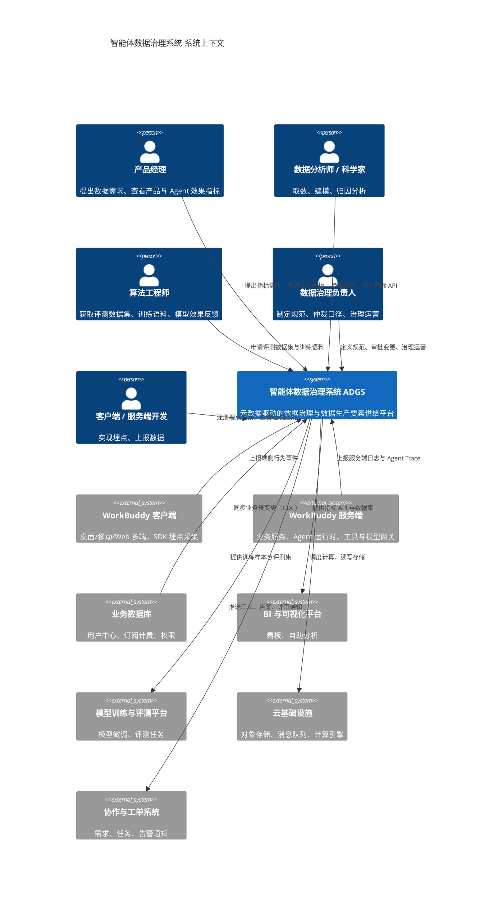

---

## 2. 需求建模

### 2.1 干系人与角色

| 角色 | 核心诉求 | 对本系统的关键期望 | 主要使用场景 |
|---|---|---|---|
| 数据治理负责人 | 口径统一、规范落地、风险可控 | 一个地方定义规范，全域自动生效 | 规范发布、口径仲裁、治理度量 |
| 产品经理 | 快速看到新功能效果，结论可信 | 需求上线即可取数，指标口径明确 | 埋点需求提报、效果分析、A/B 结论 |
| 客户端 / 服务端开发 | 埋点实现简单、不返工 | 有明确 Schema、有自检工具、有验收标准 | 埋点方案查阅、SDK 接入、埋点自检 |
| 数据分析师 | 找得到数据、信得过数据 | 资产可检索、口径可追溯、取数自助 | 资产检索、SQL 建模、指标分析 |
| 算法工程师 | 高质量评测集与训练语料 | 数据可筛选、可版本化、可复现 | 评测集构建、Badcase 归因、样本导出 |
| 数据工程师 | 管道稳定、变更可评估 | 依赖清晰、影响可分析、故障可回溯 | 管道运维、模型变更、故障回溯 |
| 安全合规 | 敏感数据不外泄、留存合规 | 分级脱敏自动化、删除请求可级联 | 数据分级、审计、合规报表 |
| 管理层 | 看到业务全貌与 Agent 竞争力 | 核心指标一致、可信、可对比 | 经营看板、周月报 |

### 2.2 用例模型

```mermaid
graph TB
    subgraph Actors
        GOV[数据治理负责人]
        PM[产品经理]
        DEV[客户端/服务端开发]
        DA[数据分析师/科学家]
        ALGO[算法工程师]
        DE[数据工程师]
        SEC[安全合规]
    end

    subgraph ADGS["智能体数据治理系统"]
        UC1[注册与版本化业务对象/事件]
        UC2[设计并评审埋点方案]
        UC3[采集与接入多源数据]
        UC4[编排实时/离线管道]
        UC5[定义主题域与数据分层体系]
        UC5b[基于分类体系进行数仓建模]
        UC6[定义与管理指标口径]
        UC7[配置并执行质量稽核]
        UC8[分析血缘与变更影响]
        UC9[检索与申请数据资产]
        UC10[构建评测与训练数据集]
        UC11[执行脱敏与留存策略]
        UC12[发起并跟踪数据工单]
        UC13[治理度量与运营看板]
    end

    GOV --> UC1
    GOV --> UC5
    GOV --> UC6
    GOV --> UC13
    PM --> UC2
    PM --> UC6
    PM --> UC12
    DEV --> UC2
    DEV --> UC3
    DA --> UC5b
    DA --> UC8
    DA --> UC9
    ALGO --> UC10
    ALGO --> UC9
    DE --> UC4
    DE --> UC5
    DE --> UC5b
    DE --> UC7
    SEC --> UC11
    SEC --> UC9
```

### 2.3 功能性需求矩阵

| 需求域 | 需求 ID | 需求描述 | 优先级 | 承载子系统 |
|---|---|---|---|---|
| 元数据 | FR-M01 | 支持业务对象（User/Session/Conversation/Agent/Turn/ToolCall 等）的注册、属性定义、版本管理与发布 | P0 | S1 |
| 元数据 | FR-M02 | 支持技术元数据（表、字段、分区、存储、责任人）自动采集与同步 | P0 | S1 |
| 元数据 | FR-M03 | 支持业务元数据（业务口径、使用场景、资产等级）人工维护与评审 | P0 | S1 |
| 元数据 | FR-M04 | 支持元数据的血缘关系建模与可视化展示（表级 + 字段级） | P0 | S1 / S7 |
| 元数据 | FR-M05 | 支持元数据变更审计与版本 diff | P1 | S1 |
| 元数据 | FR-M06 | 支持主题域体系管理：域的注册、层级、域码、Owner、核心实体与资产挂载；主题域为全域资产（表/事件/指标/数据集/规则）共用 | P0 | S1 |
| 元数据 | FR-M07 | 支持数据分层规范管理：分层定义（ODS/DWD/DWM/DWS/ADS/DIM）、层级职责、跨层依赖规则、访问约束、默认生命周期策略 | P0 | S1 |
| 元数据 | FR-M08 | 支持分类体系的合规扫描：资产主题域归属完整性、跨层依赖违规（如 ADS 被下游依赖、ODS 被直接查询）检测 | P1 | S1 |
| 元数据 | FR-M09 | 支持主题域与分层变更的影响评估与评审（新增/合并/废弃域或层） | P1 | S1 / S7 |
| 埋点治理 | FR-T01 | 支持事件与属性的在线注册、Schema 定义（类型/必填/枚举/值域/示例） | P0 | S2 |
| 埋点治理 | FR-T02 | 支持埋点方案与产品需求关联，支持需求评审流程线上化 | P0 | S2 / S9 |
| 埋点治理 | FR-T03 | 提供埋点命名与规范自动校验（命名式、类型合规、必填校验、枚举收敛） | P0 | S2 |
| 埋点治理 | FR-T04 | 支持 Schema 版本管理与兼容性检查（向后兼容检测、破坏性变更拦截） | P0 | S2 |
| 埋点治理 | FR-T05 | 提供埋点自检工具与自动化验收（多端抓包校验、样本比对、覆盖率检查） | P0 | S2 |
| 埋点治理 | FR-T06 | 自动生成多端 SDK 代码模板与上报示例 | P1 | S2 / S3 |
| 采集接入 | FR-C01 | 提供多端采集 SDK（桌面/移动/Web/服务端），统一上报协议 | P0 | S3 |
| 采集接入 | FR-C02 | 支持事件的本地缓存、批量上报、失败重试与顺序保证 | P0 | S3 |
| 采集接入 | FR-C03 | 统一接入网关支持 Schema 校验、脏数据隔离、死信队列 | P0 | S3 |
| 采集接入 | FR-C04 | 支持业务库 CDC 同步与第三方数据源接入 | P1 | S3 |
| 管道编排 | FR-P01 | 支持离线批处理任务调度、依赖编排与回溯重跑 | P0 | S4 |
| 管道编排 | FR-P02 | 支持实时流处理作业管理与状态监控 | P0 | S4 |
| 管道编排 | FR-P03 | 支持流批一体开发与口径对齐校验 | P1 | S4 |
| 管道编排 | FR-P04 | 支持任务级别的数据质量卡点与失败熔断 | P1 | S4 / S8 |
| 数仓建模 | FR-W01 | 支持事实表/维度表在线建模设计，自动生成 DDL、调度任务与质量规则模板 | P0 | S5 |
| 数仓建模 | FR-W02 | 支持公共维度（一致性维度）注册、共享与版本管理，并强制一致性复用 | P0 | S5 |
| 数仓建模 | FR-W03 | 支持缓慢变化维（SCD Type 1/2）处理 | P1 | S5 |
| 数仓建模 | FR-W04 | 支持建模规范执行校验：命名规范、分层依赖合规、维度一致性、字段复用扫描 | P0 | S5 |
| 数仓建模 | FR-W05 | 支持建模时挂载主题域与分层，并绑定生命周期策略与安全分级（联动 S1 / S12 / S11） | P1 | S5 |
| 指标体系 | FR-I01 | 支持原子指标、派生指标、复合指标的定义与关系建模 | P0 | S6 |
| 指标体系 | FR-I02 | 指标定义卡：业务定义、计算逻辑、数据源、维度、周期、责任人、口径说明 | P0 | S6 |
| 指标体系 | FR-I03 | 支持指标 SQL 自动生成与多引擎适配（离线 / 实时 / OLAP） | P0 | S6 |
| 指标体系 | FR-I04 | 支持指标口径变更的评审、通知与影响评估 | P0 | S6 / S7 |
| 指标体系 | FR-I05 | 提供统一的指标查询 API（按维度组合、时间粒度、对比周期） | P0 | S6 |
| 指标体系 | FR-I06 | 支持指标异动检测与归因辅助 | P2 | S6 |
| 数据质量 | FR-Q01 | 支持质量规则配置：完整性、准确性、一致性、及时性、唯一性、有效性 | P0 | S8 |
| 数据质量 | FR-Q02 | 支持规则绑定资产、定时调度执行、结果可视化 | P0 | S8 |
| 数据质量 | FR-Q03 | 支持异常自动告警、分派与工单闭环 | P0 | S8 / S9 |
| 数据质量 | FR-Q04 | 支持异常影响面分析（下游资产、看板、指标） | P0 | S8 / S7 |
| 数据质量 | FR-Q05 | 支持数据回溯（Backfill）任务发起、进度跟踪与结果校验 | P0 | S8 / S4 |
| 数据质量 | FR-Q06 | 支持埋点质量专项：覆盖率、丢失率、重复率、端侧失败率监控 | P0 | S8 |
| 数据质量 | FR-Q07 | 支持质量分（资产健康分）计算与排名 | P1 | S8 |
| 血缘 | FR-L01 | 自动采集管道血缘与 SQL 解析血缘（表级 + 字段级） | P0 | S7 |
| 血缘 | FR-L02 | 支持上下游影响分析：改某字段影响哪些表/指标/看板 | P0 | S7 |
| 血缘 | FR-L03 | 支持血缘链路的根因追溯：指标异常 → 上游表 → 任务 → 数据源 | P0 | S7 |
| 血缘 | FR-L04 | 支持血缘快照与时间旅行查询 | P2 | S7 |
| 资产服务 | FR-A01 | 数据地图：资产检索、详情、热度、评价、认领 | P0 | S1 |
| 资产服务 | FR-A02 | 统一数据服务 API：指标取数、明细查询、限流与审计 | P0 | S13 |
| 资产服务 | FR-A03 | 支持数据集构建、版本化、脱敏导出与分发 | P0 | S13 |
| 评测数据 | FR-E01 | 支持从 Trace/对话数据构建评测集（规则筛选 + 人工标注） | P0 | S10 |
| 评测数据 | FR-E02 | 支持 Badcase 归集、聚类与回流至评测集 | P1 | S10 |
| 评测数据 | FR-E03 | 支持评测结果与线上指标的关联分析（离线效果 ↔ 线上表现） | P1 | S10 / S6 |
| 安全合规 | FR-S01 | 支持数据分级分类（公开/内部/敏感/机密）与标签传播 | P0 | S11 |
| 安全合规 | FR-S02 | 支持字段级脱敏策略（哈希、掩码、截断、加密）自动生效 | P0 | S11 |
| 安全合规 | FR-S03 | 支持行/列级权限与资产申请审批 | P0 | S11 |
| 安全合规 | FR-S04 | 支持数据留存策略与用户删除请求的级联执行 | P0 | S11 / S12 |
| 安全合规 | FR-S05 | 支持全量数据访问审计日志 | P1 | S11 |
| 生命周期 | FR-LC01 | 支持表/分区级生命周期策略（热温冷归档、TTL、下线） | P1 | S12 |
| 生命周期 | FR-LC02 | 支持存储与计算成本计量、归因到团队与资产 | P1 | S12 |
| 生命周期 | FR-LC03 | 支持无用资产识别与下线流程 | P2 | S12 |
| 协作流程 | FR-WF01 | 支持数据需求 → 埋点设计 → 开发 → 验收的端到端工单流转 | P0 | S9 |
| 协作流程 | FR-WF02 | 支持规范发布、变更评审等多级审批流 | P1 | S9 |
| 协作流程 | FR-WF03 | 支持流程 SLA 统计与瓶颈分析 | P1 | S9 |
| 治理运营 | FR-G01 | 治理度量看板：规范覆盖率、质量达标率、资产复用率、口径一致率 | P0 | S14 |
| 治理运营 | FR-G02 | 支持治理任务下发、跟踪与团队治理排名 | P2 | S14 |

### 2.4 非功能性需求

| 类别 | 需求 ID | 指标要求 |
|---|---|---|
| 规模 | NFR-01 | 支持日均事件量 ≥ 50 亿条，峰值 QPS ≥ 50 万 |
| 时效 | NFR-02 | 实时链路端到端延迟 P95 ≤ 30s，P99 ≤ 60s |
| 时效 | NFR-03 | 离线核心 DWD/DWS 表按小时/天产出，SLA 达成率 ≥ 99.5% |
| 时效 | NFR-04 | 元数据变更后，血缘与影响分析结果 5 分钟内可见 |
| 可用性 | NFR-05 | 治理管控面（元数据/指标/质量）可用性 ≥ 99.9%；数据面采集网关 ≥ 99.99% |
| 准确性 | NFR-06 | 核心指标端到端准确率 ≥ 99.9%；端侧上报丢失率 ≤ 0.1% |
| 可扩展 | NFR-07 | 新增一个业务对象的埋点接入成本 ≤ 0.5 人日 |
| 可扩展 | NFR-08 | 新增一个数据源接入 ≤ 1 人日；新增一个主题域建模 ≤ 3 人日 |
| 可扩展 | NFR-09 | 元模型可扩展：支持自定义实体类型与关系类型 |
| 兼容 | NFR-10 | 事件 Schema 变更向后兼容；破坏性变更需双写灰度 ≥ 1 个版本周期 |
| 安全 | NFR-11 | 敏感字段脱敏覆盖率 100%；数据访问 100% 留痕 |
| 安全 | NFR-12 | 支持数据跨境/区域化存储策略（如适用） |
| 易用 | NFR-13 | 资产检索平均响应 ≤ 500ms；检索结果准确率（Top5 命中）≥ 85% |
| 成本 | NFR-14 | 单位事件存储与计算成本逐年下降 ≥ 20% |
| 可观测 | NFR-15 | 系统自身关键链路 100% 埋点自监控（自举：ADGS 用 ADGS 治理） |

---

## 3. 系统上下文与总体架构

### 3.1 总体分层架构

系统采用**数据面（Data Plane）+ 治理面（Governance Plane）+ 消费面（Consumption Plane）**三平面架构。三个平面的职责边界如下：

| 平面 | 职责 | 是否承载业务数据 | 包含子系统 |
|---|---|---|---|
| **数据面 Data Plane** | 数据的生产、加工与存储：从多端采集到管道加工，再到分层建模落存 | 是 | S3、S4、S5 |
| **治理面 Governance Plane** | 横切管控全链路：定义规范与契约、稽核质量、解析血缘、保障安全、度量治理成效 | 否（仅承载元数据与控制指令） | S1、S2、S6、S7、S8、S9、S11、S12、S14 |
| **消费面 Consumption Plane** | 数据价值的对外交付：服务化出口、场景化数据应用与业务场景消费 | 是（派生与结果数据） | S10、S13 |

三条核心链路：**数据流**（数据源 → 采集 → 管道 → 分层存储 → 服务 → 应用，纵向贯穿数据面与消费面）、**管控流**（治理面 → 数据面/消费面，下发规范、契约、策略与卡点）、**回流流**（数据面/消费面 → 治理面，回流技术元数据、血缘、运行指标与访问行为）。

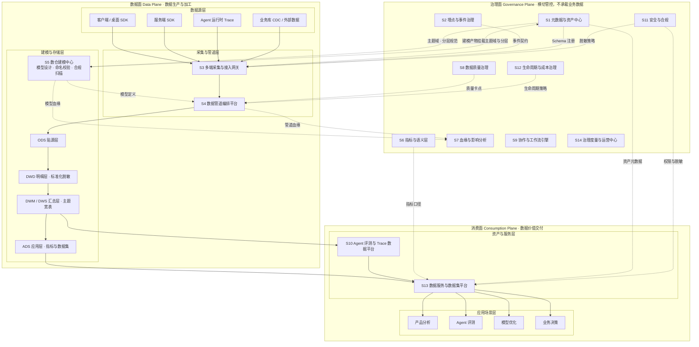

> 图例：**实线** = 数据流（数据实体自左向右/自上而下流动）；**虚线** = 管控流与回流流（规范、契约、策略的下发，以及元数据、血缘、运行指标的回传）。

---

#### 💡 交互版架构图（推荐 · 含悬停高亮与链路过滤）

将上方 mermaid 图的语义，按人读习惯重新组织为**「治理面俯瞰走廊数据面 / 消费面」**三行结构：

- **走廊**：所有跨平面链路（管控下发 / 元数据回流）的唯一通道，能直观看到 **S1↔S5、S4↔S7** 等双向成对关系。
- **每条边带语义标注**：事件契约 / Schema 注册 / 脱敏策略 / 质量卡点 / 指标口径 / 管道血缘 / 建模产物挂载 ……（图中 26 条连线均有中文 label）。
- **三种交互**：
  1. 鼠标悬停任意子系统卡片 → 该子系统的全部关联链路高亮，其余淡出；
  2. 顶部复选框可单独筛选 数据流 / 管控流 / 回流流；
  3. 图下方可展开**文本版连线清单**（按链路类型分组），便于逐条核对与检索。

<div align="center">

<object type="text/html" data="./架构图-3.1-总体分层架构.html" width="100%" height="820" style="border:1px solid #e2e6ea;border-radius:8px">
  <!-- 静态 PNG 兜底：任何渲染器（含 VS Code 默认预览 / GitHub）都会显示这张静态图 -->
  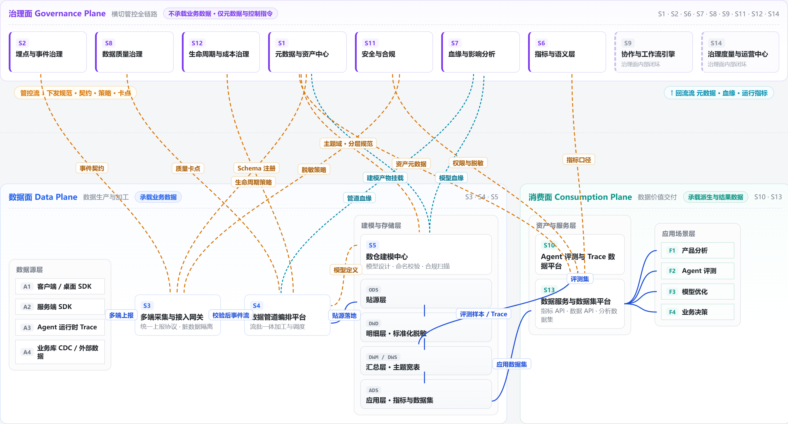
  <!-- 渲染器完全不支持 object/img 时，给出本地文件链接 -->
  <p>📄 请直接打开 <a href="./架构图-3.1-总体分层架构.html"><b>架构图-3.1-总体分层架构.html</b></a>　（同目录 · 单文件 · 零外部依赖）</p>
</object>

</div>

<sub>📌 提示：在 OneDrive / 本地浏览器中打开 HTML 效果最佳；若需在公司内网文档站分享，可将 HTML 一并上传到静态资源目录并改 <code>data="./路径/架构图-3.1-总体分层架构.html"</code>。</sub>

---

### 3.2 子系统全景

系统拆解为 **14 个子系统**，按职责归属到三个平面（数据面 3 个、治理面 9 个、消费面 2 个）：

| 编号 | 子系统 | 英文名 | 所属平面 | 一句话定位 |
|---|---|---|---|---|
| S3 | 多端采集与接入网关 | Collection & Ingestion Gateway | 数据面 | 多端统一上报协议、SDK 与脏数据隔离网关 |
| S4 | 数据管道编排平台 | Pipeline Orchestration Platform | 数据面 | 流批一体的数据加工与调度中枢 |
| S5 | 数仓建模中心 | Warehouse Modeling Center | 数据面 | 基于统一分类体系进行模型设计，并执行建模规范校验与公共维度治理 |
| S1 | 元数据与资产中心 | Metadata & Asset Center | 治理面 | 全域资产的"户籍系统"与**分类体系（主题域·分层）定义者**，一切治理能力的元数据底座 |
| S2 | 埋点与事件治理平台 | Event Tracking Governance Platform | 治理面 | 埋点从需求到验收全生命周期的规范管控台 |
| S6 | 指标与语义层平台 | Metrics & Semantic Layer | 治理面 | 指标口径的唯一仲裁者，对外提供统一语义取数 |
| S7 | 血缘与影响分析系统 | Lineage & Impact Analysis | 治理面 | 数据链路的可追溯性与变更影响评估能力 |
| S8 | 数据质量治理中心 | Data Quality Center | 治理面 | 质量规则定义、稽核执行、异常闭环与回溯 |
| S9 | 数据协作与工作流引擎 | Collaboration & Workflow Engine | 治理面 | 跨角色数据交付流程的线上化载体 |
| S11 | 数据安全与合规治理 | Security & Compliance | 治理面 | 分级分类、脱敏、权限、审计、删除权 |
| S12 | 数据生命周期与成本治理 | Lifecycle & Cost Governance | 治理面 | 冷热分层、TTL、成本归因与无用资产下线 |
| S14 | 治理度量与运营中心 | Governance Operations Center | 治理面 | 治理成效的可视化与持续改进闭环 |
| S10 | Agent 评测与 Trace 数据平台 | Agent Eval & Trace Platform | 消费面 | 面向 Agent 效果、成本、Badcase 的专项数据能力 |
| S13 | 数据服务与数据集平台 | Data Service & Dataset Platform | 消费面 | 指标 API、数据 API、分析数据集的统一出口 |

### 3.3 子系统依赖关系

子系统之间的依赖按**平面内依赖**与**跨平面依赖**两类组织：平面内依赖构成各平面的能力骨架，跨平面依赖构成"管控下发"与"元数据回流"的双向治理闭环。

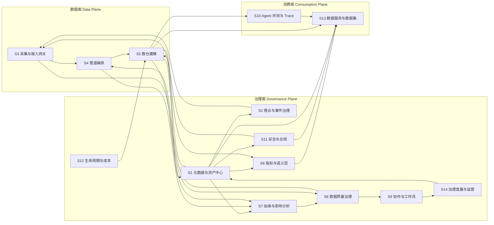

---

#### 💡 交互版依赖关系图（推荐 · 含悬停高亮与链路过滤）

把上方 mermaid 的 26 条依赖重新组织为 **「治理闭环走廊 + 数据/消费双面板」** 的可读布局：

- **左侧治理闭环走廊**：S1 作为枢纽节点高亮，治理面内部跨节点的依赖（S1→S6/S11/S7、S14→S1）以**嵌套弧线**从面板左缘绕行，绝不压盖中间子系统 —— 治理自闭环 `S1→S7→S8→S9→S14→S1` 一眼可辨。
- **右侧数据面 + 消费面垂直堆叠**：数据交付（S5→S10/S13、S10→S13）走右列内垂直通道；管控下发（S1/S11/S6→S13、S8→S4 等）走右侧面板间隙，与回流路径配对呈现。
- **每条边带语义标注**：分类体系、资产语义、分级基准、事件契约、脱敏策略、主题域·分层规范、质量卡点、指标口径、上报质量回流、模型血缘、产物挂载…… 共 24 条带 label 的边。
- **四种链路区分**：蓝色实线 = 数据流/数据交付；紫色实线 = 治理面内部依赖；橙色虚线 = 跨平面管控下发；青色点线 = 跨平面元数据回流。
- **三种交互**：① 鼠标悬停任一子系统可高亮其全部入向/出向依赖，其余淡出；② 顶部复选框可单独筛选 4 类链路；③ 图下方可展开**依赖清单**（按链路类型分组），便于逐条核对。

<div align="center">

<object type="text/html" data="./架构图-3.3-子系统依赖关系.html" width="100%" height="540" style="border:1px solid #e2e6ea;border-radius:8px">
  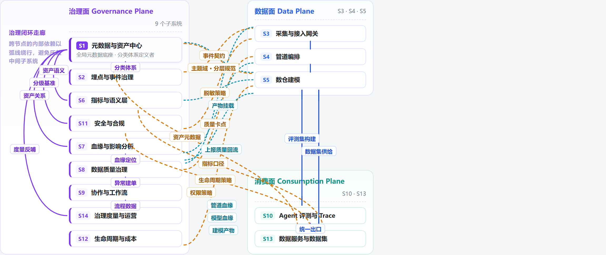
  <p>📄 请直接打开 <a href="./架构图-3.3-子系统依赖关系.html"><b>架构图-3.3-子系统依赖关系.html</b></a>　（同目录 · 单文件 · 零外部依赖）</p>
</object>

</div>

---

#### 依赖关系分组说明

| 依赖组 | 方向 | 依赖关系 | 语义 |
|---|---|---|---|
| **平面内 · 数据面** | 数据面→数据面 | S3 → S4 → S5 | 采集 → 管道加工 → 分层建模，构成数据生产主链路 |
| **平面内 · 治理面** | 治理面→治理面 | S1 → S2 / S6 / S7 / S11 | S1 作为元数据底座，向各治理子系统供给事实源 |
| | 治理面→治理面 | S7 → S8 → S9 → S14 → S1 | 血缘支撑质量定位 → 异常生成工单 → 流程数据进入治理度量 → 度量结果反哺元数据，形成治理自闭环 |
| **跨平面 + 平面内 · 消费面** | 数据面→消费面→消费面 | S5 → S10 → S13 | 评测平台基于数仓产出构建评测集，再经服务与数据集平台统一出口对外交付 |
| **跨平面 · 管控下发** | 治理面→数据面 | S2 → S3 | 埋点事件契约下发至网关，作为上报数据的校验依据 |
| | 治理面→数据面 | S11 → S3 | 脱敏策略前置到网关，确保敏感字段明文不落 ODS |
| | 治理面→数据面 | S8 → S4 | 质量规则作为管道卡点，稽核失败阻断下游 |
| | 治理面→数据面 | S1 / S12 → S5 | 主题域与分层规范、生命周期策略约束建模行为 |
| **跨平面 · 元数据回流** | 数据面→治理面 | S3 → S8 | 上报质量数据（校验失败率、未知事件）回流至质量中心 |
| | 数据面→治理面 | S4 / S5 → S7 | 管道血缘与模型血缘自动采集至血缘系统 |
| | 数据面→治理面 | S5 → S1 | 建模产物回写资产元数据，并挂载所属主题域与数据分层 |
| | 数据面→治理面 | S5 → S6 | 建模产物作为指标定义的数据源 |
| **跨平面 · 服务赋能** | 治理面→消费面 | S6 / S11 / S1 → S13 | 指标口径、权限策略、资产元数据共同决定对外服务的内容与边界 |

**关键依赖说明：**
- **S1 元数据与资产中心是全局最强依赖**：S2/S5/S6/S7/S11/S13 均以其为事实源，且 S1 额外持有全域资产分类体系（主题域、数据分层）的定义权，所有子系统在注册资产时都必须从 S1 获取分类标准。S1 不可用将导致所有治理能力降级，故其可用性要求最高（NFR-05）。
- **S1 与 S5 之间是"定义权 ↔ 执行权"的分工，而非重复建设**：S1 定义"有哪些主题域、有哪些层、各层的职责与约束是什么"，S5 在建模环节消费这套分类体系并将具体模型挂载上去，同时把违规情况回写给 S1 用于合规扫描。这条 S1↔S5 的双向依赖正是"跨平面依赖必须双向成对"原则的落地点。
- **S7 血缘是治理闭环的枢纽**：S8 异常定位、S6 口径变更影响、S12 下线决策、S11 删除权执行均依赖 S7。
- **S6 与 S13 是指标出口的双层设计**：S6（治理面）负责"定义与计算逻辑"，S13（消费面）负责"服务化与限流鉴权"，避免指标平台直接暴露给业务方。
- **跨平面依赖必须双向成对**：任何"治理面 → 数据面"的管控下发，都应配套一条"数据面 → 治理面"的回流路径（如 S8→S4 的质量卡点对应 S3→S8 的质量数据回流）。单向管控会导致治理规则与实际数据状态脱节，最终演变为"治理空转"。
- **消费面不得绕过治理面直接对外供数**：消费面所有对外交付必须经过治理面赋能（S6 提供口径、S11 提供权限、S1 提供资产元数据）后方可生效。S10 作为场景化数据应用可直接从 S5 取数，但其产出仍需回流至 S13 统一出口，避免出现无口径、无鉴权、无审计的"影子取数"通道。

---

## 4. 子系统分析与设计

### S1 元数据与资产中心

**定位：**全域数据资产的"户籍管理系统"与**分类体系的定义者**。它是 ADGS 的元模型（Meta-Model）底座，所有其他子系统的资产定义都在此注册，并由此派生出校验规则、血缘关系、权限策略与资产目录；同时统一定义并管理**主题域**与**数据分层**两套全域分类体系，为所有类型的资产提供一致的组织框架。

> **架构决策：为何主题域与分层的定义权归属 S1 而非 S5**
>
> 主题域与分层本质上是**描述数据的数据**——它们回答"这份资产属于哪个业务范畴、处于加工链路的哪个位置"，而非"这张表有哪些字段、怎么建"。因此其定义权应归属元数据底座，具体理由有三：
> 1. **适用范围不止数仓表**：事件、指标、数据集、质量规则、API 服务同样需要挂主题域与分层标签。若定义权留在建模工具（S5），则 S2 事件治理、S6 指标平台、S13 数据集平台要使用同一套分类体系时，必须反向依赖一个数据面的建模子系统，破坏"治理面是唯一事实源"的架构原则。
> 2. **变更频率与影响面不匹配建模工具**：主题域与分层是**稳定的企业级标准**（半年甚至年度级变更，且变更影响全域资产），而模型设计是高频日常操作（天级）。把低频高影响的分类标准与高频低影响的建模动作放在一起管理，会导致标准的变更被日常操作淹没。
> 3. **分类标准需要跨资产类型的全局校验**：如"同一主题域下资产命名前缀必须一致""ADS 层资产不得被下游依赖"这类约束，需要跨越表、事件、指标、数据集统一执行，只有持有全域元数据的 S1 具备这个视野。
>
> 由此形成清晰的职责切分：**S1 拥有分类体系的定义权与合规扫描权，S5 拥有分类体系的消费权与建模规范执行权。**

**职责边界：**
- 负责：元模型定义、资产注册、**主题域体系管理**、**数据分层规范管理**、技术/业务/操作元数据采集、资产检索与目录、资产等级与责任人、版本与变更审计、分类体系合规扫描。
- 不负责：数据的实际存储与计算（属 S4/S5）、模型的物理设计与 DDL 生成（属 S5）、质量规则执行（属 S8）、指标计算（属 S6）。

**核心元模型（Meta-Model）分层：**

```
L0 元元模型层（Meta-Meta Model）
   └─ 定义"什么是实体、什么是关系、什么是属性"，支持自定义扩展

L1 元模型层（Meta Model）
   ├─ 实体类型：BusinessObject / Event / Property / Table / Field /
   │            Metric / Dimension / Dataset / Rule / Pipeline / Dashboard
   ├─ 分类实体：SubjectDomain（主题域）/ DataLayer（数据分层）
   │            ← 二者是跨域的公共分类维度，可挂载到任意资产类型
   └─ 关系类型：contains / derives_from / belongs_to / maps_to /
                depends_on / classified_by（分类挂载）

L2 元数据实例层（Metadata Instance）
   └─ 具体资产：event.session_start / table.dwd_conversation_turn_di ...
      └─ 每个实例均带 (subject_domain, data_layer) 二元组分类坐标
```

**全域资产分类体系：**

每份资产在注册时必须获得一个二元组分类坐标 `(主题域, 数据分层)`，二者正交组合构成资产的"地址"，是资产检索、权限、生命周期策略、成本归因的共同基础。

| 资产类型 | 主题域取值示例 | 数据分层取值示例 | 说明 |
|---|---|---|---|
| 数仓表 | conv | DWD | `dwd_conv_turn_di` 属会话交互域 DWD 层 |
| 埋点事件 | conv | ODS | 事件原始上报归入贴源层 |
| 原子指标 | conv | — | 指标按主题域分类，分层由其来源表决定 |
| 分析数据集 | quality | ADS | 评测数据集属质量与评测域应用层 |
| 质量规则 | meta | — | 规则按所辖资产的主题域继承 |
| 数据服务 API | growth | ADS | 服务按业务域与来源层打标 |

**主题域体系（Subject Domain）：**

| 主题域 | 域码 | 核心业务过程 | 核心实体 | 典型事实 | 域 Owner |
|---|---|---|---|---|---|
| 用户与组织域 | user | 注册、登录、激活、分层、订阅 | User、Tenant、Device、Account | 新增用户数、活跃用户数、留存率 | 用户增长组 |
| 会话交互域 | conv | 会话创建、消息发送、轮次完成、会话结束 | Session、Conversation、Turn、Message | 会话数、轮次数、会话时长、多轮深度 | Agent 产品组 |
| 智能体域 | agent | 创建、配置、发布、调用、评价 | Agent、AgentVersion、Skill、Plugin | Agent 使用次数、任务完成率 | Agent 平台组 |
| 工具与模型调用域 | invoke | 工具调用、模型推理、检索召回 | ToolCall、ModelCall、Retrieval | 调用成功率、平均延迟、Token 成本 | Agent 平台组 |
| 内容与知识域 | content | 文档上传、知识入库、内容生成、引用 | Document、KnowledgeBase、Citation | 引用率、知识覆盖率 | 知识工程组 |
| 质量与评测域 | quality | 自动评测、人工标注、反馈、Badcase | EvalTask、EvalCase、Feedback | 好评率、Badcase 率、评测得分 | 算法评测组 |
| 增长与商业化域 | growth | 曝光、转化、付费、续费、流失 | Campaign、Order、Subscription | ARPU、付费转化率、流失率 | 商业化组 |
| 系统与稳定性域 | ops | 请求、错误、崩溃、性能 | APILog、ErrorLog、PerformanceMetric | 成功率、P95 延迟、崩溃率 | SRE 组 |
| 数据资产域 | meta | 资产访问、任务运行、质量稽核 | Asset、Task、QualityResult | 资产健康分、任务 SLA 达成率 | 数据治理组 |

**数据分层规范（Data Layer）：**

| 层 | 名称 | 定位 | 建模方法 | 使用约束 | 默认保留期 |
|---|---|---|---|---|---|
| ODS | 贴源层 | 原始数据保真，与源系统 1:1 | 不做清洗，仅加分区与采集元字段 | 禁止直接对外查询（除排障） | 30 天 |
| DWD | 明细层 | 标准化、清洗、脱敏、ID 打通后的最细粒度事实 | 维度建模，星型模型 | 推荐的分析起点 | 180 天 |
| DWM | 中间层 | 轻度汇总，如会话粒度聚合、用户日粒度聚合 | 跨事实的桥接与聚合 | 复用性要求高，需评审 | 365 天 |
| DWS | 汇总层 | 面向主题域的宽表，多维度预聚合 | 宽表建模，维度退化 | 面向具体业务场景，场景化复用 | 730 天 |
| ADS | 应用层 | 面向具体应用/看板/数据集的结果表 | 结果导向，允许冗余 | 不可被下游再依赖 | 180 天 |
| DIM | 公共维度层 | 一致性维度，全域共享 | 缓慢变化维 SCD | 强管控，变更需评审 | 永久 |

**跨层依赖规则（由 S1 定义、S5 执行校验）：**

| 规则 ID | 规则 | 违规处置 |
|---|---|---|
| LR-1 | 数据只能从低层流向高层（ODS → DWD → DWM → DWS → ADS），禁止跨层直读（如 ADS 直接读 ODS） | 建模阶段阻断，已存在资产告警 |
| LR-2 | ADS 层资产不可被任何下游任务依赖，仅作为消费终点 | 建模阶段阻断 |
| LR-3 | ODS 层禁止对外提供查询权限，仅排障场景可临时授权 | 权限申请拦截 |
| LR-4 | DIM 层资产可被任意层关联，但不得被修改（只读共享） | 变更申请阻断 |
| LR-5 | 同层之间禁止互相依赖（如 DWS_A 依赖 DWS_B），须下沉至 DWM | 建模阶段告警，纳入健康分扣减 |

**核心能力：**

| 能力 | 说明 |
|---|---|
| 元模型管理 | 定义实体类型、属性模板、关系类型，支持无代码扩展新资产类型 |
| **主题域体系管理** | 域的注册、域码分配、层级结构、域 Owner 指派、核心实体与业务过程声明；支持域的新增、合并、拆分、废弃全流程评审 |
| **数据分层规范管理** | 分层定义、层级职责、建模方法约定、使用约束、跨层依赖规则、默认生命周期与安全等级模板 |
| **分类坐标挂载** | 任意资产注册时必须指定 `(主题域, 数据分层)`；支持批量挂载、按命名规则自动推断与人工确认 |
| **分类体系合规扫描** | 自动检测：资产主题域缺失、跨层依赖违规（LR-1~LR-5）、分层与命名前缀不一致、主题域归属与血缘冲突 |
| 技术元数据采集 | 通过 Hook/Catalog API/定时爬取，自动同步表结构、分区、存储量、行数、更新时间 |
| 业务元数据维护 | 业务口径、使用场景、资产等级（S/A/B/C）、数据 Owner、SLA 等级 |
| 操作元数据采集 | 资产访问热度、查询次数、下游引用数、变更频率 |
| 资产目录与检索 | 全文检索 + 标签过滤 + **按主题域/分层导航** + 热度/评分排序，支持"按业务语义找表" |
| 资产关系图谱 | 资产之间的依赖、派生、映射关系可视化 |
| 版本与审计 | 任何元数据变更（含分类体系变更）生成版本快照，支持 diff 与回滚 |
| 资产健康分 | 综合质量、时效、热度、文档完整度、分类合规性计算资产健康度 |

**关键设计要点：**
1. **元数据采集必须"双向"**：自动采集保证及时性与覆盖率，人工补录保证业务语义完整性；二者冲突时以人工审核后的业务元数据为准，但保留自动采集值用于"元数据漂移检测"（表结构变了但文档没更新 → 告警）。
2. **资产等级驱动治理强度**：S 级资产（核心营收/核心指标）必须 100% 有血缘、有质量规则、有 Owner、有分类坐标、变更强卡点；C 级资产仅做基础登记。避免"一刀切"治理造成的效率损耗。
3. **主题域划分遵循"业务过程归属唯一"原则**：一份资产只能归属一个主题域。跨域分析通过关联而非重复归属解决——若某张表确实横跨两个域（如"带成本信息的会话表"），按**业务过程的主导方**归属（此例归 conv 域），成本字段通过维度外键关联 invoke 域。
4. **主题域是稳定的，分层是可扩展的**：主题域对应业务本质，应长期稳定（变更需评审并评估影响面）；分层对应技术架构，允许随引擎演进而新增层级（如未来引入 "DWR 实时层"），新增层级需同步更新跨层依赖规则。
5. **分类坐标是多项治理能力的共同输入**：权限策略（按主题域授权）、生命周期策略（按分层设默认保留期）、成本归因（按主题域归集到业务团队）、检索导航（按域+层浏览）均依赖这一二元组，因此其完备率应作为治理核心度量（目标 ≥ 98%）。
6. **元数据存储选型**：采用图存储（承载关系与血缘）+ 搜索引擎（承载检索与分类导航）+ 关系库（承载结构化元数据与分类体系）的组合，通过变更事件（Meta Change Event）保持三者一致。

---

### S2 埋点与事件治理平台

**定位：**埋点的"需求—设计—评审—开发—验收"全生命周期管控台。它是质量左移的核心载体，把 60% 的数据质量问题消灭在需求阶段。

**核心对象：**Event（事件）、Property（属性）、EventSchema（事件契约）、TrackingPlan（埋点方案）、TrackingRequirement（埋点需求）、PropertyGroup（公共属性组）、SchemaVersion（版本）。

**事件分类模型：**

| 事件类型 | 说明 | 示例 | 采集方式 |
|---|---|---|---|
| 通用事件 | 所有页面/场景自动采集 | `app_launch`、`app_exit`、`page_view` | SDK 自动 |
| 交互事件 | 用户主动操作 | `agent_card_click`、`tool_call_submit` | 手动埋点 |
| 业务过程事件 | 关键业务节点 | `conversation_start`、`turn_complete`、`task_finish` | 手动 + 服务端 |
| 系统/技术事件 | 性能与异常 | `api_error`、`model_latency`、`crash` | SDK/服务端自动 |
| Agent 语义事件 | Agent 特有行为 | `intent_recognized`、`tool_invoked`、`answer_cited` | Agent 运行时上报 |

**埋点方案（Tracking Plan）结构：**

```
TrackingPlan
 ├─ 基本信息：需求来源、关联需求ID、产品模块、负责人、目标上线版本
 ├─ 业务目标：要回答什么问题、需要哪些指标
 ├─ 事件清单
 │   ├─ Event: conversation_start
 │   │   ├─ 触发时机：用户发送首条消息并成功创建会话
 │   │   ├─ 上报端：客户端 / 服务端（去重策略：服务端为准）
 │   │   ├─ 公共属性（自动注入）：user_id, device_id, app_version, os, ...
 │   │   └─ 自定义属性
 │   │       ├─ conversation_id  STRING  必填  会话唯一标识
 │   │       ├─ agent_id         STRING  必填  智能体标识
 │   │       ├─ entry_source     ENUM    必填  入口来源 [home|search|share|deeplink]
 │   │       └─ is_first_time    BOOL    选填  是否首次对话
 │   └─ Event: ...
 └─ 验收标准：字段非空率 ≥ 99%、上报时序正确、与服务端日志对账一致率 ≥ 99.5%
```

**核心能力：**

| 能力 | 说明 |
|---|---|
| 事件字典 | 事件的集中式注册与管理，含状态（设计中/评审中/已上线/已废弃） |
| 规范自动校验 | 命名式校验（小写下划线 + 对象_动作）、类型校验、枚举收敛检查、必填校验、相似事件查重 |
| 埋点方案设计器 | 可视化编排事件与属性，自动继承公共属性组，生成 SDK 代码模板 |
| 评审工作流 | 需求 → 设计 → 数据团队评审 → 开发确认 → 提测 → 验收，全过程线上留痕 |
| Schema 版本管理 | 语义化版本号，自动兼容性检查（新增选填=兼容；删字段/改类型=破坏性） |
| 埋点验收 | 与 S8 联动，提供实时上报流预览、样本比对、覆盖率与完整率自动校验 |
| 埋点资产化 | 已上线事件自动生成元数据进入 S1，并自动生成 DDL 建议进入 S5 |

**关键流程（埋点全生命周期）：**见 [7.1 节](#71-埋点全生命周期流程)。

**关键设计要点：**
1. **"相似事件查重"是治理杠杆**：在注册阶段用语义相似度 + 属性集合重合度，提示"已有 3 个相似事件，请复用或说明差异"，从源头抑制事件膨胀。
2. **公共属性组（Property Group）机制**：将 user/device/app/agent 等高频属性定义为公共组，由 SDK 统一注入，避免各事件重复定义造成的不一致。
3. **双端上报去重是 Agent 场景的硬需求**：客户端事件（快但不全）与服务端事件（准但延迟）并存，需在 DWD 层定义明确的**主体事件优先规则**（如 `turn_complete` 以服务端为准，客户端仅用于补齐端侧属性）。

---

### S3 多端采集与接入网关

**定位：**数据进入系统的唯一入口，承担协议统一、Schema 校验、脏数据隔离与流量保护。

**职责边界：**负责"把数据收上来且收对"，不负责业务加工。

**统一上报协议（事件包结构）：**

```json
{
  "protocol_version": "2.0",
  "app_id": "workbuddy_desktop",
  "sdk": { "name": "wb-tracker", "version": "1.8.3", "platform": "macos" },
  "device": { "device_id": "d_xxx", "os": "macOS 15.1", "resolution": "2560x1440" },
  "user":  { "user_id": "u_xxx", "anonymous_id": "a_xxx", "tenant_id": "t_xxx" },
  "session": { "session_id": "s_xxx", "seq": 42 },
  "events": [
    {
      "event_name": "turn_complete",
      "event_id": "evt_uuid",
      "client_ts": 1757000000123,
      "schema_version": "1.2",
      "properties": {
        "conversation_id": "c_xxx",
        "turn_seq": 3,
        "model_id": "gpt-x",
        "input_tokens": 512,
        "output_tokens": 340,
        "latency_ms": 2380,
        "tool_call_count": 2
      }
    }
  ]
}
```

**核心能力：**

| 能力 | 说明 |
|---|---|
| 多端 SDK | 桌面（Mac/Windows）、移动（iOS/Android）、Web、服务端（Go/Java/Python）统一 API 语义 |
| 上报可靠性 | 本地持久化队列、批量压缩上报、指数退避重试、App 冷启动补发 |
| 网关校验 | Schema 校验（对照 S2 契约）、必填校验、类型校验、枚举校验、大小与频率限制 |
| 脏数据隔离 | 校验失败数据进入**死信队列（DLQ）**，不阻塞正常流，同时触发 S8 质量告警 |
| 流量治理 | 按 app_id / event_name 分级限流、熔断、降级，防止异常上报打垮管道 |
| ID 打通 | 匿名 ID 与登录 ID 的绑定映射（ID-Mapping），保障跨端用户识别 |
| 敏感字段前置处理 | 在网关层根据 S11 的分级策略对敏感字段即时脱敏，确保明文不落 ODS |
| 采样策略 | 支持按事件/用户/流量分级采样，高价值事件全量、调试事件采样 |

**关键设计要点：**
1. **网关必须"宽进严出"**：数据面绝不因校验失败丢数据（进 DLQ 可回溯），管控面通过告警驱动修复。宁可多存脏数据，不可丢原始数据——这是可回溯治理的前提。
2. **时钟校正**：客户端时间不可信。网关需记录 `server_ts` 并与 `client_ts` 一并存储，DWD 层统一用服务端时间做分区与时序计算，客户端时间仅用于计算端侧耗时。
3. **ID-Mapping 的服务化**：用户身份打通是跨端分析的基石，应独立为服务而非散落在各管道中，并支持"同一设备多用户 / 同一用户多设备"的图关系维护。

---

### S4 数据管道编排平台

**定位：**数据加工的执行中枢，负责离线批处理与实时流处理的调度、依赖管理、回溯重跑与运行可观测。

**职责边界：**负责任务的"何时跑、跑什么、失败了怎么办"，不负责业务逻辑本身。

**核心能力：**

| 能力 | 说明 |
|---|---|
| 离线调度 | DAG 依赖编排、定时调度（分钟/小时/天/周）、跨周期依赖、基线保障与优先级抢占 |
| 实时作业管理 | Flink 作业生命周期管理、Checkpoint、状态监控、扩缩容 |
| 流批一体 | 同一套口径定义生成流与批两套执行计划，并支持**流批对账**（差异率 > 阈值告警） |
| 回溯重跑 | 支持按时间范围、按分区、按上游触发的回溯，自动推导下游依赖并重跑 |
| 质量卡点 | 任务产出后自动触发 S8 质量规则，失败则阻断下游（强卡点，仅 S/A 级资产启用） |
| 资源与成本 | 任务资源画像、成本归因到团队/资产，与 S12 联动 |
| 运行可观测 | 任务运行时长趋势、数据倾斜检测、产出行数波动检测、基线破线告警 |

**分层加工规范：**

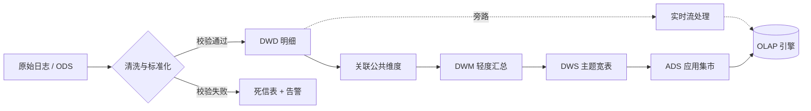

**关键设计要点：**
1. **回溯能力是治理可信度的基石**：任何数据问题修复后必须能低成本回溯。因此所有任务必须是**幂等**的（按分区覆盖写），且元数据中明确记录输入输出分区依赖关系。
2. **流批对账机制**：实时与离线两套链路服务于不同场景（实时看趋势、离线看精确值），但口径必须一致。系统需自动计算双链路核心指标差异率，差异超阈值即告警，防止"实时数与离线数打架"。
3. **基线（Baseline）管理**：为核心任务链定义产出时间基线，一旦预测破线提前告警，把"事后补救"变成"事前干预"。

---

### S5 数仓建模中心

**定位：**基于统一分类体系的数据模型设计与规范执行中心。它消费 S1 定义的主题域与数据分层标准，完成事实表/维度表的物理建模，并在建模环节强制执行命名规范、跨层依赖合规与公共维度一致性，确保数据"存得下、找得到、用得对"。

**职责边界：**
- 负责：事实表/维度表的建模设计与 DDL 生成、建模规范（命名、跨层依赖、维度一致性）的执行与校验、公共维度的设计与一致性复用、建模时绑定生命周期与安全分级。
- 不负责：**主题域与数据分层的定义**（属 S1，本中心仅消费与挂载）、数据的调度执行（属 S4）、质量规则执行（属 S8）。

**与 S1 的协作关系：**

| 环节 | S1 元数据与资产中心 | S5 数仓建模中心 |
|---|---|---|
| 分类体系 | **定义**主题域清单与分层规范，维护跨层依赖规则 | **消费**分类标准，在建表时选择并挂载 |
| 合规校验 | 全域扫描分类坐标缺失、命名与分类不一致 | 建模阶段前置校验，拦截违规模型提交 |
| 模型元数据 | 接收并存储建模产物元数据，纳入资产目录 | 生成模型元数据并回写至 S1 |
| 变更 | 分类体系变更（新增域/层）需评审并通知 S5 | 感知分类体系变更，评估存量模型影响并配合迁移 |

**公共维度（一致性维度）清单（示例）：**

| 维度 | 维度键 | 主要属性 | 管理要点 |
|---|---|---|---|
| 时间维 | dim_date | 日期、周、月、季度、年、是否工作日、节假日 | 预生成，全场景统一 |
| 用户维 | dim_user | 用户分层、注册渠道、会员等级、行业标签 | SCD Type 2，保留历史分层 |
| 设备与平台维 | dim_device | 平台、OS 版本、App 版本、机型、地域 | App 版本需支持版本组聚合 |
| 智能体维 | dim_agent | Agent 分类、能力标签、创建者、发布状态 | Agent 配置变更频繁，SCD Type 2 |
| 模型维 | dim_model | 模型厂商、版本、上下文长度、单价 | 成本计算的关键维 |
| 工具/技能维 | dim_tool | 工具类型、所属技能、是否内置 | 与 Agent 维多对多 |
| 租户维 | dim_tenant | 租户类型、规模、订阅套餐、地域 | 企业版场景强依赖 |

**核心能力：**

| 能力 | 说明 |
|---|---|
| 在线建模 | 可视化设计事实表/维度表，自动生成标准 DDL、调度任务与质量规则模板 |
| 分类坐标挂载 | 建模时从 S1 拉取主题域与分层清单进行选择挂载，支持按命名规则自动推断并二次确认 |
| 跨层依赖合规检查 | 建模阶段即执行 S1 定义的 LR-1~LR-5 规则，拦截跨层直读、ADS 被依赖等违规；存量违规由 S1 全域扫描发现后回流本中心整改 |
| 维度一致性管理 | 公共维度注册、版本管理、一致性维度跨表复用率统计 |
| 命名规范校验 | 库/表/字段命名自动检查（`{层}_{主题域}_{业务过程}_{粒度}_{周期}`），其中层与主题域 token 校验依据 S1 注册表，杜绝使用未注册的域码或层级 |
| 生命周期与安全绑定 | 建模时即绑定 TTL、冷热策略（联动 S12）与字段安全分级（联动 S11），默认继承所在分层的策略模板 |

**关键设计要点：**
1. **建模规范"可检查"而非"靠自觉"**：所有规范必须落地为自动化扫描规则（命名、跨层依赖、维度一致性、字段复用），并纳入资产健康分。本中心负责**建模阶段的前置拦截**（成本最低），S1 负责**全域存量扫描**（兜底发现），两者规则同源、集中维护在 S1，避免两处规则漂移。
2. **Agent 场景的粒度设计是关键决策**：Conversation（任务视角，可跨天）与 Session（使用视角，单次启动）是两个不同粒度的事实，必须分别建模并通过桥接表关联，避免"用会话口径回答对话问题"这类常见错误。
3. **公共维度必须强制复用**：DWD/DWS 建模时，若某维度已存在于 DIM 层，系统应强制关联而非重新定义；确需扩展属性时应走维度扩展流程。维度表本身虽由本中心设计，但其注册与版本信息需回写 S1，确保指标平台（S6）与数据集平台（S13）使用的是同一份维度定义。
4. **分类体系变更要能平滑传导**：当 S1 新增主题域或数据分层时，本中心需支持批量重挂与命名前缀批量修正，并提供"变更前影响评估"（多少存量模型需迁移、多久可完成），避免分类标准升级引发大规模手工整改。

---

### S6 指标与语义层平台

**定位：**指标口径的唯一仲裁者（Single Source of Truth for Metrics）。它把"定义在文档里、散落在 SQL 里、重复在各看板里"的指标，收敛为可注册、可版本化、可追溯、可服务化的一等公民。

**指标分层模型：**

```
                      ┌─────────────────┐
                      │   复合指标       │  Agent 健康度分 = 任务完成率×0.4 + 好评率×0.3
                      │  Composite      │                  + 成本效率×0.3
                      └────────┬────────┘
                               │ 由多个派生指标按公式计算
              ┌────────────────┴────────────────┐
              │          派生指标                │  近7日 iOS 端 人均会话数
              │   Derived  = 原子指标            │  = SUM(会话数) / COUNT(DISTINCT 用户)
              │            + 时间周期            │    时间=近7日, 平台=iOS
              │            + 修饰词 + 维度切片    │
              └────────────────┬────────────────┘
                               │ 基于
              ┌────────────────┴────────────────┐
              │          原子指标                │  会话数 = COUNT(conversation_id)
              │   Atomic = 业务过程 + 度量        │  业务过程=创建会话, 度量=次数
              └────────────────┬────────────────┘
                               │ 来源于
              ┌────────────────┴────────────────┐
              │      数据源（DWD/DWS 表字段）      │
              └─────────────────────────────────┘
```

**指标定义卡（Metric Definition Card）结构：**见 [附录 C](#附录-c-指标定义卡模板)。

**核心能力：**

| 能力 | 说明 |
|---|---|
| 指标注册与分类 | 按主题域/业务线/层级组织，支持指标树与标签 |
| 原子指标管理 | 绑定业务过程与数据源字段，定义聚合方式（SUM/COUNT/DISTINCT/AVG/MAX/MIN） |
| 派生指标生成 | 通过"原子指标 + 周期 + 修饰词 + 维度切片"的组合式配置生成，避免重复定义 |
| 复合指标建模 | 支持公式编辑器，引用其他指标并做加权/比值/指数运算 |
| 多引擎 SQL 生成 | 同一定自动生成离线（Spark/Iceberg）、实时（Flink）、OLAP（Doris/ClickHouse）三种方言 |
| 口径评审与发布 | 指标上线需评审；口径变更需评估影响并通知下游 |
| 统一查询 API | 对外暴露 `queryMetric(metricCode, dimensions, filters, timeRange, granularity)` |
| 指标血缘 | 指标 → 派生指标 → 原子指标 → 表 → 字段 的完整血缘链 |
| 指标市场 | 指标检索、热度、评价、使用场景说明，促进复用 |
| 异动检测 | 基于历史基线自动检测指标异常波动并辅助维度归因 |

**关键设计要点：**
1. **指标的"原子化 + 组合式生成"是抑制膨胀的核心**：业务方想要 100 个派生指标，系统只需 20 个原子指标 + 配置组合，而非 100 段独立 SQL。这既降低了维护成本，也从结构上保证了口径一致性。
2. **指标必须有且只有一个 Owner 与一个定义源**：系统需自动扫描"同一业务含义、不同计算 SQL"的指标对（通过语义相似度 + 结果数值比对），识别并推动合并。
3. **语义层与存储解耦**：指标定义只描述"业务语义 + 计算逻辑"，物理执行由引擎适配层决定。更换底层引擎（如从 ClickHouse 到 Doris）不影响指标定义与上层调用。
4. **Agent 特有指标的四象限覆盖**：指标体系设计需覆盖**效果**（任务完成率、好评率、引用准确率）、**效率**（首字延迟、端到端时长、轮次深度）、**成本**（Token 消耗、单次会话成本、工具调用成本）、**安全**（敏感内容拦截率、合规风险率）四个象限，单一维度无法评价 Agent 好坏。

---

### S7 血缘与影响分析系统

**定位：**数据链路的可追溯性基础设施。回答两个问题：**"这个数据从哪来"**（溯源）和**"改了它会影响谁"**（影响分析）。

**血缘类型与采集方式：**

| 血缘类型 | 说明 | 采集方式 | 精度 |
|---|---|---|---|
| 管道血缘 | 任务 A 读表 X 写表 Y | 管道元数据埋点（自动） | 表级，100% 覆盖 |
| SQL 解析血缘 | 从 SQL AST 解析输入输出 | 静态 SQL 解析（自动） | 表级 + 字段级 |
| 指标血缘 | 指标 → 表 → 字段 | 指标定义结构化解析（自动） | 字段级 |
| 事件血缘 | 埋点事件 → ODS → DWD → 指标 | 元数据关联（自动） | 字段级 |
| 运行时血缘 | 实际执行时的数据流转 | 引擎 Hook / Spark Listener | 表级，校验用 |
| 人工补录血缘 | 无法通过解析获得的关系 | 人工登记 | 表级 |

**核心能力：**

| 能力 | 说明 |
|---|---|
| 血缘图谱 | 有向无环图存储，支持上下游 N 层展开、路径查询、环路检测 |
| 字段级血缘 | 精确到字段的派生关系，支持"这个指标字段来自哪个源字段" |
| 影响分析 | 输入一个资产 → 输出所有下游资产、指标、看板、数据集，并按资产等级排序 |
| 根因追溯 | 指标异常 → 逐层上溯 → 定位到具体任务/表/分区/数据源 |
| 变更影响评估 | 建模变更（改字段类型、删字段）前自动评估影响面，作为评审依据 |
| 血缘快照 | 定期快照，支持"上周这条链路长什么样" |
| 血缘完备度 | 统计有血缘资产占比，作为治理度量指标 |

**关键流程（异常根因追溯）：**

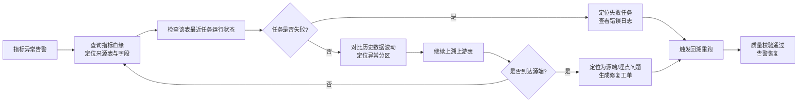

**关键设计要点：**
1. **血缘完备度比血缘精度更重要**：优先保证 100% 的资产都有表级血缘（通过管道元数据强制采集），再逐步提升字段级血缘覆盖率。无血缘的资产应被标记为"不可信"并在资产目录中降级展示。
2. **血缘必须能驱动动作**：血缘的价值不在于"画出来好看"，而在于**变更前的阻断**（改 S 级资产字段强制走评审）与**故障后的定位**（自动缩小排查范围）。因此血缘必须与 S8、S9、S5 深度集成，而非独立工具。
3. **SQL 解析是主要难点**：需覆盖多引擎方言、CTE、临时表、UDF、动态分区等复杂语法，建议采用"通用解析器 + 方言适配 + 人工修正兜底"的组合策略，并对解析失败的 SQL 建立降级处理（标记为表级血缘待人工确认）。

---

### S8 数据质量治理中心

**定位：**数据可信度的守护者。建立"定义—检测—告警—定位—修复—回溯—复盘"的完整质量闭环。

**质量维度与规则体系：**

| 质量维度 | 定义 | 典型规则 | 适用对象 |
|---|---|---|---|
| 完整性 | 数据不缺失 | 必填字段非空率 ≥ 99%；分区数据行数波动 ±30% 告警；事件上报覆盖率 ≥ 98% | 全量资产 |
| 准确性 | 数据反映真实 | 枚举值合法率 = 100%；数值在合理值域内；与源端对账一致率 ≥ 99.5% | 核心资产 |
| 一致性 | 口径与逻辑统一 | 主外键关联成功率 ≥ 99.9%；跨端（客户端 vs 服务端）同一事件计数差异率 ≤ 0.5%；流批对账差异率 ≤ 1% | 核心资产 |
| 及时性 | 数据按时产出 | 任务产出时间满足 SLA；实时链路延迟 P95 ≤ 30s | 全量资产 |
| 唯一性 | 无重复 | 主键重复率 = 0；事件 event_id 去重率 ≤ 0.01% | 全量资产 |
| 有效性 | 符合 Schema 约定 | Schema 校验通过率 ≥ 99.9%；未知事件（未注册）占比 = 0 | 采集入口 |
| 埋点质量专项 | 埋点可信 | 埋点需求覆盖率；埋点丢失率；上报时序正确率；属性填充率 | 埋点事件 |

**质量规则模型：**

```
DQRule
 ├─ 基本信息：规则编码、名称、质量维度、严重等级（Block/Warn/Info）
 ├─ 绑定对象：资产（表/字段/事件）+ 分区范围 + 执行频率
 ├─ 规则定义
 │   ├─ 模板型：非空率、唯一性、值域、枚举、行数波动、产出延迟
 │   ├─ SQL 型：自定义 SQL 返回布尔或数值，与阈值比较
 │   └─ 对比型：跨表对账、跨端对账、流批对账、同比环比波动
 ├─ 阈值与告警：阈值、连续 N 次触发、告警渠道、告警接收人
 └─ 处置策略：阻断下游 / 仅告警 / 自动回溯
```

**核心能力：**

| 能力 | 说明 |
|---|---|
| 规则市场 | 内置规则模板库，支持自定义 SQL 规则，规则可复用与共享 |
| 定时稽核 | 与 S4 调度集成，任务产出后自动触发稽核；支持独立定时稽核 |
| 质量看板 | 资产质量分趋势、维度雷达图、失败规则 TOP、团队质量排名 |
| 异常闭环 | 告警 → 自动创建工单（S9）→ 分派 → 处理 → 验证 → 关闭，全程留痕 |
| 影响面分析 | 异常资产的下游影响面（调用 S7），用于确定告警等级与通知范围 |
| 数据回溯 | 修复后发起 Backfill，自动推导下游重跑并校验结果 |
| 埋点质量专项 | 埋点覆盖率、丢失率、重复率、属性填充率的端到端监控 |
| 资产质量分 | 综合各维度稽核结果计算 0-100 质量分，进入 S1 资产健康分 |

**质量闭环流程：**见 [7.2 节](#72-数据质量异常闭环流程)。

**关键设计要点：**
1. **质量规则的"严重等级"决定处置方式，避免告警疲劳**：Block 级（核心资产、影响核心指标）才阻断下游并电话告警；Warn 级仅通知 Owner；Info 级仅记录。告警必须有明确的 Owner 与处理入口，否则等于没有告警。
2. **质量左移：把校验前置到接入网关与埋点设计阶段**。网关做 Schema 与有效性校验（成本最低），埋点设计阶段做规范与完整性校验（修复成本次低），数仓层做业务准确性校验（修复成本最高）。70% 的规则应在前两阶段生效。
3. **回溯是质量治理的"最后一公里"**：没有回溯能力的质量治理只能保证"未来正确"，无法修复"历史错误"。因此 S8 必须与 S4 的回溯能力强集成，且回溯任务本身的执行结果也要纳入质量校验。
4. **质量分要能驱动行为**：资产质量分应进入资产目录排序、进入团队治理排名、进入资产上线卡点，让"质量好"成为可见的、有回报的事情。

---

### S9 数据协作与工作流引擎

**定位：**跨角色数据交付流程的线上化载体，把"需求提报—埋点设计—开发—验收—发布"的口头流程固化为可追踪、可度量、可优化的系统流程。

**核心流程定义：**

| 流程 | 参与角色 | 关键节点 | SLA |
|---|---|---|---|
| 数据需求流程 | 产品 → 数据 → 开发 → 数据 | 需求提报 → 可行性评估 → 埋点设计 → 评审 → 开发 → 验收 | 需求响应 ≤ 1 工作日 |
| 埋点变更流程 | 开发 → 数据 → 产品 | 变更申请 → 兼容性检查 → 影响评估 → 审批 → 灰度发布 | 评审 ≤ 2 工作日 |
| 指标口径变更流程 | 数据 → 产品 → 业务 | 变更申请 → 影响评估 → 评审 → 通知下游 → 生效 | 评审 ≤ 2 工作日 |
| 数据资产申请流程 | 使用方 → 资产 Owner → 安全 | 申请 → 用途说明 → Owner 审批 → 安全审批 → 授权 | 审批 ≤ 1 工作日 |
| 质量异常处理流程 | 系统 → 资产 Owner → 数据工程 | 告警 → 建单 → 定位 → 修复 → 回溯 → 验证 → 复盘 | 响应 ≤ 30 分钟（Block） |
| 资产下线流程 | 数据 → 下游使用方 → 治理 | 下线申请 → 影响通知 → 无异议 → 归档 → 下线 | 公示 ≥ 5 工作日 |

**核心能力：**

| 能力 | 说明 |
|---|---|
| 流程编排 | 可视化流程定义，支持条件分支、并行审批、超时自动升级 |
| 表单与模板 | 各流程的标准化表单（如埋点需求模板），减少沟通成本 |
| 卡点集成 | 流程节点可调用 S2（规范校验）、S7（影响分析）、S8（质量校验）作为自动卡点 |
| 通知与提醒 | 集成 IM / 邮件，支持待办汇总与超时催办 |
| SLA 度量 | 各流程各节点的平均耗时、超时率、瓶颈分析 |
| 知识沉淀 | 流程产生的评审意见、口径说明自动沉淀为元数据 |

**关键设计要点：**
1. **流程的价值在于"自动卡点"而非"人工审批"**：能自动校验的（命名规范、兼容性、影响面、质量结果）全部自动化，人工审批只处理需要业务判断的部分。否则流程会退化为形式主义。
2. **流程数据反哺治理度量**：流程耗时、退回次数、超时率是衡量协作效率的关键指标，应直接进入 S14 治理度量，用于识别协作瓶颈。

---

### S10 Agent 评测与 Trace 数据平台

**定位：**Agent 产品特有的数据能力子系统，打通"线上行为数据 → 评测数据集 → 效果评估 → 模型优化"的闭环。这是 ADGS 区别于通用数据治理平台的核心差异化模块。

**为什么必须独立成子系统：**
Agent 产品的核心评价对象是"效果"而非"行为"，效果评估需要**非结构化对话内容 + 结构化调用链 + 人工/自动标注**三者结合，其数据形态、处理链路与消费方式都与常规行为数据显著不同，混在通用数仓中会导致两难：结构化指标算不好，语料治理也做不透。

**核心对象：**Trace、Span、Conversation、Turn、ToolCall、ModelCall、Retrieval、EvalTask、EvalCase、EvalScore、Badcase、Annotation。

**Trace 数据模型（Agent 运行时调用链）：**

```
Trace (trace_id, conversation_id, turn_id, user_id, agent_id, start_ts, end_ts, status)
 ├─ Span: intent_recognition   意图识别   (intent, confidence)
 ├─ Span: plan_generation      任务规划   (plan_steps, strategy)
 ├─ Span: retrieval            知识检索   (kb_id, query, hit_count, top_score)
 ├─ Span: tool_call            工具调用   (tool_id, params, result_status, latency_ms)
 │    └─ 可嵌套子 Span（工具内部多步调用）
 ├─ Span: model_call           模型推理   (model_id, input_tokens, output_tokens, latency_ms, cost)
 └─ Span: response_generation  应答生成   (answer_length, cited_sources, safety_check)
```

**核心能力：**

| 能力 | 说明 |
|---|---|
| Trace 采集与存储 | 支持 OTLP 协议接入，Trace 明细与聚合双写（明细入对象存储/检索，聚合入数仓） |
| 调用链检索 | 按 trace_id / conversation_id / user_id / 工具 / 模型 检索完整调用链 |
| 成本与性能分析 | Token 消耗、单次会话成本、各阶段耗时占比、模型成本归因 |
| 评测集构建 | 规则筛选（如"工具调用失败 + 用户负反馈"）+ 采样 + 人工标注 → 生成版本化评测集 |
| 自动评测 | 支持规则评测、模型评测（LLM-as-Judge）、人工评测三种模式与结果融合 |
| Badcase 归集 | 负反馈、任务失败、异常中断自动归集，语义聚类定位共性问题 |
| 离线-线上关联 | 评测得分与线上指标（任务完成率、留存）关联分析，验证评测体系有效性 |
| 语料导出 | 按质量分、去重、脱敏后导出训练/微调语料，支持数据血缘追溯到原始会话 |

**关键流程（评测数据闭环）：**见 [7.4 节](#74-agent-评测数据闭环流程)。

**关键设计要点：**
1. **评测数据集必须版本化与可复现**：评测集 = 数据筛选规则 + 采样种子 + 标注结果 + 数据快照。任何一次评测结果都应能追溯到"用了哪个版本的评测集、哪些数据、什么标注标准"，否则不同轮次的评测分数无法对比。
2. **Trace 数据量级远大于行为事件**（一次会话可能产生上百个 Span），需在设计上分层：Trace 明细走低成本存储 + 按需检索，聚合指标（工具成功率、平均延迟、Token 消耗）进入数仓参与常规分析。
3. **评测体系需要"校准"**：自动评测（LLM-as-Judge）与人工评测需定期对齐一致性，避免"评测分数涨了但用户体验没变"的失效情况。系统应提供评测一致性监控能力。
4. **语料治理与合规强绑定**：对话内容用于训练需特别关注 PII 与授权，必须在导出前完成脱敏，并记录语料的来源与使用授权范围（与 S11 联动）。

---

### S11 数据安全与合规治理

**定位：**数据可用性与安全性的平衡器，将分级分类、脱敏、权限、审计、删除权内建为数据生产链路的固有能力，而非事后补救。

**数据分级分类：**

| 等级 | 定义 | 示例 | 管控策略 |
|---|---|---|---|
| L1 公开 | 可对外公开 | Agent 名称、公开模板 | 无限制 |
| L2 内部 | 内部可用 | 聚合指标、匿名行为数据 | 登录可访问 |
| L3 敏感 | 需授权访问 | 用户 ID、设备信息、地域 | 申请审批 + 脱敏 |
| L4 机密 | 严格管控 | 对话原文、文件内容、代码、密钥 | 强审批 + 强制脱敏 + 审计 + 限时 |

**核心能力：**

| 能力 | 说明 |
|---|---|
| 分级分类 | 支持字段级打标；支持基于规则（正则、字典、NLP 识别）自动识别敏感字段；标签随血缘向下游传播 |
| 脱敏策略 | 哈希（保持关联性）、掩码（保留格式）、截断、泛化、加密、替换；按等级与场景自动选择 |
| 访问控制 | RBAC + ABAC，支持行级（租户隔离）、列级（敏感字段）、单元格级（极高敏）权限 |
| 申请审批 | 资产/权限申请线上化（走 S9 流程），支持用途声明与有效期 |
| 审计日志 | 全量数据访问留痕：谁、何时、访问什么、从哪来；支持异常访问检测 |
| 删除权（Right to be Forgotten） | 用户删除请求 → 定位全链路数据（依赖 S7 血缘）→ 级联删除或匿名化 → 出具删除证明 |
| 合规报表 | 数据留存状态、跨境情况、访问审计的可导出报表 |

**关键设计要点：**
1. **脱敏必须前置到接入网关**：一旦明文落入 ODS，后续所有副本都需回溯处理，成本极高。应在 S3 网关层根据 S11 策略即时脱敏，确保"明文不落 ODS"。
2. **敏感标签需随血缘传播**：字段被打标为 L4 后，其所有下游派生字段自动继承（或更高）等级，避免"上游脱敏了、下游又通过关联还原"的泄漏路径。这需要 S7 字段级血缘的支撑。
3. **删除权的落地依赖血缘完整度**：无法定位数据在哪里，就无法真正执行删除。这是血缘完备度的合规刚需，也是 S7 存在的重要理由之一。

---

### S12 数据生命周期与成本治理

**定位：**数据资产的"新陈代谢"管理，在保证可回溯的前提下控制存储与计算成本，并推动无用资产有序下线。

**生命周期阶段与策略：**

| 阶段 | 存储形态 | 访问性能 | 保留策略 | 典型保留期 |
|---|---|---|---|---|
| 热（Hot） | 高性能 OLAP / SSD | 毫秒-秒级 | 在线可查 | 近 7-30 天明细 |
| 温（Warm） | 标准对象存储 + 列式文件 | 秒-分钟级 | 可查询，需加载 | 31-180 天 |
| 冷（Cold） | 低频/归档存储 | 分钟-小时级 | 按需解冻 | 181-730 天 |
| 销毁（Expired） | — | — | 按策略删除或匿名化 | 到期执行 |

**分层保留策略示例：**

> 下表的默认保留期继承自 **S1 数据分层规范**中定义的各层默认保留期（见 [4. S1 数据分层规范](#s1-元数据与资产中心)），S12 在此默认策略基础上按数据类别细化冷热阈值；当 S1 调整某层的默认保留期时，本表相应类别自动同步更新。

| 数据类别 | 热 | 温 | 冷 | 销毁 |
|---|---|---|---|---|
| 事件明细（DWD） | 30 天 | 150 天 | 550 天 | 730 天 |
| 会话/轮次明细 | 60 天 | 275 天 | 540 天 | 875 天 |
| Trace 明细 | 7 天 | 23 天 | 60 天 | 90 天（聚合结果永久） |
| 对话原文（脱敏后） | 30 天 | 90 天 | — | 120 天（按合规要求） |
| DWS 汇总 | 730 天 | — | — | 永久（或按需） |
| ADS 结果 | 180 天 | — | — | 归档至对象存储 |

**核心能力：**

| 能力 | 说明 |
|---|---|
| 策略配置 | 按表/分区/资产等级配置生命周期策略，建模时即绑定（S5） |
| 自动流转 | 定时执行冷热迁移、格式转换（如 Parquet + Z-Order）、归档与删除 |
| 成本计量 | 存储与计算成本按表/任务/团队/业务线归因，生成成本账单 |
| 成本优化建议 | 识别大表小用、重复表、低频访问表、低效 SQL，给出优化建议 |
| 无用资产下线 | 识别 90 天无访问、无下游依赖的资产，发起下线流程（S9） |
| 容量预测 | 基于增长趋势预测未来存储与计算成本 |

**关键设计要点：**
1. **生命周期策略是建模的一部分，不是运维的补丁**：新建表时必须声明保留期与归档策略，否则不允许上线。这从源头避免了"只增不减"的数据膨胀。
2. **成本必须可归因到团队**：无法归因的成本无法被优化。需将存储按表归因、计算按任务归因，再由表/任务的 Owner 归属到团队，形成团队成本账单。

---

### S13 数据服务与数据集平台

**定位：**数据对外交付的统一出口，把"给数据"从"导出 Excel / 给 SQL"升级为"标准化、可治理、可审计的服务"。

**服务形态：**

| 服务类型 | 说明 | 适用场景 | 特点 |
|---|---|---|---|
| 指标服务 API | 按指标编码 + 维度 + 时间范围查询 | 看板、报表、应用内嵌 | 口径统一，无需理解表结构 |
| 明细查询 API | 结构化查询经审计的明细数据 | 个案排查、名单提取 | 需权限审批，限量返回 |
| 分析数据集 | 版本化的结构化数据快照 | 深度分析、建模 | 支持导出到分析环境 |
| 评测/训练语料 | 脱敏后的对话与 Trace 数据 | 模型评测与优化 | 强合规管控，记录用途 |
| 订阅推送 | 定时/事件触发的数据推送 | 下游系统、告警 | 保证投递与幂等 |

**核心能力：**

| 能力 | 说明 |
|---|---|
| 服务注册与发布 | 数据资产一键发布为 API，自动生成文档与 SDK |
| 统一鉴权 | 与 S11 集成，服务级 + 数据级双重鉴权 |
| 流量治理 | 限流、熔断、降级、配额管理，按调用方分级 |
| 缓存加速 | 热点指标多级缓存，保证查询性能与后端稳定 |
| 调用审计 | 全量调用日志，支持用量分析与成本分摊 |
| 数据集版本 | 数据集快照版本化，支持 diff 与回滚 |
| SLA 保障 | 服务可用性、响应时延的监控与告警 |

**关键设计要点：**
1. **服务化是提升交付效率的关键杠杆**：将高频取数场景沉淀为标准 API/数据集后，重复取数需求转化为自助调用，把数据团队从"取数民工"中解放出来。衡量指标是"需求自助满足率"。
2. **服务必须有 Owner 与 SLA**：每个对外服务都要明确责任人、可用性承诺与变更通知机制，避免下游依赖了无人维护的接口。

---

### S14 治理度量与运营中心

**定位：**治理成效的度量与持续改进闭环，回答"治理做得怎么样、下一步该治理什么"。

**治理度量指标体系：**

| 维度 | 指标 | 目标 | 说明 |
|---|---|---|---|
| 规范覆盖 | 埋点规范覆盖率 | 100% | 已注册事件数 / 实际上报事件数 |
| 规范覆盖 | 元数据完备率 | ≥ 95% | 有完整业务元数据的资产占比 |
| 规范覆盖 | **分类坐标完备率** | ≥ 98% | 已挂载 `(主题域, 数据分层)` 的资产占比 |
| 规范覆盖 | **跨层依赖合规率** | 100% | 无 LR-1~LR-5 违规的模型占比 |
| 规范覆盖 | 血缘完备率 | ≥ 90% | 有血缘的资产占比 |
| 数据质量 | 核心资产质量达标率 | ≥ 99% | 稽核通过次数 / 总稽核次数 |
| 数据质量 | 埋点字段完整率 | ≥ 99% | 必填字段非空比例 |
| 数据质量 | 质量问题平均修复时长 | ≤ 4 小时 | 告警到关闭的时长 |
| 口径一致 | 指标口径一致率 | 100% | 无"同名不同义/同义不同名"的核心指标占比 |
| 口径一致 | 流批对账差异率 | ≤ 1% | 实时与离线核心指标差异 |
| 资产复用 | 公共维度复用率 | ≥ 85% | 使用公共维度的表占比 |
| 资产复用 | DWS 复用率 | ≥ 70% | 被 2 个以上场景引用的 DWS 表占比 |
| 交付效率 | 需求自助满足率 | ≥ 70% | 通过资产/服务自助满足的需求占比 |
| 交付效率 | 平均取数交付时长 | ≤ 1 天 | 需求提出到数据交付 |
| 成本控制 | 单位业务量数据成本 | 年降 20% | 存储 + 计算成本 / 业务量 |
| 成本控制 | 冷数据归档率 | ≥ 60% | 已归档数据占应归档数据比例 |
| 合规安全 | 敏感字段脱敏覆盖率 | 100% | 已脱敏敏感字段 / 敏感字段总数 |
| 合规安全 | 权限合规率 | 100% | 无越权访问、无长期未使用的权限 |

**核心能力：**治理驾驶舱（多维度看板）、团队治理排名、治理任务下发与跟踪、定期治理报告自动生成、治理问题自动识别（如"某团队新增表 30 天无访问"）。

---

## 5. 领域模型设计

### 5.1 领域划分（限界上下文）

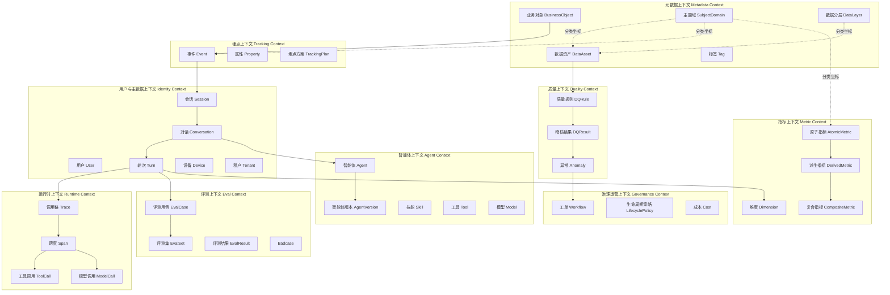

> 主题域（SubjectDomain）与数据分层（DataLayer）是**跨域的公共分类实体**，位于元数据上下文，通过 `classified_by` 关系挂载到任意上下文的资产（数据资产、事件、指标、数据集等），共同构成资产的二元组分类坐标 `(主题域, 数据分层)`。

### 5.2 核心领域对象（Agent 业务对象模型）

这是 ADGS 最重要的建模成果——**覆盖 User、Session、Conversation 等核心对象的可扩展数据模型**。

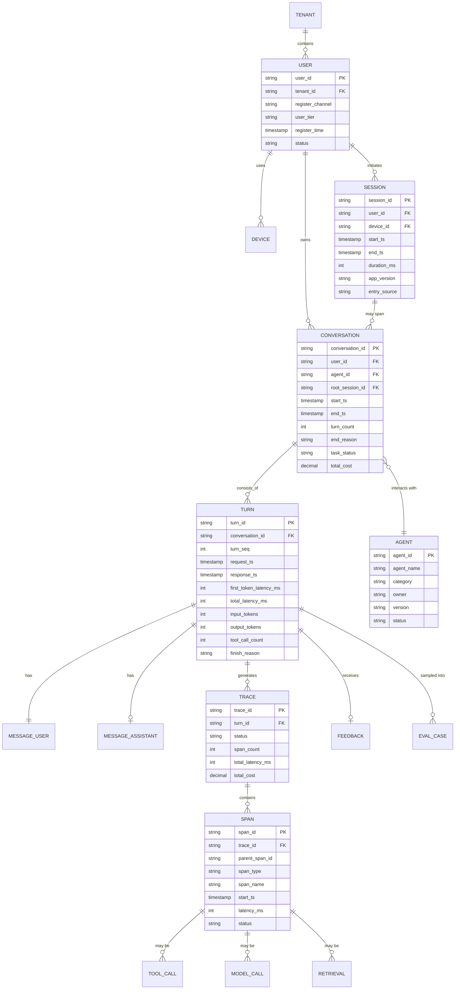

### 5.3 对象身份与关系设计要点

| 设计点 | 决策 | 理由 |
|---|---|---|
| Session 与 Conversation 的关系 | 多对多（通过桥接表或 root_session_id 冗余） | 一次会话（Session）可包含多个对话（Conversation）；一个长任务对话可跨多次会话（Session）续接 |
| Conversation 与 Turn 的关系 | 一对多，Turn 有单调递增的 turn_seq | 保证多轮对话的时序可还原，是"多轮深度""第 N 轮流失"等指标的基础 |
| Turn 与 Trace 的关系 | 一对多（重试场景会产生多条 Trace） | 同一轮次可能因工具重试、模型降级产生多次调用链 |
| User 标识策略 | user_id（登录）+ anonymous_id（匿名）+ device_id，通过 ID-Mapping 服务打通 | 支持未登录用户行为分析与登录后归因 |
| Agent 版本处理 | Agent 主表存当前状态，AgentVersion 存历史快照，事实表记录 `agent_version` | Agent 配置迭代频繁，效果对比必须能定位到具体版本 |
| 时间字段设计 | 所有事实表同时记录 `client_ts` 与 `server_ts`，分析统一用 server_ts | 客户端时钟不可信，但端侧耗时计算需要 client_ts |
| 扩展性设计 | 对象属性分"强 Schema 字段"（进列存，可加速查询）+ "扩展属性 Map"（进 JSON 列） | 平衡查询性能与模型演进速度，新增属性无需改表 |

---

## 6. 数据模型设计

> **归属说明：**本章是数据模型的**设计产物**。其中主题域体系与数据分层规范由 **S1 元数据与资产中心**统一定义并管理（定义见 [4. S1](#s1-元数据与资产中心)），**S5 数仓建模中心**在本章设计内容的落地过程中负责建模执行与规范校验。二者为"定义权 ↔ 执行权"关系。

### 6.1 分层数据流总览

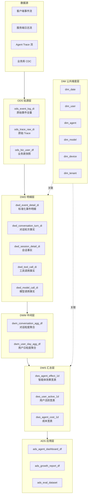

### 6.2 命名规范

**表命名：**`{层}_{主题域}_{业务过程}_{粒度}_{周期}`

```
层级：ods / dwd / dwm / dws / ads / dim
主题域：user / conv / agent / invoke / content / quality / growth / ops / meta
粒度：di（日增量）/ df（日全量）/ hi（小时增量）/ rt（实时）
示例：dwd_conv_turn_di    对话域-轮次-日增量
     dws_agent_effect_1d 智能体域-效果-1日汇总
     dim_agent           智能体维度表
```

> 命名中的「层」与「主题域」两个 token 不是自由文本，其合法取值由 **S1 元数据与资产中心**的分类体系注册表统一维护（见 [4. S1 主题域体系](#s1-元数据与资产中心) 与 [数据分层规范](#s1-元数据与资产中心)）。S5 在建模阶段依据该注册表校验，使用未注册的域码或层级将被拦截；新增域码或层级须先在 S1 完成注册与评审。

**字段命名：**小写下划线；布尔型 `is_xxx`；计数 `xxx_cnt`；金额 `xxx_amt`；时长 `xxx_ms` / `xxx_duration`；比例 `xxx_rate`；时间 `xxx_ts`（时间戳）/ `xxx_time`（格式化时间）；ID `xxx_id`。

**事件命名：**`{对象}_{动作}`，小写下划线，动作用过去式或完成时语义。

```
conversation_start / conversation_end
turn_complete / turn_abandon
tool_call_invoked / tool_call_failed
agent_created / agent_shared
```

### 6.3 核心事实表设计

#### 6.3.1 对话轮次事实表 `dwd_conv_turn_di`（粒度：一次轮次）

| 字段 | 类型 | 说明 | 来源 |
|---|---|---|---|
| turn_id | STRING | 轮次唯一标识（主键） | 服务端生成 |
| conversation_id | STRING | 所属对话 | 事件属性 |
| session_id | STRING | 所属会话 | 上下文注入 |
| user_id | STRING | 用户标识 | ID-Mapping |
| device_id | STRING | 设备标识 | 公共属性 |
| tenant_id | STRING | 租户标识 | 公共属性 |
| agent_id | STRING | 智能体标识 | 事件属性 |
| agent_version | STRING | 智能体版本 | 关联 dim_agent |
| model_id | STRING | 使用模型 | Trace 关联 |
| turn_seq | INT | 轮次序号（对话内递增） | 事件属性 |
| is_first_turn | BOOLEAN | 是否首轮 | 计算 |
| request_ts / response_ts | BIGINT | 请求/响应服务端时间戳 | 服务端 |
| first_token_latency_ms | INT | 首字延迟 | Trace |
| total_latency_ms | INT | 端到端时长 | Trace |
| input_tokens / output_tokens | INT | 输入输出 Token | Trace |
| tool_call_cnt | INT | 本轮工具调用次数 | Trace 聚合 |
| tool_success_cnt | INT | 工具调用成功次数 | Trace 聚合 |
| retrieval_cnt | INT | 检索次数 | Trace 聚合 |
| retrieval_hit_cnt | INT | 检索命中次数 | Trace 聚合 |
| is_cited | BOOLEAN | 是否引用来源 | Trace |
| finish_reason | STRING | 结束原因 [normal/timeout/error/user_abort/safety] | 事件属性 |
| is_error | BOOLEAN | 是否异常 | 计算 |
| error_code | STRING | 错误码 | 服务端 |
| turn_cost | DECIMAL | 本轮成本 | Token × 单价 |
| has_feedback | BOOLEAN | 是否有反馈 | 关联 |
| feedback_type | STRING | 反馈类型 [like/dislike/none] | 关联 |
| client_ts | BIGINT | 客户端时间戳 | 事件属性 |
| etl_ts | TIMESTAMP |  ETL 处理时间 | 系统 |
| dt | STRING | 分区（按 server_ts 日期） | 系统 |

#### 6.3.2 对话事实表 `dwd_conv_conversation_di`（粒度：一次对话）

| 字段 | 类型 | 说明 |
|---|---|---|
| conversation_id | STRING | 对话唯一标识（主键） |
| user_id / agent_id / agent_version | STRING | 主体与对象 |
| root_session_id | STRING | 起始会话 |
| start_ts / end_ts | BIGINT | 起止时间 |
| duration_ms | INT | 对话时长 |
| turn_cnt | INT | 总轮次 |
| valid_turn_cnt | INT | 有效轮次（非异常） |
| tool_call_cnt / tool_success_cnt | INT | 工具调用统计 |
| total_input_tokens / total_output_tokens | INT | Token 汇总 |
| total_cost | DECIMAL | 总成本的 |
| max_model_id | STRING | 主用模型 |
| task_status | STRING | 任务状态 [completed/abandoned/failed/timeout] |
| is_task_completed | BOOLEAN | 是否任务完成 |
| end_reason | STRING | 结束原因 |
| entry_source | STRING | 入口来源 |
| session_cnt | INT | 跨会话次数（衡量跨续接） |
| dt | STRING | 分区（按 start_ts 日期） |

#### 6.3.3 工具调用事实表 `dwd_invoke_tool_call_di`（粒度：一次工具调用）

| 字段 | 类型 | 说明 |
|---|---|---|
| tool_call_id | STRING | 调用唯一标识（主键） |
| trace_id / turn_id / conversation_id | STRING | 链路标识 |
| tool_id / tool_name | STRING | 工具标识 |
| tool_type | STRING | 工具类型 [builtin/mcp/plugin/api] |
| skill_id | STRING | 所属技能 |
| invoke_status | STRING | 调用状态 [success/failed/timeout/rejected] |
| error_type | STRING | 错误类型 [param_error/permission/timeout/upstream_error] |
| latency_ms | INT | 调用耗时 |
| retry_cnt | INT | 重试次数 |
| input_size / output_size | INT | 输入输出大小 |
| is_parallel | BOOLEAN | 是否并发调用 |
| dt | STRING | 分区 |

### 6.4 公共维度表设计

#### 6.4.1 智能体维度表 `dim_agent`（SCD Type 2）

| 字段 | 类型 | 说明 |
|---|---|---|
| agent_sk | BIGINT | 代理键（主键） |
| agent_id | STRING | 智能体业务 ID |
| agent_name | STRING | 名称 |
| agent_category | STRING | 分类 |
| agent_tags | ARRAY | 能力标签 |
| creator_id | STRING | 创建者 |
| is_official | BOOLEAN | 是否官方 |
| agent_version | STRING | 版本号 |
| release_status | STRING | 发布状态 [draft/review/online/offline] |
| effective_from | TIMESTAMP | 生效开始时间 |
| effective_to | TIMESTAMP | 生效结束时间（9999-12-31 表示当前） |
| is_current | BOOLEAN | 是否当前版本 |

**使用约定：**事实表关联时采用 `agent_id + 时间点 BETWEEN effective_from AND effective_to` 的方式获取当时快照，确保历史分析口径不变。

#### 6.4.2 模型维度表 `dim_model`

| 字段 | 类型 | 说明 |
|---|---|---|
| model_sk / model_id | — | 代理键 / 业务键 |
| model_name / vendor | STRING | 模型名 / 厂商 |
| model_version | STRING | 版本 |
| context_window | INT | 上下文长度 |
| input_price_per_1k / output_price_per_1k | DECIMAL | 单价（用于成本计算） |
| capability_tags | ARRAY | 能力标签 [vision/code/reasoning] |
| is_deprecated | BOOLEAN | 是否已下线 |

### 6.5 实时链路设计

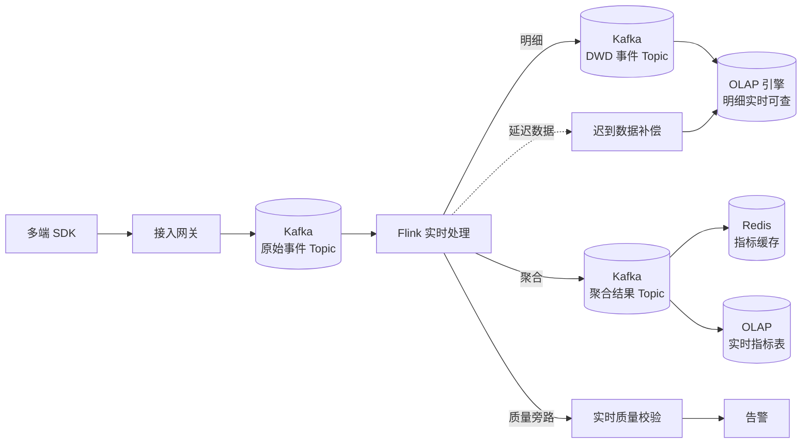

**实时设计要点：**
- **乱序与迟到处理**：设置 Watermark 允许迟到（如 5 分钟），超时数据进入迟到表由离线链路补偿修正。
- **实时口径与离线对齐**：实时聚合使用与离线相同的维度定义与去重逻辑，通过流批对账任务监控差异。
- **Exactly-Once 语义**：关键指标链路启用 Checkpoint + 幂等写入（按窗口 + 维度主键覆盖写）。

---

## 7. 核心业务流程建模

### 7.1 埋点全生命周期流程

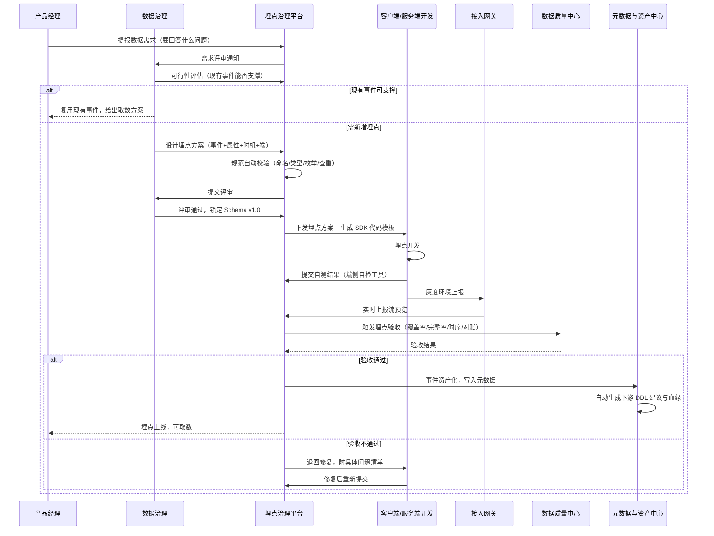

### 7.2 数据质量异常闭环流程

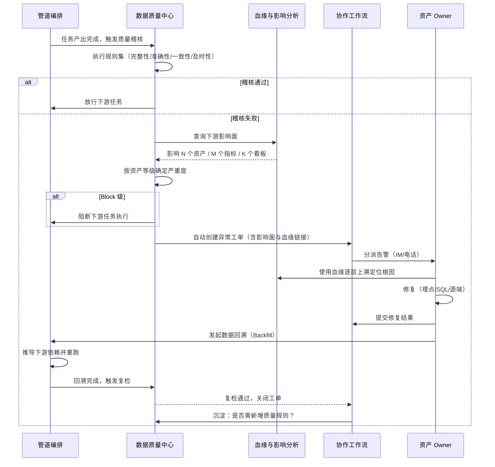

### 7.3 指标口径变更影响流程

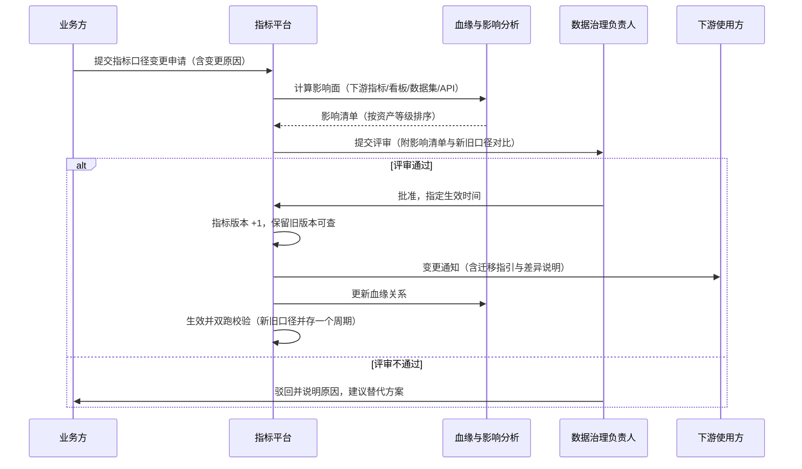

### 7.4 Agent 评测数据闭环流程

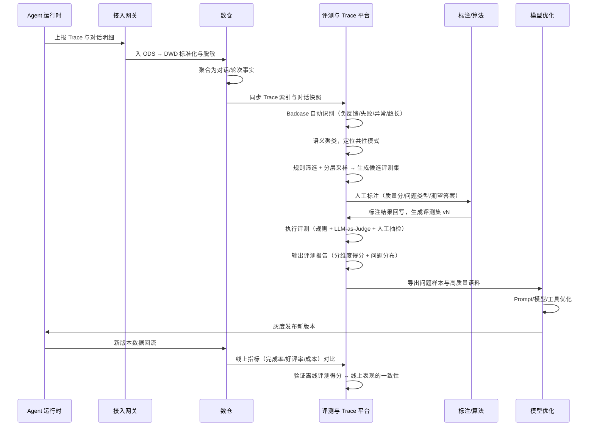

---

## 8. 接口与集成设计

### 8.1 内部子系统接口

| 接口 | 提供方 | 消费方 | 协议 | 关键内容 |
|---|---|---|---|---|
| 元数据服务 API | S1 | S2/S5/S6/S7/S11/S13 | gRPC + HTTP | 资产注册、查询、检索、变更订阅 |
| 元数据采集 Hook | S1 | S3/S4/S5 | SDK / Webhook | 表结构、任务血缘、运行时指标上报 |
| 事件契约服务 API | S2 | S3 | HTTP | 获取事件 Schema（含版本），供网关校验 |
| 埋点验收 API | S2 | S8 | HTTP | 触发验收、查询验收结果 |
| 上报协议 | S3 | 多端 SDK | HTTP / gRPC | 事件包上报（见 3.x 协议定义） |
| 管道调度 API | S4 | S5/S8 | HTTP | 任务创建、触发回溯、查询状态 |
| 质量规则 API | S8 | S4/S2 | HTTP | 规则查询、稽核触发、结果回写 |
| 血缘服务 API | S7 | S6/S8/S11/S12 | gRPC + HTTP | 血缘查询、影响分析、根因追溯 |
| 指标查询 API | S6 | S13/BI | HTTP | `queryMetric(...)` 统一取数 |
| 分级脱敏服务 | S11 | S3/S5/S13 | gRPC | 字段分级查询、脱敏执行 |
| 生命周期策略 API | S12 | S5/S4 | HTTP | 策略查询、归档执行 |
| 数据服务 API | S13 | 外部消费方 | HTTP | 指标/明细/数据集查询（含鉴权限流） |
| 工作流 API | S9 | 全体 | HTTP | 工单创建、流转、查询 |

### 8.2 对外集成接口

| 集成对象 | 方向 | 方式 | 说明 |
|---|---|---|---|
| 多端 SDK | 入 | HTTP Batch | 事件上报，支持压缩与批量 |
| Agent 运行时 | 入 | OTLP / HTTP | Trace 与 Span 上报 |
| 业务数据库 | 入 | CDC（Binlog / WAL） | 用户、订单、订阅等变更同步 |
| BI 平台 | 出 | 指标 API / JDBC | 指标取数与明细查询 |
| MLOps 平台 | 出 | 对象存储 / API | 评测集、训练语料导出 |
| 协作与工单系统 | 双向 | Webhook / OpenAPI | 告警推送、流程同步 |
| 云基础设施 | 双向 | 各云 API | 存储、计算、监控 |

### 8.3 数据服务 API 示例

**指标查询：**
```http
POST /api/v1/metrics/query
Content-Type: application/json
Authorization: Bearer <token>

{
  "metric_codes": ["conv_task_completion_rate", "conv_avg_turn_cnt"],
  "dimensions": ["agent_category", "platform"],
  "filters": [
    { "dimension": "agent_id", "operator": "in", "values": ["agt_001", "agt_002"] },
    { "dimension": "user_tier", "operator": "=", "values": ["pro"] }
  ],
  "time_range": { "start": "2026-08-01", "end": "2026-08-31" },
  "granularity": "day",
  "compare": { "type": "previous_period" },
  "options": { "cache": true, "timeout_ms": 3000 }
}
```

**响应：**
```json
{
  "request_id": "req_xxx",
  "metrics": [
    {
      "metric_code": "conv_task_completion_rate",
      "metric_name": "任务完成率",
      "unit": "percent",
      "definition_version": "2.1",
      "data": [
        {
          "date": "2026-08-01",
          "dimensions": { "agent_category": "coding", "platform": "macos" },
          "value": 0.8734,
          "compare_value": 0.8512,
          "change_rate": 0.0261
        }
      ]
    }
  ],
  "metadata": {
    "lineage_url": "/lineage/metric/conv_task_completion_rate",
    "definition_url": "/metrics/conv_task_completion_rate",
    "cached": true,
    "cost_ms": 128
  }
}
```

---

## 9. 非功能性设计

### 9.1 容量估算

| 项 | 估算假设 | 结果 |
|---|---|---|
| 日活用户 | 100 万 DAU | — |
| 人均日事件数 | 200 条（含 Agent 高频交互） | 2 亿条/日 |
| Agent Trace Span | 人均 50 轮次 × 8 Span | 4 亿条/日 |
| 单条事件大小 | 压缩后 500 B | 100 GB/日（事件） |
| Trace 大小 | 压缩后 2 KB | 800 GB/日（Trace） |
| 峰值 QPS | 按 5 倍均值的峰值系数 | ~35 万 QPS |
| 年存储增量（含副本与分层） | 热 + 温 + 冷全量 | ~500 TB/年（需按生命周期策略压缩至 ~150 TB） |

**关键结论：**Trace 数据占存储大头（约 80%），因此必须对 Trace 采用激进的生命周期策略（明细保留 90 天，聚合结果永久），并在采集侧支持采样（非关键 Span 按比例采样）。

### 9.2 时效 SLA 分级

| 数据类别 | 时效要求 | 实现方式 | 达标率 |
|---|---|---|---|
| 实时监控指标 | 秒级（P95 ≤ 30s） | Flink 流处理 + OLAP | ≥ 99% |
| 实时明细查询 | 分钟级（≤ 3 min） | 流式写入 OLAP | ≥ 99% |
| 小时级聚合 | ≤ 15 min 延迟 | 小时批调度 | ≥ 99.5% |
| 日级 DWD | 次日 03:00 前 | 日批调度 | ≥ 99.5% |
| 日级 DWS/ADS | 次日 06:00 前 | 日批调度 | ≥ 99.5% |
| 评测数据集 | T+1 | 日批 + 标注流程 | ≥ 98% |

### 9.3 高可用设计

| 层级 | 策略 |
|---|---|
| 采集网关 | 多可用区部署 + 负载均衡；本地 SDK 缓存保证断网不丢；网关无状态可水平扩展 |
| 消息队列 | 多副本 + 跨 AZ；分区数预留 50% 余量 |
| 计算引擎 | 作业级 Checkpoint；失败自动重启；关键链路双链路热备 |
| 存储 | 多副本；跨区域备份（元数据与核心汇总数据） |
| 治理管控面 | 元数据库主备 + 只读副本；搜索引擎集群；管控面故障时数据面继续运行（降级不阻断） |
| 降级策略 | 治理管控面不可用时，数据面继续采集与加工，仅暂停强卡点校验，恢复后补检 |

### 9.4 可扩展设计

| 扩展场景 | 设计支撑 |
|---|---|
| 新增业务对象 | 元模型可扩展（L0/L1 层），无需改代码；建模后自动生成 DDL、任务模板、质量规则模板 |
| 新增数据源 | 标准化接入适配器（Adapter 模式），配置化接入 |
| 新增指标 | 组合式派生，无需开发；仅需注册原子指标（若不存在） |
| 新增质量规则 | 规则模板 + 自定义 SQL，插件化扩展 |
| 新增主题域 / 数据分层 | 在 S1 配置化注册（需评审），经 Meta Change Event 自动同步至 S5 建模校验规则、S1 检索导航与 S12 生命周期默认策略；S5 提供存量模型批量重挂与影响评估，无需改代码 |
| 多租户隔离 | 元数据与数据双层隔离：元数据按租户打标，数据按 tenant_id 行级隔离 |

### 9.5 兼容性设计

| 变更类型 | 兼容性 | 处理方式 |
|---|---|---|
| 新增事件 | 兼容 | 直接发布 |
| 新增选填属性 | 兼容 | 直接发布，Schema 小版本 +1 |
| 新增必填属性 | 不兼容 | 走评审；双写灰度一个版本后转必填 |
| 修改属性类型（拓宽） | 兼容 | 直接发布 |
| 修改属性类型（收窄） | 不兼容 | 走评审；需评估存量数据 |
| 删除属性 / 事件 | 不兼容 | 先标记废弃 → 通知下游 → 无引用后下线 |
| 修改枚举值含义 | 不兼容 | 视为新增枚举 + 废弃旧值 |

**灰度策略：**破坏性变更必须经历 `设计评审 → 双写灰度（≥ 1 个版本周期）→ 数据一致性校验 → 全量切换 → 旧版本保留观察 ≥ 30 天` 五个阶段。

---

## 10. 治理运营机制设计

系统只是工具，治理要落地必须配套组织与机制。

### 10.1 角色与职责矩阵（RACI 摘要）

| 事项 | 数据治理 | 数据工程 | 产品开发 | 分析师 | 算法 | 安全合规 |
|---|---|---|---|---|---|---|
| **主题域与数据分层体系定义及变更** | R/A | C | C | C | C | I |
| 制定埋点与建模规范 | R/A | C | C | C | C | C |
| 业务对象与事件模型设计 | R/A | C | C | C | C | I |
| 埋点方案评审 | R/A | C | R | C | C | I |
| 埋点开发与上报 | C | R | R/A | I | I | I |
| 数仓建模与开发（挂载分类坐标） | A | R | I | C | I | I |
| 指标定义与口径仲裁 | R/A | C | C | C | C | I |
| 质量规则配置与处理 | A | R | C | C | I | I |
| 资产权限审批 | C | I | I | I | I | R/A |
| 数据生命周期策略 | R/A | R | I | C | C | C |
| 治理度量改进 | R/A | C | C | C | C | C |

> R=执行，A=担责，C=需咨询，I=需知会

### 10.2 规范体系

| 规范 | 内容 | 管控方式 |
|---|---|---|
| 《埋点命名规范》 | 事件/属性命名、类型、枚举管理 | 平台自动校验 + 评审 |
| 《事件设计规范》 | 触发时机、上报端、去重策略、必填约定 | 埋点方案模板 + 评审 |
| 《数据资产分类规范》 | 主题域体系、数据分层规范、跨层依赖规则、分类坐标挂载要求 | S1 注册强约束 + 全域合规扫描（Owner：数据治理组） |
| 《数仓建模规范》 | 建模方法、命名规范、维度一致性、公共维度复用 | S5 在线建模模板 + 建模阶段校验（Owner：数据工程组） |
| 《指标定义规范》 | 指标分层、定义卡、口径变更 | 指标平台强约束 |
| 《数据质量规范》 | 质量维度、规则模板、严重等级 | 规则市场 + 稽核执行 |
| 《数据安全规范》 | 分级分类、脱敏、权限、审计 | 平台强制 + 审批 |
| 《数据生命周期规范》 | 保留期、冷热策略、下线流程 | 建模时绑定 + 自动执行 |

### 10.3 运营节奏

| 周期 | 活动 | 产出 |
|---|---|---|
| 日 | 质量告警处理、任务 SLA 巡检 | 异常处理记录 |
| 周 | 埋点评审会、指标口径评审会、质量周报 | 评审结论、质量周报 |
| 双周 | 治理度量回顾、资产清理 | 改进项清单 |
| 月 | 治理月报（各团队排名）、成本账单、规范更新 | 治理月报、成本账单 |
| 季 | 数据体系 Review（主题域与分层体系优化、指标树优化）、分类坐标完备率专项治理、架构演进评审 | 体系优化方案 |

---

## 11. 演进路线

### 阶段一：夯基（0-3 个月）—— 让数据"收得上来、看得见"

| 优先级 | 建设内容 | 交付物 |
|---|---|---|
| P0 | S2 埋点治理平台 MVP | 事件字典、规范校验、埋点方案、评审流 |
| P0 | S3 多端 SDK + 接入网关 | 统一上报协议、Schema 校验、DLQ |
| P0 | S1 元数据与资产中心 MVP | 资产注册、技术元数据采集、资产检索 |
| P0 | **S1 分类体系建设** | 9 个主题域注册与 Owner 指派、6 层分层规范与跨层依赖规则（LR-1~LR-5）、分类坐标挂载能力 |
| P0 | S5 核心主题域建模（user/conv/agent） | 挂载分类坐标的 DWD 核心事实表、公共维度表 |
| P0 | S6 指标体系 MVP | 原子/派生指标定义、指标定义卡 |
| P1 | S8 基础质量规则 | 完整性、及时性、有效性稽核 |

**阶段目标：**核心埋点 100% 纳管；主题域与分层体系上线、新建资产分类坐标完备率 100%；核心数据资产可检索；核心指标有明确定义。

### 阶段二：闭环（4-6 个月）—— 让数据"信得过、查得清"

| 优先级 | 建设内容 | 交付物 |
|---|---|---|
| P0 | S7 血缘与影响分析（表级） | 自动血缘采集、影响分析、根因追溯 |
| P0 | S8 质量闭环 | 告警、工单、回溯、质量分 |
| P0 | S4 管道编排与回溯能力 | 调度、依赖、Backfill |
| P0 | S11 安全合规基础 | 分级分类、脱敏、权限、审计 |
| P1 | S9 协作工作流 | 需求、变更、异常处理流程线上化 |
| P1 | S13 数据服务与数据集 | 指标 API、分析数据集 |

**阶段目标：**核心资产血缘完备率 ≥ 90%；质量问题平均修复时长 ≤ 4 小时；敏感字段脱敏 100%。

### 阶段三：提效（7-12 个月）—— 让数据"用得顺、成本低"

| 优先级 | 建设内容 | 交付物 |
|---|---|---|
| P0 | S10 Agent 评测与 Trace 平台 | Trace 采集、评测集构建、Badcase 归集 |
| P0 | S6 指标语义层完善 | 复合指标、多引擎 SQL、统一查询 API |
| P0 | S7 字段级血缘 | 字段级派生关系、精确影响分析 |
| P1 | S12 生命周期与成本治理 | 冷热分层、成本归因、下线流程 |
| P1 | S14 治理度量与运营 | 治理驾驶舱、团队排名、自动报告 |
| P1 | S5 流批一体 | 实时管道、流批对账 |

**阶段目标：**需求自助满足率 ≥ 70%；Agent 评测闭环打通；单位数据成本下降 20%。

### 阶段四：智能（12+ 个月）—— 让治理"自动化、自适应"

| 建设内容 | 说明 |
|---|---|
| 智能埋点辅助 | 基于需求描述自动生成埋点方案建议 |
| 智能指标推荐 | 基于分析意图推荐指标与维度组合 |
| 异常自动归因 | 指标异动自动下钻到贡献最大的维度组合 |
| 质量规则自学习 | 基于历史数据自动推荐阈值与新增规则 |
| 自然语言取数 | NL → 指标/SQL 的语义解析与生成 |
| 元数据自动补全 | 基于表内容与血缘自动生成业务描述 |

---

## 12. 风险与开放问题

| 编号 | 风险/问题 | 影响 | 应对建议 |
|---|---|---|---|
| R1 | 元数据采集不完整（历史存量资产多） | 资产目录与血缘覆盖率低，治理无法落地 | 分批治理：先治理核心链路资产（S/A 级），存量资产通过"用到再治理"渐进覆盖 |
| R2 | SQL 解析血缘覆盖率不足（复杂方言、UDF、动态 SQL） | 字段级血缘不准，影响分析与根因追溯失效 | 通用解析器 + 方言适配 + 人工修正兜底；先保证表级血缘 100%，字段级渐进提升 |
| R3 | 治理流程降低研发效率 | 业务方绕开治理系统，形成"影子数据" | 自动卡点优先于人工审批；提供自助工具与模板；定期扫描未纳管资产 |
| R4 | 埋点事件数量膨胀，治理成本线性上升 | 事件字典臃肿，维护困难 | 相似事件查重机制；事件废弃流程；鼓励使用公共属性组与通用事件 |
| R5 | 实时与离线口径不一致 | 数据打架，信任受损 | 强制流批对账任务；口径定义统一由语义层生成两套执行计划 |
| R6 | Agent 评测体系与线上体验脱节 | 评测分数提升但用户无感 | 定期校准自动评测与人工评测一致性；建立评测得分 ↔ 线上指标的关联性监控 |
| R7 | 对话数据的合规与隐私风险 | 法律风险、用户信任受损 | 脱敏前置到网关；语料使用授权流程；留存策略自动执行 |
| R8 | Trace 数据量过大导致成本失控 | 存储成本快速增长 | 采样策略；Trace 明细短保留 + 聚合结果长保留；按需检索而非全量入仓 |
| O1 | 开放问题：Session 与 Conversation 是否需要在物理层建桥接表？ | 影响跨会话分析的灵活性与复杂度 | 建议：事实表冗余 root_session_id 满足大部分场景，桥接表按需建设 |
| O2 | 开放问题：多租户（企业版）的数据隔离粒度？ | 影响数仓设计与权限模型 | 建议：数据层按 tenant_id 行级隔离，元数据层按租户打标，超级租户需特殊处理 |
| O3 | 开放问题：实时链路是否需要 Exactly-Once？ | 影响架构复杂度与成本 | 建议：核心指标链路 Exactly-Once，明细链路 At-Least-Once + 离线修正 |
| O4 | 开放问题：是否自建指标语义层 vs 采购开源方案？ | 影响建设周期与长期维护成本 | 建议：MVP 阶段可基于成熟语义层框架做二次开发，避免过度自研 |

---

## 附录 A 埋点命名与事件字典样例

### A.1 命名规则

| 对象 | 规则 | 正例 | 反例 |
|---|---|---|---|
| 事件名 | `{对象}_{动作}`，小写下划线，动词过去式 | `conversation_start`、`turn_complete` | `ConversationStart`、`start_conversation_btn_click` |
| 属性名 | 小写下划线，名词或形容词短语 | `agent_id`、`is_first_turn` | `AgentID`、`firstTurn` |
| 布尔属性 | `is_` / `has_` 前缀 | `is_task_completed` | `task_completed`（易与枚举混淆） |
| 计数属性 | `_cnt` 后缀 | `tool_call_cnt` | `tool_calls` |
| 时间属性 | `_ts`（时间戳，毫秒）/ `_time`（格式化） | `request_ts` | `requestTime` |
| 时长属性 | `_ms` / `_duration` | `latency_ms` | `latency` |
| 比例属性 | `_rate`（0-1 小数） | `completion_rate` | `completion_percent` |
| 金额属性 | `_amt` | `turn_cost_amt` | `turn_cost` |

### A.2 公共属性组（所有事件自动注入）

| 属性组 | 属性 | 类型 | 说明 |
|---|---|---|---|
| 用户组 | user_id, anonymous_id, tenant_id, user_tier | STRING | ID-Mapping 后补全 |
| 设备组 | device_id, platform, os, os_version, app_version, network_type | STRING | SDK 采集 |
| 会话组 | session_id, session_seq | STRING/INT | SDK 维护 |
| 应用组 | app_id, app_channel, build_type | STRING | SDK 配置 |
| 上下文组 | conversation_id, agent_id, agent_version, page_id | STRING | 运行时上下文 |
| 上报组 | client_ts, server_ts, sdk_version, schema_version | — | 网关补全 server_ts |

### A.3 事件字典样例

| 事件名 | 中文名 | 触发时机 | 上报端 | 关键属性 | 状态 |
|---|---|---|---|---|---|
| `app_launch` | 应用启动 | App 冷/热启动 | 客户端（自动） | launch_type, is_first_launch | 已上线 |
| `conversation_start` | 对话开始 | 用户发送首条消息且会话创建成功 | 服务端 | conversation_id, agent_id, entry_source, is_first_time | 已上线 |
| `turn_complete` | 轮次完成 | 助手应答完整返回 | 服务端 | turn_seq, model_id, input_tokens, output_tokens, tool_call_cnt, latency_ms, finish_reason | 已上线 |
| `tool_call_invoked` | 工具调用 | 工具被实际调用 | 服务端 | tool_id, tool_type, invoke_status, latency_ms, retry_cnt | 已上线 |
| `agent_card_click` | 智能体卡片点击 | 用户点击智能体卡片 | 客户端 | agent_id, position, page_id | 已上线 |
| `answer_feedback` | 应答反馈 | 用户点赞/点踩 | 客户端+服务端 | turn_id, feedback_type, feedback_reason | 已上线 |
| `conversation_end` | 对话结束 | 对话终止（完成/放弃/超时/异常） | 服务端 | conversation_id, end_reason, turn_cnt, duration_ms, total_cost | 已上线 |
| `model_latency` | 模型响应性能 | 每次模型调用返回 | 服务端（自动） | model_id, first_token_latency_ms, total_latency_ms, token_cnt | 已上线 |
| `api_error` | 接口异常 | 接口返回错误 | 客户端+服务端（自动） | api_path, error_code, error_msg, is_retried | 已上线 |

---

## 附录 B 核心表 DDL 样例

```sql
-- 对话轮次事实表（日增量，按 server_ts 分区）
CREATE TABLE IF NOT EXISTS dwd_conv_turn_di (
    turn_id                 STRING   COMMENT '轮次唯一标识',
    conversation_id         STRING   COMMENT '对话ID',
    session_id              STRING   COMMENT '会话ID',
    user_id                 STRING   COMMENT '用户ID',
    device_id               STRING   COMMENT '设备ID',
    tenant_id               STRING   COMMENT '租户ID',
    agent_id                STRING   COMMENT '智能体ID',
    agent_version           STRING   COMMENT '智能体版本',
    model_id                STRING   COMMENT '模型ID',
    turn_seq                INT      COMMENT '轮次序号（对话内递增）',
    is_first_turn           BOOLEAN  COMMENT '是否首轮',
    request_ts              BIGINT   COMMENT '请求时间戳(ms, 服务端)',
    response_ts             BIGINT   COMMENT '响应时间戳(ms, 服务端)',
    first_token_latency_ms  INT      COMMENT '首字延迟(ms)',
    total_latency_ms        INT      COMMENT '端到端时长(ms)',
    input_tokens            INT      COMMENT '输入Token数',
    output_tokens           INT      COMMENT '输出Token数',
    tool_call_cnt           INT      COMMENT '工具调用次数',
    tool_success_cnt        INT      COMMENT '工具调用成功次数',
    retrieval_cnt           INT      COMMENT '检索次数',
    retrieval_hit_cnt       INT      COMMENT '检索命中次数',
    is_cited                BOOLEAN  COMMENT '是否引用来源',
    finish_reason           STRING   COMMENT '结束原因',
    is_error                BOOLEAN  COMMENT '是否异常',
    error_code              STRING   COMMENT '错误码',
    turn_cost_amt           DECIMAL(18,6) COMMENT '本轮成本(元)',
    has_feedback            BOOLEAN  COMMENT '是否有反馈',
    feedback_type           STRING   COMMENT '反馈类型 like/dislike/none',
    client_ts               BIGINT   COMMENT '客户端时间戳(ms)',
    ext_attrs               STRING   COMMENT '扩展属性(JSON)',
    etl_ts                  TIMESTAMP COMMENT 'ETL处理时间'
)
COMMENT '对话轮次事实表-日增量'
PARTITIONED BY (dt STRING COMMENT '分区日期 yyyy-MM-dd')
STORED AS ORC
TBLPROPERTIES ('orc.compress' = 'SNAPPY');

-- 智能体维度表（缓慢变化维 Type 2）
CREATE TABLE IF NOT EXISTS dim_agent (
    agent_sk         BIGINT   COMMENT '代理键',
    agent_id         STRING   COMMENT '智能体业务ID',
    agent_name       STRING   COMMENT '智能体名称',
    agent_category   STRING   COMMENT '分类',
    agent_tags       STRING   COMMENT '能力标签(JSON Array)',
    creator_id       STRING   COMMENT '创建者',
    is_official      BOOLEAN  COMMENT '是否官方',
    agent_version    STRING   COMMENT '版本号',
    release_status   STRING   COMMENT '发布状态',
    effective_from   TIMESTAMP COMMENT '生效开始时间',
    effective_to     TIMESTAMP COMMENT '生效结束时间',
    is_current       BOOLEAN  COMMENT '是否当前版本'
)
COMMENT '智能体维度表-SCD Type2'
STORED AS ORC;
```

---

## 附录 C 指标定义卡模板

| 字段 | 内容示例 |
|---|---|
| **指标编码** | `conv_task_completion_rate` |
| **指标名称** | 任务完成率 |
| **指标层级** | 原子指标 |
| **所属主题域** | 会话交互域（conv） |
| **业务定义** | 在统计周期内，任务状态为"已完成"的对话数占全部有效对话数的比例 |
| **业务口径说明** | "已完成"指用户获得有效结果并正常结束对话（task_status = completed）；用户主动放弃、超时、系统异常不计入分子 |
| **计算逻辑** | `COUNT(DISTINCT CASE WHEN task_status='completed' THEN conversation_id END) / COUNT(DISTINCT conversation_id)` |
| **数据来源** | `dwd_conv_conversation_di` |
| **度量字段** | conversation_id（去重计数） |
| **过滤条件** | `is_valid = true`（排除测试数据、内部账号、异常会话） |
| **支持维度** | 时间、智能体、智能体分类、模型、平台、用户分层、租户、入口来源 |
| **时间周期** | 支持 小时 / 日 / 周 / 月 |
| **数值类型** | 比率，0-1 小数，展示为百分比 |
| **指标 Owner** | 张三（数据治理组） |
| **关联分析场景** | Agent 效果评估、版本对比、模型选型 |
| **血缘** | `dwd_conv_conversation_di.task_status` → 本指标 → ADS 看板「Agent 效果周报」、指标 API `agent_health_score` |
| **版本历史** | v1.0（2026-01，初始定义）；v2.0（2026-05，排除内部账号）；v2.1（2026-08，新增 is_valid 过滤条件） |
| **变更影响** | v2.1 影响 3 个看板、1 个 API，已通知下游（2026-08-15） |
| **已知口径边界** | 跨会话续接的对话，完成状态以最后一次会话为准；对话超过 24 小时未更新视为超时未完成 |

---

## 附：系统自检清单（上线前 Gate）

- [ ] 所有核心业务对象已在元数据与资产中心注册，且有明确 Owner
- [ ] 新增埋点 100% 通过规范校验并完成验收
- [ ] 事件 Schema 已版本化，破坏性变更已走评审与灰度
- [ ] 主题域与数据分层体系已在 S1 注册，域 Owner 已指派
- [ ] 新建资产已挂载分类坐标 `(主题域, 数据分层)`，命名中的域码与层级 token 均取自 S1 注册表
- [ ] 新建表已通过跨层依赖合规检查（LR-1~LR-5），并绑定生命周期策略与安全分级
- [ ] 公共维度已复用，未重复定义一致性维度
- [ ] 指标已注册定义卡，支持维度与计算逻辑明确
- [ ] 核心资产已配置质量规则，且告警有明确接收人
- [ ] 数据血缘已采集，影响分析可正常执行
- [ ] 敏感字段已完成分级与脱敏，权限已审批
- [ ] 对外服务已注册，具备 SLA 与限流策略

---

*本文档为系统分析与设计基线，随业务演进持续迭代。所有架构决策的变更需通过架构评审并更新本文档版本号。*
